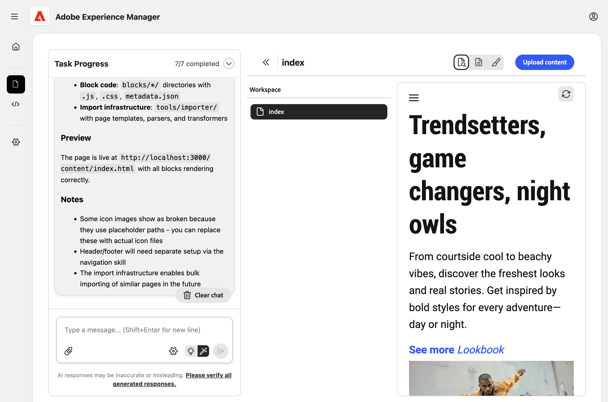
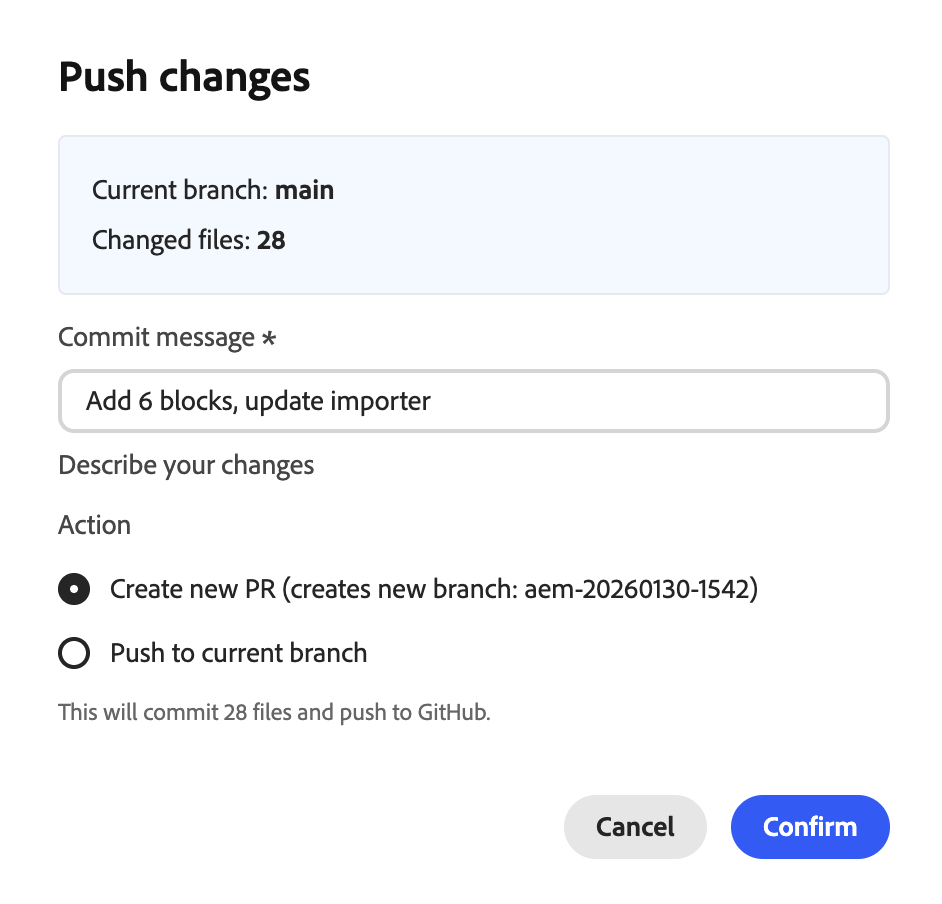
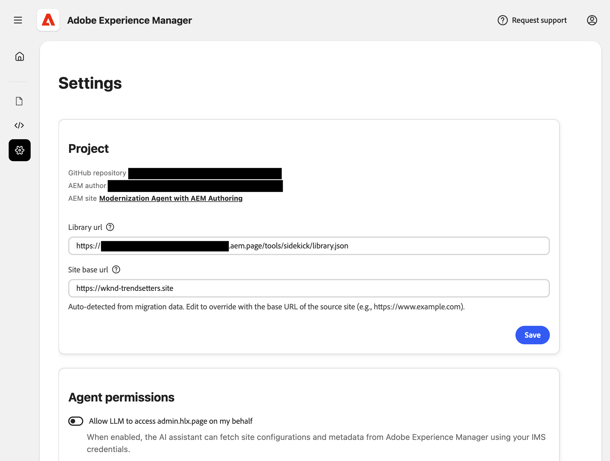

# 경험 현대화 콘솔 {#console-reference}

경험 현대화 콘솔 인터페이스 및 기능에 대한 참조 안내서

>[!NOTE]
>
>Experience Modernation Console 사용에 관심이 있는 경우 원활한 온보딩 경험을 위해 액세스를 요청할 수 있습니다.

## 개요 {#overview}

Experience Modernation Console은 [`aemcoder.adobe.io`에서 웹 인터페이스로 노출되는 Edge Delivery Services을 위한 호스팅된 AI 지원 개발 환경입니다.](https://aemcoder.adobe.io) 해당 GitHub 프로젝트에 연결한 후 추가 설정이나 로컬 환경 구성 없이 자연어로 변경 메시지를 즉시 표시할 수 있습니다.

>[!TIP]
>
>콘솔을 바로 시작하려면 문서 [Experience 현대화 에이전트 시작하기](/help/ai-in-aem/agents/brand-experience/modernization/getting-started.md)를 확인하십시오.

## 기능 {#capabilities}

콘솔의 핵심 기능:

* 에이전트 및 해당 기술이 포함된 대화형 채팅 패널
* 변경 사항에 대한 즉각적인 시각적 피드백을 위한 라이브 AEM 미리보기
* 컨텐츠 파일 브라우저 및 Markdown 뷰어
* [문서 작성](https://da.live)과(와) 콘텐츠 동기화
* 변경 사항을 검토하기 위한 코드 브라우저 및 비교 뷰어
* 변경 사항에서 가져오기 요청을 만드는 기능과 GitHub 통합

개발자들은 어떤 선박을 운항할 것인가에 대한 완전한 통제권을 보유한다. 콘솔을 통해 모든 변경 사항을 적용하려면 배포 전에 검토하고 승인해야 하며 거버넌스, 브랜드 일관성 및 보안이 보장됩니다.

## 탐색 {#navigation}

[`aemcoder.adobe.io`,](https://aemcoder.adobe.io)에 콘솔에 로그인하면 콘솔의 홈 화면에 도달합니다.

### 메뉴 바 {#menu-bar}

상단 메뉴 모음에는 다음이 포함되어 있습니다.

* 왼쪽 패널의 세부 정보를 확장하거나 축소하는 왼쪽의 **메뉴 열기** 단추
* 어두운 모드로 전환하고 콘솔에서 로그아웃하기 위한 오른쪽의 **계정** 단추

### 왼쪽 사이드바 {#sidebar}

왼쪽 사이드바를 통해 콘솔의 중요한 보기에 빠르게 액세스할 수 있습니다.

* **[홈 보기](#home-view)**(집 모양 아이콘) - 콘솔 사용을 위한 시작 지점
* **[콘텐츠 보기](#content-view)**(파일 아이콘) - 가져온 콘텐츠
* **[코드 보기](#code-view)**(`</>` 아이콘) - 작업 중인 사이트의 코드
* **[설정 보기](#settings-view)**(톱니바퀴 아이콘) - 콘솔의 설정

## 홈 보기 {#home-view}

**Home** 보기는 콘솔 사용을 위한 시작점입니다.

* 맨 위에는 콘솔의 요청을 수행하기 위한 [프롬프트 패널](#prompt-panel)이 있습니다.
* 프롬프트 패널 아래에 프로젝트를 시작하는 데 사용할 것인지 묻는 메시지가 표시됩니다.

### 프롬프트 패널 {#prompt-panel}

프롬프트 패널에서는 AI와 상호 작용하기 위한 컨트롤이 제공됩니다.

* **계획/실행 모드**(전구 및 자동 선택 아이콘): 계획 모드와 실행 모드 간을 각각 전환합니다.
   * **플랜 모드**: AI가 요청을 분석하고 변경 없이 접근 방식을 간략하게 설명합니다. 이는 커밋하기 전에 전략을 이해하는 데 유용합니다.
   * **실행 모드**: AI가 계획을 수행하고 실제 파일을 변경합니다.
* **파일 첨부**(paperclip icon): 추가 컨텍스트(예: 참조 디자인, 스크린샷, 사양)를 위해 파일을 업로드하고 프롬프트에 첨부합니다.
* **설정**(톱니바퀴 아이콘): AI에서 확인 질문을 건너뛰도록 선택합니다.
* **채팅 지우기**: 대화를 재설정하고 AI의 컨텍스트 창을 지웁니다. 이전 대화와 관련이 없는 새 작업을 시작할 때 이 옵션을 사용합니다.

## 컨텐츠 보기 {#content-view}

**콘텐츠 보기**&#x200B;에서는 콘텐츠를 찾아보고 미리 볼 수 있는 도구를 제공합니다. 기본적으로 보기는 왼쪽에서 오른쪽으로 세 개의 패널로 분할됩니다.

* 콘솔 및 프로젝트와 상호 작용하기 위한 프롬프트 패널
* 콘텐츠 파일 개요를 위한 파일 브라우저(V자형 화살표 아이콘으로 이 패널을 표시하는 토글)
* 파일 브라우저에서 선택한 콘텐츠를 시각화하기 위한 미리보기 패널

미리보기 패널에는 다음 세 가지 모드가 있습니다.

* 렌더링된 HTML 컨텐츠를 보려면 **미리 보기**(돋보기 아이콘이 있는 문서)
* 기본 문서 작성 콘텐츠 구조를 보려면 **HTML 보기**(문서 아이콘)를 각각 클릭하십시오.
* **디자인 모드**(페인트브러쉬 아이콘) - 프롬프트의 컨텍스트에 대한 페이지의 요소를 선택합니다.

항상 **미리 보기 새로 고침** 아이콘을 클릭하여 미리 보기 패널을 업데이트할 수 있습니다.

**콘텐츠 업로드** 단추를 누르면 AEM 문서 작성에 파일을 업로드할 수 있는 모달 창이 열립니다.

* 프로젝트에 **파일이 있는 경우**&#x200B;조직&#x200B;**및**&#x200B;저장소`fstab.yaml` 필드가 미리 채워집니다
* 파일 선택을 통해 편집 가능한 대상 경로 제공
* JCR(범용 편집기용)에 대한 업로드는 지원되지 않습니다

## 코드 보기 {#code-view}

**코드 보기**&#x200B;에서는 코드를 탐색하고 코드 변경 내용을 관리하는 도구를 제공합니다. 보기는 왼쪽에서 오른쪽으로 세 개의 패널로 분할됩니다.

* 콘솔 및 프로젝트와 상호 작용하기 위한 프롬프트 패널
* 코드 파일 또는 변경 사항에 대한 개요를 보려면 파일 브라우저
* 코드 파일을 보기 위한 미리 보기 패널 또는 파일 브라우저에서 선택한 비교

미리보기 패널은 두 가지 모드를 제공합니다.

* **Workspace 파일**: 현재 작업 영역의 코드 파일을 브라우저에서
* 프로젝트에서 작업에 의해 생성된 여러 파일 변경 내용을 보려면 **Git 변경 내용**
   * 변경된 파일을 준비하려면 `+` 아이콘을 클릭하십시오.
   * 화살표 아이콘을 클릭하여 변경된 파일을 삭제합니다

**정보** 아이콘에는 현재 연결된 GitHub 계정 및 프로젝트가 나열됩니다.

**GitHub 작업** 메뉴(오른쪽 상단)에서는 저장소 작업을 제공합니다.

* **연결/다시 연결**: GitHub OAuth를 시작합니다
* **저장소 전환**: 작업 영역을 다른 저장소로 바꿉니다. 커밋되지 않은 모든 작업은 손실됩니다.
* **분기 전환**: 동일한 저장소 내에서 분기를 전환합니다.
* **동기화**: 원격 원본에서 최신 변경 내용을 가져옵니다.
* **푸시**: GitHub에 작업 영역 변경 사항을 푸시하기 위한 모달을 엽니다.
* **로그아웃**: GitHub에서 연결 끊기

변경 사항을 푸시할 때 푸시에 포함하려면 먼저 스테이징된 변경 사항이 있어야 합니다. 푸시할 때 새 PR을 만들거나 현재 분기에 직접 푸시하도록 선택할 수 있습니다

## 설정 보기 {#settings-view}

설정 보기를 사용하면 콘솔의 기본 설정을 관리할 수 있습니다.

* **자격 증명**&#x200B;을(를) 사용하면 콘솔이 프로젝트의 디자인 블록에 액세스할 수 있도록 Figma에 대한 개인 액세스 토큰을 지정할 수 있습니다.
* **작업 영역을 다시 설정**&#x200B;하면 콘솔이 시작 상태로 되돌아가며 푸시되지 않거나 업로드되지 않은 모든 변경 내용이 손실됩니다.
