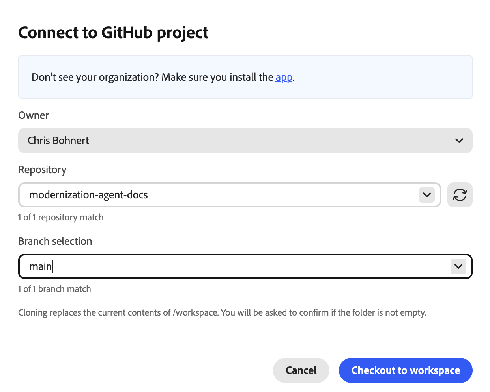
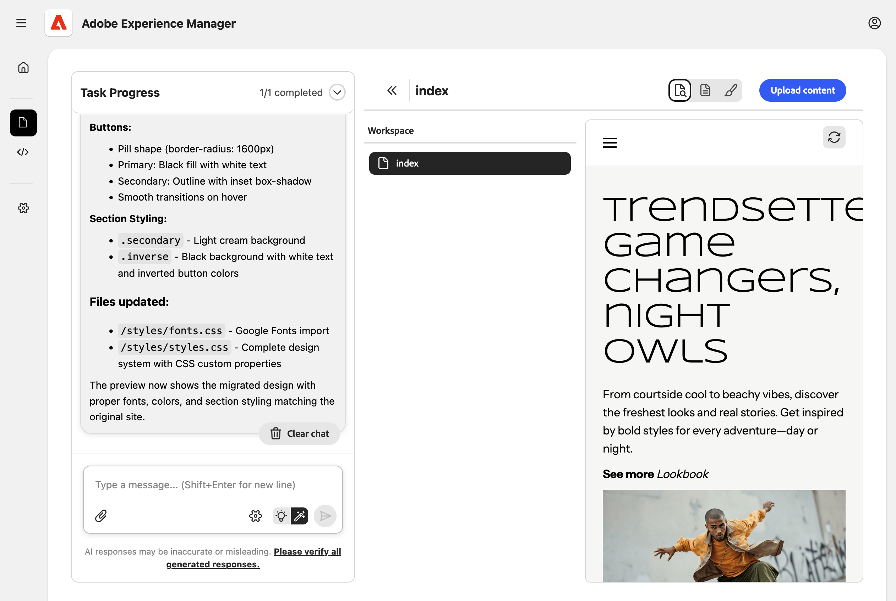
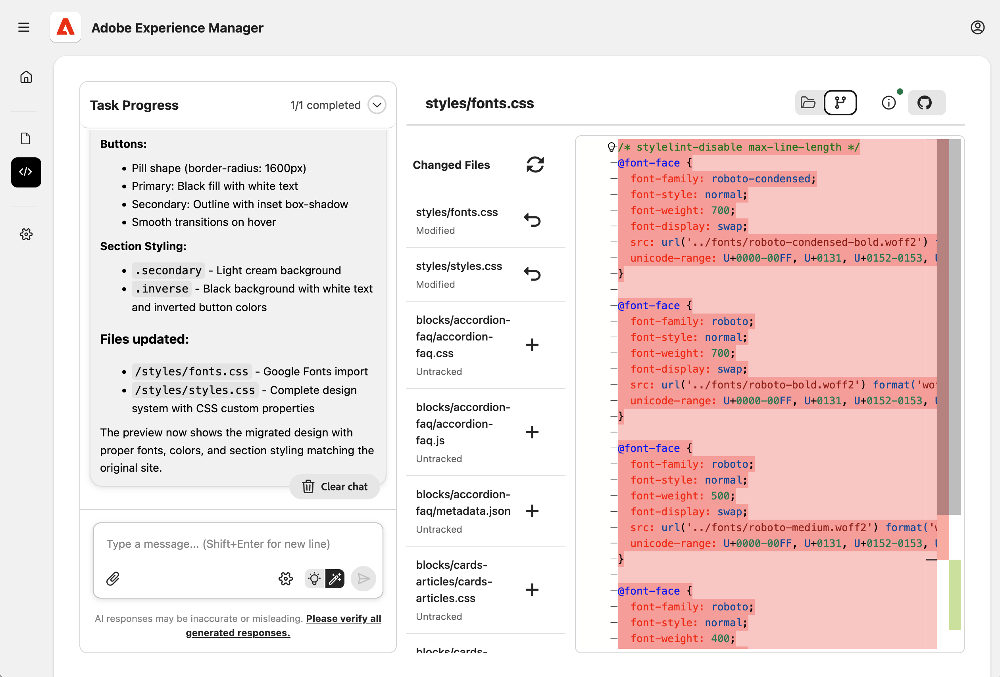

# Experience Modernation Agent 시작하기 {#getting-started}

Experience Modernation Console을 사용하여 Experience Modernation Agent를 통해 신속하게 생산성을 높일 수 있는 첫 번째 단계에 대해 알아봅니다.

>[!NOTE]
>
>Experience Modernation Console 사용에 관심이 있는 경우 원활한 온보딩 경험을 위해 액세스를 요청할 수 있습니다.

## Edge Delivery GitHub 저장소 준비 {#prepare-repo}

1. Experience Modernation Console에 사용할 [Edge Delivery Services](/help/edge/overview.md) 리포지토리를 선택하십시오.
   * 이 프로젝트는 기존 Edge Delivery Services 프로젝트이거나 [표준 리포지토리를 사용하여 ](https://www.aem.live/developer/tutorial)개발자 자습서[에 따라 새 프로젝트를 만들 수 있습니다.](https://github.com/adobe/aem-boilerplate)
1. [AEM 코드 커넥터](https://github.com/apps/aem-code-connector)가 저장소에 설치되어 있는지 확인하십시오.
   * 이렇게 하면 콘솔에서 코드를 검사할 수 있습니다.
1. [AEM 코드 동기화 GitHub 앱](https://github.com/apps/aem-code-sync)이 저장소에 설치되어 있는지 확인하십시오.
   * 이렇게 하면 Edge Delivery Services에서 코드를 동기화할 수 있습니다.
   * 보고서가 자습서를 기반으로 한다면 이 단계는 이미 완료된 것입니다.

## Experience Modernation Console 열기 {#open-console}

1. [`aemcoder.adobe.io`.](https://aemcoder.adobe.io)&#x200B;(으)로 이동
1. Adobe ID으로 로그인합니다.

## GitHub 저장소 연결 {#connect-repo}

처음 로그인할 때 저장소를 묻는 메시지가 콘솔에 표시됩니다.

1. **저장소 연결**&#x200B;을 클릭합니다.
1. 새 브라우저 탭에서 AEM 코드 커넥터 앱이 열립니다. **AEM 코드 커넥터 승인**&#x200B;을 클릭합니다.
1. 콘솔로 돌아가서 **소유자**, **저장소** 및 **분기 선택**&#x200B;을 선택하고 **작업 영역에 체크 아웃**을 클릭합니다.
   
1. **기존 작업 영역 바꾸기**&#x200B;를 묻는 메시지가 표시되면 **작업 영역 바꾸기**를 클릭합니다.
   

GitHub 프로젝트가 이제 콘솔에 연결되고 홈 화면에 표시됩니다.

## 메시지 표시 시작 {#start-prompting}

이제 콘솔에서 코드에 액세스할 수 있으므로 메시지를 시작할 준비가 되었습니다.

1. 시작하려면 사이트의 콘텐츠를 가져올 수 있습니다.
   * &quot;`https://wknd-trendsetters.site` 페이지를 마이그레이션합니다.&quot;
1. 사이트의 콘텐츠를 가져옵니다.
   * 이 콘솔은 문제 분리를 관찰하고 콘텐츠와 프레젠테이션을 개별적으로 처리합니다.
   * 사이트 콘텐츠를 처음 가져오는 데 몇 분 정도 걸릴 수 있습니다.
   * 콘솔은 계획된 단계의 개요를 포함하여 작업을 시작할 때 지속적인 피드백을 제공합니다.
     
1. 사이트를 가져오면 **Workspace** 패널에 페이지가 표시됩니다. 오른쪽 패널에서 미리 볼 페이지를 선택합니다.
   
1. 이제 콘텐츠가 있으므로 동일한 소스에서 스타일을 가져오라는 메시지를 표시할 수 있습니다.
   * &quot;`https://wknd-trendsetters.site`에서 일반 스타일을 가져옵니다.&quot;
1. 초기 콘텐츠 가져오기와 마찬가지로 가져오기에도 몇 분 정도 걸릴 수 있으며, 콘솔에서 요청을 처리하고 스타일을 가져올 때 피드백을 제공합니다. 작업이 완료되면 오른쪽 패널에서 **미리 보기 새로 고침**을 클릭하여 스타일이 지정된 콘텐츠를 봅니다.
   

이제 콘솔에 콘텐츠와 스타일을 모두 가져왔습니다.

## 콘텐츠 업로드 {#upload-content}

콘텐츠를 [문서 작성](https://da.live)에 업로드하려면:

1. **콘텐츠** 보기에 있는지 확인한 다음 오른쪽 상단의 **콘텐츠 업로드** 단추를 클릭합니다.
   * 콘솔에 들어갈 때는 기본적으로 **콘텐츠** 보기에 있습니다.
   * 콘솔의 왼쪽에 있는 사이드바에서 강조 표시된 아이콘이 보기를 표시합니다.
1. **에서 미리 채워진 대상 조직 및 저장소와 함께**&#x200B;콘텐츠 업로드`fstab.yaml` 대화 상자가 열립니다.
   * `fstab.yaml`이(가) 연결된 저장소에 없는 경우 **조직** 및 **저장소**&#x200B;를 수동으로 입력해야 합니다.
   * 상용구를 사용한 경우 `fstab.yaml`이(가) 제공됩니다.
1. 업로드할 파일을 선택하고 **업로드**를 클릭합니다.
   
1. 콘솔은 **업로드** 단추를 회색으로 표시하여 업로드 프로세스를 나타냅니다.
   
1. 완료되면 콘솔 하단에 알림이 표시됩니다.
   

문서 작성에서 업로드된 콘텐츠에 액세스하려면 업로드가 완료되면 알림에서 **AEM에서 보기**&#x200B;를 클릭하거나 `https://da.live/#/{organization}/{repository}`(으)로 이동하십시오.

가져온 콘텐츠는 이제 문서 작성 중입니다.

## 푸시 코드 변경 {#push-code-changes}

코드에 적용한 변경 사항이 만족하면 GitHub 리포지토리에 푸시할 수 있습니다.

1. **코드** 보기(왼쪽 사이드바의 `</>` 아이콘)로 전환한 다음 **Git 변경 사항** 탭(오른쪽 상단의 분기 아이콘)으로 전환합니다.
   
1. 변경된 파일 목록에서 일부 파일이 추적되지 않은 것으로 표시되면 `+` 단추를 클릭하여 준비합니다.
1. 오른쪽 상단의 **GitHub 작업** 단추를 클릭한 다음 드롭다운에서 **푸시**&#x200B;를 선택합니다.
1. **변경 내용 푸시** 대화 상자에서 변경 내용을 새 PR(기본값) 또는 현재 분기에 푸시하도록 선택하고 **확인**&#x200B;을 클릭하여 푸시합니다.
   * 확실하지 않은 경우 현재 분기로 푸시하여 상황을 단순화할 수 있습니다.
1. 완료되면 콘솔 하단에 알림이 표시됩니다.
   

GitHub에서 푸시된 변경 사항에 직접 액세스하려면 푸시가 완료되면 알림에서 **PR 보기**&#x200B;를 클릭하십시오.

이제 코드가 GitHub에 있습니다.

## 사이트 미리보기 {#preview-site}

미리보기 환경에서 변경 사항을 보려면 다음과 같이 하십시오.

1. 문서 작성으로 돌아갑니다.
   * 콘텐츠를 업로드한 후 **AEM에서 보기**&#x200B;를 클릭한 후 연 브라우저 탭에서 열려 있을 수 있습니다.
   * 또는 `https://da.live/#/{organization}/{repository}`(으)로 이동
1. 이전에 AEM에 업로드한 페이지 중 하나를 엽니다.
1. 종이 비행기 아이콘(오른쪽 상단)을 클릭하고 **미리 보기**를 선택합니다.
   

축하합니다! 마이그레이션된 컨텐츠 및 스타일이 이제 AEM 미리보기 환경에 라이브로 표시됩니다.

코드를 `main` 이외의 분기로 푸시한 경우 문서 작성에서 연 미리 보기에 스타일이 표시되지 않습니다. 미리 보기의 URL을 업데이트하여 분기로 변경하면 스타일을 볼 수 있습니다.

## 추가 리소스 {#additional-resources}

다음 문서는 경험 현대화 에이전트 및 해당 콘솔을 계속 살펴볼 때 유용할 수 있습니다.

* [경험 현대화 콘솔](/help/ai-in-aem/agents/brand-experience/modernization/console.md) - 콘솔에 대한 세부 정보, 보기, 옵션 및 기능
* [Edge Delivery Services 개발자 자습서](https://www.aem.live/developer/tutorial) - AEM 및 Edge Delivery Services 프로젝트를 처음 사용하는 경우 유용합니다.
* [문서 작성](https://da.live) - 콘텐츠 관리를 위해 문서 작성을 처음 하는 경우에 유용합니다.
