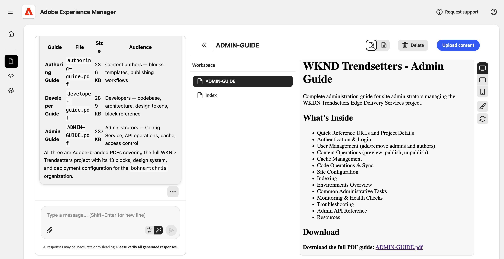

# 프로젝트 설명서 스킬 {#project-documentation}

Experience 현대화 에이전트의 설명서 기술을 통해 프로젝트 이행을 가속화하는 방법에 대해 알아봅니다.

## 프로젝트 전환 가속화 {#project-handovers}

[Experience 현대화 에이전트](/help/ai-in-aem/agents/brand-experience/modernization/overview.md)는 다음과 같은 기능을 제공하는 AEM Edge Delivery Services 프로젝트에 대한 프로젝트 설명서 안내서를 자동으로 생성할 수 있습니다.

* **프로젝트 연습** - 수동으로 작업하지 않고 생성된 프로젝트 설정, 구조 및 규칙에 대한 설명
* **모듈 및 구성 요소 조직** - 블록, 모듈 및 구성 요소를 구성하는 방법과 구성 요소가 서로 관련되는 방법에 대한 설명서를 지웁니다.
* **역할 기반 안내서** - 작성자, 개발자 및 관리자를 위한 대상 설명서이므로 각 팀원이 필요한 항목을 정확하게 얻을 수 있습니다.

이를 통해 AEM Edge Delivery Services 프로젝트의 프로젝트 전달을 간소화합니다.

## 사전 요구 사항 {#prerequisites}

이 스킬을 사용하기 전에 다음 사항을 확인하십시오.

* 프로젝트가 콘솔에서 작업 공간으로 체크 아웃되어 있어야 합니다.
* 설명서를 만드는 프로젝트에 대한 관리자 권한이 있어야 합니다.
* 콘솔에서 에이전트 권한을 허용해야 합니다.
   * 콘솔 설정에서 **LLM이 나를 대신하여 admin.hlx.page에 액세스하도록 허용** [옵션을 선택합니다.](/help/ai-in-aem/agents/brand-experience/modernization/console.md#settings-view)
   * 이 옵션이 활성화되어 있지 않으면 에이전트는 액세스할 수 있는 코드 베이스를 기반으로 설명서를 생성합니다.

## 프로젝트 설명서 만들기 {#creating-documentation}

전제 조건이 충족되면 에이전트에 프로젝트에 대한 설명서를 생성하도록 요청하면 됩니다.

1. 채팅에서 &quot;이 프로젝트의 설명서 만들기&quot;를 요청합니다.
1. 에이전트에서 요청할 경우 프로젝트의 조직 이름을 입력합니다.
1. 에이전트는 만들려는 설명서를 묻습니다. 일반적으로 **모두**&#x200B;를 선택합니다.

   

1. 가이드가 만들어지면 작업 공간에 배치됩니다. 설명을 보려면 하나를 선택하고 링크를 클릭하여 전체 PDF을 다운로드합니다.

   

PDF을 직접 저장하여 팀에 제공하거나 나머지 DA 콘텐츠의 일부로 업로드할 수 있습니다.

>[!NOTE]
>
>Edge Delivery Services 관리 API에 액세스할 권한이 없는 경우 또는 콘솔 설정에서 **LLM이 나를 대신하여 admin.hlx.page에 액세스하도록 허용** [옵션을 선택하십시오.](/help/ai-in-aem/agents/brand-experience/modernization/console.md#settings-view)을(를) 사용할 수 없습니다. 에이전트가 액세스할 수 있는 코드 베이스를 기반으로 설명서를 생성합니다.

## 문제 해결 {#troubleshooting}

다음은 프로젝트 설명서 기술을 사용할 때 발생하는 일반적인 오류 메시지와 해결 방법입니다.

### &quot;액세스 거부됨&quot; 또는 &quot;승인되지 않음&quot; {#unauthorized}

* **원인:** 누락된 관리자 권한 또는 에이전트 권한이 활성화되지 않았습니다.
* **솔루션:**
   1. 프로젝트에 대한 관리자 액세스 권한이 있는지 확인
   1. 콘솔 설정에서 **LLM이 나를 대신하여 admin.hlx.page에 액세스하도록 허용** [옵션을 선택합니다.](/help/ai-in-aem/agents/brand-experience/modernization/console.md#settings-view)

### &quot;프로젝트를 찾을 수 없음&quot; {#not-found}

* **원인:** 저장소가 작업 영역에서 체크 아웃되지 않았습니다.
* **솔루션:**
   1. 프로젝트 저장소 체크 아웃
   1. 올바른 작업 영역에 있는지 확인합니다.

### &quot;구성 API 오류&quot; {#api-error}

* **원인:** Edge Delivery Services 구성 서비스 API에 액세스할 수 없습니다.
* **솔루션:**
   1. 콘솔 설정에서 **LLM이 나를 대신하여 admin.hlx.page에 액세스하도록 허용** [옵션을 선택합니다.](/help/ai-in-aem/agents/brand-experience/modernization/console.md#settings-view)
   1. 네트워크/VPN 연결 확인
   1. 프로젝트에 대한 관리자 액세스 확인
