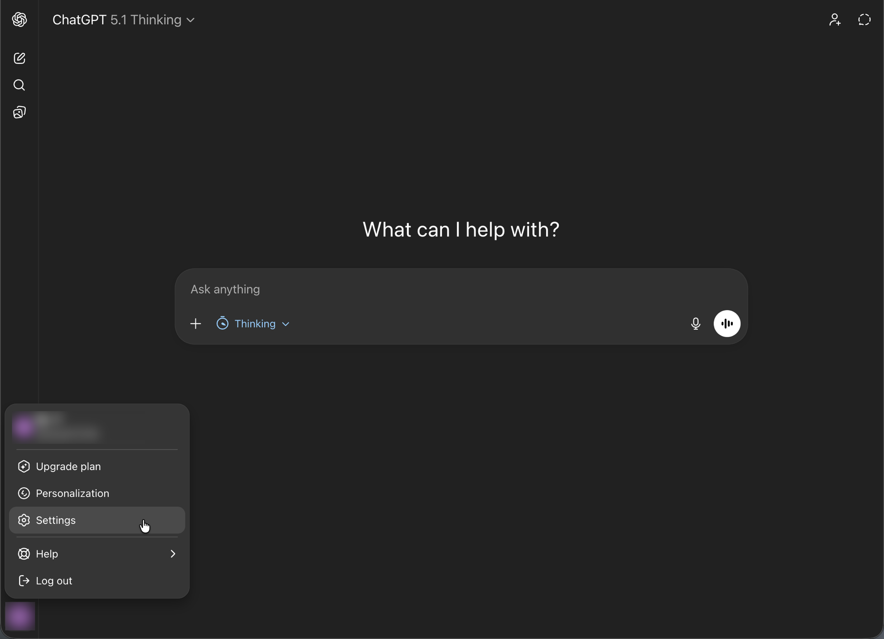

# AEM MCP를 사용하여 OpenAI ChatGPT 설정 {#setup-chatgpt}

다음 단계에 따라 OpenAI ChatGPT를 AEM의 MCP 서버에 연결합니다.

* MCP 연결 또는 도구가 구성된 영역에 하나 이상의 AEM MCP 서버 URL을 추가합니다.
* 연결을 트리거하고 리디렉션될 때 Adobe ID으로 로그인합니다.
* 채팅에서 프롬프트에서 구성된 AEM 도구를 참조하십시오. 예를 들면 다음과 같습니다.

  ```
  "Using the configured AEM MCP tools, list all sites in the author environment."
  ```




