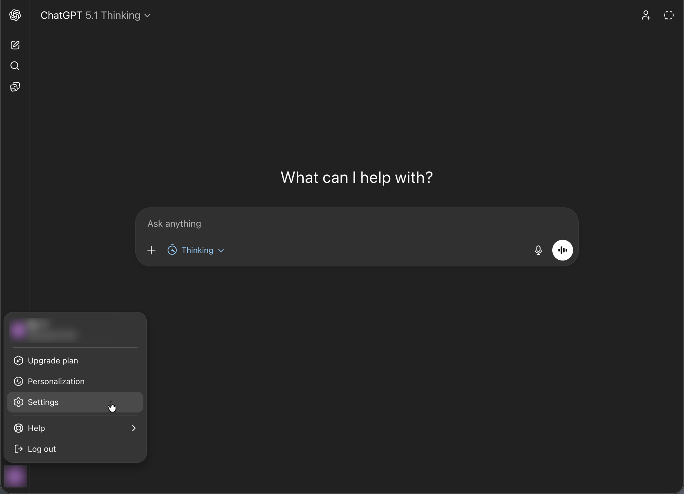
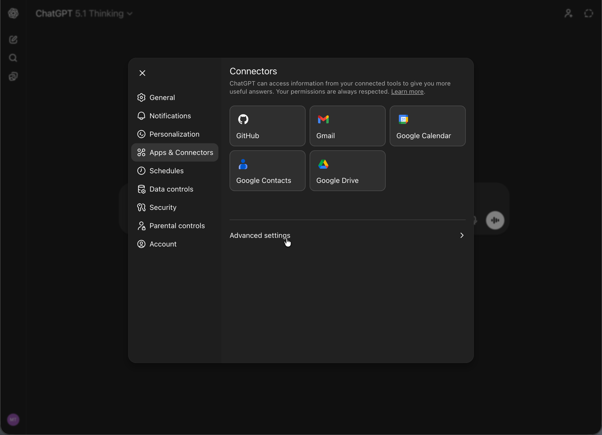
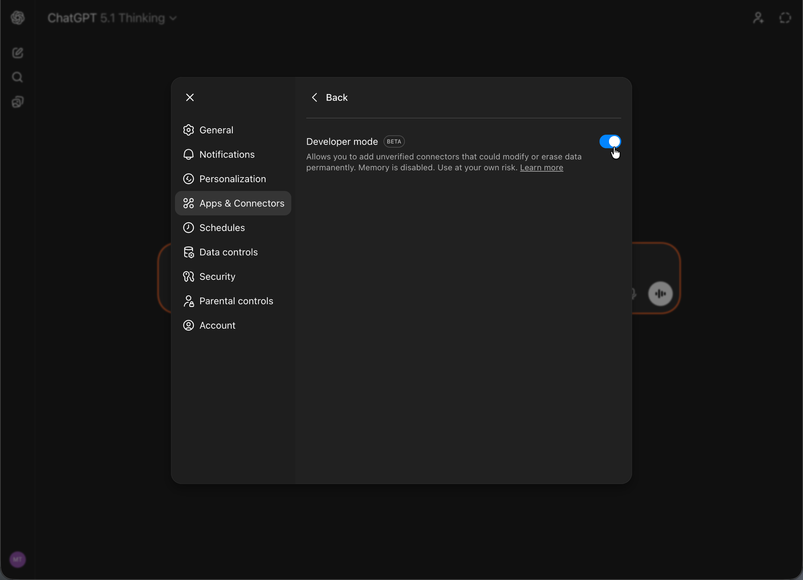
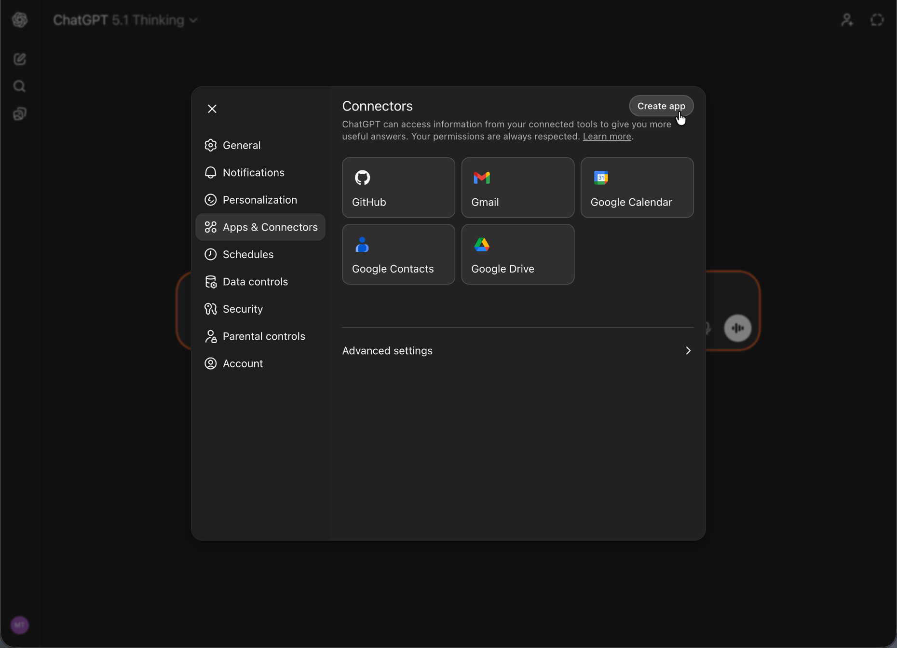
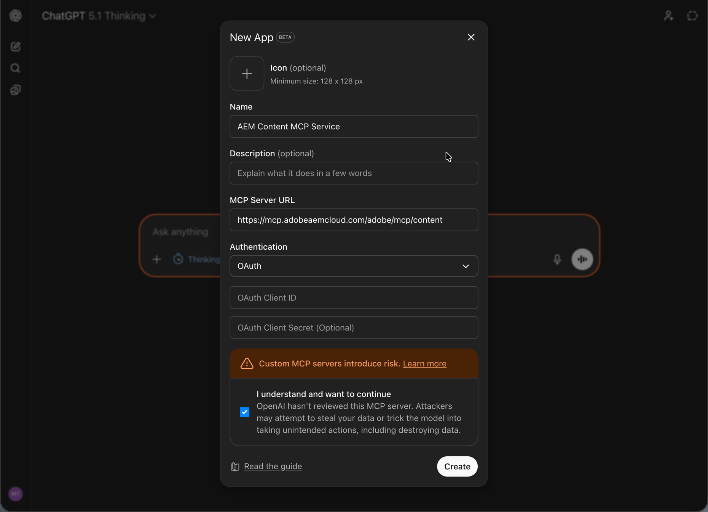

# AEM MCP를 사용하여 OpenAI ChatGPT 설정 {#setup-chatgpt}

다음 단계에 따라 OpenAI ChatGPT를 AEM의 MCP 서버에 연결합니다.

* MCP 연결 또는 도구가 구성된 영역에 하나 이상의 AEM MCP 서버 URL을 추가합니다.
* 연결을 트리거하고 리디렉션될 때 Adobe ID으로 로그인합니다.
* 채팅에서 프롬프트에서 구성된 AEM 도구를 참조하십시오. 예를 들면 다음과 같습니다.

  ```
  "Using the configured AEM MCP tools, list all sites in the author environment."
  ```

>[!NOTE]
>
>OpenAI ChatGPT 사용자 인터페이스는 변경될 수 있으며 결정적이지 않습니다. 이러한 지시사항은 예시적인 목적을 위한 것입니다.

1. MCP 연결 또는 도구가 구성된 영역에 연결할 수 있도록 **설정**&#x200B;을 엽니다.

   

1. **앱 및 커넥터**&#x200B;에서 **고급 설정**&#x200B;을 열어 커넥터 및 MCP 관련 옵션을 관리합니다.

   

1. 사용자 지정 앱 또는 커넥터를 추가하고 구성할 수 있도록 **앱 및 커넥터**&#x200B;에서 **개발자 모드**&#x200B;을 사용하도록 설정하십시오.

   

1. **새 앱 만들기**(또는 이에 상응하는 컨트롤)를 시작하여 AEM MCP 서버에 앱 항목을 추가합니다.

   

1. **새 앱** 양식을 작성합니다. 예를 들어 앱 이름을 지정하고 AEM MCP 서버 URL 및 기타 필수 필드를 입력한 다음 **저장**&#x200B;합니다.

   

1. ChatGPT에서 사용할 수 있도록 **AEM 콘텐츠 MCP 서비스**(또는 구성된 앱)이 **앱 및 커넥터**&#x200B;에 표시되는지 확인합니다.

   

1. 채팅에서 ChatGPT에 구성된 **AEM 도구**&#x200B;를 사용하도록(예: 작성자 콘텐츠 또는 사이트를 쿼리하도록) 알리는 메시지를 작성하십시오.

   
