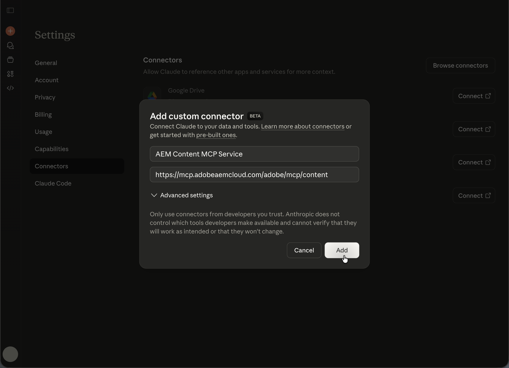

# AEM MCP로 Anthropic Claude 설정 {#setup-claude}

다음 단계에 따라 Anthropic Claude를 AEM의 MCP 서버에 연결합니다.

* Claude의 MCP 구성에서 하나 이상의 AEM MCP 서버 URL을 등록합니다.
* Adobe 로그인 플로우를 완료합니다.
* 필요한 경우 구성 영역의 특정 도구에 대해 자동 확인 을 활성화합니다. 이 옵션은 검색 또는 읽기 전용 작업에 권장됩니다.
* 대화를 시작하기 전에 MCP 서버를 선택해야 합니다.
* Claude에게 AEM 관련 작업을 수행하도록 요청합니다. Claude 귀하의 프롬프트에 따라 MCP 서버에 의해 노출 된 AEM 도구를 선택합니다.

