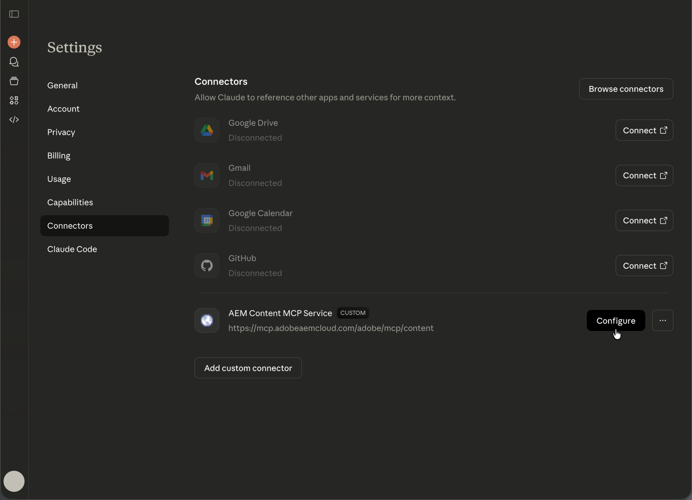
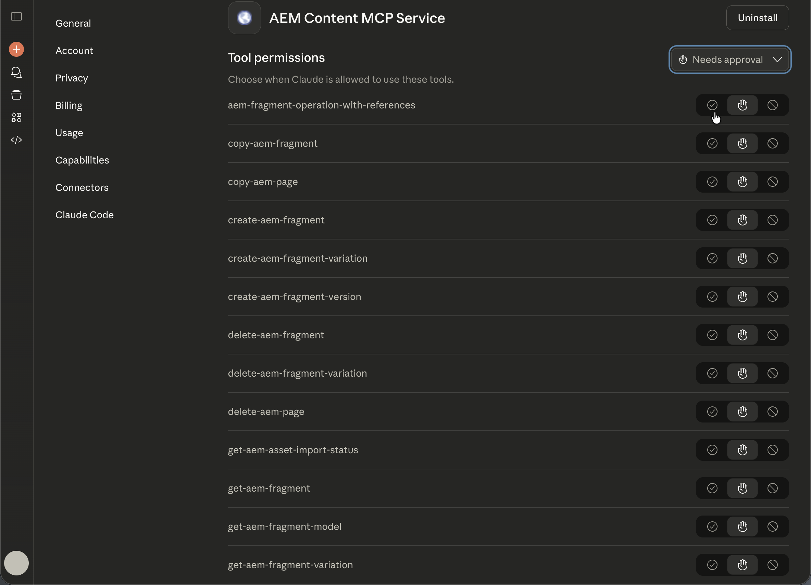
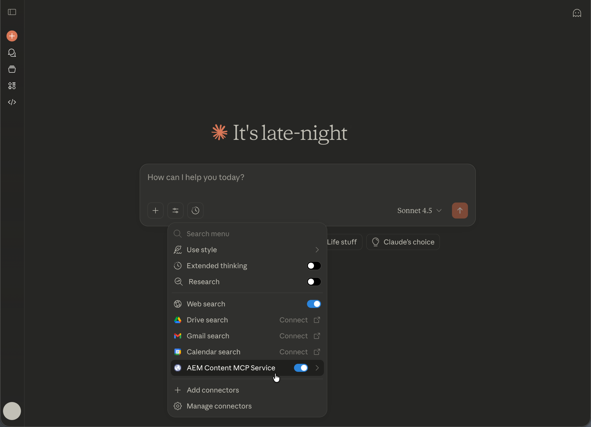

# AEM MCP로 Anthropic Claude 설정 {#setup-claude}

이 문서에서는 AEM과 함께 Anthropic Claude를 사용하는 두 가지 방법을 다룹니다.

- 클라우드에 있는 AEM의 MCP 서버 중 하나 이상을 수동으로 구성합니다([AEM as a Cloud Service과 함께 MCP 사용 - MCP 서버](/help/ai-in-aem/mcp-support/using-mcp-with-aem-as-a-cloud-service.md#mcp-servers)에 설명된 서버).
- Anthropic의 커넥터 마켓플레이스에서 Adobe Experience Manager 커넥터를 설치합니다. 현재 컨텐츠 MCP 서버와의 기능 패리티가 있으며 AEM의 MCP 서버에서 사용할 수 있는 도구의 증가하는 부분 집합을 노출시킵니다.

## 클라우드에서 AEM의 MCP 서버 수동 구성 {#manual-configure-aems-mcp-servers-in-claude}

이 섹션에서는 하나 이상의 AEM MCP 서버를 Cloud에 사용자 정의 커넥터로 추가하는 **수동 구성** 방법에 대해 설명합니다.

>[!NOTE]
>
>Claude 사용자 인터페이스는 변경될 수 있으며 확정적이지 않습니다. 이러한 지시사항은 예시적인 목적을 위한 것입니다.

1. 클라우드 웹 앱의 왼쪽 아래 모서리에서 계정 메뉴를 열고 **설정**&#x200B;을 선택하여 설정 영역을 엽니다.

   

1. 설정 사이드바에서 **커넥터**&#x200B;를 선택합니다. Connectors 페이지에서 **사용자 지정 커넥터 추가**&#x200B;를 선택하여 사용자 지정 MCP 끝점을 등록합니다.

   사용자 지정 커넥터 추가 설정의 

1. **사용자 지정 커넥터 추가** 대화 상자에서 디스플레이 이름(예: **AEM Content MCP Service**)과 MCP 서버 URL을 입력한 다음 **추가**&#x200B;를 선택합니다. 배포에 추가 옵션이 필요한 경우에만 **고급 설정**&#x200B;을 사용하십시오.

   

1. 커넥터 목록에서 사용자 지정 커넥터 항목(**CUSTOM** 레이블이 표시됨)을 찾은 다음 **연결**&#x200B;을 선택하여 로그인하고 커넥터를 클라우드 계정에 연결합니다.

   

1. 커넥터가 해당 URL과 함께 목록에 나타나면 **AEM 콘텐츠 MCP 서비스** 옆의 **구성**&#x200B;을(를) 선택하여 커넥터 세부 정보를 열고 설치를 계속합니다.

   

1. **도구 권한** 페이지에서 기본값을 검토한 다음(예: **승인 필요**) 보안 정책에 따라 각 AEM 도구를 **항상 허용**, **권한 요청** 또는 **절대 허용 안 함**&#x200B;으로 설정합니다.

   

1. 대화를 엽니다. 메시지 필드 왼쪽에 있는 도구 및 모델 메뉴(슬라이더 아이콘)를 선택하고 Connectors에서 **AEM 콘텐츠 MCP 서비스**&#x200B;를 사용하도록 설정한 다음 Claude가 해당 채팅에 MCP 도구를 사용할 수 있도록 프롬프트를 입력합니다.

   

## Adobe Experience Manager 커넥터 설치(Anthropic 커넥터 마켓플레이스) {#install-adobe-experience-manager-connector}

이 섹션에서는 Anthropic의 커넥터 마켓플레이스에서 가져온 **설치 가능한 커넥터**&#x200B;에 대해 설명합니다(사용자 지정 커넥터 URL 추가와 반대). 여기에는 AEM의 MCP 서버에서 사용할 수 있는 도구의 하위 집합이 포함됩니다.

**Adobe Experience Manager 커넥터**&#x200B;를 설치하려면 클라우드에서 **설정** > **커넥터**&#x200B;를 여십시오. [https://claude.ai/settings/connectors](https://claude.ai/settings/connectors)에서 바로 Connectors 페이지를 열 수도 있습니다. 커넥터는 AEM 워크플로우에 대한 늘어나는 도구 세트를 노출하는 MCP 서버를 등록합니다.

