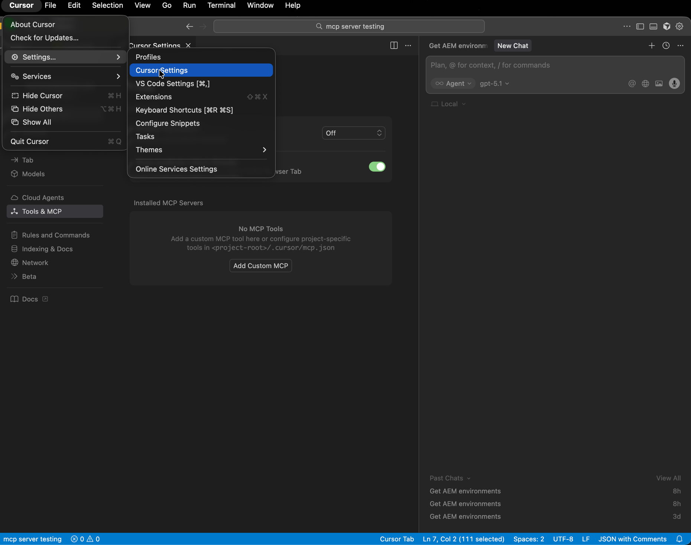
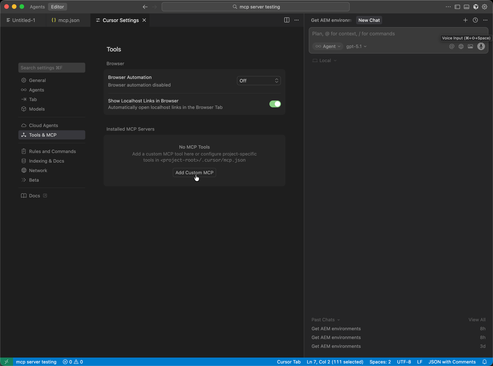
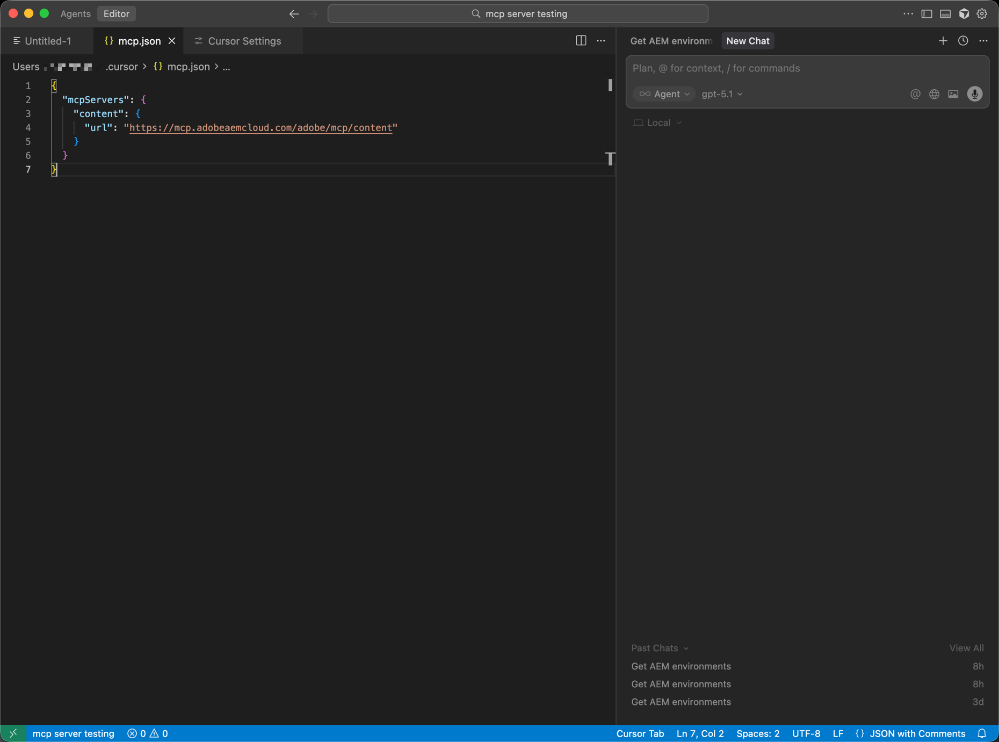
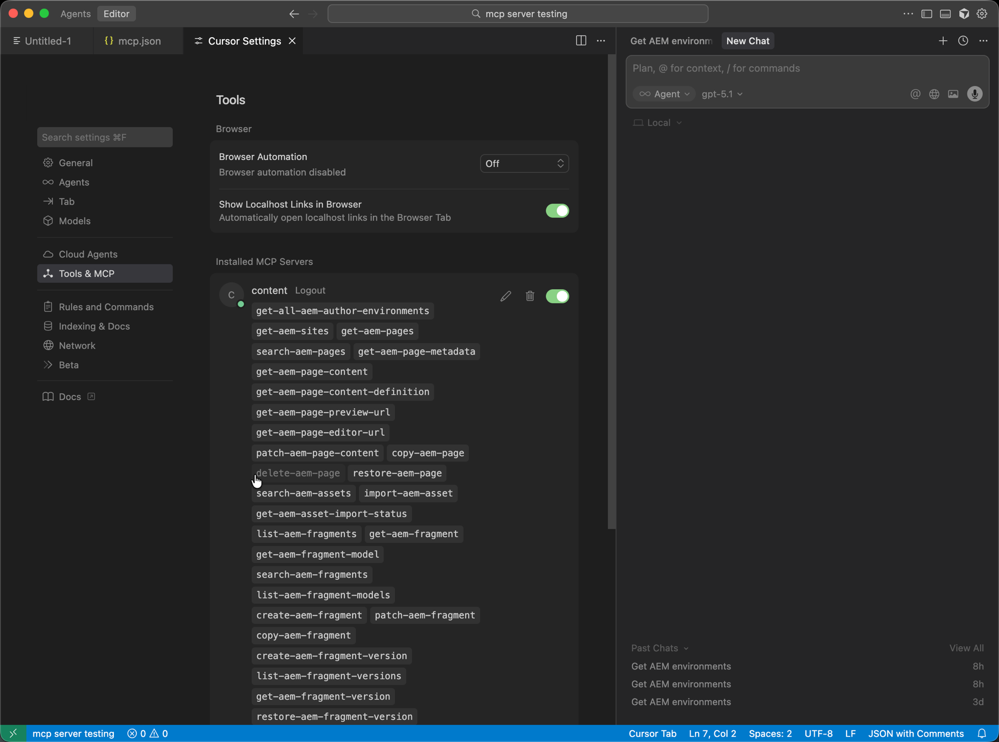

# AEM MCP를 사용하여 커서 설정 {#setup-cursor}

다음 단계에 따라 Cursor를 AEM의 MCP 서버에 연결합니다.

* 커서의 MCP 설정에서 하나 이상의 AEM MCP URL이 포함된 새 MCP 서버 항목을 만듭니다.
* 메시지가 표시되면 Adobe ID을 사용하여 인증합니다.
* 필요한 경우 도구 이름을 클릭하여 개별 도구를 활성화하거나 비활성화합니다. 모든 도구는 기본적으로 활성화되어 있습니다.
* 커서 편집기 또는 채팅을 사용하여 개발 또는 콘텐츠 워크플로의 일부로 AEM 도구를 호출합니다.

>[!NOTE]
>
>Cursor 사용자 인터페이스는 변경될 수 있으며 확정적이지 않습니다. 이러한 지시사항은 예시적인 목적을 위한 것입니다.

1. Cursor가 MCP 서버에 연결되는 방법을 구성할 수 있도록 **커서 설정**&#x200B;을 엽니다.

   

1. **도구 및 MCP**&#x200B;를 연 다음 **사용자 지정 MCP 추가**&#x200B;를 선택하여 사용자 지정 MCP 서버 항목을 시작합니다.

   

1. 사용자 지정 MCP 서버 양식에 **이름**, AEM MCP **URL**(또는 URL) 및 기타 필수 필드를 입력한 다음 **저장**&#x200B;합니다.

   

1. 연결 대화 상자가 나타나면 새 MCP 서버가 승인되도록 **Connect**&#x200B;를 눌러 로그인을 완료합니다.

   

1. **채팅** 또는 편집기에서 구성된 MCP 서버가 워크플로에 참여할 수 있도록 **AEM 도구**&#x200B;를 호출하는 프롬프트를 작성하십시오.

   
