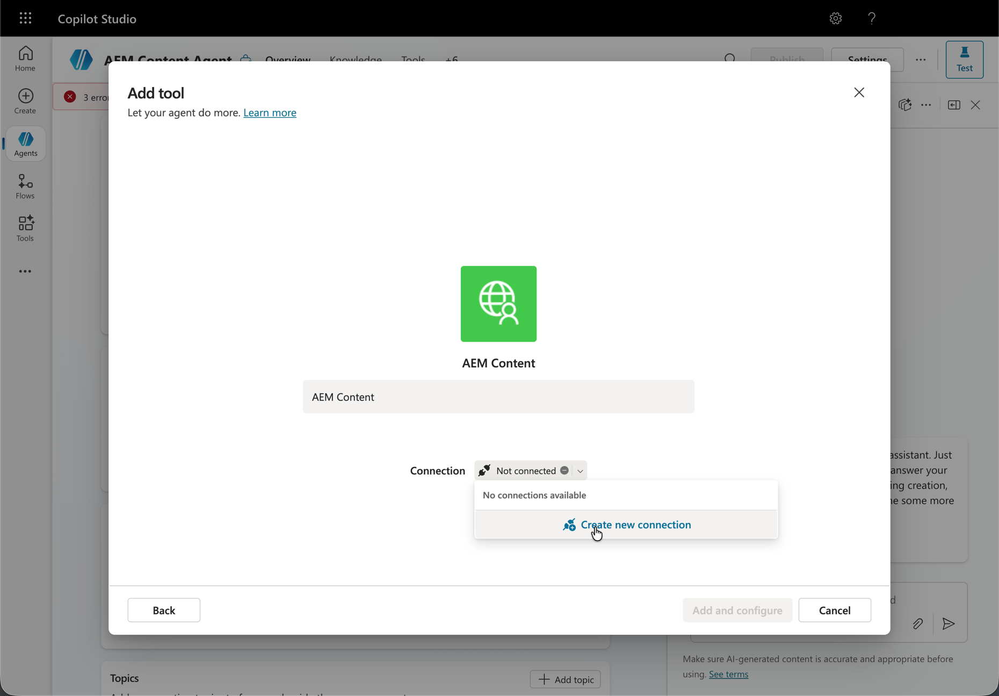
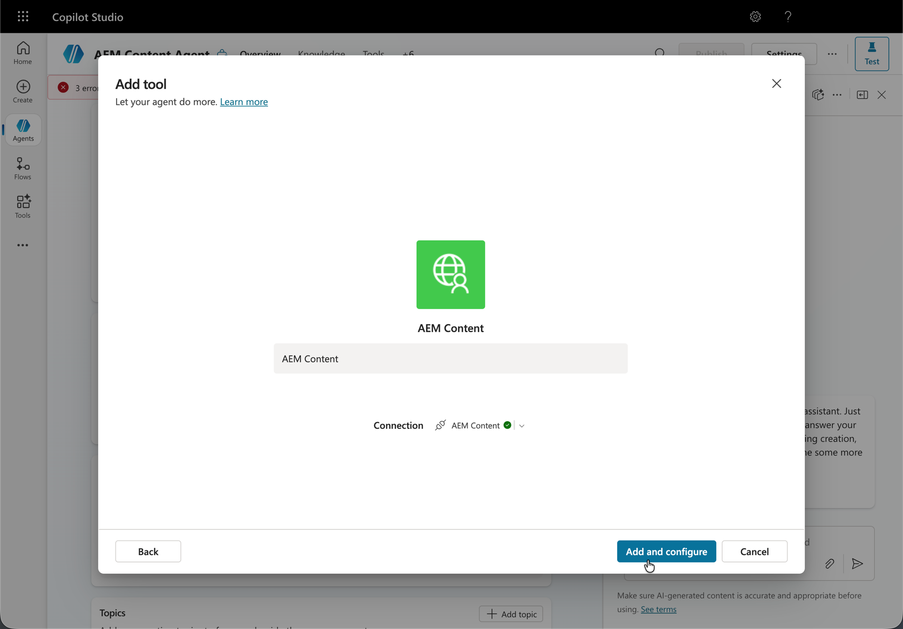

# AEM MCP를 사용하여 Microsoft Copilot Studio 설정 {#setup-microsoft-copilot-studio}

다음 단계에 따라 Microsoft Copilot Studio를 AEM의 MCP 서버에 연결합니다.

* 새 에이전트를 만듭니다.
* 도구 섹션으로 이동한 다음 **도구 추가**&#x200B;를 클릭합니다.
* 기존 도구를 선택하거나 새 도구를 만듭니다.
* 하나 이상의 AEM MCP 서버 URL을 가리키는 새 MCP 도구를 구성합니다.
* 에이전트 간에 공유하거나 전담할 수 있는 연결을 설정합니다.
* 리디렉션될 때 Adobe ID을 사용하여 로그인합니다.
* 필요한 경우 자동 확인 모드를 활성화하거나 모든 도구 상호 작용에 대해 최종 사용자 확인이 필요합니다.
* 에이전트를 테스트할 때 먼저 연결 관리자를 열어 세션에 연결을 할당한 다음 **다시 시도**&#x200B;를 누르십시오.

