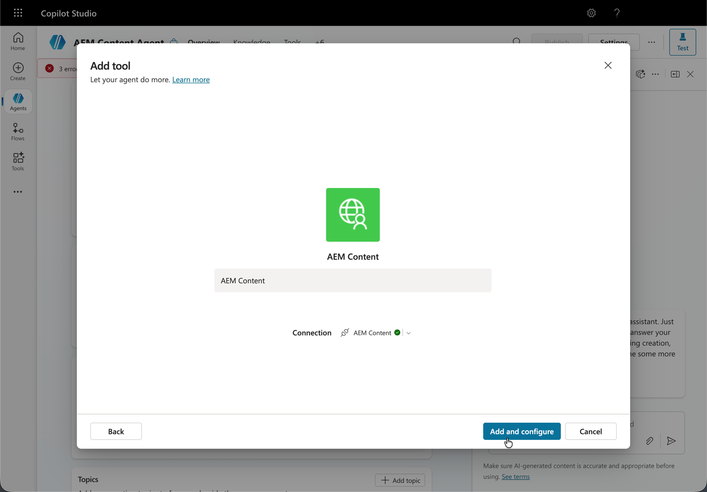

# AEM MCP를 사용하여 Microsoft Copilot Studio 설정 {#setup-microsoft-copilot-studio}

다음 단계에 따라 Microsoft Copilot Studio를 AEM의 MCP 서버에 연결합니다.

>[!NOTE]
>
>Microsoft Copilot Studio 사용자 인터페이스는 변경될 수 있으며, 확정적이지 않습니다. 이러한 지시사항은 예시적인 목적을 위한 것입니다.

1. **에이전트**&#x200B;에서 AEM MCP 도구를 사용할 에이전트를 추가하는 흐름을 시작하십시오.

   * 새 에이전트를 만듭니다.

   

1. 외부 기능을 호출하는 방법을 등록할 수 있도록 해당 에이전트에 대한 도구 영역을 엽니다.

   * 도구 섹션으로 이동한 다음 **도구 추가**&#x200B;를 클릭합니다.

   

1. 기존 통합을 다시 사용할지 또는 새로운 MCP 지원 도구를 정의할지 결정합니다.

   * 기존 도구를 선택하거나 새 도구를 만듭니다.

   

1. 새 MCP 도구를 만들 때 표시되는 미리 보기 모드를 포함하여 **모델 컨텍스트 프로토콜** 서버 단계를 계속하십시오.

   * 하나 이상의 AEM MCP 서버 **URL**&#x200B;을(를) 가리키는 새 MCP 도구를 구성합니다.

   

1. 액세스 공유 또는 전용 여부를 포함하여 에이전트가 이 MCP 끝점에 도달하는 방법을 정의합니다.

   * 에이전트 간에 **공유** 또는 **전용**&#x200B;일 수 있는 연결을 설정하십시오.

   

1. **추가 및 구성**&#x200B;에서 에이전트가 AEM 환경에 도달할 수 있도록 MCP 도구 세부 정보를 제공하거나 확인하십시오.

   

1. MCP 도구 양식의 완료 필드(예: 서버 **URL** 및 인증 관련 옵션).

   * 필요한 경우 모든 도구 상호 작용에 대해 **자동 확인 모드**&#x200B;를 활성화하거나 **최종 사용자 확인**&#x200B;이 필요합니다.

   

1. MCP 서버에 대한 연결을 확인합니다. Copilot Studio가 사용자를 리디렉션하면 브라우저 기반 로그인을 완료합니다.

   * 리디렉션될 때 **Adobe ID**&#x200B;을 사용하여 로그인합니다.

   

1. 테스트를 실행하기 전에 **연결 관리**(또는 **연결 관리자**)를 열고 세션에 올바른 연결을 할당하십시오.

   * 에이전트를 테스트할 때 먼저 **연결 관리자**&#x200B;를 열어 세션에 연결을 지정하십시오.

   

1. 테스트 경험에서 AEM MCP 연결에 대해 에이전트를 실행합니다.

   * 에이전트를 테스트할 때는 **연결 관리자**&#x200B;에서 연결을 할당한 후 **다시 시도**&#x200B;를 누르십시오.

   
