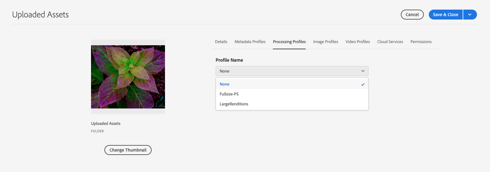

# Adobe Experience Manager에 디지털 자산 추가 {#add-assets-to-experience-manager}

Adobe Experience Manager은 풍부한 메타데이터, 스마트 태그, 변환 및 기타 DAM(Digital Asset Management) 서비스를 사용하여 업로드된 디지털 파일의 바이너리 컨텐츠를 더욱 풍부하게 제공합니다. 로컬 폴더 또는 네트워크 드라이브에서 Experience Manager 에셋으로 이미지, 문서 및 원시 이미지 파일과 같은 다양한 유형의 파일을 업로드할 수 있습니다.

여러 업로드 방법이 제공됩니다. 가장 일반적으로 사용되는 브라우저 업로드 외에도 Adobe Asset Link 또는 Experience Manager 데스크탑 앱과 같은 데스크탑 클라이언트, 고객이 만드는 업로드 및 통합 스크립트, AEM 익스텐션으로 추가된 자동화된 통합 등 Experience Manager 저장소에 자산을 추가하는 다른 방법이 있습니다.

여기에서 최종 사용자를 위한 업로드 방법에 중점을 두고 Experience Manager API 및 SDK를 사용하여 자산 업로드 및 수집의 기술적 측면을 설명하는 문서에 대한 링크를 제공합니다.

Experience Manager의 모든 이진 파일을 업로드 및 관리할 수 있지만 일반적으로 사용되는 파일 포맷은 메타데이터 추출 또는 미리 보기/변환 생성과 같은 추가 서비스를 지원합니다. 자세한 내용은 [지원되는 파일 형식을](file-format-support.md) 참조하십시오.

업로드된 자산에 대해 추가 처리를 하도록 선택할 수도 있습니다. 특정 메타데이터, 변환 또는 이미지 처리 서비스를 추가하기 위해 자산을 업로드하는 폴더에 다양한 자산 처리 프로필을 구성할 수 있습니다. 자세한 [내용은](#additional-processing) 아래 추가 처리를 참조하십시오.

>[!NOTE]
>
>Cloud Service은 직접 바이너리 업로드라는 새로운 방식의 자산 업로드 방식을 활용합니다. 기본적으로 AEM 사용자 인터페이스, Adobe Asset Link, AEM 데스크탑 앱과 같은 기본 제품 기능과 클라이언트가 지원되므로 최종 사용자에게 투명하게 표시됩니다.
>
>고객 기술 팀이 사용자 정의하거나 확장한 코드를 업로드하려면 새로운 업로드 API 및 프로토콜을 사용해야 합니다.

## Upload assets {#upload-assets}

파일(또는 여러 파일)을 업로드하려면 데스크탑에서 해당 파일을 선택하고 사용자 인터페이스(웹 브라우저)를 대상 폴더로 드래그하여 놓을 수 있습니다. 또는 사용자 인터페이스에서 업로드를 시작할 수 있습니다.

1. 자산 사용자 인터페이스에서 디지털 자산을 추가할 위치로 이동합니다.
1. 자산을 업로드하려면 다음 중 하나를 수행합니다.

   * 도구 모음에서 **[!UICONTROL 만들기]** 아이콘을 누릅니다. 그런 다음 메뉴에서 **[!UICONTROL 파일을 누릅니다]**. 필요한 경우 표시된 대화 상자에서 파일의 이름을 변경할 수 있습니다.
   * HTML5를 지원하는 브라우저에서 자산을 자산 사용자 인터페이스에서 바로 드래그합니다. 파일 이름 바꾸기 대화 상자가 표시되지 않습니다.

   

   여러 파일을 선택하려면 Ctrl 또는 Command 키를 누르고 파일 선택기 대화 상자에서 자산을 선택합니다. iPad를 사용하는 경우 한 번에 하나의 파일만 선택할 수 있습니다.

<!-- #ENGCHECK do we support pausing? I couldn't get pause to show with 1.5GB upload.... If not, this should be removed#

   You can pause the uploading of large assets (greater than 500 MB) and resume it later from the same page. Tap the **[!UICONTROL Pause]** icon beside progress bar that appears when an upload starts.

   

   The size above which an asset is considered a large asset is configurable. For example, you can configure the system to consider assets above 1000 MB (instead of 500 MB) as large assets. In this case, **[!UICONTROL Pause]** appears on the progress bar when assets of size greater than 1000 MB are uploaded.

   The Pause button does not show if a file greater than 1000 MB is uploaded with a file less than 1000 MB. However, if you cancel the less than 1000 MB file upload, the **[!UICONTROL Pause]** button appears.

   To modify the size limit, configure the `chunkUploadMinFileSize` property of the `fileupload`node in the CRX repository.

   When you click the **[!UICONTROL Pause]** icon, it toggles to a **[!UICONTROL Play]** icon. To resume uploading, click the **[!UICONTROL Play]** icon.

   
-->

1. 진행 중인 업로드를 취소하려면 진행률 표시줄 옆에 있는 닫기(`X`)를 클릭합니다. 업로드 작업을 취소하면 AEM Assets은 자산의 부분적으로 업로드된 부분을 삭제합니다.

   파일이 업로드되기 전에 업로드 작업을 취소하면 AEM Assets이 현재 파일 업로드를 중지하고 콘텐트를 새로 고칩니다. 하지만 이미 업로드된 파일은 삭제되지 않습니다.

<!-- #ENGCHECK do we support pausing? I couldn't get pause to show with 1.5GB upload.... If not, this should be removed#
   The ability to resume uploading is especially helpful in low-bandwidth scenarios and network glitches, where it takes a long time to upload a large asset. You can pause the upload operation and continue later when the situation improves. When you resume, uploading starts from the point where you paused it.
-->

<!-- #ENGCHECK assuming this is not relevant? remove after confirming#
   During the upload operation, AEM saves the portions of the asset being uploaded as chunks of data in the CRX repository. When the upload completes, AEM consolidates these chunks into a single block of data in the repository.

   To configure the cleanup task for the unfinished chunk upload jobs, go to `https://[aem_server]:[port]/system/console/configMgr/org.apache.sling.servlets.post.impl.helper.ChunkCleanUpTask`.
-->

1. AEM Assets의 업로드 진행 대화 상자에는 업로드된 파일의 수와 업로드하지 못한 파일의 수가 표시됩니다.

또한 자산 사용자 인터페이스에는 업로드한 가장 최근 자산이나 처음 만든 폴더가 표시됩니다.

>[!NOTE]
>
>중첩된 폴더 계층을 AEM에 업로드하려면 자산 [일괄 업로드를 참조하십시오](#bulk-upload).

<!-- #ENGCHECK I'm assuming this is no longer relevant.... If yes, this should be removed#

### Serial uploads {#serialuploads}

Uploading numerous assets in bulk consumes significant I/O resources, which may adversely impact the performance of your AEM Assets instance. In particular, if you have a slow internet connection, the time to upload drastically increases due to a spike in disk I/O. Moreover, your web browser may introduce additional restrictions to the number of POST requests AEM Assets can handle for concurrent asset uploads. As a result, the upload operation fails or terminate prematurely. In other words, AEM assets may miss some files while ingesting a bunch of files or altogether fail to ingest any file.

To overcome this situation, AEM Assets ingests one asset at a time (serial upload) during a bulk upload operation, instead of the concurrently ingesting all the assets.

Serial uploading of assets is enabled by default. To disable the feature and allow concurrent uploading, overlay the `fileupload` node in Crx-de and set the value of the `parallelUploads` property to `true`.

### Streamed uploads {#streamed-uploads}

If you upload many assets to AEM, the I/O requests to server increase drastically, which reduces the upload efficiency and can even cause some upload task to time out. AEM Assets supports streamed uploading of assets. Streamed uploading reduces the disk I/O during the upload operation by avoiding asset storage in a temporary folder on the server before copying it to the repository. Instead, the data is transferred directly to the repository. This way, the time to upload large assets and the possibility of timeouts is reduced. Streamed upload is enabled by default in AEM Assets.

>[!NOTE]
>
>Streaming upload is disabled for AEM running on JEE server with servlet-api version lower than 3.1.
-->

### 자산이 이미 존재하는 경우 업로드 처리 {#handling-upload-existing-file}

자산을 업로드하고 있는 위치에서 이미 사용할 수 있는 자산의 이름과 동일한 이름의 자산을 업로드하면 경고 대화 상자가 표시됩니다.

기존 자산을 교체하거나, 다른 버전을 만들거나, 업로드된 새 자산의 이름을 변경하여 두 자산을 모두 유지하도록 선택할 수 있습니다. 기존 자산을 대체할 경우, 기존 자산에 대한 메타데이터와 이전 수정(예: 주석, 자르기 등)이 삭제됩니다. 두 자산을 모두 유지하려면 새 자산의 이름이 이름에 추가되는 번호로 `1` 바뀝니다.

>[!NOTE]
>
>이름 충돌 대화 상자 **[!UICONTROL 에서]** [!UICONTROL 대체를] 선택하면 새 자산에 대해 자산 ID가 다시 생성됩니다. 이 ID는 이전 자산의 ID와 다릅니다.
>
>자산 통찰력이 Adobe Analytics에서 노출 횟수/클릭을 추적하도록 활성화된 경우 재생성된 자산 ID는 Analytics에서 자산에 대해 캡처된 데이터를 무효화합니다.

AEM Assets에 중복된 자산을 유지하려면 유지를 탭/ **[!UICONTROL 클릭합니다]**. 업로드한 중복 자산을 삭제하려면 삭제를 탭/ **[!UICONTROL 클릭합니다]**.

### 파일 이름 처리 및 금지 문자 {#filename-handling}

AEM Assets을 사용하면 파일 이름에 금지된 문자가 포함된 에셋을 업로드할 수 없습니다. 허용되지 않은 문자 이상이 포함된 파일 이름으로 자산을 업로드하려고 하면 AEM Assets에 경고 메시지가 표시되고 이러한 문자를 제거하거나 허용되는 이름으로 업로드할 때까지 업로드가 중지됩니다.

조직에 대한 특정 파일 이름 지정 규칙에 맞추기 위해 자산 [!UICONTROL 업로드] 대화 상자를 사용하면 업로드하는 파일의 긴 이름을 지정할 수 있습니다.

그러나 다음(공백으로 구분된 목록) 문자는 지원되지 않습니다.

* 자산 파일 이름에 `* / : [ \\ ] | # % { } ? &`
* 에셋 폴더 이름은 포함할 수 없습니다. `* / : [ \\ ] | # % { } ? \" . ^ ; + & \t`

## 자산 일괄 업로드 {#bulk-upload}

대용량 파일을 업로드하기 위해, 특히 디스크의 중첩된 폴더 계층에 파일이 있는 경우 다음 방법을 사용할 수 있습니다.

* 자산 업로드 API를 활용하는 사용자 지정 업로드 스크립트 또는 [도구를 사용합니다](developer-reference-material-apis.md#asset-upload-technical). 이러한 사용자 지정 도구는 필요한 경우 자산의 추가 처리(예: 메타데이터를 번역하거나 파일 이름 변경)를 추가할 수 있습니다.
* Experience Manager [데스크탑 앱을](https://docs.adobe.com/content/help/en/experience-manager-desktop-app/using/using.html) 사용하여 중첩된 폴더 계층을 업로드합니다.

>[!NOTE]
>
>Experience Manager으로 설정 및 배포할 때 다른 시스템에서 컨텐츠 마이그레이션의 일부로 일괄 업로드하려면 도구를 신중하게 계획, 고려 및 선택해야 합니다. 콘텐츠 [마이그레이션 방식에 대한 지침은 배포 가이드를](/help/implementing/deploying/overview.md) 참조하십시오.

## 데스크탑 클라이언트를 사용하여 에셋 업로드 {#upload-assets-desktop-clients}

웹 브라우저 사용자 인터페이스 외에도 Experience Manager은 데스크탑에서 다른 클라이언트를 지원합니다. 또한 웹 브라우저로 이동할 필요 없이 업로드 환경을 제공합니다.

* [Adobe Asset Link는](https://helpx.adobe.com/kr/enterprise/using/adobe-asset-link.html) Adobe Photoshop, Adobe Illustrator 및 Adobe InDesign 데스크탑 애플리케이션의 AEM에서 제공하는 에셋에 액세스할 수 있는 권한을 제공합니다. 이러한 데스크탑 애플리케이션 내에서 Adobe Asset Link 사용자 인터페이스에서 바로 현재 열려 있는 문서를 AEM에 업로드할 수 있습니다.
* [Experience Manager 데스크탑 앱을](https://docs.adobe.com/content/help/en/experience-manager-desktop-app/using/using.html) 사용하면 파일 유형이나 이를 처리하는 기본 애플리케이션에 상관없이 데스크탑에서 에셋을 사용하여 작업을 간소화할 수 있습니다. 브라우저 업로드는 플랫 파일 목록만 업로드하므로 로컬 파일 시스템에서 중첩된 폴더 계층 구조의 파일을 업로드하는 것이 특히 유용합니다.

## 추가 처리 {#additional-processing}

업로드된 자산에 대해 추가 처리를 수행하려면, 자산이 업로드되는 폴더의 자산 처리 프로필 프로필을 사용할 수 있습니다. 폴더 속성 대화 상자에서 **[!UICONTROL 사용할 수]** 있습니다.

다음 프로필을 사용할 수 있습니다.

* [메타데이터 프로필을](metadata-profiles.md) 사용하면 해당 폴더에 업로드된 자산에 기본 메타데이터 속성을 적용할 수 있습니다
* [처리 프로필](asset-microservices-configure-and-use.md#processing-profiles) 기능을 사용하면 기본 변환 처리 및 변환 외에 변환을 적용할 수 있습니다

또한 Dynamic Media이 사용자 환경에서 활성화된 경우:

* [Dynamic Media 이미지 프로필을](dynamic-media/image-profiles.md) 사용하면 특정 자르기(**[!UICONTROL 스마트 자르기]** 및 픽셀 자르기)와 선명 효과 구성을 업로드된 자산에 적용할 수 있습니다.
* [Dynamic Media 비디오 프로필을](dynamic-media/video-profiles.md) 사용하면 특정 비디오 인코딩 프로필(해상도, 형식, 매개 변수)을 적용할 수 있습니다.

>[!NOTE]
>
>자산에 대한 Dynamic Media 자르기 및 기타 작업은 파괴적이지 않습니다. 즉, 업로드된 원본을 변경하지 않고 자산 제공 시 수행할 자르기 또는 미디어 변환에 대한 매개 변수를 제공합니다

처리 프로필이 할당된 폴더의 경우 카드 보기의 축소판에 프로필 이름이 나타납니다. 목록 보기에서 프로필 이름이 처리 프로필 **[!UICONTROL 열에]** 나타납니다.

## API를 사용하여 에셋 업로드 또는 인제스트 {#upload-using-apis}

업로드 API 및 프로토콜의 기술 세부 사항, 오픈 소스 SDK 및 샘플 클라이언트에 대한 링크는 개발자 참조 [의 자산 업로드](developer-reference-material-apis.md#asset-upload-technical) 섹션에 제공됩니다.

>[!MORELIKETHIS]
>
>* [Adobe Experience Manager 데스크탑 앱](https://docs.adobe.com/content/help/ko-KR/experience-manager-desktop-app/using/introduction.html)
>* [Adobe Asset Link](https://www.adobe.com/kr/creativecloud/business/enterprise/adobe-asset-link.html)
>* [Adobe Asset Link 설명서](https://helpx.adobe.com/kr/enterprise/using/adobe-asset-link.html)
>* [자산 업로드를 위한 기술 참조](developer-reference-material-apis.md#asset-upload-technical)

