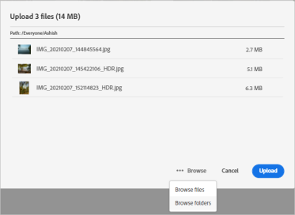

# 에셋 업로드 {#add-assets}

작업할 새 에셋을 추가하려면 로컬 파일 시스템에서 몇 가지 에셋을 업로드하십시오. <!-- TBD: Many of the [common file formats are supported](/help/assets/supported-file-formats-assets-view.md). -->

다음 방법을 사용하여 하나 이상의 에셋 또는 에셋이 포함된 폴더를 업로드할 수 있습니다.

* 사용자 인터페이스에서 에셋 또는 폴더를 드래그하고 화면에 표시되는 안내를 따릅니다.
* 도구 모음에서 **[!UICONTROL 에셋 추가]** 옵션을 클릭하고 업로드 대화 상자에 일부 파일을 추가하십시오.

<!-- TBD: Update this GIF
 -->

폴더를 만든 후 이러한 방법을 사용하여 에셋을 업로드할 수 있습니다. 빈 폴더를 만들려면 도구 모음에서 **[!UICONTROL 폴더 만들기]**&#x200B;를 클릭합니다. [!DNL Assets view]는 강력한 전체 텍스트 검색 기능을 제공하며 폴더를 사용하여 에셋을 보다 효율적으로 구성할 수도 있습니다.

파일을 선택하면 파일을 더 추가하거나 이미 선택한 파일을 제거하라는 확인 대화 상자가 표시됩니다. 선택 항목에 더 많은 파일을 추가하려면 **[!UICONTROL 검색]**&#x200B;을 클릭하고 **[!UICONTROL 파일 검색]** 또는 **[!UICONTROL 폴더 검색]**&#x200B;을 선택합니다. 동일한 폴더 또는 다른 폴더에서 파일이나 폴더를 더 추가합니다.

모든 파일이 대기열에 추가되면 **[!UICONTROL 업로드]**&#x200B;를 클릭합니다.

*그림: 선택한 에셋을 업로드하기 전에 대기열에서 에셋을 추가하거나 제거할 수 있습니다.*

>[!TIP]
>
>폴더 구조를 자산 보기에 업로드하는 경우 폴더 구조로 .ZIP 파일을 만들 필요가 없으므로 폴더 구조를 직접 업로드할 수 있습니다. 에셋 보기에 업로드된 .ZIP 파일은 하나의 ZIP 에셋으로 저장되며 업로드 후 자동으로 추출되지 않습니다.

## 업로드 진행 상황 및 상태 보기 {#upload-progress}

[!DNL Assets view]에 대량의 에셋 또는 중첩된 폴더를 업로드할 때 일부 에셋은 중복 에셋 및 네트워크 문제와 같은 다양한 이유로 업로드에 실패할 수 있습니다.

업로드 진행 상황을 추적하려면 도구 모음에서 **[!UICONTROL 업로드 진행 상황]** 옵션을 클릭합니다. 패널에 모든 에셋의 업로드 진행 상황이 표시됩니다.

업로드 진행 상황 또는 상태에 따라 에셋의 하위 집합을 보려면 **[!UICONTROL 업로드 진행 상황]** 사이드바에서 필터를 사용하십시오. 다양한 필터에는 모든 에셋, 완료된 업로드, 진행 중인 업로드, 업로드 대기 중인 에셋, 일시 중지된 업로드, 중복 에셋 및 업로드에 실패한 에셋이 표시됩니다.

*그림: 업로드 상태 또는 업로드 진행 상황에 따라 업로드를 시도한 에셋을 필터링합니다.*

에셋이 업로드된 직후 [!DNL Assets view]는 에셋을 처리하여 썸네일을 생성하고 메타데이터를 처리합니다. 대부분의 에셋은 처리에 시간이 소요됩니다. 썸네일이 보이지 않고 플레이스홀더 썸네일에 처리 중 메시지가 표시되는 경우 몇 분 후에 폴더를 다시 확인하십시오. 처리 중에 [!DNL Assets view]는 렌디션을 생성하고 스마트 태그를 추가하며 검색을 위해 에셋 세부 정보를 조정합니다.

*그림: 업로드된 에셋은 타일에 표시 처리됩니다.*

## 에셋 렌디션 {#renditions}

[!DNL Assets view]는 업로드된 에셋을 실시간에 가깝게 처리하며 지원되는 다양한 파일 유형에 대해 렌디션을 생성합니다. 이미지용으로 생성된 렌디션은 업로드된 이미지의 크기가 조정된 버전입니다. 에셋뿐만 아니라 렌디션도 다운로드하여 적절한 버전을 사용할 수 있습니다. [에셋을 미리 볼 때](/help/assets/navigate-assets-view.md#preview-assets) 에셋의 모든 렌디션을 볼 수 있습니다.

*그림: 렌디션 보기 및 다운로드*

## 실패한 업로드 관리 {#resolve-upload-fails}

지원되는 에셋의 업로드가 어떤 이유로 실패한 경우 [!UICONTROL 업로드 진행률] 창에서 **[!UICONTROL 다시 시도]**&#x200B;를 클릭하십시오.

*그림: 지원되는 파일이 어떤 이유로 업로드되지 않으면 다시 시도하십시오.*

중복 에셋을 업로드하려고 하면 업로드를 명시적으로 확인할 때까지 에셋이 업로드되지 않습니다. 처음에는 중복 에셋이 업로드 실패로 표시됩니다. 이 문제를 해결하려면 버전을 생성하거나, 기존 에셋을 삭제 및 교체하거나, 에셋 이름을 변경하여 복제본을 생성하면 됩니다. 이러한 실패는 한 번에 에셋 하나씩 해결하거나 실패한 모든 중복 에셋에 대해 일괄적으로 해결할 수 있습니다.

*그림: 기본 업로드에 실패한 중복 에셋의 경우 한 번에 하나씩 문제를 해결합니다.*

*그림: 기본 업로드에 실패한 중복 에셋의 경우 모든 에셋에 대한 문제를 한 번에 해결합니다.*

>[!TIP]
>
>내에서 직접 DAM 저장소로 에셋을 업로드할 수 있습니다. [!DNL Creative Cloud] 데스크탑 애플리케이션.
<!--TBD
See how [[!DNL Assets view] integrates with [!DNL Adobe Asset Link]](/help/assets/integration-assets-view.md).
-->

## 에셋 또는 폴더 삭제 {#delete-assets}

사용자는 더 이상 필요하지 않은 개별 에셋 또는 폴더를 삭제할 수 있습니다. 에셋 또는 폴더를 삭제하려면 다음 중 하나를 수행하십시오.

* 에셋 또는 폴더의 썸네일에서 사용할 수 있는 옵션을 사용합니다.

  

  *그림: 파일 및 폴더에 대한 작업은 에셋 또는 폴더 타일에서 사용할 수 있습니다.*

* 에셋 또는 폴더를 선택하고 도구 모음에서 **[!UICONTROL 삭제]**()를 클릭합니다.

## 다음 단계 {#next-steps}

* [에셋 보기의 에셋 업로드에 대한 비디오 보기](https://experienceleague.adobe.com/docs/experience-manager-learn/assets-essentials/basics/creating.html)

* Assets 보기 사용자 인터페이스에서 사용 가능한 [!UICONTROL 피드백] 옵션을 사용하여 제품 피드백 제공

* 오른쪽 사이드바에서 사용 가능한 [!UICONTROL 이 페이지 편집], , [!UICONTROL 문제 기록] 또는 을 사용하여 설명서 피드백 제공

* [고객 지원 센터](https://experienceleague.adobe.com/?support-solution=General#support) 문의
