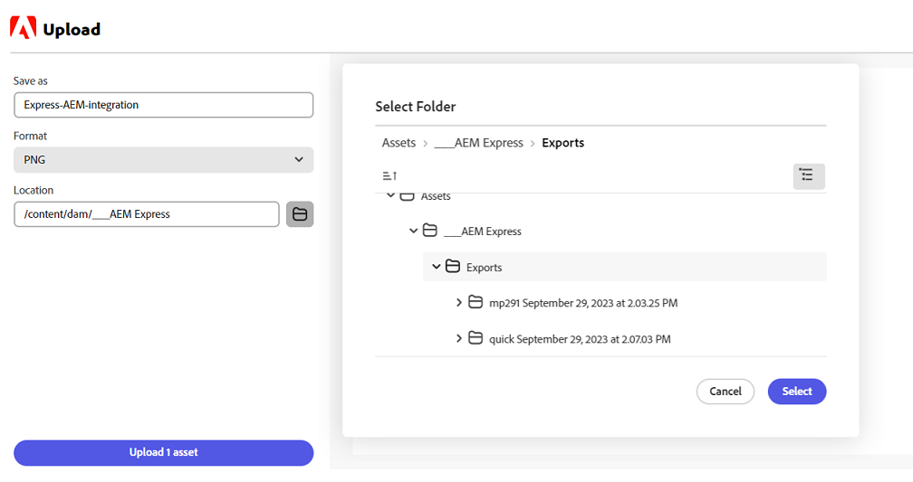

# Adobe Express의 AEM Assets 추가 기능 {#assets-addon-adobe-express}

Adobe Express의 AEM Assets 추가 기능을 사용하여 Adobe Express 사용자 인터페이스 내에서 AEM Assets에 저장된 자산에 직접 액세스할 수 있습니다. AEM Assets에서 관리되는 콘텐츠를 Express 캔버스에 배치한 다음 AEM Assets 저장소에 새 콘텐츠 또는 편집된 콘텐츠를 저장할 수 있습니다. 추가 기능은 다음과 같은 주요 이점을 제공합니다.

* AEM의 새 자산을 편집 및 저장하여 콘텐츠 재사용이 늘어남

* 새로운 자산 또는 새로운 버전의 기존 자산을 만드는 데 소요되는 전반적인 시간과 노력이 단축됨

## 사전 요구 사항 {#prerequisites}

AEM Assets 내 Adobe Express와 하나 이상의 환경에 액세스하기 위한 권한입니다. 환경은 Assets as a Cloud Service 또는 Assets Essentials 내에 있는 저장소 중 하나일 수 있습니다.

## AEM Assets 추가 기능을 Adobe Express에 추가 {#access-assets-addon}

AEM Assets 추가 기능을 Adobe Express에 추가하려면 다음 단계를 수행하십시오.

1. Adobe Express 웹 애플리케이션을 엽니다.

1. 새 템플릿 또는 프로젝트를 로드하거나 에셋을 만들어 새 빈 캔버스를 엽니다.

1. 왼쪽 탐색 창에서 사용할 수 있는 **[!UICONTROL 추가 기능]**&#x200B;을 클릭합니다.

1. [!UICONTROL 추가 기능] 섹션 상단에서 사용 가능한 검색 창에서 **[!UICONTROL AEM Assets]**&#x200B;을 지정하고 AEM Assets 추가 가능을 클릭합니다.

   

1. **[!UICONTROL 추가]**&#x200B;를 클릭합니다. 추가 기능이 **[!UICONTROL 내 추가 기능]** 섹션 목록에 표시됩니다. 추가 기능을 다시 클릭하여 오른쪽 탐색 창에 콘텐츠를 표시합니다. 추가 기능은 루트 수준에서 사용할 수 있는 자산 및 폴더 목록과 함께 액세스 권한이 있는 저장소 목록을 표시합니다.

   검색 창을 사용하여 캔버스에서 사용해야 하는 자산을 검색합니다.

   

   A. AEM Assets 저장소 선택 B. 검색 창을 사용하여 자산 검색 C. 자산을 오름차순 또는 내림차순으로 정렬 D. 선택한 위치에서 사용 가능한 자산 및 폴더. E. AEM Assets의 변경 내용 저장

## Adobe Express 편집기 내 AEM Assets 사용 {#use-aem-assets-in-express}

AEM Assets 추가 기능을 Adobe Express에 추가한 후에 Express 캔버스 내에서 AEM Assets 저장소에 저장된 PNG 이미지와 JPEG 이미지 사용을 시작할 수 있습니다. 적절한 폴더로 이동한 다음 자산을 클릭하여 캔버스에 포함합니다.

## AEM Assets에 Adobe Express 프로젝트 저장 {#save-express-projects-in-assets}

Express 캔버스에 해당 수정 사항을 통합한 후에 AEM Assets 저장소에 저장할 수 있습니다.

1. **[!UICONTROL 저장]**&#x200B;을 클릭하여 **[!UICONTROL 업로드]** 대화 상자를 엽니다.
1. 자산의 이름 및 형식을 지정합니다. 캔버스의 콘텐츠를 PNG 또는 JPEG 포맷 유형으로 저장할 수 있습니다.

1. **[!UICONTROL 위치]** 필드에 인접한 폴더 아이콘을 클릭하고 자산을 저장해야 하는 위치로 이동한 다음 **[!UICONTROL 선택]**&#x200B;을 클릭합니다. 폴더 이름이 **[!UICONTROL 위치]** 필드에 표시됩니다.

1. **[!UICONTROL 업로드]**&#x200B;를 클릭하여 자산을 AEM Assets에 업로드합니다.

   
