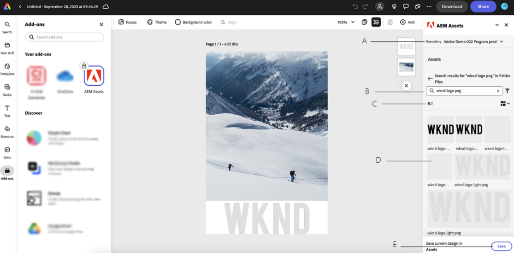

# Adobe Express을 위한 AEM Assets 추가 기능 {#assets-addon-adobe-express}

Adobe Express용 AEM Assets 추가 기능을 사용하면 Adobe Express 사용자 인터페이스 내에서 AEM Assets에 저장된 자산에 직접 액세스할 수 있습니다. AEM Assets에서 관리하는 콘텐츠를 빠른 캔버스에 넣은 다음 AEM Assets 저장소에 새 콘텐츠 또는 편집된 콘텐츠를 저장할 수 있습니다. 추가 기능은 다음과 같은 주요 이점을 제공합니다.

* AEM에서 새 자산을 편집하고 저장하여 콘텐츠 재사용 증가

* 새 에셋을 만들거나 기존 에셋의 새 버전을 만드는 데 드는 전반적인 시간과 노력이 감소했습니다.

## 사전 요구 사항 {#prerequisites}

AEM Assets 내에서 Adobe Express 및 하나 이상의 환경에 액세스할 수 있는 권한. 환경은 Assets as a Cloud Service 또는 Assets Essentials 내의 모든 저장소일 수 있습니다.

## Adobe Express에 AEM Assets 추가 기능 추가 {#access-assets-addon}

AEM Assets 추가 기능을 Adobe Express에 추가하려면 다음 단계를 수행하십시오.

1. Adobe Express 웹 응용 프로그램을 엽니다.

1. 새 템플릿 또는 프로젝트를 로드하거나 새 에셋을 만들어 새 빈 캔버스를 엽니다.

1. 클릭 **[!UICONTROL 추가 기능]** 왼쪽 탐색 창에서 사용할 수 있습니다.

1. 지정 **[!UICONTROL AEM Assets]** 을 클릭합니다. [!UICONTROL 추가 기능] 섹션을 참조하고 AEM Assets 추가 기능을 클릭합니다.

   

1. 클릭 **[!UICONTROL 추가]**. 추가 기능은 다음 목록에 표시됩니다. **[!UICONTROL 내 추가 기능]** 섹션. 추가 기능을 다시 클릭하여 오른쪽 탐색 창에 내용을 표시합니다. 추가 기능은 루트 수준에서 사용할 수 있는 에셋 및 폴더 목록과 함께 액세스할 수 있는 저장소 목록을 표시합니다.

   검색 창을 사용하여 캔버스에서 사용해야 하는 에셋을 검색합니다.

   

   A. AEM Assets 저장소를 선택합니다. B. 검색 막대를 사용하여 에셋을 검색합니다. C. 에셋을 오름차순 또는 내림차순 D로 정렬합니다. 선택한 위치에서 사용할 수 있는 에셋 및 폴더입니다. E. AEM Assets에서 변경 사항 저장

## Adobe Express 편집기에서 AEM Assets 사용 {#use-aem-assets-in-express}

AEM Assets 추가 기능을 Adobe Express에 추가한 후 Express 캔버스 내에서 AEM Assets 저장소에 저장된 PNG 및 JPEG 이미지를 사용할 수 있습니다. 해당 폴더로 이동하고 에셋을 클릭하여 캔버스에 포함합니다.

## AEM Assets에서 Adobe Express 프로젝트 저장 {#save-express-projects-in-assets}

빠른 캔버스에서 적절한 수정 사항을 통합한 후 AEM Assets 저장소에 저장할 수 있습니다.

1. 클릭 **[!UICONTROL 저장]** 을(를) 열려면 **[!UICONTROL 업로드]** 대화 상자.
1. 에셋의 이름과 형식을 지정합니다. 캔버스의 내용을 PNG 또는 JPEG 형식 유형으로 저장할 수 있습니다.

1. 옆에 있는 폴더 아이콘을 클릭합니다. **[!UICONTROL 위치]** 필드에서 에셋을 저장해야 하는 위치로 이동한 다음 를 클릭합니다 **[!UICONTROL 선택]**. 폴더의 이름이에 표시됩니다. **[!UICONTROL 위치]** 필드.

1. 클릭 **[!UICONTROL 업로드]** AEM Assets에 에셋을 업로드합니다.

   

