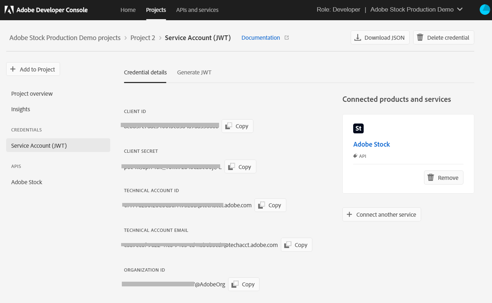

# 사용 [!DNL Adobe Stock] 의 에셋 [!DNL Adobe Experience Manager Assets] {#use-adobe-stock-assets-in-aem-assets}

| 버전 | 문서 링크 |
| -------- | ---------------------------- |
| AEM 6.5 | [여기 클릭](https://experienceleague.adobe.com/docs/experience-manager-65/assets/using/aem-assets-adobe-stock.html?lang=en) |
| AEM as a Cloud Service | 이 문서 |

[!DNL Adobe Stock] 서비스는 디자이너와 기업의 모든 광고 프로젝트를 위해 고품질로 큐레이팅된 로열티가 없는 수백만 장의 사진, 벡터, 일러스트레이션, 비디오, 템플릿 및 3D 자산에 대한 액세스를 제공합니다.

[!DNL Adobe Stock] 엔터프라이즈 오퍼링의 경우 기본적으로 조직 간 공유 권한이 포함됩니다. 조직의 사용자가 에셋에 라이선스를 부여한 후에는 다시 라이선스를 부여하지 않고도 조직의 다른 사용자가 이 에셋을 식별하고, 다운로드하고, 사용할 수 있습니다. 조직에서 에셋에 라이선스를 부여한 후에는 에셋을 사용할 수 있는 권한이 영구적으로 유지됩니다.

조직은 기업 통합 가능 [!DNL Adobe Stock] 다음으로 플랜 [!DNL Experience Manager Assets] 의 강력한 에셋 관리 기능을 사용하여 라이선스가 있는 에셋을 광고 및 마케팅 프로젝트에 폭넓게 사용할 수 있도록 합니다. [!DNL Experience Manager]. [!DNL Experience Manager] 사용자는에 저장된 Adobe Stock 에셋을 빠르게 찾고, 미리 보고, 라이선스를 제공할 수 있습니다. [!DNL Experience Manager], 을(를) 떠나지 않고 [!DNL Experience Manager] 인터페이스.

## 통합 [!DNL Experience Manager] 및 [!DNL Adobe Stock] {#integrate-aem-and-adobe-stock}

[!DNL Experience Manager Assets] 는 사용자에게 검색, 미리보기, 저장 및 라이센스 제공 [!DNL Adobe Stock] 에서 직접 에셋 [!DNL Experience Manager].

**전제 조건**

통합하려면 다음 작업을 수행해야 합니다.

* 실행 중 [!DNL Experience Manager Assets] as a [!DNL Cloud Service] 인스턴스
* An [enterprise [!DNL Adobe Stock] 플랜](https://stockenterprise.adobe.com/)
* 기본 Stock 제품 프로필 Admin Console 권한이 있는 사용자
* Adobe Developer Console에서 통합을 만들기 위한 개발자 액세스 프로필에 대한 권한이 있는 사용자

기업 [!DNL Adobe Stock] 플랜,

* 에 대한 제품 권한 제공 [!DNL Adobe Stock] (Experience Manager에 연결된 재고)
* 에 구입한 크레딧 [!DNL Adobe Admin Console] 주식 발행 권한
* 내에서 서비스 계정(JWT) 인증 활성화 [!DNL Adobe Developer Console] 주식 발행 권한
* 내에서 크레딧 및 라이센스를 전체적으로 관리 가능 [!DNL Adobe Admin Console]

권한 내에서 다음에 대한 기본 제품 프로필 [!DNL Adobe Stock] 존재함 [!DNL Admin Console]. 여러 프로필을 만들 수 있으며 이러한 프로필에 따라 Stock 자산에 라이센스를 부여할 수 있는 사람이 결정됩니다. 제품 프로필에 직접 액세스하는 사용자는 [https://stock.adobe.com/](https://stock.adobe.com/) Stock 자산에 라이센스를 부여합니다. 반면 개발자 액세스를 사용하여 통합(API)을 만드는 다른 방법이 있습니다. 이 통합은 간의 통신을 인증합니다. [!DNL Experience Manager Assets] 및 [!DNL Adobe Stock].

>[!NOTE]
>
>JWT(Stock 서비스 계정) 인증은 Enterprise Stock 권한 부여와 함께 제공됩니다.
>
>통합은 엔터프라이즈 스톡 권한에 대한 Oauth 인증을 지원하지 않습니다.

<!--
### Create an IMS configuration {#create-an-ims-configuration}

1. In the [!DNL Experience Manager] user interface, navigate to **[!UICONTROL Tools]** > **[!UICONTROL Security]** > **[!UICONTROL Adobe IMS Configurations]**. Click **[!UICONTROL Create]** and select **[!UICONTROL Cloud Solution]** > **[!UICONTROL Adobe Stock]**.
1. Either reuse an existing certificate or select **[!UICONTROL Create new certificate]**.
1. Click **[!UICONTROL Create certificate]**. Once created, download the public key. Click **[!UICONTROL Next]**. Leave the [!UICONTROL Adobe IMS Technical Account Configuration] screen open to provide the required values shortly.
1. Access [Adobe Developer Console](https://console.adobe.io). Ensure that your account has administrator permissions for the organization for which the integration is required.
1. Click **[!UICONTROL Create new project]** and click **[!UICONTROL Add API]**. Select **[!UICONTROL Adobe Stock]** from the list of APIs that are available to you. Select [!UICONTROL OAUTH 2.0 Web].
1. Provide **[!UICONTROL Default redirect URI]** and **[!UICONTROL Redirect URI pattern]** values. Click **[!UICONTROL Save configured API]**. Copy the generated ID and secret.
1. In [!UICONTROL Adobe IMS Technical Account Configuration] screen, provide the values in the boxes titled **[!UICONTROL Title]**, **[!UICONTROL Authorization Server]**, **[!UICONTROL API Key]**, **[!UICONTROL Client Secret]**, and **[!UICONTROL Payload]**. For detailed information about these values, see [JWT authentication quick start](https://www.adobe.io/authentication/auth-methods.html#!AdobeDocs/adobeio-auth/master/JWT/JWT.md).

-->
<!-- TBD: Update the URL to update the terminology when AIO team updates their documentation URL. Logged issue github.com/AdobeDocs/adobeio-auth/issues/63.
-->

<!--
### Create [!DNL Adobe Stock] configuration in [!DNL Experience Manager] {#create-adobe-stock-configuration-in-aem}

1. In the [!DNL Experience Manager], navigate to **[!UICONTROL Tools]** > **[!UICONTROL Cloud Services]** > **[!UICONTROL Adobe Stock]**.
1. Click **[!UICONTROL Create]** to create a configuration and associate it with your existing IMS Configuration. Select `PROD` as the environment parameter.
1. In **[!UICONTROL Licensed Assets Path]** field, leave a location as is. Do not change the location where you want to store the [!DNL Adobe Stock] assets.
1. Complete creation by adding all the required properties. Click **[!UICONTROL Save & Close]**.
1. Add [!DNL Experience Manager] users or groups, who can license the assets.

>[!NOTE]
>
>If there are multiple [!DNL Adobe Stock] configurations, select the desired configuration in User Preferences panel. To access the panel from Experience Manager home page, click the user icon and then click **[!UICONTROL User Preferences]** > **[!UICONTROL Stock Configuration]**.

-->

## 통합하는 단계 [!DNL Experience Manager] 및 [!DNL Adobe Stock] {#integration-steps}

통합하려면 [!DNL Experience Manager] 및 [!DNL Adobe Stock]를 클릭하고 나열된 순서로 다음 단계를 수행하십시오.

1. [공개 인증서 받기](#public-certificate)

   위치 [!DNL Experience Manager]IMS 계정을 만들고 공개 인증서(공개 키)를 생성합니다.

1. [서비스 계정(JWT) 연결 만들기](#createnewintegration)

   위치 [!DNL Adobe Developer Console], 다음에 대한 프로젝트 만들기 [!DNL Adobe Stock] 조직. 프로젝트에서 공개 키로 API를 구성하여 서비스 계정(JWT) 연결을 만듭니다. 서비스 계정 자격 증명과 JWT 페이로드 정보를 가져옵니다.

1. [IMS 계정 구성](#create-ims-account-configuration)

   위치 [!DNL Experience Manager]서비스 계정 자격 증명과 JWT 페이로드를 사용하여 IMS 계정을 구성합니다.

1. [클라우드 서비스 구성](#configure-the-cloud-service)

   위치 [!DNL Experience Manager], 구성 [!DNL Adobe Stock] ims 계정을 사용하는 클라우드 서비스.

### IMS 구성 만들기 {#create-an-ims-configuration}

IMS 구성은 다음을 인증합니다 [!DNL Experience Manager Assets] 이 있는 작성자 인스턴스 [!DNL Adobe Stock] 권한 부여.

IMS 구성에는 두 단계가 포함됩니다.

* [공개 인증서 받기](#public-certificate)
* [IMS 계정 구성](#create-ims-account-configuration)

### 공개 인증서 받기 {#public-certificate}

공개 키(인증서)는 Adobe Developer 콘솔에서 제품 프로필을 인증합니다.

1. 에 로그인 [!DNL Experience Manager Assets] 클라우드 인스턴스.

1. 다음에서 **[!UICONTROL 도구]** 패널, 다음으로 이동 **[!UICONTROL 보안]** > **[!UICONTROL Adobe IMS 구성]**.

1. Adobe IMS 구성 페이지에서 **[!UICONTROL 만들기]**&#x200B;를 클릭합니다. 다음 **[!UICONTROL Adobe IMS 기술 계정 구성]** 페이지가 열립니다.

1. 다음에서 **[!UICONTROL 인증서]** 탭, 선택 **[!UICONTROL Adobe Stock]** 다음에서 **[!UICONTROL 클라우드 솔루션]** 드롭다운 목록입니다.

1. 인증서를 생성하거나 구성에 대한 기존 인증서를 재사용할 수 있습니다.

   인증서를 만들려면 **[!UICONTROL 새 인증서 만들기]** 확인란을 선택하고 **별칭** 공개 키. 별칭은 공개 키의 이름 역할을 합니다.

1. **[!UICONTROL 인증서 만들기]**&#x200B;를 클릭합니다. 그런 다음 을 클릭합니다. **[!UICONTROL 확인]** 을 클릭하여 공개 키를 생성합니다.

1. 다음을 클릭합니다. **[!UICONTROL 공개 키 다운로드]** 을 클릭하고 공개 키(.crt) 파일을 컴퓨터에 저장합니다. 공개 키는 나중에 Brand Portal 테넌트에 대한 API를 구성하고 Adobe Developer 콘솔에서 서비스 계정 자격 증명을 생성하는 데 사용됩니다.

   **[!UICONTROL 다음]**&#x200B;을 클릭합니다.

   

1. 다음에서 **계정** 탭, 서비스 계정 자격 증명이 필요한 Adobe IMS 계정이 생성됩니다.

   새 탭을 열고 [Adobe Developer 콘솔에서 서비스 계정(JWT) 연결 만들기](#createnewintegration).

### 서비스 계정(JWT) 연결 만들기 {#createnewintegration}

Adobe Developer 콘솔에서 프로젝트 및 API는 조직 수준에서 구성됩니다. API를 구성하면 서비스 계정(JWT) 연결이 만들어집니다. 키 쌍(개인 및 공개 키)을 생성하거나 공개 키를 업로드하여 API를 구성하는 두 가지 방법이 있습니다. 이 예에서는 공개 키를 업로드하여 서비스 계정 자격 증명이 생성됩니다.

서비스 계정 자격 증명 및 JWT 페이로드를 생성하려면 다음을 수행합니다.

1. 시스템 관리자 권한으로 Adobe Developer 콘솔에 로그인합니다. 기본 URL은 [https://www.adobe.com/go/devs_console_ui](https://www.adobe.com/go/devs_console_ui).

   드롭다운(조직) 목록에서 올바른 IMS 조직(주식 자격)을 선택했는지 확인합니다.

1. **[!UICONTROL 새 프로젝트 만들기]**&#x200B;를 클릭합니다. 조직에 대해 시스템 생성 이름을 사용하는 빈 프로젝트가 만들어집니다.

   클릭 **[!UICONTROL 프로젝트 편집]**. 업데이트 **[!UICONTROL 프로젝트 제목]** 및 **[!UICONTROL 설명]**&#x200B;을 클릭한 다음 을 클릭합니다 **[!UICONTROL 저장]**.

1. 다음에서 **[!UICONTROL 프로젝트 개요]** 탭을 클릭하고 **[!UICONTROL API 추가]**.

1. 다음에서 **[!UICONTROL API 창 추가]**, 선택 **[!UICONTROL Adobe Stock]**. **[!UICONTROL 다음]**&#x200B;을 클릭합니다.

1. 다음에서 **[!UICONTROL API 구성]** 창, 선택 **[!UICONTROL 서비스 계정(JWT)]** 인증. **[!UICONTROL 다음]**&#x200B;을 클릭합니다.

   

1. 클릭 **[!UICONTROL 공개 키 업로드]**. 클릭 **[!UICONTROL 파일 선택]** 및에서 다운로드한 공개 키(.crt 파일)를 업로드합니다 [공개 인증서 받기](#public-certificate) 섹션. **[!UICONTROL 다음]**&#x200B;을 클릭합니다.

1. 공개 키를 확인하고 **[!UICONTROL 다음]**.

1. 기본값 선택 **[!UICONTROL Adobe Stock]** 제품 프로필 및 클릭 **[!UICONTROL 구성된 API 저장]**.

1. API가 구성되면 API 개요 페이지로 리디렉션됩니다. 아래의 왼쪽 탐색에서 **[!UICONTROL 자격 증명]**&#x200B;를 클릭하고 **[!UICONTROL 서비스 계정(JWT)]** 옵션을 선택합니다. 여기에서 자격 증명을 보고 JWT 토큰 생성, 자격 증명 세부 정보 복사 및 클라이언트 암호 검색과 같은 작업을 수행할 수 있습니다.

1. **[!UICONTROL 클라이언트 자격 증명]** 탭에서 **[!UICONTROL 클라이언트 ID]**&#x200B;를 복사합니다.

   **[!UICONTROL 클라이언트 암호 검색]**&#x200B;을 클릭하고 **[!UICONTROL 클라이언트 암호 키]**&#x200B;를 복사합니다.

   

1. 다음 위치로 이동 **[!UICONTROL JWT 생성]** 탭 및 복사 **[!UICONTROL JWT 페이로드]** 정보.

이제 클라이언트 ID(API 키), 클라이언트 암호 및 JWT 페이로드를 사용하여 다음을 수행할 수 있습니다 [ims 계정 구성](#create-ims-account-configuration) 위치: [!DNL Experience Manager Assets].

### IMS 계정 구성 {#create-ims-account-configuration}

다음을 보유해야 합니다. [인증서](#public-certificate) 및 [서비스 계정(JWT) 자격 증명](#createnewintegration) ims 계정을 구성합니다.

IMS 계정을 구성하려면:

1. IMS 구성을 열고 로 이동합니다. **[!UICONTROL 계정]** 탭. 그동안 페이지를 열어 두었습니다. [공개 인증서 받기](#public-certificate).

1. IMS 계정에 대한 **[!UICONTROL 제목]**&#x200B;을 지정합니다.

   다음에서 **[!UICONTROL 인증 서버]** 필드에 URL을 입력합니다. [https://ims-na1.adobelogin.com/](https://ims-na1.adobelogin.com/).

   클라이언트 ID를 **[!UICONTROL API 키]** 필드, **[!UICONTROL 클라이언트 암호]**, 및 **[!UICONTROL 페이로드]** (JWT 페이로드) [서비스 계정(JWT) 연결 생성](#createnewintegration).

1. **[!UICONTROL 만들기]**&#x200B;를 클릭합니다. IMS 계정 구성이 만들어집니다.

   

1. IMS 계정 구성을 선택하고 **[!UICONTROL 상태 확인]**.

   대화 상자에서 **[!UICONTROL 확인]**&#x200B;을 클릭합니다. 구성이 성공하면 *토큰이 성공적으로 검색되었습니다.*&#x200B;라는 메시지가 나타납니다.

   

### 클라우드 서비스 구성 {#configure-the-cloud-service}

을(를) 구성하려면 다음을 수행하십시오. [!DNL Adobe Stock] 클라우드 서비스:

1. 다음에서 [!DNL Experience Manager] 사용자 인터페이스, 다음으로 이동 **[!UICONTROL 도구]** > **[!UICONTROL Cloud Service]** > **[!UICONTROL Adobe Stock]**.

1. 다음에서 [!DNL Adobe Stock Configurations] 페이지, 클릭 **[!UICONTROL 만들기]**.

1. 지정 **[!UICONTROL 제목]** 클라우드 구성용

   [IMS 계정을 구성](#create-ims-account-configuration)하는 동안 만든 IMS 구성을 선택합니다.

   드롭다운 목록에서 로케일을 선택합니다.

   

1. **[!UICONTROL 저장 및 닫기]**&#x200B;를 클릭합니다.

   사용자 [!DNL Experience Manager Assets] 작성자 인스턴스가 이제 와 통합됨 [!DNL Adobe Stock]. 여러 개를 만들 수 있습니다. [!DNL Adobe Stock] 구성(예: 로케일 기반 구성) 이제 액세스, 검색 및 라이선스를 수행할 수 있습니다. [!DNL Adobe Stock] 내 에셋 [!DNL Experience Manager] 사용자 인터페이스.

   

   >[!NOTE]
   >
   >이 통합 단계에서는 관리자만 [!DNL Adobe Stock] assets, Stock 자산 검색(omnisearch 사용) 및 라이센스 [!DNL Adobe Stock] 에셋.
   >
   >관리자는 에 사용자 또는 그룹을 추가할 수 있습니다 [!DNL Adobe Stock] cloud service를에서 이러한 비관리 사용자에게 권한 부여 [!DNL Experience Manager] 재고 구성에 액세스합니다.

1. 사용자 또는 그룹을 추가하려면 [!DNL Adobe Stock] 클라우드 구성 및 클릭 **[!UICONTROL 속성]**.

1. 검색하여 Adobe Stock 구성에 액세스할 수 있는 권한을 할당한 사용자 또는 그룹을 추가합니다. 다음을 참조하십시오 [사용자 그룹에 권한 할당](#assign-permissions-to-group).

## 사용자 그룹에 권한 할당 {#assign-permissions-to-group}

관리자는 사용자 그룹을 만들고 특정 사용자 또는 그룹에 액세스 권한을 부여할 수 있습니다. [!DNL Adobe Stock] 클라우드 서비스.

사용자가 Adobe Stock 에셋을 검색하고 라이선스하는 데 필요한 권한은 다음과 같습니다.

* 경로 구성: `/conf/global/settings/stock`
* 권한: `jcr:read`
* 권한 유형: `Allow`

사용자 그룹을 만들거나 기존 사용자 그룹에 권한을 할당할 수 있습니다. 권한은에서 할당할 수 있습니다. [!DNL Experience Manager Assets] 인터페이스 또는 [!DNL User Admin] 콘솔.

**에서 사용자 그룹에 대한 액세스 권한을 제공하려면 [!DNL Experience Manager]:**

1. 다음에서 [!DNL Experience Manager] 사용자 인터페이스, 다음으로 이동 **[!UICONTROL 도구]** > **[!UICONTROL 보안]** > **[!UICONTROL 그룹]**. 다음에 대한 사용자 그룹 만들기 [!DNL Adobe Stock].

1. 다음으로 이동 **[!UICONTROL 도구]** > **[!UICONTROL 보안]** > **[!UICONTROL 권한]**.

1. 왼쪽 패널에서 사용자 그룹을 검색하고 새로 추가 **[!UICONTROL 액세스 제어 항목(ACE)]** Adobe Stock용

   * 경로 구성: `/conf/global/settings/stock`
   * 권한: `jcr:read`
   * 권한 유형: `Allow`

   **[!UICONTROL 추가]**&#x200B;를 클릭합니다.

   

1. 다음으로 이동 **[!UICONTROL 도구]** > **[!UICONTROL Cloud Service]** > **[!UICONTROL Adobe Stock]**. 다음 항목 선택 [!DNL Adobe Stock] 클라우드 구성 및 클릭 **[!UICONTROL 속성]**.

1. 새로 생성된 사용자 그룹을 [!DNL Adobe Stock] 구성. **[!UICONTROL 저장 및 닫기]**&#x200B;를 클릭합니다.

   

**에서 사용자에게 액세스 권한을 제공하려면 [!DNL User Admin Console]:**

1. 를 엽니다. [!DNL Experience Manager] 사용 Admin Console. 기본 URL은 `http://localhost:4502/userdamin`.

1. 왼쪽 패널에서 를 입력하여 사용자를 검색합니다. `user_id` 또는 `name`. 두 번 클릭하여 사용자 속성을 엽니다.

1. 다음 위치로 이동 **[!UICONTROL 권한]** tab 및 allow `read` 다음에 대한 권한: [!DNL Adobe Stock] 클라우드 구성: `/conf/global/settings/stock`.

   >[!CAUTION]
   >
   >클라우드 구성이 허용되지 않는 경우 사용자는 에만 액세스할 수 있습니다. **[!UICONTROL 에셋]** 다음에서 [!DNL Experience Manager] 인터페이스.
   >
   >에 대한 액세스 허용 [!UICONTROL 에셋] 및 [!DNL Adobe Stock] assets에서 사용자에게 클라우드 구성이 허용되는지 확인합니다.

1. 클릭 **[!UICONTROL 저장]** 사용 권한을 업데이트합니다.

   

1. 에 사용자 또는 그룹 추가 [!DNL Adobe Stock] 클라우드 구성.

## Adobe Stock 에셋 액세스 {#access-stock-assets}

에 대한 권한이 있는 관리자가 아닌 사용자 [!DNL Adobe Stock] 클라우드 구성은 를 검색하고 라이선스를 제공할 수 있습니다. [!DNL Adobe Stock] 의 에셋 [!DNL Experience Manager] 인터페이스.

사용자는 를 활성화하는 추가 단계를 수행해야 합니다. [!DNL Adobe Stock] 액세스 전 클라우드 구성 [!DNL Adobe Stock] 에셋. 일회성 활동입니다. 사용자에게 여러 사용자에 대한 권한이 할당된 경우 [!DNL Adobe Stock] 클라우드 구성에서 사용자는 다음에서 원하는 구성을 선택할 수 있습니다. **[!UICONTROL 사용자 환경 설정]**.

를 활성화하려면 [!DNL Adobe Stock] 클라우드 구성:

1. 에 로그인 [!DNL Experience Manager].

1. 오른쪽 상단에서 사용자 아이콘을 클릭한 다음 을 클릭합니다 **[!UICONTROL 내 환경 설정]**. 다음 **[!UICONTROL 사용자 환경 설정]** 창이 열립니다.

1. 원하는 을 선택합니다 **[!UICONTROL Stock 구성]** 드롭다운 목록에서 **[!UICONTROL Accept]** 구성을 활성화합니다.

   

1. 다음으로 이동 **[!UICONTROL 에셋]** > **[!UICONTROL Adobe Stock]**. 이제 보기, 검색 및 라이선스를 할 수 있습니다. [!DNL Adobe Stock] 에셋.

다음 표에서는 에 액세스하는 동안 사용자 권한이 작동하는 방식을 설명합니다. [!DNL Adobe Stock] 에셋:

| 사용자 | 그룹 | 권한 | 사용자 환경 설정에서 Stock 구성 수락 | 에셋 액세스 | Adobe Stock 액세스 |
| --- | --- | --- | --- | --- | --- |
| admin | N/A | 모두 | N/A | 예 | 예 |
| test-doc1 | DAM 사용자 | /conf/global/settings/stock/cloud-config | 예 | 예 | 예 |
| test-doc1 | DAM 사용자 | /conf/global/settings/stock/cloud-config | 아니요 | 오류: 데이터를 로드하지 못했습니다. | 아니요 |
| test-doc1 | DAM 사용자 | **허용**: /conf/global/settings/stock **거부**: /cloud-config | Stock 구성이 표시되지 않음 | 예 | 아니요 |

## 사용 및 관리 [!DNL Adobe Stock] 의 에셋 [!DNL Experience Manager] {#usemanage}

이 기능을 사용하면 조직에서 해당 사용자가 을 사용하여 작업할 수 있습니다. [!DNL Adobe Stock] 의 에셋 [!DNL Experience Manager Assets]. 다음 범위 내에서 [!DNL Experience Manager] 사용자 인터페이스, 사용자가 검색 가능 [!DNL Adobe Stock] 에셋 을 선택하고 필요한 에셋에 라이선스를 부여합니다.

한 번 [!DNL Adobe Stock] 자산에 라이센스가 부여됨 [!DNL Experience Manager]를 통해 일반적인 자산처럼 사용 및 관리할 수 있습니다. 위치 [!DNL Experience Manager], 사용자는 에셋을 검색하고 미리 볼 수 있고, 에셋을 복사하여 게시하고, 에셋을 공유할 수 있습니다. [!DNL Brand Portal]; 를 통해 에셋에 액세스하고 사용합니다. [!DNL Experience Manager] 데스크탑 앱 등.

![검색 대상 [!DNL Adobe Stock] 에서 에셋 및 필터 결과 [!DNL Adobe Experience Manager] 작업 영역](assets/adobe-stock-search-results-workspace.png)

**A.**[!DNL Adobe Stock] Search assets similar to the assets whose ID is provided. **B.** Search assets that match your selection of shape or orientation. **C.** Search for one of more supported asset types **D.** Open or collapse the filters pane **E.** License and save the selected asset in [!DNL Experience Manager]**F.**[!DNL Experience Manager] Save the asset in with watermark **G.**[!DNL Adobe Stock] Explore assets on website that are similar to the selected asset **H.**[!DNL Adobe Stock] View the selected assets on website **I.** Number of selected assets from the search results **J.** Switch between Card view and List view

### 에셋 찾기 {#find-assets}

사용자 [!DNL Experience Manager] 사용자, 두 위치에서 에셋을 검색할 수 있음, [!DNL Experience Manager] 및 [!DNL Adobe Stock]. 검색 위치가 다음으로 제한되지 않는 경우 [!DNL Adobe Stock], 검색 결과 위치 [!DNL Experience Manager] 및 [!DNL Adobe Stock] 표시됩니다.

* 을 검색하려면 [!DNL Adobe Stock] 에셋, 클릭 **[!UICONTROL 탐색]** > **[!UICONTROL 에셋]** > **[!UICONTROL Adobe Stock 검색]**.

* 에서 에셋을 검색하려면 [!DNL Adobe Stock] 및 [!DNL Experience Manager Assets], 검색 클릭 .

또는 입력을 시작합니다 `Location: Adobe Stock` 을(를) 검색 창에서 선택 [!DNL Adobe Stock] 에셋. [!DNL Experience Manager] 에서는 검색된 에셋에 대한 고급 필터링 기능을 제공하여 지원되는 에셋 유형, 이미지 방향 및 라이선스 상태 등의 필터를 사용하여 필요한 에셋을 빠르게 제로인할 수 있습니다.

>[!NOTE]
>
>다음에서 검색된 자산 [!DNL Adobe Stock] 다음에표시됨 [!DNL Experience Manager]. [!DNL Adobe Stock] 자산을 가져와서 저장합니다. [!DNL Experience Manager] 다음 중 한 명의 사용자 후에만 리포지토리 [자산을 저장합니다.](/help/assets/aem-assets-adobe-stock.md#saveassets) 또는 [에셋 라이센스 부여 및 저장](/help/assets/aem-assets-adobe-stock.md#licenseassets). 이미 저장된 자산 [!DNL Experience Manager] 쉽게 참조하고 액세스할 수 있도록 표시되고 강조 표시됩니다. 또한 [!DNL Stock] 에셋은 소스를 나타내는 추가 메타데이터와 함께 저장됩니다. [!DNL Stock].

![에서 필터 검색 [!DNL Experience Manager] 강조 표시 [!DNL Adobe Stock] 검색 결과의 자산](assets/aem-search-filters2.jpg)

### 필요한 에셋 저장 및 보기 {#saveassets}

저장할 자산을 선택합니다 [!DNL Experience Manager]. 클릭 [!UICONTROL 저장] 을 클릭하고 에셋의 이름과 위치를 입력합니다. 라이센스가 없는 자산은 워터마크로 로컬에 저장됩니다.

다음에 에셋을 검색할 때 저장된 에셋은에서 사용할 수 있음을 나타내는 배지와 함께 강조 표시됩니다. [!DNL Experience Manager Assets].

>[!NOTE]
>
>최근에 추가된 에셋에는 라이센스가 부여된 배지 대신 새 배지가 표시됩니다.

### 에셋 라이센스 부여 {#licenseassets}

사용자는 라이센스를 부여할 수 있습니다. [!DNL Adobe Stock] 할당량을 사용한 자산 [!DNL Adobe Stock] 엔터프라이즈 플랜입니다. 에셋에 라이선스를 부여하면 워터마크 없이 저장되고 검색 및 사용에 사용할 수 있습니다 [!DNL Experience Manager Assets].

![라이센스 부여 및 저장 대화 상자 [!DNL Adobe Stock] 의 에셋 [!DNL Experience Manager Assets]](assets/aem-stock_licenseandsave.jpg)

### 메타데이터 및 자산 속성 액세스 {#access-metadata-and-asset-properties}

사용자는 다음을 포함한 메타데이터에 액세스하고 미리 볼 수 있습니다. [!DNL Adobe Stock] 에 저장된 자산에 대한 메타데이터 속성 [!DNL Experience Manager], 및 추가 **[!UICONTROL 라이선스 참조]** 에셋의 경우. 그러나 라이센스 참조에 대한 업데이트는 다음 사이에 동기화되지 않습니다 [!DNL Experience Manager] 및 [!DNL Adobe Stock] 웹 사이트입니다.

사용자는 라이선스가 부여된 에셋과 라이선스가 없는 에셋 모두에 대한 속성을 볼 수 있습니다.

## 알려진 제한 사항 {#known-limitations}

* **사용자의 라이선스 제한을 위한 기능이 제대로 작동하지 않음**: 다음을 보유한 모든 사용자 `read` stock 구성에 대한 권한을 사용하여 [!DNL Adobe Stock] 에셋.

* **관리자가 아닌 사용자는 다음을 수동으로 활성화해야 합니다. [!DNL Adobe Stock] 클라우드 구성**: 의 **[!UICONTROL 사용자 환경 설정]** 창, **[!UICONTROL Stock 구성]** 다음을 표시합니다. [!DNL Adobe Stock] 클라우드 구성이 활성화되었지만 관리자가 아닌 사용자에게는 작동하지 않습니다. 사용자가 다음을 클릭해야 함 **[!UICONTROL Accept]** 버튼을 눌러 Stock 구성을 활성화합니다. 이 단계가 없을 경우 시스템에 액세스 시 오류 메시지가 반영됩니다 **[!UICONTROL 에셋]**.

* **편집 이미지 경고가 표시되지 않음**: 이미지에 라이센스를 부여할 때 이미지가 에디토리얼 전용 이미지인지 확인할 수 없습니다. 오용을 방지하기 위해 관리자는 Admin Console에서 편집 에셋에 대한 액세스를 중단할 수 있습니다.

* **잘못된 라이선스 유형이 표시됨**: 잘못된 라이선스 유형이에 표시될 수 있습니다. [!DNL Experience Manager] 에셋의 경우. 사용자가에 로그인할 수 있습니다. [!DNL Adobe Stock] 웹 사이트에서 라이선스 유형을 확인할 수 있습니다.

* **참조 필드 및 메타데이터가 동기화되지 않음**: 사용자가 라이선스 참조 필드를 업데이트할 때에서 라이선스 참조 정보가 업데이트됩니다. [!DNL Experience Manager] 하지만 에는 없습니다. [!DNL Adobe Stock] 웹 사이트입니다. 마찬가지로, 사용자가 [!DNL Adobe Stock] 웹 사이트, 업데이트가 동기화되지 않음 [!DNL Experience Manager].

<!--
## Use and manage [!DNL Adobe Stock] assets in [!DNL Experience Manager] {#usemanage}

Using this capability, organizations users can work using [!DNL Adobe Stock] assets in [!DNL Experience Manager Assets]. From within the [!DNL Experience Manager] user interface, users can search [!DNL Adobe Stock] assets and license the required assets.

Once an [!DNL Adobe Stock] asset is licensed in [!DNL Experience Manager], it can be used and managed like a typical asset. In [!DNL Experience Manager], the users can search and preview the assets; copy and publish the assets; share the assets on [!DNL Brand Portal]; access and use the assets via [!DNL Experience Manager] desktop app; and so on.
-->

<!--  

*Figure: Search for [!DNL Adobe Stock] assets and filter results from your [!DNL Experience Manager] interface.*

**A.** Search assets similar to the assets whose [!DNL Adobe Stock] ID is provided. **B.** Search assets that match your selection of shape or orientation. **C.** Search for one of more supported asset types **D.** Open or collapse the filters pane **E.** License and save the selected asset in [!DNL Experience Manager] **F.** Save the asset in [!DNL Experience Manager] with watermark **G.** Explore assets on [!DNL Adobe Stock] website that are similar to the selected asset **H.** View the selected assets on [!DNL Adobe Stock] website **I.** Number of selected assets from the search results **J.** Switch between Card view and List view -->

<!--
### Find assets {#find-assets}

Your [!DNL Experience Manager] users, can search for assets in both, [!DNL Experience Manager] and [!DNL Adobe Stock]. When the search location is not limited to [!DNL Adobe Stock], the search results from [!DNL Experience Manager] and [!DNL Adobe Stock] are displayed.

* To search for [!DNL Adobe Stock] assets, click **[!UICONTROL Navigation]** > **[!UICONTROL Assets]** > **[!UICONTROL Search Adobe Stock]**.

* To search for assets across [!DNL Adobe Stock] and [!DNL Experience Manager Assets], click search .

Alternatively, start typing `Location: Adobe Stock` in the search bar to select [!DNL Adobe Stock] assets. [!DNL Experience Manager] offers advanced filtering capabilities on the searched assets, allowing users to quickly zero-in on the required assets using filters, such as types of supported assets, image orientation, and licensed state.

>[!NOTE]
>
>Assets searched from [!DNL Adobe Stock] are just displayed in [!DNL Experience Manager]. [!DNL Adobe Stock] assets are fetched and stored in [!DNL Experience Manager] repository only after a user either [saves an asset](/help/assets/aem-assets-adobe-stock.md#saveassets) or [licenses and saves an asset](/help/assets/aem-assets-adobe-stock.md#licenseassets). Assets that are already stored in [!DNL Experience Manager] are displayed and highlighted for ease of reference and access. Also, the [!DNL Stock] assets are saved with some additional metadata to indicate the source as [!DNL Stock].

*Figure: Search filters in [!DNL Experience Manager] and highlighted [!DNL Adobe Stock] assets in search results.*

### Save and view the required assets {#saveassets}

Select an asset that you want to save in [!DNL Experience Manager]. Click [!UICONTROL Save] in the toolbar at the top and provide the name and location of the asset. The unlicensed assets are saved locally with a watermark.

Next time when you search for assets, the saved assets are highlighted with a badge, to indicate that such assets are available in [!DNL Experience Manager Assets].

>[!NOTE]
>
>The recently added assets display a New badge instead of Licensed badge.

### License assets {#licenseassets}

Users can license [!DNL Adobe Stock] assets by using the quota of their [!DNL Adobe Stock] enterprise plan. When you license an asset, it is saved without a watermark and is available for searching and using in [!DNL Experience Manager Assets].

*Figure: Dialog to license and save [!DNL Adobe Stock] assets in [!DNL Experience Manager Assets].*

### Access metadata and asset properties {#access-metadata-and-asset-properties}

Users can access and preview the metadata, including the [!DNL Adobe Stock] metadata properties for the assets saved in [!DNL Experience Manager], and add **[!UICONTROL License References]** for an asset. However, the updates to license reference are not synced between [!DNL Experience Manager] and [!DNL Adobe Stock] website.

Users can see the properties for both, licensed and unlicensed assets.

*Figure: View and access metadata and license references of saved assets.*

## Known limitations {#known-limitations}

* **Editorial image warning is not displayed**: When licensing an image, users cannot check if an image is Editorial Use Only. To prevent possible misuse, the administrators can turn off the access to editorial assets from the Admin Console.

* **Wrong license type is displayed**: It is possible that an incorrect license type is displayed in [!DNL Experience Manager] for an asset. Users can log into the [!DNL Adobe Stock] website to see the license type.

* **Reference fields and metadata are not synced**: When a user updates a license reference field, the license reference information is updated in [!DNL Experience Manager] but not on the [!DNL Adobe Stock] website. Similarly, if the user updates the reference fields on the [!DNL Adobe Stock] website, the updates are not synchronized in [!DNL Experience Manager].
-->

**추가 참조**

* [자산 번역](translate-assets.md)
* [Assets HTTP API](mac-api-assets.md)
* [자산이 지원되는 파일 형식](file-format-support.md)
* [자산 검색](search-assets.md)
* [연결된 자산](use-assets-across-connected-assets-instances.md)
* [자산 보고서](asset-reports.md)
* [메타데이터 스키마](metadata-schemas.md)
* [자산 다운로드](download-assets-from-aem.md)
* [메타데이터 관리](manage-metadata.md)
* [검색 패싯](search-facets.md)
* [컬렉션 관리](manage-collections.md)
* [일괄 메타데이터 가져오기](metadata-import-export.md)

>[!MORELIKETHIS]
>
>* [Experience Manager Assets에서 Adobe Stock 에셋 사용에 대한 비디오 튜토리얼](https://experienceleague.adobe.com/docs/experience-manager-learn/assets/creative-workflows/adobe-stock.html)
>* [Adobe Stock 엔터프라이즈 플랜 도움말](https://helpx.adobe.com/enterprise/using/adobe-stock-enterprise.html)
>* [ADOBE STOCK FAQ](https://helpx.adobe.com/stock/faq.html)
