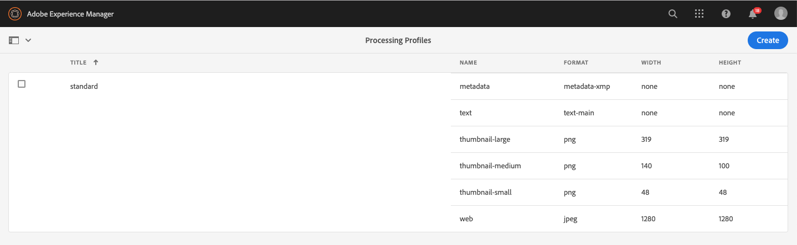
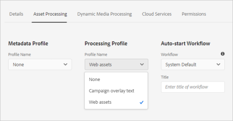

# 자산 마이크로서비스 및 처리 프로필 사용 {#get-started-using-asset-microservices}

에셋 마이크로서비스 는 클라우드 기반 애플리케이션(작업자라고도 함)을 사용하여 확장 가능하고 복원 가능한 에셋 처리를 제공합니다. Adobe은 다양한 에셋 유형 및 처리 옵션을 최적으로 처리하기 위해 서비스를 관리합니다.

에셋 마이크로서비스 를 사용하여 [광범위한 파일 유형](/help/assets/file-format-support.md) 의 이전 버전에서 사용할 수 있는 것보다 더 많은 형식을 즉시 지원 [!DNL Experience Manager]. 예를 들어 이제 PSD 및 PSB 형식의 썸네일 추출이 가능하지만, 이전에는 다음과 같은 타사 솔루션이 필요했습니다. [!DNL ImageMagick].

에셋 처리는 의 구성에 따라 다릅니다. **[!UICONTROL 처리 프로필]**. Experience Manager은 기본 설정을 제공하며 관리자가 보다 구체적인 에셋 처리 구성을 추가할 수 있도록 합니다. 관리자는 선택적 사용자 지정을 포함하여 사후 처리 워크플로우의 구성을 작성, 유지 관리 및 수정합니다. 워크플로를 사용자 지정하면 개발자가 기본 오퍼링을 확장할 수 있습니다.

<!-- Proposed DRAFT diagram for asset microservices flow - see section "asset-microservices-flow.png (asset-microservices-configure-and-use.md)" in the PPTX deck

https://adobe-my.sharepoint.com/personal/gklebus_adobe_com/_layouts/15/guestaccess.aspx?guestaccesstoken=jexDC5ZnepXSt6dTPciH66TzckS1BPEfdaZuSgHugL8%3D&docid=2_1ec37f0bd4cc74354b4f481cd420e07fc&rev=1&e=CdgElS
-->

>[!NOTE]
>
>여기에 설명된 자산 처리는 `DAM Update Asset` 의 이전 버전에 있는 워크플로 모델 [!DNL Experience Manager]. 대부분의 표준 렌디션 생성 및 메타데이터 관련 단계는 에셋 마이크로서비스 처리로 대체되며, 나머지 단계(있는 경우)는 사후 처리 워크플로우 구성으로 대체할 수 있습니다.

## 에셋 처리 옵션 이해 {#get-started}

[!DNL Experience Manager] 는 다음 처리 수준을 허용합니다.

| 옵션 | 설명 | 활용 사례 |
|---|---|---|
| [기본 구성](#default-config) | 현재 그대로 사용할 수 있으며 수정할 수 없습니다. 이 구성은 매우 기본적인 렌디션 생성 기능을 제공합니다. | <ul> <li>에서 사용하는 표준 썸네일 [!DNL Assets] 사용자 인터페이스(48, 140 및 319픽셀) </li> <li> 대형 미리 보기(웹 렌디션 - 1280픽셀) </li><li> 메타데이터 및 텍스트 추출.</li></ul> |
| [사용자 지정 구성](#standard-config) | 사용자 인터페이스를 통해 관리자가 구성합니다. 기본 옵션을 확장하여 렌디션을 생성하는 추가 옵션을 제공합니다. 기본 제공 옵션을 확장하여 다양한 형식 및 렌디션을 제공합니다. | <ul><li>FPO 렌디션. </li> <li>파일 형식 및 이미지 해상도 변경</li> <li> 구성된 파일 유형에 조건부로 적용합니다. </li> </ul> |
| [사용자 지정 프로필](#custom-config) | 사용자 정의 애플리케이션을 통해 사용자 정의 코드를 사용하여 를 호출하도록 사용자 인터페이스를 통해 관리자가 구성 [Asset compute 서비스](https://experienceleague.adobe.com/docs/asset-compute/using/introduction.html). 클라우드 기반의 확장 가능한 방식으로 보다 복잡한 요구 사항을 지원합니다. | 다음을 참조하십시오 [허용된 사용 사례](#custom-config). |

<!-- To create custom processing profiles specific to your custom requirements, say to integrate with other systems, see [post-processing workflows](#post-processing-workflows).
-->

## 지원되는 파일 형식 {#supported-file-formats}

에셋 마이크로서비스 는 메타데이터 처리, 렌디션 생성 또는 추출을 위한 다양한 파일 형식을 지원합니다. 다음을 참조하십시오 [지원되는 파일 형식](file-format-support.md) MIME 유형의 전체 목록 및 각 유형에 대해 지원되는 기능에 대해 설명합니다.

## 기본 구성 {#default-config}

일부 기본값은 Experience Manager에 필요한 기본 변환을 사용할 수 있도록 사전 구성되어 있습니다. 또한 기본 구성은 메타데이터 추출 및 텍스트 추출 작업을 사용할 수 있도록 합니다. 사용자는 에셋 업로드 또는 업데이트를 즉시 시작할 수 있으며 기본적으로 기본 처리를 사용할 수 있습니다.

기본 구성에서는 가장 기본적인 처리 프로필만 구성됩니다. 이러한 처리 프로필은 사용자 인터페이스에 표시되지 않으므로 수정할 수 없습니다. 업로드된 에셋을 처리하기 위해 항상 실행됩니다. 이러한 기본 처리 프로필은 필요한 기본 처리를에 보장합니다 [!DNL Experience Manager] 모든 에셋에서 완료되었습니다.

<!-- 
-->

## 표준 구성 {#standard-config}

[!DNL Experience Manager] 는 사용자의 요구 사항에 따라 일반적인 형식에 대해 보다 구체적인 렌디션을 생성하는 기능을 제공합니다. 관리자가 추가 항목을 만들 수 있습니다. [!UICONTROL 처리 프로필] 표현물을 쉽게 만들 수 있습니다. 그런 다음 사용자는 사용 가능한 프로필 중 하나 이상을 특정 폴더에 할당하여 추가 처리를 완료합니다. 예를 들어 추가 처리는 웹, 모바일 및 태블릿에 대한 렌디션을 생성할 수 있습니다. 다음 비디오에서는 을 만들고 적용하는 방법을 보여 줍니다 [!UICONTROL 처리 프로필] 그리고 만들어진 렌디션에 액세스하는 방법을 이해할 수 있습니다.

* **렌디션 너비 및 높이**: 렌디션 너비 및 높이 사양은 생성된 출력 이미지의 최대 크기를 제공합니다. 에셋 마이크로서비스 는 가능한 최대 렌디션을 만들려고 시도하며, 이 렌디션의 폭과 높이는 각각 지정된 폭과 높이보다 크지 않습니다. 종횡비는 그대로 유지됩니다. 즉, 원본과 동일합니다. 빈 값은 에셋 처리가 원본의 픽셀 차원을 가정함을 의미합니다.

* **MIME 유형 포함 규칙**: 특정 MIME 유형의 에셋이 처리되면 먼저 렌디션 사양에 대해 제외된 MIME 유형 값에 대해 MIME 유형을 확인합니다. 해당 목록과 일치하는 경우 에셋(차단 목록)에 대해 이 특정 렌디션이 생성되지 않습니다. 그렇지 않으면 포함된 MIME 유형에 대해 MIME 유형이 확인되고 목록과 일치하는 경우 렌디션이 생성됩니다(허용 목록).

* **특별 FPO 렌디션**: 대형 에셋을 배치할 때 [!DNL Experience Manager] 대상 [!DNL Adobe InDesign] 문서, 크리에이티브 전문가는 시간이 지난 후 상당한 시간을 기다립니다. [자산 배치](https://helpx.adobe.com/indesign/using/placing-graphics.html). 한편, 사용자의 사용이 차단됩니다 [!DNL InDesign]. 이는 크리에이티브 흐름을 방해하고 사용자 경험에 부정적인 영향을 미칩니다. Adobe을 사용하면 작은 크기의 렌디션을 임시로 배치할 수 있습니다. [!DNL InDesign] 로 시작하는 문서이며 나중에 전체 해상도 에셋으로 대체할 수 있습니다. [!DNL Experience Manager] 에서는 배치에만 사용되는 렌디션(FPO)을 제공합니다. 이러한 FPO 렌디션은 파일 크기는 작지만 종횡비가 동일합니다.

처리 프로필에는 FPO(배치 전용) 렌디션이 포함될 수 있습니다. 다음을 참조하십시오 [!DNL Adobe Asset Link] [설명서](https://helpx.adobe.com/kr/enterprise/using/manage-assets-using-adobe-asset-link.html) 처리 프로필에 대해 켜야 하는 경우 이해합니다. 자세한 내용은 [Adobe Asset Link 전체 설명서](https://helpx.adobe.com/kr/enterprise/using/adobe-asset-link.html).

### 표준 프로필 만들기 {#create-standard-profile}

표준 처리 프로필을 만들려면 다음 단계를 수행합니다.

1. 관리자 액세스 **[!UICONTROL 도구]** > **[!UICONTROL 에셋]** > **[!UICONTROL 처리 프로필]**. **[!UICONTROL 만들기]**&#x200B;를 클릭합니다.
1. 폴더에 적용할 때 프로필을 고유하게 식별하는 데 도움이 되는 이름을 제공합니다.
1. FPO 렌디션을 생성하려면 **[!UICONTROL 이미지]** 탭, 활성화 **[!UICONTROL FPO 렌디션 만들기]**. 입력 a **[!UICONTROL 품질]** 1과 100 사이의 값입니다.
1. 다른 변환을 생성하려면 다음을 클릭합니다. **[!UICONTROL 새로 추가]** 다음 정보를 입력하십시오.

   * 각 렌디션의 파일 이름.
   * 각 렌디션의 파일 형식(PNG, JPEG, GIF 또는 WebP)입니다.
   * 각 표현물의 폭 및 높이(픽셀 단위). 값을 지정하지 않으면 원본 이미지의 전체 픽셀 크기가 사용됩니다.
   * 각 JPEG 및 WebP 렌디션의 품질(%).
   * 프로필의 적용 가능성을 정의하기 위해 포함 및 제외된 MIME 유형입니다.

   

1. **[!UICONTROL 저장]**&#x200B;을 클릭합니다.

<!-- TBD: Update the video link when a new video is available from Tech Marketing.

The following video demonstrates the usefulness and usage of standard profile.

>[!VIDEO](https://video.tv.adobe.com/v/29832?quality=9)
-->

<!-- This image was removed per cqdoc-15624, as requested by engineering.
  
 -->

## 사용자 지정 프로필 및 사용 사례 {#custom-config}

다음 [!DNL Asset Compute Service] 는 기본 처리, Photoshop 파일과 같은 Adobe 특정 형식 처리, 사용자 지정 또는 조직별 처리 구현 등 다양한 사용 사례를 지원합니다. 과거에 필요한 DAM 자산 업데이트 워크플로우 사용자 지정은 자동으로 또는 처리 프로필 구성을 통해 처리됩니다. Adobe 이러한 처리 옵션으로 비즈니스 요구 사항을 충족하지 않으면 를 개발 및 사용하는 것이 좋습니다 [!DNL Asset Compute Service] 기본 기능을 확장합니다. 개요를 보려면 다음을 참조하십시오. [확장성 및 사용 시기 이해](https://experienceleague.adobe.com/docs/asset-compute/using/extend/understand-extensibility.html).

>[!NOTE]
>
>Adobe은 기본 구성 또는 표준 프로필을 사용하여 비즈니스 요구 사항을 달성할 수 없는 경우에만 사용자 지정 애플리케이션을 사용하는 것을 권장합니다.

이미지, 비디오, 문서 및 기타 파일 형식을 썸네일, 추출한 텍스트 및 메타데이터, 아카이브를 포함한 다양한 변환으로 변환할 수 있습니다.

개발자는 [!DNL Asset Compute Service] 끝 [사용자 정의 애플리케이션 만들기](https://experienceleague.adobe.com/docs/asset-compute/using/extend/develop-custom-application.html) 를 참조하십시오. [!DNL Experience Manager] 는 관리자가 구성하는 사용자 정의 프로필을 사용하여 사용자 인터페이스에서 이러한 사용자 정의 애플리케이션을 호출할 수 있습니다. [!DNL Asset Compute Service] 는 외부 서비스를 호출하는 다음과 같은 사용 사례를 지원합니다.

* 사용 [!DNL Adobe Photoshop]의 [ImageCutout API](https://developer.adobe.com/photoshop/photoshop-api-docs/) 결과를 렌디션으로 저장합니다.
* 타사 시스템을 호출하여 PIM 시스템과 같은 데이터를 업데이트합니다.
* 사용 [!DNL Photoshop] Photoshop 템플릿을 기반으로 다양한 렌디션을 생성하기 위한 API입니다.
* 사용 [ADOBE LIGHTROOM API](https://developer.adobe.com/photoshop/photoshop-api-docs/) 를 사용하여 수집된 에셋을 최적화하고 렌디션으로 저장합니다.

>[!NOTE]
>
>사용자 지정 응용 프로그램을 사용하여 표준 메타데이터를 편집할 수 없습니다. 사용자 지정 메타데이터만 수정할 수 있습니다.

### 사용자 지정 프로필 만들기 {#create-custom-profile}

사용자 지정 프로필을 만들려면 다음 단계를 수행합니다.

1. 관리자 액세스 **[!UICONTROL 도구]** > **[!UICONTROL 에셋]** > **[!UICONTROL 처리 프로필]**. **[!UICONTROL 만들기]**&#x200B;를 클릭합니다.
1. 클릭 **[!UICONTROL 사용자 정의]** 탭. 클릭 **[!UICONTROL 새로 추가]**. 원하는 렌디션 파일 이름을 입력합니다.
1. 다음 정보를 입력하십시오.

   * 각 렌디션의 파일 이름 및 지원되는 파일 확장명.
   * [App Builder 사용자 지정 앱의 끝점 URL](https://experienceleague.adobe.com/docs/asset-compute/using/extend/deploy-custom-application.html). 앱은 Experience Manager 계정과 동일한 조직의 앱이어야 합니다.
   * 에 서비스 매개 변수 추가 [사용자 지정 응용 프로그램에 추가 정보 또는 매개 변수 전달](https://experienceleague.adobe.com/docs/asset-compute/using/extend/develop-custom-application.html#extend).
   * 일부 특정 파일 형식으로 처리를 제한하기 위한 포함 및 제외된 MIME 유형입니다.

   **[!UICONTROL 저장]**&#x200B;을 클릭합니다.

맞춤형 애플리케이션은 Headless [프로젝트 앱 빌더](https://developer.adobe.com/app-builder/docs/overview/) 앱. 처리 프로필로 설정된 경우 사용자 정의 응용 프로그램에서 제공된 모든 파일을 가져옵니다. 응용 프로그램에서 파일을 필터링해야 합니다.

>[!CAUTION]
>
>App Builder 앱 및 [!DNL Experience Manager] 계정이 동일한 조직의 계정이 아니므로 통합이 작동하지 않습니다.

### 사용자 지정 프로필의 예 {#custom-profile-example}

사용자 지정 프로필의 사용을 설명하기 위해 사용 사례를 사용하여 캠페인 이미지에 사용자 지정 텍스트를 적용해 보겠습니다. Photoshop API를 활용하여 이미지를 편집하는 처리 프로필을 만들 수 있습니다.

Asset compute 서비스 통합을 사용하면 Experience Manager이 다음을 사용하여 이러한 매개 변수를 사용자 지정 애플리케이션에 전달할 수 있습니다. [!UICONTROL 서비스 매개 변수] 필드. 그런 다음 사용자 지정 애플리케이션은 Photoshop API를 호출하고 이러한 값을 API에 전달합니다. 예를 들어 글꼴 이름, 텍스트 색상, 텍스트 두께 및 텍스트 크기를 전달하여 캠페인 이미지에 사용자 정의 텍스트를 추가할 수 있습니다.

<!-- TBD: Check screenshot against the interface. -->

*그림: 사용 [!UICONTROL 서비스 매개 변수] 사용자 지정 애플리케이션에 빌드되는 사전 정의된 매개 변수에 추가된 정보를 전달하는 필드입니다. 이 예에서 캠페인 이미지가 업로드되면 이미지는 다음으로 업데이트됩니다 `Jumanji` 텍스트 입력 `Arial-BoldMT` 글꼴.*

## 처리 프로필을 사용하여 자산 처리 {#use-profiles}

Experience Manager이 이러한 폴더에 업로드되거나 업데이트된 에셋을 처리하기 위해 추가 사용자 정의 처리 프로필을 만들어 특정 폴더에 적용합니다. 기본 내장된 표준 처리 프로필은 항상 실행되지만 사용자 인터페이스에는 표시되지 않습니다. 사용자 지정 프로필을 추가하는 경우 두 프로필 모두 업로드된 에셋을 처리하는 데 사용됩니다.

다음 방법 중 하나를 사용하여 처리 프로필을 폴더에 적용합니다.

* 관리자는에서 처리 프로필 정의를 선택할 수 있습니다. **[!UICONTROL 도구]** > **[!UICONTROL 에셋]** > **[!UICONTROL 처리 프로필]**, 및 사용 **[!UICONTROL 폴더에 프로필 적용]** 작업. 이 옵션을 선택하면 특정 폴더로 이동하여 선택하고 프로필의 애플리케이션을 확인할 수 있는 컨텐츠 브라우저가 열립니다.
* 사용자는 Assets 사용자 인터페이스에서 폴더를 선택하고 **[!UICONTROL 속성]** 폴더 속성 화면을 여는 작업 **[!UICONTROL 자산 처리]** 탭 및 [!UICONTROL 처리 프로필] 목록에서 해당 폴더에 적합한 처리 프로필을 선택합니다. 변경 내용을 저장하려면 **[!UICONTROL 저장 및 닫기]**를 클릭합니다.
   

* 사용자는 Assets 사용자 인터페이스에서 폴더 또는 특정 에셋을 선택하여 처리 프로필을 적용한 다음 을 선택할 수 있습니다.  **[!UICONTROL 자산 재처리]** 맨 위에 있는 옵션에서 선택할 수 있습니다.

>[!TIP]
>
>한 개의 처리 프로필만이 폴더에 적용될 수 있습니다. 렌디션을 더 생성하려면 기존 처리 프로필에 렌디션 정의를 더 추가합니다.

처리 프로필이 폴더에 적용되면 구성된 추가 처리 프로필을 사용하여 이 폴더 또는 하위 폴더에 업로드된(또는 업데이트된) 모든 새 자산이 처리됩니다. 이 처리는 표준 기본 프로필에 포함됩니다.

>[!NOTE]
>
>폴더에 적용된 처리 프로필은 전체 트리에 대해 작동하지만 하위 폴더에 다른 프로필이 적용되면 오버라이드될 수 있습니다. 에셋이 폴더에 업로드되면 Experience Manager은 처리 프로필에 대해 포함된 폴더의 속성을 확인합니다. 프로필이 적용되지 않은 경우 계층 구조의 상위 폴더에서 적용할 처리 프로필을 확인합니다.

에셋이 처리되는지 확인하려면 다음에서 생성된 렌디션을 미리 봅니다. [!UICONTROL 표현물] 왼쪽 레일에서 보기 에셋 미리보기를 열고 왼쪽 레일을 열어 **[!UICONTROL 표현물]** 보기. 처리 프로필에서 특정 에셋의 유형이 MIME 유형 포함 규칙과 일치하는 특정 렌디션을 보고 액세스할 수 있어야 합니다.

*그림: 상위 폴더에 적용된 처리 프로필로 생성된 두 개의 추가 렌디션의 예*

## 사후 처리 워크플로 {#post-processing-workflows}

처리 프로필을 사용하여 달성할 수 없는 자산의 추가 처리가 필요한 경우 구성에 추가 사후 처리 워크플로우를 추가할 수 있습니다. 후 처리를 사용하면 에셋 마이크로서비스를 사용하여 구성 가능한 처리 위에 완전히 맞춤화된 처리를 추가할 수 있습니다.

사후 처리 워크플로 또는 [워크플로우 자동 시작](https://experienceleague.adobe.com/docs/experience-manager-learn/assets/configuring/auto-start-workflows.html), 구성된 경우 다음에 의해 자동으로 실행됩니다. [!DNL Experience Manager] microservices 처리가 완료된 후. 워크플로우를 트리거하기 위해 워크플로우 런처를 수동으로 추가할 필요가 없습니다. 예는 다음과 같습니다.

* 에셋을 처리하는 사용자 지정 워크플로 단계입니다.
* 제품 또는 프로세스 정보와 같은 외부 시스템의 에셋에 메타데이터 또는 속성을 추가하는 통합.
* 외부 서비스에서 수행한 추가 처리입니다.

사후 처리 워크플로 구성을 다음에 추가하려면 [!DNL Experience Manager], 다음 단계를 수행합니다.

* 하나 이상의 워크플로 모델을 만듭니다. 이러한 사용자 지정 모델을 라고 합니다. *사후 처리 워크플로 모델* 이 설명서에서 참조하십시오. 그것들은 보통 거예요 [!DNL Experience Manager] 워크플로우 모델.
* 필요한 워크플로우 단계를 이러한 모델에 추가합니다. 기본 워크플로우에서 단계를 검토하고 필요한 모든 기본 단계를 사용자 지정 워크플로우에 추가합니다. 단계는 워크플로우 모델 구성을 기반으로 에셋에서 실행됩니다. 예를 들어 에셋 업로드 시 스마트 태그 지정이 자동으로 수행되도록 하려면 단계를 사용자 지정 사후 처리 워크플로 모델에 추가합니다.
* 추가 [!UICONTROL DAM 자산 업데이트 워크플로우 완료 프로세스] 맨 끝에 서. 이 단계를 추가하면 Experience Manager은 처리가 종료되는 시점을 알고 자산이 처리된 것으로 표시될 수 있습니다. 즉, *신규* 자산에 표시됩니다.
* 경로(폴더 위치) 또는 정규 표현식으로 후 처리 워크플로 모델의 실행을 구성할 수 있는 사용자 정의 워크플로 실행자 서비스에 대한 구성을 만듭니다.

사후 처리 워크플로에서 사용할 수 있는 표준 워크플로 단계에 대한 자세한 내용은 다음을 참조하십시오. [사후 처리 워크플로의 워크플로 단계](developer-reference-material-apis.md#post-processing-workflows-steps) 를 참조하십시오.

### 사후 처리 워크플로 모델 만들기 {#create-post-processing-workflow-models}

사후 처리 워크플로 모델은 일반적입니다 [!DNL Experience Manager] 워크플로우 모델. 서로 다른 저장소 위치 또는 에셋 유형에 대해 서로 다른 처리가 필요한 경우 서로 다른 모델을 만듭니다.

필요에 따라 처리 단계가 추가됩니다. 사용 가능한 지원되는 단계와 사용자 지정 구현 워크플로우 단계를 모두 사용할 수 있습니다.

각 사후 처리 워크플로우의 마지막 단계가 다음과 같은지 확인합니다. `DAM Update Asset Workflow Completed Process`. 마지막 단계는 Experience Manager이 에셋 처리가 언제 완료되었는지 아는 데 도움이 됩니다.

### 사후 처리 워크플로우 실행 구성 {#configure-post-processing-workflow-execution}

에셋 마이크로서비스 가 업로드된 에셋의 처리를 완료한 후 에셋을 추가로 처리하는 사후 처리 워크플로우를 정의할 수 있습니다. 워크플로우 모델을 사용하여 후 처리를 구성하려면 다음 중 하나를 수행할 수 있습니다.

* [폴더 속성에 워크플로 모델 적용](#apply-workflow-model-to-folder).
* [사용자 지정 Workflow Runner 서비스 구성](#configure-custom-workflow-runner-service).

#### 폴더에 워크플로 모델 적용 {#apply-workflow-model-to-folder}

일반적인 사후 처리 사용 사례의 경우 메서드를 사용하여 폴더에 워크플로를 적용하는 것이 좋습니다. 폴더에 워크플로 모델을 적용하려면 [!UICONTROL 속성], 다음 단계를 수행합니다.

1. 워크플로우 모델을 만듭니다.
1. 폴더를 선택하고 **[!UICONTROL 속성]** 을 클릭하고 **[!UICONTROL 자산 처리 중]** 탭.
1. 아래 **[!UICONTROL 워크플로우 자동 시작]**&#x200B;필요한 워크플로우를 선택하고 워크플로우 제목을 입력한 다음 변경 사항을 저장합니다.

   

#### 사용자 지정 Workflow Runner 서비스 구성 {#configure-custom-workflow-runner-service}

폴더에 워크플로우를 적용하여 쉽게 이행할 수 없는 고급 구성에 대해 사용자 지정 워크플로우 실행기 서비스를 구성할 수 있습니다. (예: 정규 표현식을 사용하는 워크플로우) Adobe CQ DAM 사용자 지정 워크플로우 러너(`com.adobe.cq.dam.processor.nui.impl.workflow.CustomDamWorkflowRunnerImpl`)는 OSGi 서비스입니다. 이 섹션에서는 구성을 위한 다음 두 가지 옵션을 제공합니다.

* 경로별 사후 처리 워크플로(`postProcWorkflowsByPath`): 다양한 저장소 경로를 기반으로 여러 워크플로 모델을 나열할 수 있습니다. 콜론을 사용하여 경로와 모델을 구분합니다. 단순 저장소 경로가 지원됩니다. 에서 워크플로 모델에 매핑 `/var` 경로. 예: `/content/dam/my-brand:/var/workflow/models/my-workflow`.
* 표현식별 사후 처리 워크플로(`postProcWorkflowsByExpression`): 다양한 정규 표현식을 기반으로 여러 워크플로우 모델을 나열할 수 있습니다. 표현식과 모델은 콜론으로 구분해야 합니다. 정규 표현식은 렌디션이나 파일 중 하나가 아닌 에셋 노드를 직접 가리켜야 합니다. 예: `/content/dam(/.*/)(marketing/seasonal)(/.*):/var/workflow/models/my-workflow`.

OSGi 구성을 배포하는 방법은 다음을 참조하십시오. [배포 대상 [!DNL Experience Manager]](/help/implementing/deploying/overview.md).

#### 사후 처리 워크플로우 실행 비활성화

사후 처리가 필요하지 않은 경우 __워크플로우 자동 시작__ 선택 항목.

##### 비활성화된 자동 시작 워크플로우 모델 만들기

1. 다음으로 이동 __도구 > 워크플로우 > 모델__
1. 선택 __만들기 > 모델 만들기__ 맨 위 작업 표시줄에서 양식
1. 새 워크플로 모델의 제목과 이름을 입력합니다. 예를 들면 다음과 같습니다.
   * 제목: 자동 시작 워크플로우 비활성화
   * 이름: disable-auto-start-workflow
1. 선택 __완료__ 워크플로우 모델을 만들려면
1. __선택__ 및 __편집__ 새로 만든 워크플로우 모델
1. 워크플로우 모델 편집기에서 __1단계__ 모델 정의에서 를 삭제하고
1. 를 엽니다. __사이드 패널__, 및 선택 __단계__
1. 드래그 __DAM 자산 업데이트 워크플로우 완료__ 모델 정의로 이동
1. 다음 항목 선택 __페이지 정보__ 단추(다음 옆에 있음) __사이드 패널__ toggle), select __속성 열기__
1. 아래 __기본__ 탭, 선택 __임시 워크플로우__
1. 선택 __저장 및 닫기__ 맨 위의 작업 표시줄에서
1. 선택 __동기화__ 맨 위의 작업 표시줄에서
1. 워크플로우 모델 편집기 닫기

##### 비활성화된 자동 시작 워크플로우 모델 적용

다음에 설명된 단계 수행 [폴더에 워크플로 모델 적용](#apply-workflow-model-to-folder) 및 설정 __자동 시작 워크플로우 비활성화__ (으)로 __워크플로우 자동 시작__ 폴더의 경우 에셋을 사후 처리할 필요가 없습니다.

## 우수 사례 및 제한 사항 {#best-practices-limitations-tips}

* 워크플로우를 디자인할 때 모든 유형의 표현물에 대한 요구 사항을 고려합니다. 나중에 렌디션이 필요할 것으로 예상되지 않으면 워크플로우에서 렌디션 만들기 단계를 제거합니다. 렌디션은 이후에 일괄 삭제할 수 없습니다. 원하지 않는 렌디션은 을 장기간 사용한 후 많은 저장 공간을 차지할 수 있습니다. [!DNL Experience Manager]. 개별 에셋의 경우 사용자 인터페이스에서 렌디션을 수동으로 제거할 수 있습니다. 여러 에셋의 경우 다음 중 하나를 사용자 정의할 수 있습니다 [!DNL Experience Manager] 특정 렌디션을 삭제하거나 에셋을 삭제한 다음 다시 업로드합니다.
* 현재, 지원은 렌디션 생성으로 제한됩니다. 새 자산 생성은 지원되지 않습니다.
* 현재 메타데이터 추출을 위한 파일 크기 제한은 약 15GB입니다. 매우 큰 에셋을 업로드할 때 메타데이터 추출 작업이 실패하는 경우가 있습니다.

**추가 참조**

* [에셋 번역](translate-assets.md)
* [Assets HTTP API](mac-api-assets.md)
* [에셋이 지원되는 파일 형식](file-format-support.md)
* [에셋 검색](search-assets.md)
* [연결된 에셋](use-assets-across-connected-assets-instances.md)
* [에셋 보고서](asset-reports.md)
* [메타데이터 스키마](metadata-schemas.md)
* [에셋 다운로드](download-assets-from-aem.md)
* [메타데이터 관리](manage-metadata.md)
* [검색 패싯](search-facets.md)
* [컬렉션 관리](manage-collections.md)
* [일괄 메타데이터 가져오기](metadata-import-export.md)

>[!MORELIKETHIS]
>
>* [asset compute 서비스 소개](https://experienceleague.adobe.com/docs/asset-compute/using/introduction.html).
>* [확장성 및 사용 시기 이해](https://experienceleague.adobe.com/docs/asset-compute/using/extend/understand-extensibility.html).
>* [사용자 정의 응용 프로그램을 만드는 방법](https://experienceleague.adobe.com/docs/asset-compute/using/extend/develop-custom-application.html).
>* [다양한 사용 사례에 대해 지원되는 MIME 유형](/help/assets/file-format-support.md).

<!-- TBD: 
* How/where can admins check what's already configured and provisioned.
* How/where to request for new provisioning/purchase.
-->
