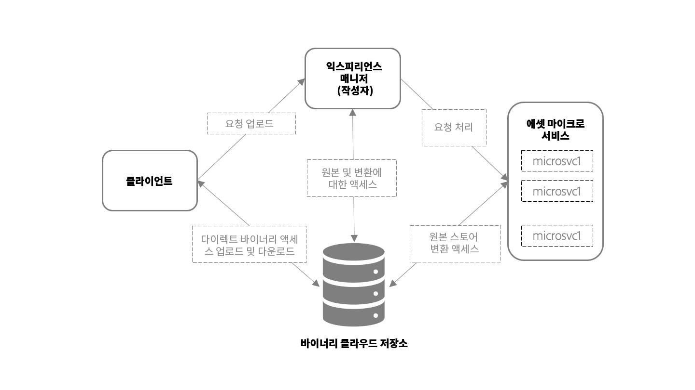

# 에셋 마이크로서비스를 이용한 에셋 수집 및 처리에 대한 개요 {#asset-microservices-overview}

Adobe Experience Manager as a [!DNL Cloud Service]는 클라우드 기반의 Experience Manager 애플리케이션 및 기능 활용 방법을 제공합니다. 이 새 아키텍처의 핵심 요소 중 하나는 에셋 마이크로서비스에서 제공하는 에셋 수집 및 처리입니다. 에셋 마이크로서비스는 클라우드 서비스를 사용하여 확장 가능하고 탄력적인 에셋 처리 워크플로를 제공합니다. Adobe는 다양한 에셋 유형 및 옵션을 최적으로 처리할 수 있는 클라우드 서비스를 관리합니다. 클라우드 기반 에셋 마이크로서비스의 주요 이점은 다음과 같습니다.

* 리소스 집약적인 작업을 원활하게 처리할 수 있는 확장 가능한 아키텍처입니다.
* Experience Manager 환경의 성능에 영향을 주지 않는 효율적인 인덱싱 및 텍스트 추출 기능입니다.
* Experience Manager 환경에서 워크플로가 에셋을 처리할 필요성을 최소화할 수 있습니다. 이를 통해 리소스를 확보하고, Experience Manager의 로드를 최소화하고, 뛰어난 확장성을 제공합니다.
* 에셋 처리의 복원력이 개선됩니다. 손상된 파일이나 대용량 파일 등 비정상적인 파일을 처리하는 경우 발생할 수 있는 문제는 배포 성능에 더 이상 영향을 주지 않습니다.
* 관리자용 에셋 처리 구성을 단순화합니다.
* Adobe에서 에셋 처리 설정을 관리 및 유지하여 파일 유형에 따라 렌디션, 메타데이터와 텍스트 추출 처리에 필요한 잘 알려진 구성을 제공합니다.
* 해당되는 경우 기본 Adobe 파일 처리 서비스를 사용하여 고화질 출력을 제공하고 [Adobe 소유 포맷을 효율적으로 처리](file-format-support.md)합니다.
* 사후 처리 워크플로를 구성하여 사용자별 액션과 통합 기능을 추가합니다.

에셋 마이크로서비스는 서드파티 렌더링 도구와 메서드(예: [!DNL ImageMagick] 및 FFmpeg 변환)의 필요성을 줄이고 구성을 간소화하는 동시에 기본적으로 일반적인 파일 형식에 기본 기능을 제공하는 데 도움이 됩니다.

## 고차원의 아키텍처 {#asset-microservices-architecture}

고차원의 아키텍처 다이어그램은 에셋 수집 및 처리의 핵심 요소와 시스템 전체의 에셋 흐름을 나타냅니다.

<!-- Proposed DRAFT diagram for asset microservices overview - see section "Asset processing - high-level diagram" in the PPTX deck

https://adobe-my.sharepoint.com/personal/gklebus_adobe_com/_layouts/15/guestaccess.aspx?guestaccesstoken=jexDC5ZnepXSt6dTPciH66TzckS1BPEfdaZuSgHugL8%3D&docid=2_1ec37f0bd4cc74354b4f481cd420e07fc&rev=1&e=CdgElS
-->

에셋 마이크로서비스를 이용한 수집 및 처리의 주요 단계는 다음과 같습니다.

* 웹 브라우저 또는 Adobe Asset Link 등 클라이언트는 [!DNL Experience Manager]에 업로드 요청을 보내고 바이너리 클라우드 스토리지에 직접 바이너리를 업로드하기 시작합니다.
* 다이렉트 바이너리 업로드가 완료되면 클라이언트는 [!DNL Experience Manager]를 알립니다.
* [!DNL Experience Manager] 에셋 마이크로서비스에 처리 요청을 보냅니다. 요청 콘텐츠는 생성할 렌디션을 지정하는 [!DNL Experience Manager]의 처리 프로필 구성에 따라 다릅니다.
* 에셋 마이크로서비스 백엔드는 요청을 수신하고, 요청에 따라 한 개 이상의 마이크로서비스로 발송합니다. 각 마이크로서비스는 바이너리 클라우드 스토어에서 직접 원본 바이너리에 액세스합니다.
* 렌디션 등 처리 결과는 바이너리 클라우드 스토리지에 저장됩니다.
* Experience Manager는 생성된 바이너리(렌디션)에 대한 다이렉트 포인터와 함께 처리가 완료되었다는 알림을 받습니다. 생성된 렌디션은 업로드된 에셋의 [!DNL Experience Manager]에서 사용할 수 있습니다.

이는 에셋 수집 및 처리의 기본 흐름입니다. 구성된 경우 Experience Manager는 사용자 지정 워크플로 모델을 시작하여 에셋의 사후 처리를 수행할 수도 있습니다. 예를 들어 엔터프라이즈 시스템에서 정보 가져오기 및 에셋 속성에 추가 등 환경에 고유한 사용자 지정된 단계를 실행합니다.

수집 및 처리 흐름은 Experience Manager에 필요한 에셋 마이크로서비스 아키텍처의 핵심 개념입니다.

* **다이렉트 바이너리 액세스**: Experience Manager 환경에 구성된 에셋을 바이너리 클라우드 스토어에 전송(및 업로드)한 다음 [!DNL Experience Manager] 마지막으로 클라이언트는 에셋 마이크로서비스에 직접 액세스하여 작업을 수행합니다. 이는 네트워크의 부하와 저장된 바이너리의 중복을 최소화합니다.
* **외부화된 처리**: 외부 [!DNL Experience Manager]환경에서 에셋을 처리하고, 리소스(CPU, 메모리)를 저장하여 주요 디지털 에셋 관리(DAM) 기능을 제공하고 최종 사용자 시스템과의 인터랙티브 작업을 지원할 수 있습니다.

## 다이렉트 바이너리 액세스로 에셋 업로드 {#asset-upload-with-direct-binary-access}

제품 서비스의 일부인 Experience Manager 클라이언트는 기본적으로 다이렉트 바이너리 액세스로 모든 업로드를 지원합니다. 여기에는 웹 인터페이스, Adobe Asset Link와 [!DNL Experience Manager] 데스크탑 앱을 사용하는 업로드가 포함됩니다.

[!DNL Experience Manager] HTTP API와 직접 구동하는 사용자 지정 업로드 도구를 사용할 수 있습니다. 해당 API를 직접 사용하거나, 업로드 프로토콜을 구현하는 다음 오픈 소스 프로젝트를 사용하고 확장할 수 있습니다.

* [오픈 소스 업로드 라이브러리](https://github.com/adobe/aem-upload)
* [오픈 소스 명령줄 도구](https://github.com/adobe/aio-cli-plugin-aem)

자세한 내용은 [에셋 업로드](add-assets.md)를 참조하십시오.

## 사용자 지정 에셋 사후 처리 추가 {#add-custom-asset-post-processing}

고객 대부분은 구성 가능한 에셋 마이크로서비스에서 모든 에셋 처리 요구 사항을 파악해야 하지만 일부 고객은 에셋 처리가 추가로 필요할 수 있습니다. 이는 특히 통합을 통해 다른 시스템에서 입수된 정보를 기반으로 에셋을 처리해야 하는 경우 적용됩니다. 그와 같은 경우 사용자 지정 사후 처리 워크플로를 사용할 수 있습니다.

사후 처리 워크플로는 일반 [!DNL Experience Manager] 워크플로 모델이며 [!DNL Experience Manager] 워크플로 편집기에서 만들고 관리합니다. 고객은 워크플로를 구성하여 에셋에서 추가 처리 단계(기본 제공 워크플로 단계 및 사용자 지정 워크플로 사용 포함)를 수행할 수 있습니다.

에셋 처리가 완료되면 Adobe Experience Manager를 구성하여 사후 처리 워크플로를 자동으로 트리거할 수 있습니다.

<!-- TBD asgupta, Engg: Create some asset-microservices-data-flow-diagram.
-->

**추가 참조**

* [에셋 번역](translate-assets.md)
* [Assets HTTP API](mac-api-assets.md)
* [자산 지원 파일 형식](file-format-support.md)
* [에셋 검색](search-assets.md)
* [연결된 자산](use-assets-across-connected-assets-instances.md)
* [에셋 보고서](asset-reports.md)
* [메타데이터 스키마](metadata-schemas.md)
* [에셋 다운로드](download-assets-from-aem.md)
* [메타데이터 관리](manage-metadata.md)
* [검색 패싯](search-facets.md)
* [컬렉션 관리](manage-collections.md)
* [벌크 메타데이터 가져오기](metadata-import-export.md)

>[!MORELIKETHIS]
>
>* [에셋 마이크로서비스 사용 시작](asset-microservices-configure-and-use.md)
>* [지원되는 파일 형식](file-format-support.md)
>* [Adobe Asset Link](https://helpx.adobe.com/kr/enterprise/using/adobe-asset-link.html)
>* [[!DNL Experience Manager] 데스크탑 앱](https://experienceleague.adobe.com/docs/experience-manager-desktop-app/using/introduction.html)
>* [다이렉트 바이너리 액세스에 대한 Apache Oak 설명서](https://jackrabbit.apache.org/oak/docs/features/direct-binary-access.html)

