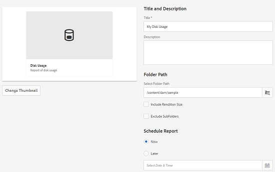

# 자산 보고서 {#asset-reports}

| 버전 | 문서 링크 |
| -------- | ---------------------------- |
| AEM 6.5 | [여기 클릭](https://experienceleague.adobe.com/docs/experience-manager-65/assets/administer/asset-reports.html?lang=en) |
| AEM as a Cloud Service | 이 문서 |

에셋 보고를 통해 의 유틸리티를 평가할 수 있습니다. [!DNL Adobe Experience Manager Assets] 배포. 포함 [!DNL Assets], 디지털 에셋에 대한 다양한 보고서를 생성할 수 있습니다. 보고서는 시스템의 사용, 사용자가 에셋과 상호 작용하는 방법, 에셋에 대한 유용한 정보를 제공합니다 <!-- downloaded and --> 공유됨.

보고서의 정보를 사용하여 채택을 측정할 주요 성공 지표를 도출할 수 있습니다. [!DNL Assets] 기업 내 및 고객별로

다음 [!DNL Assets] 보고 프레임워크 사용 [!DNL Sling] 순서대로 보고서 요청을 비동기식으로 처리하는 작업. 대형 저장소에 대해 확장 가능합니다. 비동기 보고서 처리를 통해 보고서가 생성되는 효율성과 속도가 향상됩니다.

보고서 관리 인터페이스는 직관적이고, 보관된 보고서에 액세스하고 보고서 실행 상태(성공, 실패 및 대기 중)를 보기 위한 세분화된 옵션 및 제어를 포함합니다.

보고서가 생성되면 다음을 통해 알림을 받습니다. <!-- through an email (optional) and --> 받은 편지함 알림. 이전에 생성된 모든 보고서가 표시되는 보고서 목록 페이지에서 보고서를 보거나, 다운로드하거나, 삭제할 수 있습니다.

## 보고서 생성 {#generate-reports}

[!DNL Experience Manager Assets] 는 다음과 같은 표준 보고서를 생성합니다.

* 업로드
* 다운로드
* 만료
* 수정
* 게시
* [!DNL Brand Portal] 게시
* 디스크 사용량
* 파일
* 공유 링크

<!-- Removed download report.
* Upload
* Download
* Expiration
* Modification
* Publish
* [!DNL Brand Portal] publish
* Disk Usage
* Files
* Link Share
-->

[!DNL Adobe Experience Manager] 관리자는 구현에 맞게 이러한 보고서를 쉽게 생성하고 사용자 지정할 수 있습니다. 관리자는 다음 단계에 따라 보고서를 생성할 수 있습니다.

1. 위치 [!DNL Experience Manager] 인터페이스, 클릭 **[!UICONTROL 도구]** > **[!UICONTROL 에셋]** > **[!UICONTROL 보고서]**.

   

1. 다음에서 [!UICONTROL 자산 보고서] 페이지, 클릭 **[!UICONTROL 만들기]** 을 클릭합니다.
1. 다음에서 **[!UICONTROL 보고서 만들기]** 페이지에서 만들려는 보고서를 선택하고 **[!UICONTROL 다음]**.

   

1. 제목, 설명, 썸네일 및 폴더 경로 등 보고서 세부 사항을 구성합니다. 기본적으로 폴더 경로는 `/content/dam`. 특정 폴더에서 보고서를 실행할 다른 경로를 지정할 수 있습니다.

   

   보고서의 날짜 범위를 선택합니다. 지금 또는 미래 날짜 및 시간에 보고서를 생성하도록 선택할 수 있습니다.

   >[!NOTE]
   >
   >보고서를 나중에 예약하도록 선택하는 경우 날짜 및 시간 필드에 날짜 및 시간을 지정해야 합니다. 값을 지정하지 않으면 보고서 엔진은 값을 즉시 생성할 보고서로 처리합니다.

   구성 필드는 사용자가 만드는 보고서 유형에 따라 다를 수 있습니다. 예를 들어 **[!UICONTROL 디스크 사용]** 보고서는 에셋에서 사용하는 디스크 공간을 계산할 때 에셋 변환을 포함하는 옵션을 제공합니다. 디스크 사용량 계산을 위해 하위 폴더에 자산을 포함하거나 제외하도록 선택할 수 있습니다.

   >[!NOTE]
   >
   >The **[!UICONTROL Disk Usage]** report does not include date range fields because it indicates current disk space usage only.

   

   다음을 만들 때 **[!UICONTROL 파일]** 보고서에서 하위 폴더를 포함/제외할 수 있습니다. 그러나 이 보고서에 대한 에셋 렌디션은 포함할 수 없습니다.

   

   다음 **[!UICONTROL 링크 공유]** 내부 외부 사용자와 공유되는 자산의 URL이 보고서에 표시됩니다. [!DNL Assets]. <!-- It includes email ids of the user who shared the assets, emails ids of users with which the assets are shared, share date, and expiration date for the link. --> 열을 사용자 지정할 수 없습니다.

   다음 **[!UICONTROL 링크 공유]** 보고서에서는 아래에 표시되는 공유 URL만 게시하므로 하위 폴더 및 렌디션에 대한 옵션을 포함하지 않습니다. `/var/dam/share`.

   

1. 클릭 **[!UICONTROL 다음]** 을 클릭합니다.

1. 다음에서 **[!UICONTROL 열 구성]** 기본적으로 보고서에 나타나도록 일부 열이 선택되어 있습니다. 열을 더 선택할 수 있습니다. 보고서에서 제외할 열 선택을 취소합니다.

   

   사용자 지정 열 이름 또는 속성 경로를 표시하려면 `jcr:content` crx의 노드 또는 속성 경로 선택기를 통해 추가합니다.

   

1. 클릭 **[!UICONTROL 만들기]** 을 클릭합니다. 보고서 생성이 시작되었음을 알리는 메시지가 표시됩니다.
1. 다음에서 [!UICONTROL 자산 보고서] 페이지의 보고서 생성 상태는 다음과 같은 보고서 작업의 현재 상태를 기반으로 합니다. [!UICONTROL 성공], [!UICONTROL 실패], [!UICONTROL 대기열에 추가됨], 또는 [!UICONTROL 예약됨]. 받은 편지함에도 동일한 상태가 나타납니다.보고서 페이지를 보려면 보고서 링크를 클릭하십시오. 또는 보고서를 선택하고 를 클릭합니다 **[!UICONTROL 보기]** 을 클릭합니다.

   <!---->
   

   클릭 **[!UICONTROL 다운로드]** 을 클릭하여 보고서를 CSV 형식으로 다운로드합니다.

   >[!NOTE]
   >
   >지난 360일 동안 생성된 이벤트를 기반으로 보고서를 생성할 수 있습니다. Experience Manager은 30일 동안 사용자 ID 데이터를 유지합니다.

## 보고서에 사용자 정의 열 추가 {#add-custom-columns}

다음 보고서에 사용자 정의 열을 추가하여 사용자 정의 요구 사항에 더 많은 데이터를 표시할 수 있습니다.

<!-- Remove download report.
* Upload
* Download
* Expiration
* Modification
* Publish
* [!DNL Brand Portal] publish
* Files
-->

* 업로드
* 만료
* 수정
* 게시
* [!DNL Brand Portal] 게시
* 파일

이러한 보고서에 사용자 정의 열을 추가하려면 다음 단계를 수행합니다.

1. 다음에서 [!DNL Manager interface], 클릭 **[!UICONTROL 도구]** > **[!UICONTROL 에셋]** > **[!UICONTROL 보고서]**.
1. 다음에서 [!UICONTROL 자산 보고서] 페이지, 클릭 **[!UICONTROL 만들기]** 을 클릭합니다.

1. 다음에서 **[!UICONTROL 보고서 만들기]** 페이지에서 생성할 보고서를 선택합니다. **[!UICONTROL 다음]**&#x200B;을 클릭합니다.

1. 제목, 설명, 썸네일, 폴더 경로 및 날짜 범위 등 보고서 세부 사항을 적절히 구성합니다. **[!UICONTROL 다음]**&#x200B;을 클릭합니다.

1. 다음 목록에서 해당 정보를 선택합니다. **[!UICONTROL 기본 열]**. 사용자 지정 열을 표시하려면 아래에 열의 이름을 지정합니다. **[!UICONTROL 사용자 정의 열]**.

   

1. 아래에 속성 경로 추가 `jcr:content` 속성 경로 선택기를 사용하는 CRXDE의 노드입니다. 또는 속성 경로 필드에 경로를 입력합니다.

   

   사용자 정의 열을 더 추가하려면 **[!UICONTROL 추가]** 위의 단계를 반복합니다.

1. 클릭 **[!UICONTROL 만들기]** 을 클릭합니다. 보고서 생성이 시작되었음을 알리는 메시지가 표시됩니다.

<!-- TBD: How to configure purge now? Is it using OSGi configurations?

## Configure purging service {#configure-purging-service}

To remove reports that you no longer require, configure the DAM Report Purge service from the web console to purge existing reports based on their quantity and age.

1. Access the web console (configuration manager) from `https://[aem_server]:[port]/system/console/configMgr`.
1. Open the **[!UICONTROL DAM Report Purge Service]** configuration.
1. Specify the frequency (time interval) for the purging service in the `scheduler.expression.name` field. You can also configure the age and the quantity threshold for reports.
1. Save the changes.
-->

## 문제 해결 정보 {#tips-troubleshoot}

* 다음과 같은 경우 [!UICONTROL 디스크 사용량 보고서] 를 생성하지 않고 를 사용하는 경우 [!DNL Dynamic Media]모든 에셋이 올바르게 처리되었는지 확인합니다. 해결하려면 에셋을 재처리하고 보고서를 다시 생성합니다.

<!-- These notes were present in generate report section above. Removing commented text from in between the instructions to preserve the numbering of the ordered list.

TBD: How do enable this in CS now? Is it done using some OSGi config now?
   >[!NOTE]
   >
   >Before you can generate an **[!UICONTROL Asset Downloaded]** report, ensure that the Asset Download service is enabled. From the web console (`https://[aem_server]:[port]/system/console/configMgr`), open the **[!UICONTROL Day CQ DAM Event Recorder]** configuration, and select the **[!UICONTROL Asset Downloaded (DOWNLOADED)]** option in Event Types if not already selected.
-->

<!-- Removed download report.
   >[!NOTE]
   >
   >By default, the Content Fragments and link shares are included in the asset [!UICONTROL Download] report. Select the appropriate option to create a report of link shares or to exclude Content Fragments from the download report.

   >[!NOTE]
   >
   >The [!UICONTROL Download] report displays details of only those assets which are downloaded after selecting individually or are downloaded using Quick Action. However, it does not include the details of the assets that are inside a downloaded folder.
-->

**추가 참조**

* [자산 번역](translate-assets.md)
* [Assets HTTP API](mac-api-assets.md)
* [자산이 지원되는 파일 형식](file-format-support.md)
* [자산 검색](search-assets.md)
* [연결된 자산](use-assets-across-connected-assets-instances.md)
* [메타데이터 스키마](metadata-schemas.md)
* [자산 다운로드](download-assets-from-aem.md)
* [메타데이터 관리](manage-metadata.md)
* [검색 패싯](search-facets.md)
* [컬렉션 관리](manage-collections.md)
* [일괄 메타데이터 가져오기](metadata-import-export.md)
* [AEM 및 Dynamic Media에 자산 게시](/help/assets/publish-assets-to-aem-and-dm.md)
