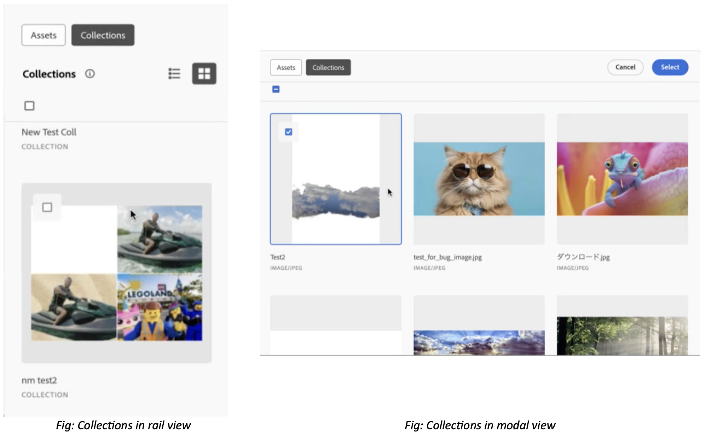

# 자산 선택기 컬렉션 {#asset-selector-collections}

컬렉션은 에셋, 폴더 또는 에셋 선택기 내의 다른 컬렉션 세트입니다. 컬렉션을 사용하여 사용자 간에 자산을 공유합니다. 폴더와 달리 컬렉션에는 서로 다른 위치의 자산이 포함될 수 있습니다.

자산 선택기의 마이크로 프론트엔드 컬렉션은 읽기 전용 모드에서 즉시 사용할 수 있습니다. 액세스 권한이 있는 [!DNL Experience Manager Assets] 리포지토리에서 직접 에셋 및 컬렉션을 가져옵니다.

>[!NOTE]
>
>[!DNL Experience Manager Assets] [imsOrg](/help/assets/asset-selector-properties.md) 및 컬렉션에 액세스할 수 있는 권한이 있는지 확인하십시오.

자산 선택기의 마이크로 프론트엔드 컬렉션은 읽기 전용 모드에서 즉시 사용할 수 있습니다. 액세스 권한이 있는 Experience Manager Assets 저장소에서 직접 에셋 및 컬렉션을 가져오고 Experience Manager Assets 저장소에서 공용 및 개인 폴더의 속성을 상속합니다. [Assets 보기에서 공개 또는 개인 컬렉션 만들기](/help/assets/manage-collections-assets-view.md#create-collection)에 대해 자세히 알아보세요.

레일 보기와 모달 보기 모두에서 에셋 선택기에서 컬렉션을 볼 수 있습니다.

<!--
Additionally, you can [customize](/help/assets/asset-selector-customization.md) the `featureSet` property to enable or disable collections in Asset Selector. See [enable or disable Collections tab](#enable-disable-collections-tab).-->

또한 컬렉션 탭에서 에셋 선택을 사용자 지정할 수도 있습니다. 이렇게 하려면 `handleSelection`을(를) 사용하여 사용자 지정할 수 있습니다. [개체 스키마를 사용하여 Assets 선택 처리](/help/assets/asset-selector-customization.md#handling-selection)를 참조하십시오.

## 컬렉션 보기 {#view-collections}

자산 선택기를 사용하면  목록 보기 또는  격자 보기에서 컬렉션을 볼 수 있습니다. 자산 선택기에서 [유형의 보기](overview-asset-selector.md#types-of-view)를 참조하십시오.

## 자산을 컬렉션으로 드래그 앤 드롭 {#collection-drag-and-drop}

작성자 환경의 [!DNL Assets as a Cloud Service] 보기에서 컬렉션으로 자산을 직접 끌어다 놓을 수 있습니다. 이렇게 하려면 Assets 탭의 에셋을 에셋 선택기 애플리케이션의 컬렉션 작업 영역으로 드래그하여 리치 애플리케이션을 빌드합니다.

>[!NOTE]
>
>* 에셋의 드래그 앤 드롭은 레일 보기에서만 가능합니다.
>* 폴더는 제외한 파일(에셋)만 드래그 앤 드롭할 수 있습니다.

다른 한편으로는 컬렉션에서 자산 끌어서 놓기를 [활성화하거나 비활성화할 수 있습니다](asset-selector-customization.md#enable-disable-drag-and-drop).

## 컬렉션에서 에셋 선택 비활성화 {#disable-selection-collection}

선택 해제 는 에셋 또는 폴더를 선택 가능하도록 숨기거나 비활성화하는 데 사용됩니다. 이 확인란을 선택하면 선택되지 않는 카드나 자산에 선택 확인란이 숨겨집니다. [선택 사용 안 함](/help/assets/asset-selector-customization.md#disable-selection)을 참조하세요.

## 컬렉션 탭 활성화 또는 비활성화 {#enable-disable-collections-tab}

에셋 선택기를 사용하면 요구 사항 및 유용성에 따라 구성 요소를 사용자 지정할 수 있습니다. 자산 선택기에서 컬렉션 탭을 활성화하거나 비활성화하려면 다음과 같은 방법으로 `featureSet` 속성을 사용할 수 있습니다.

* **컬렉션 사용 탭:** 컬렉션 탭을 사용하려면 배열에 값으로 `collections`을(를) 제공해야 합니다. 기본적으로 컬렉션 탭은 모든 사용자에 대해 즉시 활성화됩니다. 예, `featureSet:["collections"]`
* **컬렉션 탭 비활성화:** 컬렉션 탭을 비활성화하려면 빈 배열을 값으로 제공해야 합니다. 예, `featureSet:[ ]`

>[!MORELIKETHIS]
>
>* [자산 선택기 사용자 지정](/help/assets/asset-selector-customization.md)
>* [다양한 응용 프로그램과 자산 선택기 통합](/help/assets/integrate-asset-selector.md)
>* [자산 선택기 속성](/help/assets/asset-selector-properties.md)

