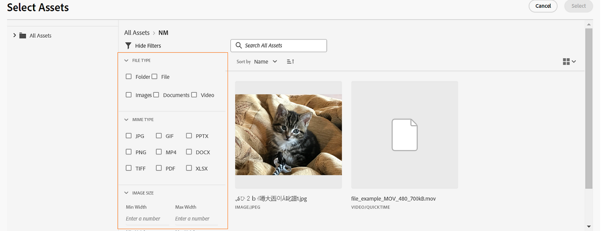

# 마이크로 프런트 엔드 자산 선택기 {#Overview}

마이크로 프런트 엔드 자산 선택기는 와 쉽게 통합되는 사용자 인터페이스를 제공합니다 [!DNL Experience Manager Assets as a Cloud Service] 리포지토리에서 사용 가능한 디지털 자산을 찾아보거나 검색하고, 애플리케이션 작성 환경에서 사용할 수 있습니다.

마이크로 프런트 엔드 사용자 인터페이스는 자산 선택기 패키지를 사용하여 애플리케이션 환경에서 사용할 수 있습니다. 패키지에 대한 모든 업데이트는 자동으로 가져오며 배포된 최신 자산 선택기가 애플리케이션 내에 자동으로 로드됩니다.


자산 선택기는 다음과 같은 많은 이점을 제공합니다.

* Vanilla JavaScript 라이브러리를 사용하여 Adobe 또는 비Adobe 애플리케이션과 쉽게 통합됩니다.
* 유지 관리가 용이한 자산 선택기 패키지 업데이트는 애플리케이션에 사용 가능한 자산 선택기에 자동으로 배포됩니다. 애플리케이션 내에 최신 수정 사항을 로드하는 데 필요한 업데이트가 없습니다.
* 애플리케이션 내에서 자산 선택기 표시를 제어하는 속성을 사용할 수 있으므로 사용자 지정의 용이성.

* 전체 텍스트 검색, 기본 제공 및 사용자 지정 필터를 사용하여 작성 환경에서 사용할 자산으로 빠르게 이동합니다.

* IMS 조직 내에서 자산을 선택하여 전환할 수 있습니다.

* 이름, 차원 및 크기별로 자산을 정렬하여 목록, 그리드, 갤러리 또는 워터폴 보기에서 볼 수 있습니다.

이 문서의 범위는 자산선택기를 [!DNL Adobe] 통합 셸 아래의 애플리케이션 또는 인증을 위해 생성된 imsToken 이 이미 있는 경우. 이러한 워크플로우를 이 문서에서 비SUSI 플로우라고 합니다.

다음 작업을 수행하여 자산 선택기를 와 통합 및 사용합니다. [!DNL Experience Manager Assets as a Cloud Service] 저장소:

* [Vanilla JS를 사용하여 자산 선택기 통합](#integration-with-vanilla-js)
* [자산 선택기 표시 속성 정의](#asset-selector-properties)
* [자산 선택기 사용](#using-asset-selector)

## Vanilla JS를 사용하여 자산 선택기 통합 {#integration-with-vanilla-js}

모든 항목을 통합할 수 있습니다 [!DNL Adobe] 또는 Adobe이 아닌 [!DNL Experience Manager Assets] 로서의 [!DNL Cloud Service] 저장소에서 응용 프로그램 내에서 자산을 선택합니다.

통합은 자산 선택기 패키지를 가져와서 Vanilla JavaScript 라이브러리를 사용하여 as a Cloud Service으로 Assets에 연결함으로써 수행됩니다. 다음을 편집해야 합니다 `index.html` 또는 애플리케이션 내의 모든 적절한 파일을 -
* 인증 세부 정보 정의
* 자산 as a Cloud Service 저장소 액세스
* 자산 선택기 표시 속성 구성

<!--
Asset Selector supports authentication to the [!DNL Experience Manager Assets] as a [!DNL Cloud Service] repository using Identity Management System (IMS) properties such as `imsScope` or `imsClientID`. Authentication using these IMS properties is referred to as SUSI (Sign Up Sign In) flow in this article.

You can perform authentication without defining some of the IMS properties, such as `imsScope` or `imsClientID`, if:

*   You are integrating an [!DNL Adobe] application on [Unified Shell](https://experienceleague.adobe.com/docs/experience-manager-cloud-service/content/overview/aem-cloud-service-on-unified-shell.html?lang=en).
*   You already have an IMS token generated for authentication.

Accessing [!DNL Experience Manager Assets] as a [!DNL Cloud Service] repository without defining `imsScope` or `imsClientID` IMS properties is referred to as a non-SUSI flow in this article.
-->

다음과 같은 경우 IMS 속성 중 일부를 정의하지 않고 인증을 수행할 수 있습니다.

* 통합 중인 [!DNL Adobe] 애플리케이션 [통합 셸](https://experienceleague.adobe.com/docs/experience-manager-cloud-service/content/overview/aem-cloud-service-on-unified-shell.html?lang=en).
* 인증을 위해 생성된 IMS 토큰이 이미 있습니다.

## 사전 요구 사항 {#prerequisites}

<!--
If your application requires user based authentication, out-of-the-box Asset Selector also supports a flow for authentication to the [!DNL Experience Manager Assets] as a [!DNL Cloud Service] repository using Identity Management System (IMS.)

You can use properties such as `imsScope` or `imsClientID` to retrieve `imsToken` automatically. You can use SUSI (Sign Up Sign In) flow and IMS properties. Also, you can obtain your own imsToken and pass it to Asset Selector by integrating within [!DNL Adobe] application on Unified Shell or if you already have an imsToken obtained via other methods (for example, using technical account). Accessing [!DNL Experience Manager Assets] as a [!DNL Cloud Service] repository without defining IMS properties (For example, `imsScope` and `imsClientID`) is referred to as a non-SUSI flow.
-->

에서 사전 요구 사항을 정의합니다 `index.html` 응용 프로그램 구현 내의 파일 또는 유사한 파일을 사용하여 [!DNL Experience Manager Assets] 로서의 [!DNL Cloud Service] 저장소. 전제 조건은 다음과 같습니다.
* imsOrg
* imsToken
* api 키

<!--
The prerequisites vary if you are authenticating using a SUSI flow or a non-SUSI flow.

**Non-SUSI flow**

*   imsOrg
*   imsToken
*   apikey

For more information on these properties, refer to [Asset Selector Properties](#asset-selector-properties).

**SUSI flow**

*   imsClientId
*   imsScope
*   redirectUrl
*   imsOrg
*   apikey

For more information on these properties, refer to [Example for the SUSI flow](#susi-vanilla) and [Asset Selector Properties](#asset-selector-properties).
-->

## 설치 {#installation}

Assets 선택기는 두 ESM CDN을 통해 사용할 수 있습니다(예: [esm.sh](https://esm.sh/)/[스키팩](https://www.skypack.dev/)) 및 [UMD](https://github.com/umdjs/umd) 버전.

브라우저에서 **UMD 버전** (권장):

```
<script src="https://experience.adobe.com/solutions/CQ-assets-selectors/assets/resources/assets-selectors.js"></script>

<script>
  const { renderAssetSelector } = PureJSSelectors;
</script>
```

브라우저: `import maps` 지원 **ESM CDN 버전**:

```
<script type="module">
  import { AssetSelector } from 'https://experience.adobe.com/solutions/CQ-assets-selectors/assets/resources/@assets/selectors/index.js'
</script>
```

다음을 사용하여 데노/웹 팩 모듈 페더레이션에서 **ESM CDN 버전**:

```
import { AssetSelector } from 'https://experience.adobe.com/solutions/CQ-assets-selectors/assets/resources/@assets/selectors/index.js'
```

### 선택한 자산 유형 {#selected-asset-type}

Selected Asset Type은 `handleSelection`, `handleAssetSelection`, 및 `onDrop` 함수 위에 있어야 합니다.

**스키마 구문**

```
interface SelectedAsset {
    'repo:id': string;
    'repo:name': string;
    'repo:path': string;
    'repo:size': number;
    'repo:createdBy': string;
    'repo:createDate': string;
    'repo:modifiedBy': string; 
    'repo:modifyDate': string; 
    'dc:format': string; 
    'tiff:imageWidth': number;
    'tiff:imageLength': number;
    'repo:state': string;
    computedMetadata: Record<string, any>;
    _links: {
        'http://ns.adobe.com/adobecloud/rel/rendition': Array<{
            href: string;
            type: string;
            'repo:size': number;
            width: number;
            height: number;
            [others: string]: any;
        }>;
    };
}
```

다음 표에서는 선택한 자산 객체의 중요한 속성 중 일부를 설명합니다.

| 속성 | 유형 | 설명 |
|---|---|---|
| *repo:repositoryId* | 문자열 | 자산이 저장된 저장소의 고유 식별자입니다. |
| *repo:id* | 문자열 | 자산의 고유 식별자입니다. |
| *repo:assetClass* | 문자열 | 자산의 분류(예: 이미지 또는 비디오, 문서)입니다. |
| *repo:name* | 문자열 | 파일 확장명을 포함하여 자산의 이름입니다. |
| *리포지토리:크기* | 개수 | 에셋의 크기입니다(바이트). |
| *리포지토리:경로* | 문자열 | 리포지토리 내의 자산 위치입니다. |
| *리포지토리:상위 항목* | `Array<string>` | 저장소의 자산에 대한 상위 항목 배열입니다. |
| *repo:state* | 문자열 | 저장소에서 자산의 현재 상태(예: 활성, 삭제 등)입니다. |
| *repo:createdBy* | 문자열 | 자산을 만든 사용자 또는 시스템입니다. |
| *repo:createDate* | 문자열 | 자산을 만든 날짜 및 시간입니다. |
| *repo:modifiedBy* | 문자열 | 자산을 마지막으로 수정한 사용자 또는 시스템입니다. |
| *repo:modifyDate* | 문자열 | 자산을 마지막으로 수정한 날짜 및 시간입니다. |
| *dc:format* | 문자열 | 파일 형식(예: JPEG, PNG 등)과 같은 자산의 형식입니다. |
| *tiff:imageWidth* | 개수 | 자산의 폭입니다. |
| *tiff:imageLength* | 개수 | 자산의 높이입니다. |
| *computedMetadata* | `Record<string, any>` | 모든 종류의 자산 메타데이터(저장소, 애플리케이션 또는 포함된 메타데이터)에 대한 버킷을 나타내는 객체입니다. |
| *_links* | `Record<string, any>` | 연결된 자산에 대한 하이퍼미디어 링크. 메타데이터 및 표현물과 같은 리소스에 대한 링크를 포함합니다. |
| *_links.http://ns.adobe.com/adobecloud/rel/rendition* | `Array<Object>` | 자산의 표현물에 대한 정보가 포함된 객체의 배열입니다. |
| *_links.http://ns.adobe.com/adobecloud/rel/rendition[].href* | 문자열 | 표현물에 대한 URI입니다. |
| *_links.http://ns.adobe.com/adobecloud/rel/rendition[].type* | 문자열 | 표현물의 MIME 유형입니다. |
| *_links.http://ns.adobe.com/adobecloud/rel/rendition[]&#39;repo:size&#39;* | 개수 | 표현물의 크기(바이트)입니다. |
| *_links.http://ns.adobe.com/adobecloud/rel/rendition[].width* | 개수 | 표현물의 폭입니다. |
| *_links.http://ns.adobe.com/adobecloud/rel/rendition[].height* | 개수 | 표현물의 높이입니다. |

전체 속성 목록 및 세부 예는 를 참조하십시오. [자산 선택기 코드 예](https://github.com/adobe/aem-assets-selectors-mfe-examples).

<!--
### ImsAuthProps {#ims-auth-props}

The `ImsAuthProps` properties define the authentication information and flow that the Asset Selector uses to obtain an `imsToken`. By setting these properties, you can control how the authentication flow should behave and register listeners for various authentication events.

| Property Name | Description|
|---|---|
| `imsClientId`| A string value representing the IMS client ID used for authentication purposes. This value is provided by Adobe and is specific to your Adobe AEM CS organization.|
| `imsScope`| Describes the scopes used in authentication. The scopes determine the level of access that the application has to your organization resources. Multiple scopes can be separated by commas.|
| `redirectUrl` | Represents the URL where the user is redirected after authentication. This value is typically set to the current URL of the application. If a `redirectUrl` is not supplied, `ImsAuthService` will use the redirectUrl used to register the `imsClientId`|
| `modalMode`| A boolean indicating whether the authentication flow should be displayed in a modal (pop-up) or not. If set to `true`, the authentication flow is displayed in a pop-up. If set to `false`, the authentication flow is displayed in a full page reload. _Note:_ for better UX, you can dynamically control this value if the user has browser pop-up disabled. |
| `onImsServiceInitialized`| A callback function that is called when the Adobe IMS authentication service is initialized. This function takes one parameter, `service`, which is an object representing the Adobe IMS service. See [`ImsAuthService`](#imsauthservice-ims-auth-service) for more details.|
| `onAccessTokenReceived`| A callback function that is called when an `imsToken` is received from the Adobe IMS authentication service. This function takes one parameter, `imsToken`, which is a string representing the access token. |
| `onAccessTokenExpired`| A callback function that is called when an access token has expired. This function is typically used to trigger a new authentication flow to obtain a new access token. |
| `onErrorReceived`| A callback function that is called when an error occurs during authentication. This function takes two parameters: the error type and error message. The error type is a string representing the type of error and the error message is a string representing the error message. |

### ImsAuthService {#ims-auth-service}

`ImsAuthService` class handles the authentication flow for the Asset Selector. It is responsible for obtaining an `imsToken` from the Adobe IMS authentication service. The `imsToken` is used to authenticate the user and authorize access to the Adobe Experience Manager (AEM) CS Assets repository. ImsAuthService uses the `ImsAuthProps` properties to control the authentication flow and register listeners for various authentication events. You can use the convenient [`registerAssetsSelectorsAuthService`](#purejsselectorsregisterassetsselectorsauthservice) function to register the _ImsAuthService_ instance with the Asset Selector. The following functions are available on the `ImsAuthService` class. However, if you're using the _registerAssetsSelectorsAuthService_ function, you do not need to call these functions directly.

| Function Name | Description |
|---|---|
| `isSignedInUser` | Determines whether the user is currently signed in to the service and returns a boolean value accordingly.|
| `getImsToken`    | Retrieves the authentication `imsToken` for the currently signed-in user, which can be used to authenticate requests to other services such as generating asset _rendition.|
| `signIn`| Initiates the sign-in process for the user. This function uses the `ImsAuthProps` to show authentication in either a pop-up or a full page reload |
| `signOut`| Signs the user out of the service, invalidating their authentication token and requiring them to sign in again to access protected resources. Invoking this function will reload the current page.|
| `refreshToken`| Refreshes the authentication token for the currently signed-in user, preventing it from expiring and ensuring uninterrupted access to protected resources. Returns a new authentication token that can be used for subsequent requests. |
-->

### 비SUSI 흐름의 예 {#non-susi-vanilla}

이 예에서는 자산을 실행할 때 비SUSI 흐름과 함께 자산 선택기를 사용하는 방법을 보여줍니다. [!DNL Adobe] 통합 셸 아래의 애플리케이션 또는 이미 `imsToken` 인증을 위해 생성되었습니다.

를 사용하여 코드에 자산 선택기 패키지를 포함합니다. `script` 태그에 다음 참조: _라인 6~15_ 아래의 예를 참조하십시오. 스크립트가 로드되면 `PureJSSelectors` 글로벌 변수를 사용할 수 있습니다. 자산 선택기 정의 [속성](#asset-selector-properties) 에 표시된 대로 _라인 16~23_. 다음 `imsOrg` 및 `imsToken` 속성은 둘 다 비SUSI 흐름에서 인증을 위해 필요합니다. 다음 `handleSelection` 속성은 선택한 자산을 처리하는 데 사용됩니다. 자산 선택기를 렌더링하려면 `renderAssetSelector` 함수 위에 있어야 합니다. _라인 17_. 자산 선택기가 `<div>` 에 표시된 대로 컨테이너 요소 _라인 21 및 22_.

이러한 단계를 수행하면, SUSI가 아닌 플로우가 있는 자산 선택기를 [!DNL Adobe] 응용 프로그램.

```html {line-numbers="true"}
<!DOCTYPE html>
<html>
<head>
    <title>Asset Selector</title>
    <script src="https://experience.adobe.com/solutions/CQ-assets-selectors/assets/resources/assets-selectors.js"></script>
    <script>
        // get the container element in which we want to render the AssetSelector component
        const container = document.getElementById('asset-selector-container');
        // imsOrg and imsToken are required for authentication in non-SUSI flow
        const assetSelectorProps = {
            imsOrg: 'example-ims@AdobeOrg',
            imsToken: "example-imsToken",
            apiKey: "example-apiKey-associated-with-imsOrg",
            handleSelection: (assets: SelectedAssetType[]) => {},
        };
        // Call the `renderAssetSelector` available in PureJSSelectors globals to render AssetSelector
        PureJSSelectors.renderAssetSelector(container, assetSelectorProps);
    </script>
</head>

<body>
    <div id="asset-selector-container" style="height: calc(100vh - 80px); width: calc(100vw - 60px); margin: -20px;">
    </div>
</body>

</html>
```

자세한 예를 보려면 [자산 선택기 코드 예](https://github.com/adobe/aem-assets-selectors-mfe-examples).

<!--
### Example for the SUSI flow {#susi-vanilla}

Use this example `index.html` file for authentication if you are integrating your application using SUSI flow.

Access the Asset Selector package using the `Script` Tag, as shown in *line 9* to *line 11* of the example `index.html` file.

*Line 14* to *line 38* of the example describes the IMS flow properties, such as `imsClientId`, `imsScope`, and `redirectURL`. The function requires that you define at least one of the `imsClientId` and `imsScope` properties. If you do not define a value for `redirectURL`, the registered redirect URL for the client ID is used.

As you do not have an `imsToken` generated, use the `registerAssetsSelectorsAuthService` and `renderAssetSelectorWithAuthFlow` functions, as shown in line 40 to line 50 of the example `index.html` file. Use the `registerAssetsSelectorsAuthService` function before `renderAssetSelectorWithAuthFlow` to register the `imsToken` with the Asset Selector. [!DNL Adobe] recommends to call `registerAssetsSelectorsAuthService` when you instantiate the component.

Define the authentication and other Assets as a Cloud Service access-related properties in the `const props` section, as shown in *line 54* to *line 60* of the example `index.html` file.

The `PureJSSelectors` global variable, mentioned in *line 65*, is used to render the Asset Selector in the web browser.

Asset Selector is rendered on the `<div>` container element, as mentioned in *line 74* to *line 81*. The example uses a dialog to display the Asset Selector.

```html {line-numbers="true"}
<!DOCTYPE html>
<html>

<head>
    <meta http-equiv="X-UA-Compatible" content="IE=edge">
    <meta charset="utf-8">
    <title>Asset Selectors</title>
    <link rel="stylesheet" href="index.css">
    <script id="asset-selector"
        src="https://experience.adobe.com/solutions/CQ-assets-selectors/assets/resources/asset-selectors.js"></script>
    <script>

        const imsProps = {
            imsClientId: "<obtained from IMS team>",
            imsScope: "openid, <other scopes>",
            redirectUrl: window.location.href,
            modalMode: true, // false to open in a full page reload flow
            onImsServiceInitialized: (service) => {
                // invoked when the ims service is initialized and is ready
                console.log("onImsServiceInitialized", service);
            },
            onAccessTokenReceived: (token) => {
                console.log("onAccessTokenReceived", token);
            },
            onAccessTokenExpired: () => {
                console.log("onAccessTokenError");
                // re-trigger sign-in flow
            },
            onErrorReceived: (type, msg) => {
                console.log("onErrorReceived", type, msg);
            },
        }

        function load() {
            const registeredTokenService = PureJSSelectors.registerAssetsSelectorsAuthService(imsProps);
            imsInstance = registeredTokenService;
        };

        // initialize the IMS flow before attempting to render the asset selector
        load();
        

        //function that will render the asset selector
            const otherProps = {
            // any other props supported by asset selector
            }
            const assetSelectorProps = {
                "imsOrg": "imsorg",
                ...otherProps
            }
             // container element on which you want to render the AssetSelector/DestinationSelector component
            const container = document.getElementById('asset-selector');

            /// Use the PureJSSelectors in globals to render the AssetSelector/DestinationSelector component
            PureJSSelectors.renderAssetSelectorWithAuthFlow(container, assetSelectorProps, () => {
                const assetSelectorDialog = document.getElementById('asset-selector-dialog');
                assetSelectorDialog.showModal();
            });
        }
    </script>

</head>
<body class="asset-selectors">
    <div>
        <button onclick="renderAssetSelectorWithAuthFlowFlow()">Asset Selector - Select Assets with Ims Flow</button>
    </div>
        <dialog id="asset-selector-dialog">
            <div id="asset-selector" style="height: calc(100vh - 80px); width: calc(100vw - 60px); margin: -20px;">
            </div>
        </dialog>
    </div>
</body>

</html>

```
-->

## 자산 선택기 속성 사용 {#asset-selector-properties}

자산 선택기 속성을 사용하여 자산 선택기가 렌더링되는 방식을 사용자 지정할 수 있습니다. 다음 표에는 자산 선택기를 사용자 지정하고 사용하는 데 사용할 수 있는 속성이 나와 있습니다.

| 속성 | 유형 | 필수 | 기본값 | 설명 |
|---|---|---|---|---|
| *레일* | 부울 | 아니요 | false | 표시된 경우 `true`, 자산 선택기가 왼쪽 레일 보기에서 렌더링됩니다. 표시되었으면 `false`를 입력하면 자산 선택기가 모달 보기로 렌더링됩니다. |
| *imsOrg* | 문자열 | 예 |  | Adobe IMS(Identity Management 시스템) ID를 프로비저닝하는 동안 할당됩니다 [!DNL Adobe Experience Manager] 로서의 [!DNL Cloud Service] 사용할 수 있습니다. 다음 `imsOrg` 액세스하는 조직이 Adobe IMS 아래에 있는지 여부를 인증하려면 키가 필요합니다. |
| *imsToken* | 문자열 | 아니요 |  | 인증에 사용되는 IMS 베어러 토큰입니다. `imsToken` 비SUSI 플로우를 사용하는 경우 필수입니다. |
| *apiKey* | 문자열 | 아니요 |  | AEM Discovery 서비스에 액세스하는 데 사용되는 API 키입니다. `apiKey` 비SUSI 플로우를 사용하는 경우 필수입니다. |
| *rootPath* | 문자열 | 아니요 | /content/dam/ | 자산 선택기가 자산을 표시하는 폴더 경로. `rootPath` 캡슐화 형태로도 사용할 수 있습니다. 예를 들어 다음 경로가 주어지면 `/content/dam/marketing/subfolder/`, 자산 선택기에서 상위 폴더를 트래버스할 수 없지만 하위 폴더만 표시합니다. |
| *경로* | 문자열 | 아니요 |  | 자산 선택기가 렌더링될 때 자산의 특정 디렉토리로 이동하는 데 사용되는 경로입니다. |
| *filterSchema* | 배열 | 아니요 |  | 필터 속성을 구성하는 데 사용되는 모델입니다. 이 기능은 자산 선택기에서 특정 필터 옵션을 제한하려는 경우 유용합니다. |
| *filterFormProps* | 오브젝트 | 아니요 |  | 검색을 세분화하는 데 사용해야 하는 필터 속성을 지정합니다. 예를 들어 MIME 유형 JPG, PNG, GIF. |
| *selectedAssets* | 배열 `<Object>` | 아니요 |  | 자산 선택기가 렌더링될 때 선택한 자산을 지정합니다. 자산의 id 속성을 포함하는 개체 배열이 필요합니다. 예, `[{id: 'urn:234}, {id: 'urn:555'}]` 현재 디렉터리에서 자산을 사용할 수 있어야 합니다. 다른 디렉토리를 사용해야 하는 경우 `path` 속성도 있습니다. |
| *acvConfig* | 오브젝트 | 아니요 |  | 기본값을 재정의하기 위한 사용자 지정 구성이 포함된 개체를 포함하는 자산 컬렉션 보기 속성입니다. |
| *i18nSymbols* | `Object<{ id?: string, defaultMessage?: string, description?: string}>` | 아니요 |  | OOTB 번역이 애플리케이션의 요구 사항에 충분하지 않으면 를 통해 고유한 사용자 지정 현지화된 값을 전달할 수 있는 인터페이스를 노출할 수 있습니다 `i18nSymbols` prop. 이 인터페이스를 통해 값을 전달하면 제공된 기본 번역을 무시하고 대신 직접 사용합니다.  재지정을 수행하려면 유효한 [메시지 설명자](https://formatjs.io/docs/react-intl/api/#message-descriptor) 개체의 키를 `i18nSymbols` 재정의할 수 있습니다. |
| *국제* | 오브젝트 | 아니요 |  | 자산 선택기가 기본 OOTB 번역을 제공합니다. 에서 유효한 로케일 문자열을 제공하여 번역 언어를 선택할 수 있습니다 `intl.locale` prop. 예: `intl={{ locale: "es-es" }}` </br></br> 지원되는 로케일 문자열은 [ISO 639 - 코드](https://www.iso.org/iso-639-language-codes.html) 언어 표준 이름의 표시. </br></br> 지원되는 로케일 목록: 영어 - &#39;en-us&#39;(기본값) 스페인어 - &#39;es-es&#39; 독일어 - &#39;de-de&#39; 프랑스어 - &#39;fr-fr&#39; 이탈리아어 - &#39;it-it&#39; 일본어 - &#39;ja-jp&#39; 한국어 - &#39;ko-kr&#39; 포르투갈어 - &#39;pt-br&#39; 중국어(번체) - &#39;zh-cn&#39; 중국어(대만) - &#39;zh-tw&#39; |
| *repositoryId* | 문자열 | 아니요 | &quot; | 자산 선택기가 컨텐츠를 로드하는 저장소. |
| *additionalAemSolutions* | `Array<string>` | 아니요 | [ ] | 추가 AEM 저장소 목록을 추가할 수 있습니다. 이 속성에 정보가 제공되지 않으면 미디어 라이브러리 또는 AEM Assets 저장소만 간주됩니다. |
| *hideTreeNav* | 부울 | 아니요 |  | 자산 트리 탐색 사이드바를 표시할지 여부를 지정합니다. 이 속성은 모달 보기에서만 사용되므로 레일 보기에서 이 속성의 영향을 받지 않습니다. |
| *onDrop* | 함수 | 아니요 |  | 속성을 사용하면 자산의 놓기 기능을 사용할 수 있습니다. |
| *dropOptions* | `{allowList?: Object}` | 아니요 |  | &#39;허용 목록에 추가하다Page&#39;를 사용하여 드롭다운 옵션을 구성합니다. |
| *colorScheme* | 문자열 | 아니요 |  | 테마 구성 (`light` 또는 `dark`) 내의 아무 곳에나 삽입할 수 있습니다. |
| *handleSelection* | 함수 | 아니요 |  | 자산을 선택하고 `Select` 모달에서 버튼을 클릭합니다. 이 함수는 모달 보기에서만 호출됩니다. 레일 보기의 경우 `handleAssetSelection` 또는 `onDrop` 함수 위에 있어야 합니다. 예: <pre>handleSelection=(assets: 자산[])=> {..}</pre> 자세한 내용은 [선택한 자산 유형](#selected-asset-type) 자세한 내용 |
| *handleAssetSelection* | 함수 | 아니요 |  | 자산을 선택하거나 선택하지 않을 때 항목 배열과 함께 호출됩니다. 이 기능은 사용자가 자산을 선택할 때 자산을 수신하려는 경우 유용합니다. 예: <pre>handleSelection=(assets: 자산[])=> {..}</pre> 자세한 내용은 [선택한 자산 유형](#selected-asset-type) 자세한 내용 |
| *onClose* | 함수 | 아니요 |  | 호출 시 `Close` 모달 보기의 버튼을 누릅니다. 호출만 됩니다 `modal` 의 `rail` 보기. |
| *onFilterSubmit* | 함수 | 아니요 |  | 사용자가 다른 필터 기준을 변경할 때 필터 항목과 함께 호출됩니다. |
| *selectionType* | 문자열 | 아니요 | 단일 | 구성 대상 `single` 또는 `multiple` 한 번에 자산 선택. |

## 자산 선택기 속성 사용 예 {#usage-examples}

자산 선택기를 정의할 수 있습니다 [속성](#asset-selector-properties) 에서 `index.html` 파일을 사용하여 자산 선택기 표시를 사용자 지정합니다.

### 예제 1: 레일 보기의 자산 선택기


AssetSelector의 값이 `rail` 가 로 설정되어 있습니다. `false` 또는 이 속성에서 언급되지 않으면 자산 선택기가 기본적으로 모달 보기에 표시됩니다.

<!--
### Example 2: Use selectedAssets property in addition to the path property

Use the `path` property to define the folder name that displays automatically when the Asset Selector is rendered. In addition, use the `selectedAssets` property to define the IDs for the assets that you need to select within the folder. Moreover, when you want to display assets that are pre-defined within the folder, you can use selectedAssets property.

   
-->

### 예제 2: 메타데이터 팝업

정보 아이콘을 사용하여 보려는 자산의 메타데이터를 정의하려면 다양한 속성을 사용합니다. 정보 팝오버는 자산의 제목, 차원, 수정 날짜, 위치 및 설명을 포함한 자산 또는 폴더에 대한 정보 수집을 제공합니다. 아래 예에서는 자산의 메타데이터를 표시하는 데 다양한 속성이 사용됩니다. 예를 들면 다음과 같습니다. `repo:path` 속성은 자산의 위치를 지정합니다. <!--`repo` represents the repository from where the asset is showing, whereas, `path` represents the route from where the asset or folder is rendered.-->


### 예제 3: 레일 보기의 사용자 지정 필터 속성

자산 선택기를 사용하면 면처리된 검색 외에도 다양한 속성을 사용자 지정하여 검색을 세분화할 수 있습니다. [!DNL Adobe Experience Manager] 로서의 [!DNL Cloud Service] 응용 프로그램. 응용 프로그램에서 사용자 지정된 검색 필터를 추가하려면 다음 코드를 추가해야 합니다. 아래 예에서는 `Type Filter` 검색을 위해 추가한 이미지, 문서, 비디오 또는 필터 유형 중에서 자산 유형을 필터링합니다.


<!--

## Customization after integrating Asset Selector 

### Custom metadata

Assets display panel shows the out of the box metadata that can be displayed in the info of the asset. In addition to this, [!DNL Adobe Experience Manager] as a [!DNL Cloud Service] application allows configuration of the asset selector by adding custom metadata that is shown in info panel of the asset.
-->

<!-- Property details to be added here. Referred the ticket https://jira.corp.adobe.com/browse/ASSETS-19023-->

<!--
## Asset Selector Object Schema {#object-schema}

Schema describes the object properties associated with an asset selected using Asset Selector. It uses the combination of data types and their values to validate the object describing the selected Asset using an Asset Selector.

**Schema Syntax**
````
interface SelectedAsset {
    'repo:id': string;
    'repo:name': string;
    'repo:path': string;
    'repo:size': number;
    'repo:createdBy': string;
    'repo:createDate': string;
    'repo:modifiedBy': string; 
    'repo:modifyDate': string; 
    'dc:format': string; 
    'tiff:imageWidth': number;
    'tiff:imageLength': number;
    'repo:state': string;
    computedMetadata: Record<string, any>;
    _links: {
        'http://ns.adobe.com/adobecloud/rel/rendition': Array<{
            href: string;
            type: string;
            'repo:size': number;
            width: number;
            height: number;
            [others: string]: any;
        }>;
    };
}
````

**Query Parameters**

| Parameter | Type | Description |
|---|---|---|
| repo:id | string | ID of an Asset |
| repo:name | string | The name of an Asset |
| repo:path | string | The path of an Asset |
| repo:size | number | Size of an Asset (in bytes) |
| repo:createdBy | string | ID of a user who created an Asset |
| repo: createdDate | string | The timestamp when an asset was created |
| repo:modifiedBy | string | ID of a user who modified the asset recently |
| repo:modifyDate | string | The timestamp when the asset was last modified |
| dc:format | string | MIME type of an Asset |
| tiff:imageWidth | number | The width of an image type of Asset |
| tiff:imageLength | number | The height of an image type of Asset |
| repo:state | string | The `Approved`, `Rejected`, or `Expired`state of an Asset |
| computedMetadata | string | It is an object that represents a bucket for all the Asset's metadata of all kinds (repository, application or embedded metadata) |
| _links | string | It represents the collection of links used in the Asset Selector. The links are represented in the form of an array. The parameters of an array include: `href`, `type`, `repo:size`, `width`, `height`, etc.  |

For the detailed example of Object Schema, click 
-->

## 개체 스키마를 사용하여 자산 선택 처리 {#handling-selection}

다음 `handleSelection` 속성은 자산 선택기에서 하나 또는 여러 자산 선택 사항을 처리하는 데 사용됩니다. 아래 예는 의 사용 구문을 설명합니다. `handleSelection`.


## 자산 선택기 사용 {#using-asset-selector}

자산 선택기가 설정되고 사용자가 와 함께 자산 선택기를 사용하도록 인증되면, [!DNL Adobe Experience Manager] 로서의 [!DNL Cloud Service] 애플리케이션에서 자산을 선택하거나 저장소 내에서 자산을 검색할 수 있는 다양한 기타 작업을 수행할 수 있습니다.


* **A**: [패널 숨기기/표시](#hide-show-panel)
* **B**: [저장소 전환기](#repository-switcher)
* **C**: [자산](#repository)
* **D**: [필터](#filters)
* **E**: [검색 창](#search-bar)
* **F**: [정렬](#sorting)
* **G**: [오름차순 또는 내림차순으로 정렬](#sorting)
* **H**: [보기](#types-of-view)

### 패널 숨기기/표시 {#hide-show-panel}

왼쪽 탐색에서 폴더를 숨기려면 **[!UICONTROL 폴더 숨기기]** 아이콘. 변경을 취소하려면 **[!UICONTROL 폴더 숨기기]** 다시 아이콘을 클릭합니다.

### 저장소 전환기 {#repository-switcher}

자산 선택기를 사용하면 자산을 선택할 수 있도록 저장소를 전환할 수도 있습니다. 왼쪽 패널에서 사용할 수 있는 드롭다운에서 선택한 저장소를 선택할 수 있습니다. 드롭다운 목록에서 사용할 수 있는 저장소 옵션은 `repositoryId` 에 정의된 속성 `index.html` 파일. 로그인한 사용자가 선택한 IMS 조직의 환경을 기반으로 합니다. 소비자는 선호하는 것을 통과할 수 있습니다 `repositoryID` 그리고 이 경우 자산 선택기가 보고서 전환기 렌더링을 중단하고 지정된 보관소의 자산만 렌더링합니다.
<!--
It is based on the `imsOrg` that is provided in the application. If you want to see the list of repositories, then `repositoryId` is required to view those specific repositories in your application.
-->

### 자산 저장소

작업을 수행하는 데 사용할 수 있는 자산 폴더의 컬렉션입니다.

### 기본 제공 필터 {#filters}

자산 선택기도 검색 결과를 구체화하기 위한 기본 필터 옵션을 제공합니다. 다음 필터를 사용할 수 있습니다.

* `File type`: 폴더, 파일, 이미지, 문서 또는 비디오를 포함합니다
* `MIME type`: JPG, GIF, PPTX, PNG, MP4, DOCX, TIFF, PDF, XLSX를 포함합니다.
* `Image Size`: 최소/최대 너비, 최소/최대 이미지 높이 포함



### 사용자 지정 검색

전체 텍스트 검색 외에도 자산 선택기를 사용하면 사용자 지정된 검색을 사용하여 파일 내에서 자산을 검색할 수 있습니다. 모달 보기 및 레일 보기 모드 모두에서 사용자 지정 검색 필터를 사용할 수 있습니다.


기본 검색 필터를 만들어 자주 검색하는 필드를 저장하고 나중에 사용할 수도 있습니다. 자산에 대한 사용자 지정 검색을 만들기 위해 `filterSchema` 속성을 사용합니다.

### 검색 창 {#search-bar}

자산 선택기를 사용하면 선택한 저장소 내에서 자산의 전체 텍스트 검색을 수행할 수 있습니다. 예를 들어, `wave` 검색 막대에서 `wave` 메타데이터 속성에 언급된 키워드가 표시됩니다.

### 정렬 {#sorting}

자산 선택기에서 자산을 자산 이름, 차원 또는 크기별로 정렬할 수 있습니다. 자산을 오름차순이나 내림차순으로 정렬할 수도 있습니다.

### 보기 유형 {#types-of-view}

자산 선택기를 사용하면 네 개의 서로 다른 보기에서 자산을 볼 수 있습니다.

* ** [!UICONTROL 목록 보기]**: 목록 보기에는 스크롤 가능한 파일과 폴더가 단일 열에 표시됩니다.
* ** [!UICONTROL 그리드 보기]**: 그리드 보기에는 스크롤 가능한 파일과 폴더가 행 및 열 그리드에 표시됩니다.
* ** [!UICONTROL 갤러리 보기]**: 갤러리 뷰는 중앙 잠금 가로 목록에 파일이나 폴더를 표시합니다.
* ** [!UICONTROL 워터폴 뷰]**: 워터폴 뷰는 Bridge의 형태로 파일이나 폴더를 표시합니다.

<!--
### Modes to view Asset Selector

Asset Selector supports two types of out of the box views:

**  Modal view or Inline view:** The modal view or inline view is the default view of Asset Selector that represents Assets folders in the front area. The modal view allows users to view assets in a full screen to ease the selection of multiple assets for import. Use `<AssetSelector rail={false}>` to enable modal view.

    

**  Rail view:** The rail view represents Assets folders in a left panel. The drag and drop of assets can be performed in this view. Use `<AssetSelector rail={true}>` to enable rail view.

    
-->
<!--

### Application Integration

Asset Selector is flexible and can be integrated within your existing [!DNL Adobe Experience Manager] as a [!DNL Cloud Service] application. It is accessible and localized to add, search, and select assets in your application. With Asset Selector you can:
*   **Configure** You can configure the files/folders that you want to show at the upfront. The assets that are chosen to view can be of any supported formats, for example, JPEG. It allows you to control the display of various text or symbols as per your choice.
*   **Perfect fit** Asset selector easily fits in your existing [!DNL Adobe Experience Manager] as a [!DNL Cloud Service] application and choose the way you want to view. The mode of view can be inline, rail, or modal view.
*   **Accessible** With Asset Selector, you can reach the desired asset in an easy manner.
*   **Localize** Assets can be availed for the various locales available as per Adobe's localization standards.
-->
<!--

### Support for multiple instances

The micro front-end design supports the display of multiple instances of Asset Selector on a single screen.


-->

<!--

### Controlled selection with multi-select

You can make default multi-selection of assets by specifying the assets to the component using `selectedAssets` property. You should specify an array of asset IDs. For example, `[{id: 'urn:234}, {id: 'urn:555'}].`
-->
<!--

### Action buttons

When you customize your application with Asset Selector based on ReactJS, you are provided with the following action buttons to perform various actions:
*   **Open in media library** Allows you to open the asset in media library.
*   **Upload** Allows you to upload an asset directly.
*   **Download** Downloads the asset in [!DNL Adobe Experience Manager] as a [!DNL Cloud Service].
-->
<!--

### Status of an asset

Asset Selector allows you to know the status of your uploaded assets. The status can be `Approved`, `Rejected`, or `Expired` of the asset. 
-->
<!--

### Localization

The integration of Asset Selector with [!DNL Adobe Experience Manager] as a [!DNL Cloud Service] allows localized content appear in your application.
-->