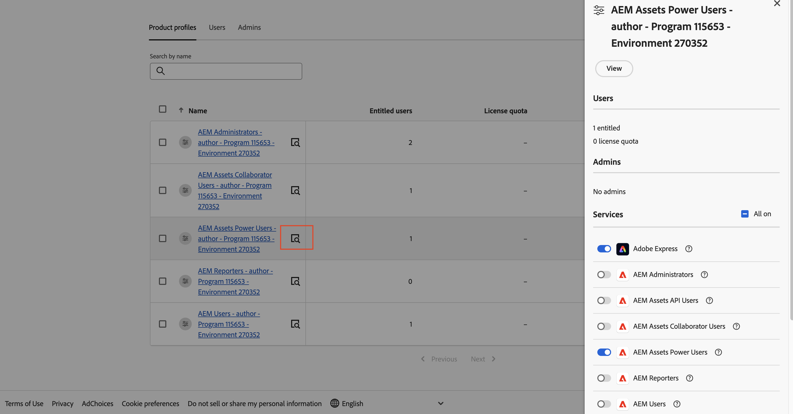

# [!DNL Assets] as a Cloud Service Prime  {#assets-prime}

<table>
    <tr>
        <td>
            <i>신규</i> <a href="/help/assets/dynamic-media/dm-prime-ultimate.md"><b>Dynamic Media Prime 및 Ultimate</b></a>
        </td>
        <td>
            <i>신규</i> <a href="/help/assets/assets-ultimate-overview.md"><b>AEM Assets Ultimate</b></a>
        </td>
        <td>
            <i>신규</i> <a href="/help/assets/integrate-aem-assets-edge-delivery-services.md"><b>Edge Delivery Services와의 AEM Assets 통합</b></a>
        </td>
        <td>
            <i>신규</i> <a href="/help/assets/aem-assets-view-ui-extensibility.md"><b>UI 확장성</b></a>
        </td>
          <td>
            <i>신규</i> <a href="/help/assets/dynamic-media/enable-dynamic-media-prime-and-ultimate.md"><b>Dynamic Media Prime 및 Ultimate 활성화</b></a>
        </td>
    </tr>
    <tr>
        <td>
            <a href="/help/assets/search-best-practices.md"><b>모범 사례 검색</b></a>
        </td>
        <td>
            <a href="/help/assets/metadata-best-practices.md"><b>메타데이터 모범 사례</b></a>
        </td>
        <td>
            <a href="/help/assets/product-overview.md"><b>Content Hub</b></a>
        </td>
        <td>
            <a href="/help/assets/dynamic-media-open-apis-overview.md"><b>OpenAPI 기능이 포함된 Dynamic Media</b></a>
        </td>
        <td>
            <a href="https://developer.adobe.com/experience-cloud/experience-manager-apis/"><b>AEM Assets 개발자 설명서</b></a>
        </td>
    </tr>
</table>

Assets as a Cloud Service Prime에는 다음과 같은 다양한 주요 기능을 수행할 수 있는 경량 DAM이 포함되어 있습니다.

* **자산 관리 및 라이브러리 서비스**&#x200B;: 사용자가 중앙 저장소에서 브랜드의 디지털 자산을 수집, 저장, 카탈로그화, 제어 및 관리할 수 있는 도구

* **검색, 발견 및 공동 작업**: 사용자가 풍부한 고객 경험을 창출하는 데 필요한 자산을 탐색, 발견, 공유 및 공동 작업을 수행할 수 있는 도구입니다.

* **보안 및 권한 관리**: 액세스, 권한 및 보안을 관리하여 규정 준수, 일관성 및 브랜드 무결성을 보장하는 도구입니다.

* **Creative Cloud 연결**: 마케팅 및 크리에이티브 팀이 간소화된 액세스, 댓글, 검토 및 주석을 통해 공동 작업을 수행하여 디지털 자산을 업데이트하거나 완성할 수 있도록 지원하는 도구입니다.

* **Experience Cloud 연결**: 다른 Experience Cloud 애플리케이션 및 서비스에서 디지털 자산에 대한 기본 액세스를 지원하는 도구입니다.

* **확장성 옵션이 없는 Distribution Portal 경험(Content Hub)**: 사용 및 브랜드 일관성을 보장하기 위해 브랜드의 승인된 디지털 에셋에 대한 액세스를 확장된 관련자로 확장하는 도구입니다.

* **통합**: 다른 Adobe 및 Adobe 이외의 애플리케이션과의 통합.

* **Dynamic Media(추가 기능)**: 어떤 디바이스에서든 풍부한 대화형 멀티미디어 경험을 제공할 수 있도록 이미지, 비디오 및 기타 새로운 콘텐츠를 변환하여 제공하는 도구입니다.

  >[!NOTE]
  >
  >회전, 자르기(수동만 해당 - 스마트 자르기 없음), 뒤집기, 높이, 너비, 품질, 형식 및 응용 비디오 스트리밍과 같은 기본 이미지 수정자에 대한 액세스를 제공하는 OpenAPI 기능이 있는 Dynamic Media도 Assets Prime에서 사용할 수 있습니다. 자세한 내용은 Adobe 계정 팀에 문의하십시오.

1. [새 프로그램을 만듭니다](/help/journey-onboarding/create-program.md).

그러나 DAM의 요구 사항이 증가하고 UI 확장성, API 기반 자동화 및 사용자 지정 코드 배포와 같은 기능이 더 필요하므로 [Assets Ultimate](/help/assets/assets-ultimate-overview.md)(으)로 업그레이드하는 것을 고려해야 합니다.

이 문서에서는 Assets as a Cloud Service Prime을 활성화하는 종단 간 워크플로우를 제공합니다.

## Assets as a Cloud Service Prime 활성화{#enable-assets-prime}

Cloud Manager을 사용하여 새 프로그램을 만드는 동안 Assets Prime을 활성화합니다. 다음 단계를 실행합니다.

1. 시스템 관리자로 Cloud Manager에 로그온합니다. 로그인하는 동안 올바른 조직을 선택해야 합니다.

   >[!NOTE]
   >
   >새 프로그램을 추가할 적절한 Cloud Manager 제품 프로필에 추가되었는지 확인합니다. 자세한 내용은 [Cloud Manager의 역할 기반 권한](/help/onboarding/cloud-manager-introduction.md#role-based-permissions)을 참조하세요.

1. [새 프로그램을 만듭니다](/help/journey-onboarding/create-program.md).

   새 프로그램을 만드는 동안 **[!UICONTROL 솔루션 및 추가 기능]** 탭에서 **[!UICONTROL Assets Prime]**&#x200B;을(를) 선택하십시오. **[!UICONTROL Assets Prime]**&#x200B;을(를) 확장하고 **[!UICONTROL Content Hub]**&#x200B;을(를) 선택하여 자산 배포에 [Content Hub](/help/assets/product-overview.md)을(를) 사용하도록 설정할 수도 있습니다.

   

1. 프로그램을 만들려면 **[!UICONTROL 만들기]**&#x200B;를 클릭하십시오.

1. 프로그램 카드를 클릭하고 **[!UICONTROL 환경 추가]**&#x200B;를 클릭합니다.

1. 환경 이름을 지정하고 영역을 정의한 다음 **[!UICONTROL 저장]**&#x200B;을 클릭하여 환경을 만듭니다.

   

>[!NOTE]
>
>Assets Prime에서는 프로덕션 환경만 만들 수 있습니다. 프로덕션 환경이 성공적으로 생성되면 환경 추가 옵션을 더 이상 사용할 수 없습니다.

이제 Assets Prime이 Experience Manager Assets as a Cloud Service에 대해 활성화됩니다.

시스템 관리자는 AEM 관리자 권한이 자동으로 부여되며 제품 프로필을 관리하기 위해 Admin Console으로 이동할 수 있는 이메일을 수신합니다.

Admin Console에서 AEM as a Cloud Service 인스턴스는 다음 제품 프로필로 구성됩니다.

* AEM 관리자

* AEM 사용자

* [AEM Assets 공동 작업자 사용자](#onboard-collaborator-users)

* [AEM Assets 파워 유저](#onboard-power-users)

AEM Assets Collaborator 사용자 및 AEM Assets Power Users 제품 프로필에 사용자 또는 사용자 그룹을 추가할 수 있습니다. 자세한 내용은 [AEM Assets Collaborator 사용자 온보딩](#onboard-collaborator-users) 및 [AEM Assets Power 사용자 온보딩](#onboard-power-users)을 참조하십시오.

Assets as a Cloud Service용 Content Hub을 활성화한 경우 Admin Console의 AEM Assets as a Cloud Service 내에서 접미사가 `delivery`인 새 인스턴스가 만들어집니다.

>[!NOTE]
>
>2024년 8월 14일 이전에 Content Hub을 프로비저닝한 경우 `contenthub`을(를) 접미사로 사용하여 새 인스턴스가 만들어집니다.

Content Hub의 인스턴스 이름에 `author` 또는 `publish`이(가) 없습니다.

`AEM Assets Limited Users` Content Hub 제품 프로필을 보려면 인스턴스 이름을 클릭하십시오.

이 제품 프로필에 사용자 또는 사용자 그룹을 추가하여 Content Hub에 대한 액세스 권한을 제공할 수 있습니다.

>[!NOTE]
>
>2024년 8월 14일 이전에 Content Hub을 프로비저닝한 경우 Content Hub 제품 프로필에 `delivery` 대신 `Limited Users` 뒤에 `contenthub`이(가) 언급되어 있습니다.

## AEM Assets Collaborator 사용자 온보드 {#onboard-collaborator-users}

AEM Assets Collaborator 사용자는 다른 Adobe 제품 및 Adobe이 아닌 애플리케이션에서 조직에서 사용할 수 있는 Assets의 통합을 통해 Experience Manager의 자산으로 작업하고, 전문적으로 디자인된 템플릿, 브랜드 키트, Adobe Stock 자산 등을 활용하여 내장 Adobe Express 및 Firefly을 사용하여 자산을 만들고 편집하고, AEM Assets Content Hub 포털을 사용하여 조직에서 승인된 자산에 액세스하고 활용할 수 있습니다.

Collaborator 사용자를 온보딩하려면 다음을 수행합니다.

1. Admin Console의 제품 목록에서 Experience Manager Assets 제품 이름을 클릭하여 AEM as a Cloud Service 제품 프로필에 액세스합니다.

1. AEM as a Cloud Service에 대한 프로덕션 작성자 인스턴스 를 클릭합니다.
   AEM as a Cloud Service의 

1. Collaborators 사용자 제품 프로필을 클릭하고 **[!UICONTROL 사용자 추가]**를 클릭하여 사용자를 제품 프로필에 추가합니다.
   

1. **[!UICONTROL 저장]**&#x200B;을 클릭하여 변경 내용을 저장합니다.

다음 이미지에 표시된 대로 Collaborator 사용자에게 할당된 서비스에 액세스하고 이를 볼 수도 있습니다.

Collaborator 사용자를 위한 

기본적으로 `Adobe Express` 및 `AEM Assets Collaborator Users` 서비스를 사용할 수 있습니다. 필요에 따라 토글을 끄거나 켤 수 있지만, Adobe에서는 제품 프로필에 대해 활성화된 기본 서비스를 사용하는 것이 좋습니다.

## AEM Assets Power 사용자 온보드 {#onboard-power-users}

AEM Assets 파워 유저는 자산, 권한, 메타데이터 관리, 디지털 자산에 대한 전반적인 거버넌스 및 자동화를 포함한 모든 AEM Assets 기능에 액세스하고, 다른 Adobe 및 Adobe 이외의 애플리케이션에서 조직에서 사용할 수 있는 Assets의 통합을 통해 Experience Manager의 자산으로 작업하고, 내장된 Adobe Express 및 Firefly을 사용하여 전문적으로 디자인된 템플릿, 브랜드 키트, Adobe Stock 자산 등을 활용하여 자산을 만들고 편집하고, AEM Assets Content Hub 포털을 사용하여 조직에서 승인된 자산에 액세스하고 활용할 수 있습니다.

Power 사용자를 온보딩하려면:

1. Admin Console의 제품 목록에서 Experience Manager Assets 제품 이름을 클릭하여 AEM as a Cloud Service 제품 프로필에 액세스합니다.

1. AEM as a Cloud Service에 대한 프로덕션 작성자 인스턴스 를 클릭합니다.
   AEM as a Cloud Service의 

1. 고급 사용자 제품 프로필을 클릭하고 **[!UICONTROL 사용자 추가]**를 클릭하여 사용자를 제품 프로필에 추가합니다.
   

1. **[!UICONTROL 저장]**&#x200B;을 클릭하여 변경 내용을 저장합니다.

다음 이미지에 표시된 대로 고급 사용자에게 할당된 서비스에 액세스하고 서비스를 볼 수도 있습니다.

고급 사용자를 위한 

기본적으로 `Adobe Express` 및 `AEM Assets Power Users` 서비스를 사용할 수 있습니다. 필요에 따라 토글을 끄거나 켤 수 있지만, Adobe에서는 제품 프로필에 대해 활성화된 기본 서비스를 사용하는 것이 좋습니다.
