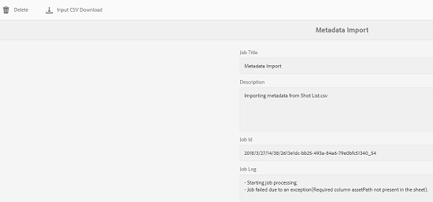

# 비동기 작업 {#asynchronous-operations}

성능에 대한 부정적인 영향을 줄이기 위해 AEM(Adobe Experience Manager) 자산은 특정 장기 실행 및 리소스 집약적인 자산 작업을 비동기적으로 처리합니다.

이러한 작업에는 다음이 포함됩니다.

* 많은 자산 삭제
* 많은 참조가 있는 많은 자산 또는 자산 이동
* 자산 메타데이터를 일괄 내보내기/가져옵니다.
* 원격 AEM 배포에서 설정된 임계값 초과 자산을 가져오는 중입니다.

비동기 처리에는 여러 작업을 등록하고 시스템 리소스의 가용성에 따라 순차적으로 실행할 수 있습니다.

비동기 작업 상태 페이지에서 비동기 작업의 상태를 볼 **[!UICONTROL 수]** 있습니다.

>[!NOTE]
>
>기본적으로 AEM 자산의 작업은 동시에 실행됩니다. N이 CPU 코어 수이면 N/2 작업은 기본적으로 동시에 실행할 수 있습니다. 작업 큐에 대한 사용자 정의 설정을 사용하려면 웹 콘솔에서 **비동기 작업** 기본 큐 구성을 수정합니다. 자세한 내용은 대기열 구성을 [참조하십시오](https://sling.apache.org/documentation/bundles/apache-sling-eventing-and-job-handling.html#queue-configurations).

## 비동기 작업 상태 모니터링 {#monitoring-the-status-of-asynchronous-operations}

AEM 자산이 비동기적으로 작업을 처리할 때마다 받은 편지함과 이메일을 통해 알림을 받습니다.

비동기 작업의 상태를 자세히 보려면 [비동기 작업 상태] **[!UICONTROL 페이지로 이동합니다]** .

1. AEM 로고를 탭/클릭하고 자산 > **[!UICONTROL 작업으로]** 이동합니다 ****.
1. [비동기 **[!UICONTROL 작업 상태]** ] 페이지에서 작업 세부 사항을 검토하십시오.

   

   특정 작업의 진행 상태를 확인하려면 상태 **[!UICONTROL 열의 값을 참조하십시오]** . 진행 상태에 따라 다음 상태 중 하나가 표시됩니다.

   **[!UICONTROL 활성]**:작업을 처리 중입니다.

   **[!UICONTROL 성공]**:작업이 완료되었습니다.

   **[!UICONTROL 실패]** 또는 **[!UICONTROL 오류]**:작업을 처리할 수 없습니다.

   **[!UICONTROL 예약됨]**:작업이 나중에 처리하도록 예약되었습니다.

1. 활성 작업을 중지하려면 목록에서 해당 작업을 선택하고 도구 모음에서 **[!UICONTROL 중지]** 아이콘을 탭/클릭합니다.

   

1. 설명 및 로그와 같은 추가 세부 사항을 보려면 작업을 선택하고 도구 모음에서 **[!UICONTROL 열기]** 아이콘을 탭/클릭합니다.

   

   작업 세부 사항 페이지가 표시됩니다.

   

1. 목록에서 작업을 삭제하려면 도구 모음에서 **[!UICONTROL 삭제를]** 선택합니다. CSV 파일로 세부 사항을 다운로드하려면 다운로드 **[!UICONTROL 아이콘을 탭/클릭합니다]** .

   >[!NOTE]
   >
   >상태가 활성 상태이거나 큐에 있는 경우 작업을 삭제할 수 없습니다.

## 완료된 작업 제거 {#purging-completed-jobs}

AEM Assets는 매일 오전 1시에 제거 작업을 실행하여 하루 이상 된 완료된 비동기 작업을 삭제합니다.

삭제 작업에 대한 일정 및 완료된 작업의 세부 사항이 삭제되기 전에 보존되는 기간을 수정할 수 있습니다. 특정 시점에 세부 사항이 보존되는 완료된 작업의 최대 수를 구성할 수도 있습니다.

1. AEM 로고를 탭/클릭하고 도구 > **[!UICONTROL 작업]** > **[!UICONTROL 웹]** 콘솔로 **[!UICONTROL 이동합니다]**.
1. Adobe CQ **[!UICONTROL DAM 비동기 작업 제거 예약]** 작업을 엽니다.
1. 완료된 작업을 삭제한 후 남은 기간(일)과 작업 내역에 세부 사항이 유지되는 최대 작업 수를 지정합니다.

   
   *그림:비동기 작업 제거를 예약하기 위한 구성*

1. 변경 사항을 저장합니다.

## 비동기 처리를 위한 임계값 구성 {#configuring-thresholds-for-asynchronous-processing}

특정 작업을 비동기적으로 처리하도록 AEM 자산에 대한 자산 또는 참조의 임계값 수를 구성할 수 있습니다.

### 비동기 삭제 작업에 대한 임계값 구성 {#configuring-thresholds-for-asynchronous-delete-operations}

삭제할 자산 또는 폴더의 수가 임계값을 초과할 경우 삭제 작업이 비동기적으로 수행됩니다.

1. AEM 로고를 탭/클릭하고 도구 > **[!UICONTROL 작업]** > **[!UICONTROL 웹]** 콘솔로 **[!UICONTROL 이동합니다]**.
1. 웹 콘솔에서 비동기 삭제 작업 **[!UICONTROL 처리 구성을 엽니다]** .
1. 자산 **[!UICONTROL 임계값]** 상자에서 삭제 작업의 비동기 처리를 위한 자산/폴더의 임계값 수를 지정합니다.

   

1. 변경 사항을 저장합니다.

### 비동기 이동 작업에 대한 임계값 구성 {#configuring-thresholds-for-asynchronous-move-operations}

이동할 자산/폴더 또는 참조 수가 임계값을 초과할 경우 이동 작업은 비동기적으로 수행됩니다.

1. AEM 로고를 탭/클릭하고 도구 > **[!UICONTROL 작업]** > **[!UICONTROL 웹]** 콘솔로 **[!UICONTROL 이동합니다]**.
1. 웹 콘솔에서 비동기 이동 작업 **[!UICONTROL 처리 구성을 엽니다]** .
1. 자산/ **[!UICONTROL 참조]** 임계값 상자에서 이동 작업의 비동기 처리를 위한 자산/폴더 또는 참조의 임계값을 지정합니다.

   

1. 변경 사항을 저장합니다.
