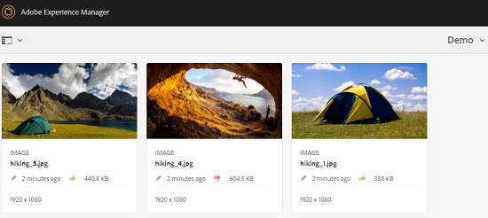

# 폴더 및 컬렉션의 자산 검토 {#review-folder-assets-and-collections}

Adobe Experience Manager Assets를 사용하여 폴더 또는 컬렉션에 있는 자산에 대한 임시 검토 워크플로우를 설정할 수 있습니다. 검토자 또는 크리에이티브 파트너와 공유하여 피드백을 받을 수 있습니다. 검토 워크플로우를 프로젝트에 연결하거나 독립적인 검토 작업을 만들 수 있습니다.

자산을 공유하면 검토자가 이를 승인하거나 거부할 수 있습니다. 알림은 워크플로우의 다양한 단계에서 수신자에게 다양한 작업 완료에 대한 알림을 보냅니다. 예를 들어, 폴더나 컬렉션을 공유할 때 검토자는 검토용으로 폴더/컬렉션이 공유되었다는 알림을 받습니다.

검토자가 검토를 완료한 후(자산을 승인하거나 거부함) 검토 완료 알림을 받게 됩니다.

## 폴더에 대한 검토 작업 만들기 {#creating-a-review-task-for-folders}

1. Assets 사용자 인터페이스에서 검토 작업을 만들 폴더를 선택합니다.
1. From the toolbar, tap/click the **[!UICONTROL Create Review Task]** icon to open the **[!UICONTROL Review Task]** page. If you cannot see the icon in the toolbar, tap/click **[!UICONTROL More]** and then select the icon.

   

1. (선택 사항) **[!UICONTROL 프로젝트]** 목록에서 검토 작업을 연결할 프로젝트를 선택합니다. 기본적으로 **[!UICONTROL 없음]** 옵션이 선택되어 있습니다. 프로젝트를 검토 작업에 연결하지 않으려면 이 선택 항목을 유지합니다.

   >[!NOTE]
   >
   >편집자 수준 권한(또는 이상)이 있는 프로젝트만 **[!UICONTROL 프로젝트]** 목록.

1. 검토 작업의 이름을 입력하고, **[!UICONTROL 할당 대상]** 목록.

   >[!NOTE]
   >
   >선택한 프로젝트의 멤버/그룹은 **[!UICONTROL 할당 대상]** 목록.

1. 검토 작업의 설명, 작업 우선순위 및 기한을 입력합니다.

   

1. 고급 탭에서 URI를 만드는 데 사용할 레이블을 입력합니다.

   

1. Tap/click **[!UICONTROL Submit]**, and then tap/click **[!UICONTROL Done]** to close the confirmation message. A notification for the new task is sent to the approver.
1. 에 로그인합니다. [!DNL Experience Manager Assets] 승인자로 이동하고 자산 UI로 이동합니다. 자산을 승인하려면 **[!UICONTROL 알림 을 참조하십시오]** 아이콘을 클릭한 다음 목록에서 검토 작업을 선택합니다.

   

1. In the **[!UICONTROL Review Task]** page, examine the details of the review task, and then tap/click **[!UICONTROL Review]**.
1. In the **[!UICONTROL Review Task]** page, select assets, and tap/click the **[!UICONTROL Approve/Reject]** icon to approve or reject, as appropriate.

   

1. 을 탭/클릭합니다. **[!UICONTROL 완료]** 아이콘 을 클릭하여 제품에서 사용할 수 있습니다. 대화 상자에서 댓글을 입력하고 탭/클릭합니다  **[!UICONTROL 완료]** 확인합니다.
1. 자산 UI로 이동하고 폴더를 엽니다. 자산에 대한 승인 상태 아이콘은 카드 및 목록 보기 모두에 표시됩니다.

   **카드 보기**

   

   **목록 보기**

   

## 컬렉션에 대한 검토 작업 만들기 {#creating-a-review-task-for-collections}

1. 컬렉션 페이지에서 검토 작업을 생성할 컬렉션을 선택합니다.
1. From the toolbar, tap/click the **[!UICONTROL Create Review Task]** icon to open the **[!UICONTROL Review Task]** page. If you cannot see the icon in the toolbar, tap/click **[!UICONTROL More]** and then select the icon.

   

1. (선택 사항) **[!UICONTROL 프로젝트]** 목록에서 검토 작업을 연결할 프로젝트를 선택합니다. 기본적으로 **[!UICONTROL 없음]** 옵션이 선택되어 있습니다. 프로젝트를 검토 작업에 연결하지 않으려면 이 선택 항목을 유지합니다.

   >[!NOTE]
   >
   >편집자 수준 권한(또는 이상)이 있는 프로젝트만 **[!UICONTROL 프로젝트]** 목록.

1. 검토 작업의 이름을 입력하고, **[!UICONTROL 할당 대상]** 목록.

   >[!NOTE]
   >
   >선택한 프로젝트의 멤버/그룹은 **[!UICONTROL 할당 대상]** 목록.

1. 검토 작업의 설명, 작업 우선순위 및 기한을 입력합니다.

   

1. Tap/click **[!UICONTROL Submit]**, and then tap/click **[!UICONTROL Done]** to close the confirmation message. A notification for the new task is sent to the approver.
1. 에 로그인합니다. [!DNL Experience Manager Assets] 승인자로 이동하고 자산 콘솔로 이동합니다. 자산을 승인하려면 **[!UICONTROL 알림 을 참조하십시오]** 아이콘을 클릭한 다음 목록에서 검토 작업을 선택합니다.
1. In the **[!UICONTROL Review Task]** page, examine the details of the review task, and then tap/click **[!UICONTROL Review]**.
1. 컬렉션의 모든 자산이 검토 페이지에 표시됩니다. 자산을 선택하고 **[!UICONTROL 승인/거부]** 아이콘을 사용하여 자산을 승인하거나 거부할 수 있습니다.

   

1. 을 탭/클릭합니다. **[!UICONTROL 완료]** 아이콘 을 클릭하여 제품에서 사용할 수 있습니다. 대화 상자에서 댓글을 입력하고 탭/클릭합니다 **[!UICONTROL 완료]** 확인합니다.
1. 컬렉션 콘솔로 이동하고 컬렉션을 엽니다. 자산에 대한 승인 상태 아이콘은 카드 및 목록 보기 모두에 표시됩니다.

   **카드 보기**

   

   **목록 보기**

   

**추가 참조**

* [에셋 번역](translate-assets.md)
* [Assets HTTP API](mac-api-assets.md)
* [자산 지원 파일 형식](file-format-support.md)
* [에셋 검색](search-assets.md)
* [연결된 자산](use-assets-across-connected-assets-instances.md)
* [에셋 보고서](asset-reports.md)
* [메타데이터 스키마](metadata-schemas.md)
* [에셋 다운로드](download-assets-from-aem.md)
* [메타데이터 관리](manage-metadata.md)
* [검색 패싯](search-facets.md)
* [컬렉션 관리](manage-collections.md)
* [벌크 메타데이터 가져오기](metadata-import-export.md)
