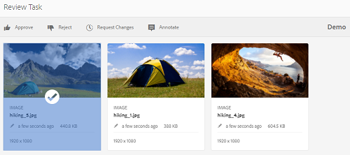

# 폴더 및 컬렉션의 에셋 검토 {#review-folder-assets-and-collections}

| 버전 | 문서 링크 |
| -------- | ---------------------------- |
| AEM 6.5 | [여기 클릭](https://experienceleague.adobe.com/docs/experience-manager-65/assets/using/bulk-approval.html?lang=en) |
| AEM as a Cloud Service | 이 문서 |

Adobe Experience Manager Assets을 사용하여 폴더 또는 컬렉션에 있는 에셋에 대한 임시 검토 워크플로를 설정할 수 있습니다. 검토자 또는 크리에이티브 파트너와 공유하여 피드백을 구할 수 있습니다. 검토 워크플로를 프로젝트와 연결하거나 독립 검토 작업을 만들 수 있습니다.

에셋을 공유하면 검토자가 승인하거나 거부할 수 있습니다. 워크플로의 다양한 단계에서 알림을 전송하여 의도한 수신자에게 다양한 작업의 완료를 알립니다. 예를 들어 폴더 또는 컬렉션을 공유할 때 검토자는 검토를 위해 폴더/컬렉션이 공유되었다는 알림을 수신합니다.

검토자가 검토를 완료한 후(에셋을 승인하거나 거부함) 검토 완료 알림을 받습니다.

## 폴더에 대한 검토 작업 만들기 {#creating-a-review-task-for-folders}

1. Assets 사용자 인터페이스에서 검토 작업을 생성할 폴더를 선택합니다.
1. 도구 모음에서 **[!UICONTROL 리뷰 작업 만들기]** 아이콘을 클릭하여 엽니다. **[!UICONTROL 작업 검토]** 페이지를 가리키도록 업데이트하는 중입니다. 도구 모음에 아이콘이 표시되지 않으면 **[!UICONTROL 자세히]** 그런 다음 아이콘을 선택합니다.

   

1. (선택 사항) **[!UICONTROL 프로젝트]** 목록에서 검토 작업과 연결할 프로젝트를 선택합니다. 기본적으로 **[!UICONTROL 없음]** 옵션이 선택되어 있습니다. 프로젝트를 검토 작업과 연결하지 않으려면 이 선택 사항을 유지하십시오.

   >[!NOTE]
   >
   >편집기 수준 권한(또는 이상)이 있는 프로젝트만 **[!UICONTROL 프로젝트]** 목록을 표시합니다.

1. 검토 작업의 이름을 입력하고 승인자에서 승인자를 선택합니다. **[!UICONTROL 할당 대상]** 목록을 표시합니다.

   >[!NOTE]
   >
   >선택한 프로젝트의 멤버/그룹은 다음에서 승인자로 사용할 수 있습니다. **[!UICONTROL 할당 대상]** 목록을 표시합니다.

1. 검토 작업에 대한 설명, 작업 우선 순위 및 기한을 입력합니다.

   

1. 고급 탭에서 URI를 만드는 데 사용할 레이블을 입력합니다.

   

1. 선택 **[!UICONTROL 제출]**&#x200B;을 선택한 다음 을 선택합니다 **[!UICONTROL 완료]** 확인 메시지를 닫습니다. A notification for the new task is sent to the approver.
1. 에 로그인 [!DNL Experience Manager Assets] 승인자로서 자산 UI로 이동합니다. 자산을 승인하려면 **[!UICONTROL 알림]** 아이콘을 클릭한 다음 목록에서 검토 작업을 선택합니다.

   

1. 다음에서 **[!UICONTROL 작업 검토]** 페이지에서 검토 작업의 세부 사항을 조사한 다음 을 선택합니다. **[!UICONTROL 리뷰]**.
1. 다음에서 **[!UICONTROL 작업 검토]** 페이지를 만들고, 자산을 선택하고, **[!UICONTROL 승인/거부]** 아이콘 을 사용하여 승인하거나 거부할 수 있습니다.

   

1. 다음 항목 선택 **[!UICONTROL 완료]** 아이콘을 클릭합니다. 대화 상자에서 댓글을 입력하고 을(를) 선택합니다.  **[!UICONTROL 완료]** 확인할 수 있습니다.
1. 에셋 UI로 이동하여 폴더를 엽니다. 에셋에 대한 승인 상태 아이콘이 카드 보기와 목록 보기에 모두 나타납니다.

   **카드 보기**

   

   **목록 보기**

   

## 컬렉션에 대한 검토 작업 만들기 {#creating-a-review-task-for-collections}

1. 컬렉션 페이지에서 검토 작업을 생성할 컬렉션을 선택합니다.
1. 도구 모음에서 **[!UICONTROL 리뷰 작업 만들기]** 아이콘을 클릭하여 엽니다. **[!UICONTROL 작업 검토]** 페이지를 가리키도록 업데이트하는 중입니다. 도구 모음에 아이콘이 표시되지 않으면 **[!UICONTROL 자세히]** 그런 다음 아이콘을 선택합니다.

   

1. (선택 사항) **[!UICONTROL 프로젝트]** 목록에서 검토 작업과 연결할 프로젝트를 선택합니다. 기본적으로 **[!UICONTROL 없음]** 옵션이 선택되어 있습니다. 프로젝트를 검토 작업과 연결하지 않으려면 이 선택 사항을 유지하십시오.

   >[!NOTE]
   >
   >편집기 수준 권한(또는 이상)이 있는 프로젝트만 **[!UICONTROL 프로젝트]** 목록을 표시합니다.

1. 검토 작업의 이름을 입력하고 승인자에서 승인자를 선택합니다. **[!UICONTROL 할당 대상]** 목록을 표시합니다.

   >[!NOTE]
   >
   >선택한 프로젝트의 멤버/그룹은 다음에서 승인자로 사용할 수 있습니다. **[!UICONTROL 할당 대상]** 목록을 표시합니다.

1. 검토 작업에 대한 설명, 작업 우선 순위 및 기한을 입력합니다.

   

1. 선택 **[!UICONTROL 제출]**&#x200B;을 선택한 다음 을 선택합니다 **[!UICONTROL 완료]** 확인 메시지를 닫습니다. A notification for the new task is sent to the approver.
1. 에 로그인 [!DNL Experience Manager Assets] 승인자로서 자산 콘솔로 이동합니다. 자산을 승인하려면 **[!UICONTROL 알림]** 아이콘을 클릭한 다음 목록에서 검토 작업을 선택합니다.
1. 다음에서 **[!UICONTROL 작업 검토]** 페이지에서 검토 작업의 세부 사항을 조사한 다음 을 선택합니다. **[!UICONTROL 리뷰]**.
1. 컬렉션의 모든 자산이 검토 페이지에 표시됩니다. 에셋을 선택하고 **[!UICONTROL 승인/거부]** 아이콘을 클릭하여 자산을 승인하거나 거부합니다.

   

1. 다음 항목 선택 **[!UICONTROL 완료]** 아이콘을 클릭합니다. 대화 상자에서 댓글을 입력하고 을(를) 선택합니다. **[!UICONTROL 완료]** 확인할 수 있습니다.
1. 컬렉션 콘솔로 이동하고 컬렉션을 엽니다. 에셋에 대한 승인 상태 아이콘이 카드 보기와 목록 보기에 모두 나타납니다.

   **카드 보기**

   

   **목록 보기**

   

**추가 참조**

* [자산 번역](translate-assets.md)
* [Assets HTTP API](mac-api-assets.md)
* [자산이 지원되는 파일 형식](file-format-support.md)
* [자산 검색](search-assets.md)
* [연결된 자산](use-assets-across-connected-assets-instances.md)
* [자산 보고서](asset-reports.md)
* [메타데이터 스키마](metadata-schemas.md)
* [자산 다운로드](download-assets-from-aem.md)
* [메타데이터 관리](manage-metadata.md)
* [검색 패싯](search-facets.md)
* [컬렉션 관리](manage-collections.md)
* [일괄 메타데이터 가져오기](metadata-import-export.md)
* [AEM 및 Dynamic Media에 자산 게시](/help/assets/publish-assets-to-aem-and-dm.md)
