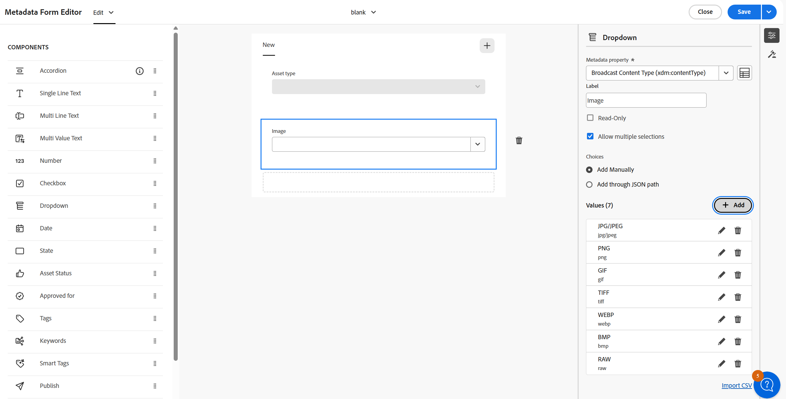
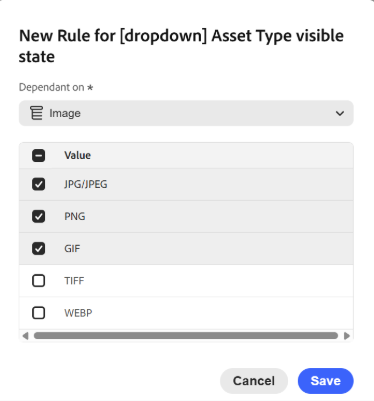

# 계단식 메타데이터 Assets 보기{#cascading-metadata-assets-view}

에셋의 메타데이터 정보를 캡처할 때, 사용자는 다양한 이용 가능한 필드들의 정보를 제공한다. 특정 메타데이터 필드나 다른 필드에서 선택한 옵션에 따라 달라지는 필드 값을 표시할 수 있습니다. 이러한 메타데이터의 조건부 표시를 계단식 메타데이터라고 합니다. 즉, 특정 메타데이터 필드/값과 하나 이상의 필드 및/또는 해당 값 사이에 종속성을 만들 수 있습니다.

메타데이터 Forms을 사용하여 계단식 메타데이터를 표시하는 규칙을 정의합니다. 예를 들어 메타데이터 양식에 에셋 유형 필드가 포함된 경우 사용자가 선택하는 에셋 유형에 따라 표시할 관련 필드 세트를 정의할 수 있습니다.

다음은 계단식 메타데이터를 정의할 수 있는 몇 가지 사용 사례입니다.

* 사용자 위치가 필요한 경우 사용자의 국가 및 주 선택에 따라 관련 도시 이름을 표시합니다.
* 사용자가 선택한 제품 범주에 따라 목록에 관련 브랜드 이름을 로드합니다.
* 다른 필드에 지정된 값을 기준으로 특정 필드의 가시성을 전환합니다. 예를 들어 사용자가 다른 주소로 배송을 배송하려는 경우 별도의 배송 주소 필드를 표시합니다.
* 다른 필드에 지정된 값을 기준으로 필드를 필수 항목으로 지정합니다.
* 다른 필드에 지정된 값을 기준으로 특정 필드에 표시되는 옵션을 변경합니다.
* 다른 필드에 지정된 값을 기반으로 특정 필드의 기본 메타데이터 값을 설정합니다.

>[!IMPORTANT]
>
>계단식 메타데이터 기능은 제한된 가용성 기능으로 사용할 수 있습니다. 기능을 배포에 사용할 수 있도록 [Adobe 고객 지원 사례를 만들고 제출](https://helpx.adobe.com/kr/enterprise/using/support-for-experience-cloud.html)할 수 있습니다.

## [!DNL Experience Manager]에서 계단식 메타데이터 구성 {#configure-cascading-metadata-in-aem}

선택한 에셋 유형에 따라 계단식 메타데이터를 표시할 시나리오를 생각해 보십시오. 예-

* 비디오의 경우 형식, 코덱, 지속 시간 등과 같은 적용 가능한 필드를 표시합니다.
* Word 또는 PDF 문서의 경우 페이지 수, 작성자 등과 같은 필드를 표시합니다.

이미지 유형에 따라 파일을 분류하는 예로 이름이 `Image`인 드롭다운 필드를 사용하고 있습니다. 드롭다운에는 지원되는 이미지 확장 기능(예: JPG/JPEG, GIF 등)을 나타내는 옵션이 포함되어 있습니다. 데이터 일관성을 보장하고 지원되지 않는 형식이 선택 또는 처리되지 않도록 이 필드에 유효성 검사 규칙이 적용됩니다. 규칙은 선택한 드롭다운 값을 평가하고 허용된 이미지 형식에 맞는 제약 조건을 적용합니다.

>[!IMPORTANT]
>
>드롭다운 필드만 기반으로 규칙을 만들 수 있습니다.

선택한 에셋 유형에 관계없이 저작권 정보를 필수 필드로 표시합니다. [미리 정의된 메타데이터 구성 요소](metadata-assets-view.md#property-components) 및 [폴더에 메타데이터 할당](metadata-assets-view.md#assign-metadata-form-folder)을 사용할 수 있습니다.

### 메타데이터 Forms 작성 {#build-metadata-schema-forms}

새 메타데이터 양식을 만들려면 아래 단계를 고려하십시오.

1. [!DNL Experience Manager] 로고를 선택하고 **[!UICONTROL 설정]** > **[!UICONTROL 메타데이터 Forms]** > **[!UICONTROL 만들기]**(으)로 이동합니다.

1. **[!UICONTROL Type]** 드롭다운에서 적절한 형식 유형(**[!UICONTROL File]**, **[!UICONTROL Folder]** 또는 **[!UICONTROL Collection]**)을 선택합니다.

1. **[!UICONTROL 이름]** 필드에 메타데이터 양식의 제목을 지정합니다.

1. 또는 **[!UICONTROL 기존 양식 템플릿에서 선택]** 드롭다운에서 기존 메타데이터 양식 템플릿을 선택합니다.

1. 빈 메타데이터 양식이 나타납니다. 새 탭을 추가합니다.

   

   * **A:** [!UICONTROL 편집] 또는 [!UICONTROL 미리 보기] 간 전환
   * **B:** [메타데이터 양식의 구성 요소](metadata-assets-view.md#property-components)
   * **C:** 다른 메타데이터 양식으로 전환
   * **일:** 새 탭 추가
   * **E:** 캔버스
   * 선택한 구성 요소에 대한 **F:** 일반 설정
   * **G:** 규칙 탭
   * **시간:** 구성 요소 속성

[메타데이터 Forms 설정](https://video.tv.adobe.com/v/341275)의 단계를 보려면 이 비디오를 시청하십시오.

### 기존 메타데이터 양식 수정 {#modify-existing-metadata-form}

기존 메타데이터 양식을 수정하려면 아래 단계를 수행합니다.

1. 기존 메타데이터 양식을 열고 양식에 추가할 [사전 정의된 구성 요소](metadata-assets-view.md#property-components)로 이동한 후 캔버스에 요소를 놓습니다.

   **이미지** 사용 사례에 따라 드롭다운 필드를 추가하여 이미지 에셋 유형을 정의합니다. **설정**&#x200B;에서 이름 및 속성 경로를 지정하고 선택적으로 필드를 **[!UICONTROL 읽기 전용]** 또는 **[!UICONTROL 다중 선택]**&#x200B;으로 구성하십시오.

1. 드롭다운에 대한 키-값 옵션을 수동으로 입력하거나 JSON 경로를 지정하거나 CSV 파일을 가져와서 제공합니다.

   * 값을 수동으로 지정하려면 **[!UICONTROL 선택 항목]**&#x200B;에서 **[!UICONTROL 수동으로 추가]**&#x200B;를 선택하고 `Add`을(를) 클릭한 다음 옵션 레이블과 값을 지정하십시오. 예를 들어 비디오, PDF 및 이미지 자산 유형을 지정합니다.

     

   * JSON 경로에서 값을 가져오려면 **[!UICONTROL JSON 경로를 통해 추가]**&#x200B;를 선택하고 JSON 파일의 경로를 지정하십시오.

     >[!NOTE]
     >
     >모든 DAM 편집기 및 작성자가 액세스할 수 있는 공유 위치에 JSON 파일을 저장해야 합니다.

     

   * CSV에서 동적으로 값을 가져오려면 **[!UICONTROL CSV 가져오기]**&#x200B;를 클릭하고 CSV 파일의 경로를 제공하십시오. [!DNL Experience Manager]은(는) 양식이 사용자에게 표시될 때 실시간으로 키-값 쌍을 가져옵니다.

     

   >[!NOTE]
   > 
   >두 옵션이 함께 사용할 수 없으므로 CSV 파일에서 옵션을 가져와 수동으로 편집할 수 없습니다.

1. 이미지 필드와 다른 필드 사이에 종속성을 만들려면 종속 필드를 선택하고 **[!UICONTROL 규칙]** 탭을 엽니다. 각 구성 요소는 특정 규칙 세트를 지원합니다. 이 사용 사례에서는 이미지 자산 유형 옵션을 사용하여 규칙 논리를 정의합니다.

   <!---->

   <!---->

1. **[!UICONTROL 필수]**&#x200B;에서 **[!UICONTROL 새 규칙을 기반으로 하는 필수]** 옵션을 선택하십시오. 새 규칙을 추가하려면 을 클릭하세요.

   

   현재 사용 사례에서 이미지 자산 형식이 JPG/JPEG, PNG, GIF, TIFF 또는 WEBP인 경우 자산 유형 필드가 필요합니다. 또한 을 클릭하여 규칙을 다시 정의하거나 을 클릭하여 정의된 규칙을 삭제합니다.

   

1. **[!UICONTROL 가시성]**&#x200B;에서 **[!UICONTROL 새 규칙에 따라 표시]** 옵션을 선택합니다. 새 규칙을 추가하려면 을 클릭하세요.

   >[!NOTE]
   >
   >**[!UICONTROL Requirement]** 조건과 **[!UICONTROL Visibility]** 조건을 서로 독립적으로 적용할 수 있습니다.

   

   현재 사용 사례에서 이미지 에셋 형식이 JPG/JPEG, PNG 또는 GIF인 경우 에셋 유형 필드가 표시됩니다. 또한 을 클릭하여 규칙을 다시 정의하거나 을 클릭하여 정의된 규칙을 삭제합니다.

   

1. **[!UICONTROL 규칙을 기반으로 한 선택 항목]**&#x200B;을 선택하여 종속성을 만들고 규칙을 정의합니다. 새 규칙을 추가하려면 을 클릭하세요.

   

   에셋 유형 드롭다운에 대한 규칙 기반 선택 사항을 구성하려면 규칙을 만들고 이미지 를 종속 필드로 설정합니다. 그런 다음 JPG/JPEG, PNG, GIF 및 TIFF에 대한 이미지 를 선택하고 WEBP에 대한 비디오 를 선택하여 각 이미지 형식에 대해 원하는 값만 선택하여 관련 옵션을 동적으로 표시하도록 하여 각 이미지 형식의 표시 값을 정의합니다. 또한 을 클릭하여 규칙을 다시 정의하거나 을 클릭하여 정의된 규칙을 삭제합니다.

   

1. 마찬가지로, [!UICONTROL 자산 유형] 필드의 PDF 및 Word와 같은 다른 자산과 [!UICONTROL 페이지 수] 및 [!UICONTROL 작성자]와 같은 필드 간에 종속성을 만드는 단계를 반복합니다.

1. **[!UICONTROL 저장]**&#x200B;을 클릭합니다. 폴더에 메타데이터 양식을 적용합니다.

1. 메타데이터 양식을 적용한 폴더로 이동하고 에셋의 속성 페이지를 엽니다. 에셋 유형 필드에서 선택한 사항에 따라 관련 계단식 메타데이터 필드가 표시됩니다.

   

>[!NOTE]
> 
>Assets 보기 계정의 연속 메타데이터에 일찍 액세스하려면 [Adobe 고객 지원 사례를 만들어 제출](https://helpx.adobe.com/kr/enterprise/using/support-for-experience-cloud.html)하십시오.

## 다음 단계 {#next-steps}

* [Assets 보기에서 메타데이터 양식을 관리하려면 비디오를 시청하십시오](https://experienceleague.adobe.com/docs/experience-manager-learn/assets-essentials/configuring/metadata-forms.html)

* Assets 보기 사용자 인터페이스에서 사용 가능한 [!UICONTROL 피드백] 옵션을 사용하여 제품 피드백 제공

* 오른쪽 사이드바에서 사용 가능한 [!UICONTROL 이 페이지 편집], , [!UICONTROL 문제 기록] 또는 을 사용하여 설명서 피드백 제공

* [고객 지원 센터](https://experienceleague.adobe.com/?support-solution=General#support) 문의

