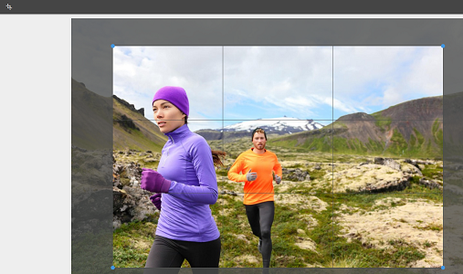

# 자산 {#check-in-and-check-out-files-in-assets}의 체크 인 및 체크 아웃 파일

Adobe Experience Manager(AEM) 자산을 사용하면 편집할 자산을 확인하고 변경을 완료한 후 다시 체크 인할 수 있습니다. 자산을 체크 아웃한 후, 자신만 자산을 편집, 주석 달기, 게시, 이동 또는 삭제할 수 있습니다. 자산을 체크 아웃하면 자산이 잠깁니다. 자산을 다시 AEM Assets으로 체크 인할 때까지 다른 사용자는 자산에 대해 이러한 작업을 수행할 수 없습니다. 하지만 잠긴 자산에 대한 메타데이터를 변경할 수는 있습니다.

자산을 체크 아웃/체크 인하려면 자산에 대해 쓰기 액세스 권한이 필요합니다.

이 기능은 여러 사용자가 팀 간의 편집 워크플로우에 대해 공동으로 작업하는 작성자가 변경한 내용을 다른 사용자가 덮어쓰는 것을 방지할 수 있도록 도와줍니다.

## 자산 체크 아웃 {#checking-out-assets}

1. 자산 UI에서 체크 아웃할 자산을 선택합니다. 여러 자산을 선택하여 체크 아웃할 수도 있습니다.

   

1. 도구 모음에서 **[!UICONTROL 체크아웃]** 아이콘을 클릭/탭합니다.

   

   **[!UICONTROL 체크아웃]** 아이콘이 잠금이 열려 있는 **[!UICONTROL 체크 인]** 아이콘으로 전환됨을 확인합니다.

   

   체크 아웃한 자산을 다른 사용자가 편집할 수 있는지 확인하려면 다른 사용자로 로그인합니다. 체크 아웃한 자산의 축소판에 잠금 아이콘이 나타납니다.

   

   자산을 선택합니다. 도구 모음에는 자산을 편집, 주석, 게시 또는 삭제할 수 있는 옵션이 표시되지 않습니다.

   

   그러나 **[!UICONTROL 속성 보기]** 아이콘을 클릭/탭하여 잠긴 자산에 대한 메타데이터를 편집할 수 있습니다.

1. 편집 아이콘을 클릭/탭하여 자산을 편집 모드로 엽니다.

   

1. 자산을 편집하고 변경 내용을 저장합니다. 예를 들어 이미지를 자르고 저장합니다.

   

   자산에 주석을 달거나 게시하도록 선택할 수도 있습니다.

1. 자산 UI에서 편집된 자산을 선택하고 도구 모음에서 **[!UICONTROL 체크 인]** 아이콘을 클릭/탭합니다.

   

   수정된 자산은 AEM Assets에 체크 인되며 다른 사용자가 편집할 수 있습니다.

## 강제 체크 인 {#forced-check-in}

관리자는 다른 사용자가 체크 아웃한 자산을 체크 인할 수 있습니다.

1. 관리자로 AEM Assets에 로그인합니다.
1. 자산 UI에서 다른 사용자가 체크 아웃한 하나 이상의 자산을 선택합니다.

   

1. 도구 모음에서 **[!UICONTROL 잠금 해제]** 아이콘을 클릭/탭합니다. 자산이 다시 체크 인되고 다른 사용자가 편집할 수 있습니다.

   