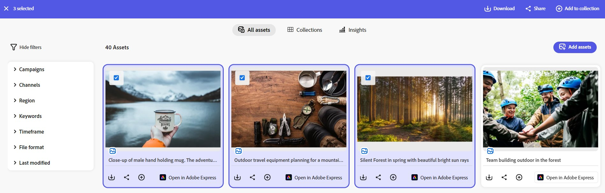

# 에서 컬렉션 관리 [!DNL Content Hub] {#manage-collections}

<!--  -->

컬렉션은 사용자 간에 공유할 수 있는 자산 집합을 나타냅니다. 컬렉션에는 참조 무결성을 유지하면서 다른 위치의 에셋이 포함될 수 있습니다.

[!DNL Content Hub] 공용 컬렉션을 만들 수 있습니다. 이러한 컬렉션은 권한이 있는 모든 사용자가 액세스할 수 있으며 여러 사용자가 효율적으로 콘텐츠에 액세스하고 사용할 수 있는 공유 공간을 만듭니다. 컬렉션은 효율성과 편의성을 높이기 위해 리소스의 공동 사용을 촉진합니다. 컬렉션 찾아보기 페이지에서 다음을 수행할 수 있습니다.

* **만들기**: 하나 이상의 컬렉션을 만듭니다.
* **보기**: 에셋 및 해당 속성을 봅니다.
* **공유**: 다른 사용자와 링크로 자산을 공유합니다.
* **다운로드**: 에셋을 다운로드합니다.
* **제거**: 컬렉션에서 특정 에셋을 제거합니다.
* **삭제**: 전체 컬렉션을 삭제합니다.

사용자가 내에서 사용할 수 있는 다양한 에셋에 쉽게 액세스하고 관리할 수 있도록 지원합니다 [!DNL Content Hub].

## 컬렉션 만들기{#create-collections}

다음을 선택할 수 있습니다. [새 컬렉션 만들기](#create-new-collection) 또는 [기존 컬렉션에 에셋 추가](#add-assets-to-existing-collection).

### 새로운 컬렉션 만들기{#create-new-collection}

컬렉션에 추가해야 하는 에셋을 선택하고 **[!UICONTROL 컬렉션에 추가]**.

새 컬렉션을 만들려면 다음 위치로 이동합니다. **[!UICONTROL 컬렉션]** tab 키를 누른 다음 클릭 **[!UICONTROL 새 컬렉션 만들기]**. 다음을 입력합니다. **[!UICONTROL 제목]** 및 옵션 제공 **[!UICONTROL 설명]** 에셋용. **[!UICONTROL 만들기]**&#x200B;를 클릭합니다.

### 기존 컬렉션에 에셋 추가{#add-assets-to-existing-collection}

기존 컬렉션에 에셋을 추가하려면 컬렉션에 추가해야 하는 에셋을 선택합니다. 클릭 **[!UICONTROL 컬렉션에 추가]**. 컬렉션을 선택하라는 메시지가 표시됩니다.

자산을 추가해야 하는 컬렉션을 선택하십시오. 검색 창을 사용하여 기존 컬렉션을 검색할 수도 있습니다.  자산을 추가해야 하는 컬렉션을 선택하고 을(를) 클릭합니다. **[!UICONTROL 컬렉션에 추가]**.

## 컬렉션 보기{#view-collections}

다음 위치로 이동 **[!UICONTROL 컬렉션]** 을 탭하고 컬렉션 이름을 검색합니다. 컬렉션에서 사용할 수 있는 에셋 목록을 보려면 컬렉션 이름을 클릭합니다. 컬렉션 내에 필터를 적용하여 에셋 결과의 범위를 좁힐 수도 있습니다.

컬렉션 내에서 보아야 하는 에셋을 클릭합니다. [!DNL Content Hub] 에셋에 대한 세부 보기를 표시합니다. [자산 세부 사항 보기](asset-properties-content-hub.md).

<!--

* **A**: Details and metadata of the asset 
* **B**: Zoom In or Zoom Out the asset 
* **C**: Reset Zoom view 
* **D**: View the previous or next asset 
* **E**: Download the asset 
* **F**: Open the asset in Adobe Express 
* **G**: Hide the metadata of the asset 
* **H**: Share the asset as a link 
-->

## 컬렉션 내에서 사용할 수 있는 에셋 다운로드{#download-assets-within-collection}

컬렉션 내에서 사용할 수 있는 에셋을 다운로드하려면 **[!UICONTROL 컬렉션]** 탭.\
클릭  아이콘을 클릭하여 컬렉션 카드에 추가합니다.

컬렉션의 모든 에셋이 다운로드됩니다.

컬렉션을 열어 자산을 개별적으로 다운로드할 수도 있습니다. 다운로드해야 하는 자산이 포함된 컬렉션을 클릭합니다. 에셋을 선택하고 **[!UICONTROL 다운로드]**.

방법 알아보기 [에서 에셋 다운로드 [!DNL Content Hub]](download-assets-content-hub.md).

## 컬렉션 내에서 사용 가능한 자산 공유 {#share-assets-available-within-collection}

컬렉션 내에서 사용할 수 있는 에셋을 공유할 수도 있습니다. 다음 위치로 이동 **[!UICONTROL 컬렉션]** 탭. 다음 항목 선택  아이콘을 클릭하여 컬렉션 카드에 추가합니다. 공유 링크가 복사됩니다. 복사한 링크를 수신자와 공유할 수 있습니다. 자세히 알아보기 [에서 에셋 공유 [!DNL Content Hub]](share-assets-content-hub.md).

## 컬렉션 세부 정보 편집 {#edit-details-of-collection}

편집하려면 **[!UICONTROL 제목]** 및 **[!UICONTROL 설명]** 컬렉션의 컬렉션 이름을 클릭한 다음  아이콘. [!UICONTROL 컬렉션 세부 사항] 을(를) 편집할 수 있는 화면이 나타납니다 **[!UICONTROL 제목]** 및 **[!UICONTROL 설명]** 컬렉션. 클릭 **[!UICONTROL 변경 내용 저장]** 을 클릭하여 수정 사항을 확인합니다.

## 컬렉션에서 자산 제거{#remove-assets-from-a-collection}

컬렉션에서 하나 또는 여러 에셋을 제거할 수 있습니다. 컬렉션에서 에셋을 제거하려면 에셋을 제거해야 하는 컬렉션을 클릭하고 에셋을 선택한 다음 를 클릭합니다 **[!UICONTROL 컬렉션에서 제거]**.

에셋 제거를 확인하는 메시지가 표시됩니다. **[!UICONTROL 제거]**&#x200B;를 클릭합니다.\
선택한 자산이 컬렉션에서 성공적으로 제거되었습니다.

## 컬렉션 삭제{#delete-collection}

컬렉션을 삭제하려면 **[!UICONTROL 컬렉션]** 을(를) 탭하고 삭제해야 하는 컬렉션을 클릭합니다. 클릭  아이콘을 클릭하여 컬렉션을 삭제합니다.
