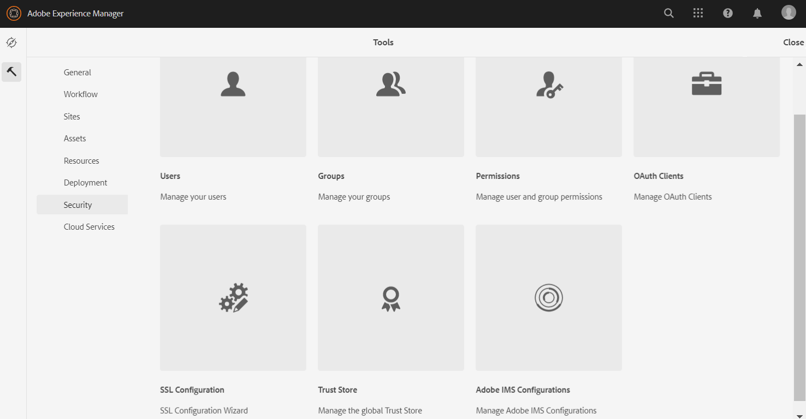

# Brand Portal로 AEM Assets 구성 {#configure-aem-assets-with-brand-portal}

AEM(Adobe Experience Manager) Assets는 Brand Portal 테넌트의 인증을 위한 IMS 토큰을 조달하는 Adobe 개발자 콘솔을 통해 Brand Portal로 구성됩니다.

**구성 작동 방식**

브랜드 포털 임차인(조직)으로 AEM Assets 클라우드 인스턴스를 구성하려면 Adobe 개발자 콘솔뿐만 아니라 AEM Assets 클라우드 인스턴스에 구성이 필요합니다.

1. AEM Assets 클라우드 인스턴스에서 IMS 계정을 만들고 공개 인증서(공개 키)를 생성합니다.
1. Adobe 개발자 콘솔에서 Brand Portal 테넌트(조직)에 대한 프로젝트를 만듭니다.
1. 프로젝트에서 공개 키로 API를 구성하여 서비스 계정(JWT) 연결을 만듭니다.
1. 서비스 계정 자격 증명과 JWT 페이로드 정보를 가져옵니다.
1. AEM Assets 클라우드 인스턴스에서 서비스 계정 자격 증명과 JWT 페이로드를 사용하여 IMS 계정을 구성합니다.
1. AEM Assets 클라우드 인스턴스에서 IMS 계정 및 브랜드 포털 끝점(조직 URL)을 사용하여 브랜드 포털 클라우드 서비스를 구성합니다.
1. AEM Assets 클라우드 인스턴스의 자산을 브랜드 포털에 게시하여 구성을 테스트합니다.

>[!NOTE]
>
>브랜드 포털 테넌트는 하나의 AEM Assets 클라우드 인스턴스로 구성되어야 합니다.
>
>여러 AEM Assets 클라우드 인스턴스로 브랜드 포털 테넌트를 구성하지 마십시오.

## 전제 조건 {#prerequisites}

Brand Portal을 사용하여 AEM Assets를 구성하려면 다음 항목이 필요합니다.

* 실행 중인 AEM Assets 클라우드 인스턴스
* Brand Portal 테넌트 URL
* Brand Portal 테넌트의 IMS 조직에 대한 시스템 관리자 권한이 있는 사용자

**자세한 내용은 고객 지원** 센터에 문의하십시오.

## 구성 만들기 {#create-new-configuration}

브랜드 포털에서 AEM Assets 클라우드 인스턴스를 구성하려면 지정된 시퀀스에서 다음 단계를 수행하십시오.

1. [공개 인증서 받기](#public-certificate)
1. [서비스 계정(JWT) 연결 만들기](#createnewintegration)
1. [IMS 계정 구성](#create-ims-account-configuration)
1. [클라우드 서비스 구성](#configure-the-cloud-service)
1. [구성 테스트](#test-configuration)

### IMS 구성 만들기 {#create-ims-configuration}

IMS 구성은 AEM Assets 클라우드 인스턴스로 브랜드 포털 테넌트를 인증합니다.

IMS 구성에는 두 단계가 포함됩니다.

* [공개 인증서 받기](#public-certificate)
* [IMS 계정 구성](#create-ims-account-configuration)

### 공개 인증서 받기 {#public-certificate}

공개 인증서를 사용하면 Adobe 개발자 콘솔에서 프로필을 인증할 수 있습니다.

1. AEM Assets 클라우드 인스턴스에 로그인합니다.

1. **도구**  패널에서 **[!UICONTROL 보안]** > **[!UICONTROL Adobe IMS 구성]**&#x200B;으로 이동합니다.

   

1. Adobe IMS 구성 페이지에서 **[!UICONTROL 만들기]**&#x200B;를 클릭합니다.

1. **[!UICONTROL Adobe IMS 기술 계정 구성]** 페이지로 리디렉션됩니다. 기본적으로 **인증서** 탭이 열립니다.

   클라우드 솔루션 **[!UICONTROL Adobe Brand Portal]**&#x200B;을 선택합니다.

1. Mark the check box **[!UICONTROL Create new certificate]** and specify an **alias** for the certificate. 별칭은 대화 상자의 이름으로 사용됩니다.

1. **[!UICONTROL 인증서 만들기]**&#x200B;를 클릭합니다. 그런 다음 대화 상자에서 **[!UICONTROL 확인]**&#x200B;을 클릭하여 공개 인증서를 생성합니다.

   

1. **[!UICONTROL 공개 키 다운로드]**&#x200B;를 클릭하고 인증서(.crt) 파일을 컴퓨터에 저장합니다.

   인증서 파일은 Brand Portal 테넌트에 대한 API를 구성하고 Adobe 개발자 콘솔에서 서비스 계정 자격 증명을 생성하는 추가 단계에 사용됩니다.

   

1. **[!UICONTROL 다음]**&#x200B;을 클릭합니다.

   **계정** 탭에서 Adobe IMS 계정을 만들지만, 이를 위해서는 Adobe 개발자 콘솔에 생성된 서비스 계정 자격 증명이 필요합니다. 우선은 이 페이지를 열어 두십시오.

   새 탭을 열고 [Adobe 개발자 콘솔에 서비스 계정(JWT) 연결을 만들어](#createnewintegration) IMS 계정을 구성하기 위한 자격 증명과 JWT 페이로드를 가져옵니다.

### 서비스 계정(JWT) 연결 만들기 {#createnewintegration}

Adobe 개발자 콘솔에서 프로젝트 및 API는 조직(Brand Portal 테넌트) 수준에서 구성됩니다. API를 구성하면 Adobe 개발자 콘솔에 서비스 계정(JWT) 연결이 만들어집니다. 키 쌍(개인 및 공개 키)을 생성하거나 공개 키를 업로드하여 API를 구성하는 두 가지 방법이 있습니다. 브랜드 포털에서 AEM Assets 클라우드 인스턴스를 구성하려면 AEM Assets 클라우드 인스턴스에서 공개 인증서(공개 키)를 생성하고 공개 키를 업로드하여 Adobe 개발자 콘솔에서 자격 증명을 만들어야 합니다. 이 공개 키는 선택한 Brand Portal 조직에 대한 API를 구성하는 데 사용되며, 서비스 계정에 대한 자격 증명과 JWT 페이로드를 생성합니다. 이러한 자격 증명은 AEM Assets 클라우드 인스턴스에서 IMS 계정을 구성하는 데 추가로 사용됩니다. IMS 계정이 구성되면 AEM Assets 클라우드 인스턴스에서 브랜드 포털 클라우드 서비스를 구성할 수 있습니다.

서비스 계정 자격 증명과 JWT 페이로드를 생성하려면 다음 단계를 수행합니다.

1. IMS 조직(Brand Portal 테넌트)에 대한 시스템 관리자 권한으로 Adobe 개발자 콘솔에 로그인합니다. 기본 URL은

   [https://www.adobe.com/go/devs_console_ui](https://www.adobe.com/go/devs_console_ui)입니다.

   >[!NOTE]
   >
   >오른쪽 위 모서리에 있는 드롭다운(조직 목록)에서 올바른 IMS 조직(Brand Portal 테넌트)을 선택했는지 확인합니다.

1. **[!UICONTROL 새 프로젝트 만들기]**&#x200B;를 클릭합니다. 조직에 대해 빈 프로젝트가 만들어집니다.

   **[!UICONTROL 프로젝트 편집]**&#x200B;을 클릭하여 **[!UICONTROL 프로젝트 제목]** 및 **[!UICONTROL 설명]**&#x200B;을 업데이트하고 **[!UICONTROL 저장]**&#x200B;을 클릭합니다.

   

1. 프로젝트 개요 탭에서 **[!UICONTROL API 추가]**&#x200B;를 클릭합니다.

   

1. API 추가 창에서 **[!UICONTROL AEM Brand Portal]**&#x200B;을 선택하고 **[!UICONTROL 다음]**&#x200B;을 클릭합니다.

   AEM Brand Portal 서비스에 대한 액세스 권한이 있는지 확인합니다.

1. API 구성 창에서 **[!UICONTROL 공개 키 업로드]**&#x200B;를 클릭합니다. 그런 다음 **[!UICONTROL 파일 선택]**&#x200B;을 클릭하고 [공개 인증서 가져오기](#public-certificate) 섹션에서 다운로드한 공개 인증서(.crt 파일)를 업로드합니다.

   **[!UICONTROL 다음]**&#x200B;을 클릭합니다.

   

1. 공개 인증서를 확인하고 **[!UICONTROL 다음]**&#x200B;을 클릭합니다.

1. 기본 제품 프로필 **[!UICONTROL Assets Brand Portal]**&#x200B;을 선택하고 **[!UICONTROL 구성 저장]**&#x200B;을 클릭합니다.

   <!-- 
   In Brand Portal, a default profile is created for each organization. The Product Profiles are created in admin console for assigning users to groups (based on the roles and permissions). For configuration with Brand Portal, the OAuth token is created at organization level. Therefore, you must configure the default Product Profile for your organization. 
   -->

   

1. API가 구성되면 API 개요로 리디렉션됩니다. **[!UICONTROL 자격 증명]** 아래의 왼쪽 탐색에서 **[!UICONTROL 서비스 계정(JWT)]**&#x200B;을 클릭합니다.

   >[!NOTE]
   >
   >필요에 따라 자격 증명을 보고 기타 작업(JWT 토큰 생성, 자격 증명 세부 사항 복사, 클라이언트 암호 검색 등)을 수행할 수 있습니다.

1. **[!UICONTROL 클라이언트 자격 증명]** 탭에서 **[!UICONTROL 클라이언트 ID]**&#x200B;를 복사합니다.

   **[!UICONTROL 클라이언트 암호 검색]**&#x200B;을 클릭하고 **[!UICONTROL 클라이언트 암호 키]**&#x200B;를 복사합니다.

   

1. **[!UICONTROL JWT 생성]** 탭으로 이동하고 **[!UICONTROL JWT 페이로드]**&#x200B;를 복사합니다.

이제 클라이언트 ID(API 키), 클라이언트 암호 및 JWT 페이로드를 사용하여 AEM Assets 클라우드 인스턴스에서 [IMS 계정을 구성](#create-ims-account-configuration)할 수 있습니다.

<!--
1. Click **[!UICONTROL Create Integration]**.

1. Select **[!UICONTROL Access an API]**, and click **[!UICONTROL Continue]**.

   

1. Create a new integration page opens. 
   
   Select your organization from the drop-down list.

   In **[!UICONTROL Experience Cloud]**, Select **[!UICONTROL AEM Brand Portal]** and click **[!UICONTROL Continue]**. 

   If the Brand Portal option is disabled for you, ensure that you have selected correct organization from the drop-down box above the **[!UICONTROL Adobe Services]** option. If you do not know your organization, contact your administrator.

   

1. Specify a name and description for the integration. Click **[!UICONTROL Select a File from your computer]** and upload the `AEM-Adobe-IMS.crt` file downloaded in the [obtain public certificates](#public-certificate) section.

1. Select the profile of your organization. 

   Or, select the default profile **[!UICONTROL Assets Brand Portal]** and click **[!UICONTROL Create Integration]**. The integration is created.

1. Click **[!UICONTROL Continue to integration details]** to view the integration information. 

   Copy the **[!UICONTROL API Key]** 
   
   Click **[!UICONTROL Retrieve Client Secret]** and copy the Client Secret key.

   

1. Navigate to **[!UICONTROL JWT]** tab, and copy the **[!UICONTROL JWT payload]**.

   The API Key, Client Secret key, and JWT payload information will be used to create IMS account configuration.

-->

### IMS 계정 구성 {#create-ims-account-configuration}

다음 절차를 수행했는지 확인하십시오.

* [공개 인증서 받기](#public-certificate)
* [서비스 계정(JWT) 연결 만들기](#createnewintegration)

다음 단계를 수행하여 [공개 인증서 받기](#public-certificate)에서 만든 IMS 계정을 구성합니다.

1. IMS 구성을 열고 **[!UICONTROL 계정]** 탭으로 이동합니다. You kept the page open while [obtaintaing the public certificate](#public-certificate).

1. IMS 계정에 대한 **[!UICONTROL 제목]**&#x200B;을 지정합니다.

   **[!UICONTROL 인증 서버]**&#x200B;에서 URL [https://ims-na1.adobelogin.com/](https://ims-na1.adobelogin.com/)을 입력하십시오.

   [서비스 계정(JWT) 연결을 만드는](#createnewintegration) 동안 복사한 API 키, 클라이언트 암호 및 JWT 페이로드에 클라이언트 ID를 붙여넣습니다.

   **[!UICONTROL 만들기]**&#x200B;를 클릭합니다.

   IMS 계정이 구성되었습니다.

   

1. Select the IMS account configuration and click **[!UICONTROL Check Health]**.

   대화 상자에서 **[!UICONTROL 확인]**&#x200B;을 클릭합니다. 구성이 성공하면 *토큰이 성공적으로 검색되었습니다.*&#x200B;라는 메시지가 나타납니다.

   

>[!CAUTION]
>
>IMS 구성은 하나만 있어야 합니다. IMS 구성을 여러 개 만들지 마십시오.
>
>IMS 구성이 상태 검사를 통과하는지 확인합니다. 구성이 상태 검사를 통과하지 않으면 구성이 잘못된 것입니다. 이 구성을 삭제하고 유효한 새 구성을 만들어야 합니다.

### 클라우드 서비스 구성 {#configure-the-cloud-service}

브랜드 포털 클라우드 서비스를 구성하려면 다음 단계를 수행하십시오.

1. AEM Assets 클라우드 인스턴스에 로그인합니다.

1. **도구**  패널에서 **[!UICONTROL 클라우드 서비스]** > **[!UICONTROL AEM Brand Portal]**&#x200B;로 이동합니다.

1. Brand Portal 구성 페이지에서 **[!UICONTROL 만들기]**&#x200B;를 클릭합니다.

1. 구성에 대한 **[!UICONTROL 제목]**&#x200B;을 지정합니다.

   [IMS 계정을 구성](#create-ims-account-configuration)하는 동안 만든 IMS 구성을 선택합니다.

   In the **[!UICONTROL Service URL]**, enter your Brand Portal tenant (organization URL).

   

1. **[!UICONTROL 저장 후 닫기]**&#x200B;를 클릭합니다. 클라우드 구성이 만들어집니다. 이제 AEM Assets 클라우드 인스턴스가 Brand Portal 테넌트로 구성되었습니다.

### 구성 테스트 {#test-configuration}

다음 단계를 수행하여 구성을 확인합니다.

1. AEM Assets 클라우드 인스턴스에 로그인합니다.

1. From the **Tools**  panel, navigate to **[!UICONTROL Deployment]** > **[!UICONTROL Distribution]**.

   

1. 배포 페이지에서 브랜드 포털에 `bpdistributionagent0` 게시하기 위해 브랜드 포털 배포 에이전트 **[!UICONTROL 가]**&#x200B;만들어졌음을 확인할 수 있습니다.

   **[!UICONTROL Brand Portal에 게시]**&#x200B;를 클릭합니다.

   

   >[!NOTE]
   >
   >기본적으로 Brand Portal 테넌트에 대해 하나의 분배 에이전트가 만들어집니다.

1. Distribution Agent 페이지에서 **[!UICONTROL 상태]** 탭 아래에 배포 대기열을 볼 수 있습니다.

   분배 에이전트에는 두 개의 큐가 있습니다.
   * **처리 큐**: 를 참조하십시오.

   * **error-queue**: for the assets where distribution has failed.
   >[!NOTE]
   >
   >오류를 검토하고 **오류 큐를 정기적으로 지우는 것이** 좋습니다.

   

1. AEM Assets와 Brand Portal 간의 연결을 확인하려면 **[!UICONTROL 연결 테스트]**&#x200B;를 클릭합니다.

   

   테스트 패키지가 성공적으로 전달되었다는 메시지가 페이지 하단에 나타납니다.

   >[!NOTE]
   >
   >자산 분배(큐에서 실행)가 실패하는 원인이 될 수 있으므로 분배 에이전트를 비활성화하지 마십시오.

AEM Assets 클라우드 인스턴스가 Brand Portal을 사용하여 성공적으로 구성되었으므로 이제 다음 작업을 수행할 수 있습니다.

* [AEM Assets의 자산을 Brand Portal에 게시](publish-to-brand-portal.md)
* [AEM Assets의 폴더를 Brand Portal에 게시](publish-to-brand-portal.md#publish-folders-to-brand-portal)
* [AEM Assets의 컬렉션을 Brand Portal에 게시](publish-to-brand-portal.md#publish-collections-to-brand-portal)

위의 항목 외에도 AEM Assets의 메타데이터 스키마, 이미지 사전 설정, 검색 패싯 및 태그를 Brand Portal 포털에 게시할 수 있습니다.

* [사전 설정, 스키마 및 패싯을 Brand Portal에 게시](https://docs.adobe.com/content/help/ko-KR/experience-manager-brand-portal/using/publish/publish-schema-search-facets-presets.html)
* [태그를 Brand Portal에 게시](https://docs.adobe.com/content/help/ko-KR/experience-manager-brand-portal/using/publish/brand-portal-publish-tags.html)

자세한 내용은 [Brand Portal 설명서](https://docs.adobe.com/content/help/ko-KR/experience-manager-brand-portal/using/home.html)를 참조하십시오.

## 분배 로그 {#distribution-logs}

배포 에이전트가 수행하는 작업에 대한 자세한 내용은 로그를 확인할 수 있습니다.

예를 들어, 구성을 확인하기 위해 AEM Assets에서 브랜드 포털에 자산을 게시했습니다.

1. Follow the steps (from 1 to 4) as shown in the [Test Configuration](#test-configuration) section and navigate to the distribution agent page.

1. **[!UICONTROL 로그]**&#x200B;를 클릭하여 분배 로그를 확인합니다. 여기에서 처리 및 오류 로그를 볼 수 있습니다.

   

분배 에이전트는 다음 로그를 생성합니다.

* 정보: 배포 에이전트를 활성화하는 성공적인 구성을 트리거하는 시스템 생성 로그입니다.
* DSTRQ1(요청 1): 테스트 연결에 대해 트리거합니다.

자산을 게시할 때 다음 요청 및 응답 로그가 생성됩니다.

**분배 에이전트 요청**:
* DSTRQ2(요청 2): 자산 게시 요청이 트리거됩니다.
* DSTRQ3(요청 3): 시스템이 자산이 있는 폴더를 게시하고 브랜드 포털에서 폴더를 복제하는 다른 요청을 트리거합니다.

**분배 에이전트 응답**:
* queue-bpdistributionagent0(DSTRQ2): 자산이 Brand Portal에 게시됩니다.
* queue-bpdistributionagent0(DSTRQ3): 시스템이 Brand Portal에서 자산을 포함하는 폴더를 복제합니다.

위 예에서 추가 요청 및 응답이 트리거됩니다. 자산이 처음으로 게시되었기 때문에 시스템이 브랜드 포털에서 상위 폴더(경로 추가)를 찾을 수 없으므로 자산이 게시된 브랜드 포털에서 동일한 이름의 상위 폴더를 만들기 위한 추가 요청을 트리거합니다.

>[!NOTE]
>
>상위 폴더가 Brand Portal에 없거나(위 예에서), 상위 폴더가 AEM Assets에서 수정된 경우에 추가 요청이 생성됩니다.

<!--

## Additional information {#additional-information}

Go to `/system/console/slingmetrics` for statistics related to the distributed content:

1. **Counter metrics**
   * sling: `mac_sync_request_failure`
   * sling: `mac_sync_request_received`
   * sling: `mac_sync_request_success`

1. **Time metrics**
   * sling: `mac_sync_distribution_duration`
   * sling: `mac_sync_enqueue_package_duration`
   * sling: `mac_sync_setup_request_duration`

-->

<!--
   Comment Type: draft

   <li> </li>
   -->

<!--
   Comment Type: draft

   <li>Step text</li>
   -->
