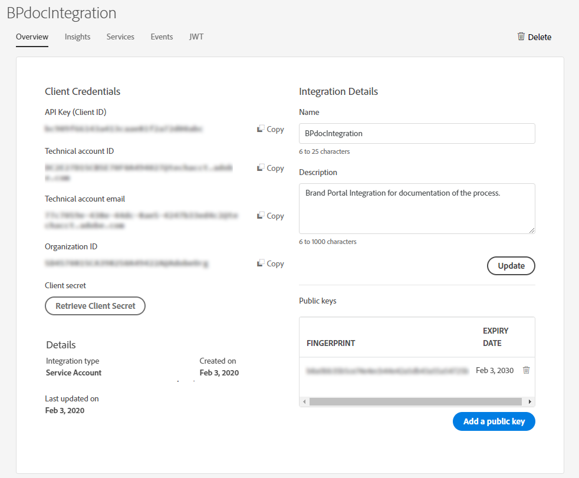

# Brand Portal로 Experience Manager Assets 구성 {#configure-aem-assets-with-brand-portal}

| 버전 | 문서 링크 |
| -------- | ---------------------------- |
| AEM 6.5 | [여기를 클릭하십시오.](https://experienceleague.adobe.com/docs/experience-manager-65/assets/brandportal/configure-aem-assets-with-brand-portal.html?lang=ko) |
| AEM as a Cloud Service | 이 문서 |

Adobe Experience Manager Assets Brand Portal을 구성하면 Adobe Experience Manager Assets에서 승인된 브랜드 자산을 다음으로 게시할 수 있습니다. [!DNL Cloud Service] 인스턴스를 Brand Portal에 배포하고 Brand Portal 사용자에게 배포합니다.

## Cloud Manager를 사용하여 Brand Portal 활성화 {#activate-brand-portal}

Cloud Manager 사용자는 Experience Manager Assets as a용 Brand Portal을 활성화합니다 [!DNL Cloud Service] 인스턴스. 활성화 워크플로우는 백엔드에 필요한 구성(인증 토큰, IMS 구성 및 Brand Portal 클라우드 서비스)을 만들고 Cloud Manager의 Brand Portal 테넌트 상태를 반영합니다. Brand Portal을 활성화하면 Experience Manager Assets 사용자가 에셋을 Brand Portal에 게시하고 Brand Portal 사용자에게 배포할 수 있습니다.

**전제 조건**

Experience Manager Assets as a에서 Brand Portal을 활성화하려면 다음이 필요합니다. [!DNL Cloud Service] 인스턴스:

* 실행 중인 Experience Manager Assets as a [!DNL Cloud Service] 인스턴스.
* Cloud Manager에 대한 액세스 권한이 있고 Cloud Manager 제품의 프로필에 할당된 사용자입니다. 다음을 참조하십시오 [Cloud Manager 액세스](https://experienceleague.adobe.com/docs/experience-manager-cloud-service/security/ims-support.html#accessing-cloud-manager) 추가 정보.

>[!NOTE]
>
>Experience Manager Assets as a에는 구성된 프로덕션 환경이 필요합니다. [!DNL Cloud Service] Brand Portal 테넌트와 연결할 인스턴스입니다.

**Brand Portal 활성화 단계**

Experience Manager Assets as a에 대한 프로덕션 환경을 만드는 동안 Brand Portal을 활성화할 수 있습니다 [!DNL Cloud Service] 예 또는 별도입니다. 환경이 이미 생성되었으며 이제 Brand Portal을 활성화해야 한다고 가정해 보겠습니다.

1. Adobe Cloud Manager에 로그인하여 다음으로 이동 **[!UICONTROL 환경]**.

   다음 **[!UICONTROL 환경]** 페이지에는 모든 기존 환경의 목록이 표시됩니다.

1. 목록에서 환경을 하나씩 선택하여 환경 세부 정보를 확인합니다.

   Brand Portal은 사용 가능한 환경 중 하나에 대한 권한이 있으며 **[!UICONTROL 환경 정보]**.

   Brand Portal과 연관된 환경을 찾으면 **[!UICONTROL Brand Portal 활성화]** 활성화 워크플로를 시작하는 단추입니다.

   

1. 활성화 워크플로우는 백엔드에 필요한 구성을 만들기 때문에 Brand Portal 테넌트를 활성화하는 데 몇 분이 걸립니다. Brand Portal 테넌트가 활성화되면 상태가 활성화됨으로 변경됩니다.

   

>[!NOTE]
>
>Brand Portal은 as a Experience Manager Assets과 동일한 IMS 조직에서 활성화되어야 합니다. [!DNL Cloud Service] 인스턴스.
>
>기존 Brand Portal 클라우드 구성이 있는 경우([Adobe Developer 콘솔을 사용하여 수동으로 구성](#manual-configuration)) IMS 조직(org1-existing) 및 Experience Manager Assets as a [!DNL Cloud Service] 인스턴스가 다른 IMS 조직(org2-new)에 대해 구성되었습니다. Cloud Manager에서 Brand Portal을 활성화하면 Brand Portal IMS 조직이 로 재설정됩니다. `org2-new`. 에 수동으로 구성된 클라우드 구성이지만 `org1-existing` 은 Experience Manager Assets 작성자 인스턴스에 표시되지만 Cloud Manager에서 Brand Portal을 활성화하면 더 이상 사용되지 않습니다.
>
>기존 Brand Portal 클라우드 구성 및 Experience Manager Assets as a [!DNL Cloud Service] 인스턴스가 동일한 IMS 조직(org1)을 사용하고 있습니다. Cloud Manager에서 Brand Portal만 활성화하면 됩니다.
>
>자동 생성된 설정은 수정하지 마십시오.

**추가 참조**:

* [Experience Manager Assets에서 as a Cloud Service으로 사용자 및 역할 추가](https://experienceleague.adobe.com/docs/experience-manager-cloud-manager/using/requirements/setting-up-users-and-roles.html)

* [Cloud Manager에서 환경 관리](https://experienceleague.adobe.com/docs/experience-manager-cloud-service/implementing/using-cloud-manager/manage-environments.html#adding-environments)

**Brand Portal 테넌트에 로그인**:

Cloud Manager에서 Brand Portal 테넌트를 활성화한 후 Admin Console에서 또는 테넌트 URL을 직접 사용하여 Brand Portal에 로그인할 수 있습니다.

Brand Portal 테넌트의 기본 URL은 다음과 같습니다. `https://<tenant-id>.brand-portal.adobe.com/`.

여기서 테넌트 id는 IMS 조직입니다.

Brand Portal URL을 잘 모를 경우 다음 단계를 수행하십시오.

1. 다음으로 로그인 [Admin Console](https://adminconsole.adobe.com/) 다음 위치로 이동 **[!UICONTROL 제품]**.
1. 왼쪽 패널에서 을 선택합니다. **[!UICONTROL ADOBE EXPERIENCE MANAGER BRAND PORTAL - BRAND PORTAL]**.
1. 클릭 **[!UICONTROL Brand Portal으로 이동]** 브라우저에서 Brand Portal을 직접 엽니다.

   또는 다음에서 Brand Portal 테넌트 URL 복사 **[!UICONTROL Brand Portal으로 이동]** 를 연결한 후 브라우저에 붙여넣어 Brand Portal 인터페이스를 엽니다.

   

**연결 테스트**

다음 단계를 수행하여 Experience Manager Assets as a 간 연결을 확인합니다 [!DNL Cloud Service] 인스턴스 및 Brand Portal 테넌트:

1. Experience Manager Assets에 로그인합니다.

1. 다음에서 **도구** 패널, 다음으로 이동 **[!UICONTROL 배포]** > **[!UICONTROL 배포]**.

   

   Brand Portal 배포 에이전트(**[!UICONTROL bpdistributionagent0]**)은 아래에 생성됩니다. **[!UICONTROL Brand Portal에 게시]**.

   

1. 클릭 **[!UICONTROL Brand Portal에 게시]** 배포 에이전트를 엽니다.

   아래에서 분배 큐를 볼 수 있습니다. **[!UICONTROL 상태]** 탭.

   분배 에이전트에는 두 개의 큐가 있습니다.
   * **processing-queue**: Brand Portal에 자산 배포용.

   * **error-queue**: 배포가 실패한 에셋입니다.
   >[!NOTE]
   >
   >실패를 검토하고 다음을 지우는 것이 좋습니다. **error-queue** 정기적으로

   

1. Experience Manager Assets as a 간 연결을 확인하려면 [!DNL Cloud Service] Brand Portal에서 **[!UICONTROL 연결 테스트]** 아이콘.

   

   다음과 같은 메시지가 나타납니다. *테스트 패키지가 정상적으로 전달되었습니다.*.

   >[!NOTE]
   >
   >자산 분배(큐에서 실행)가 실패하는 원인이 될 수 있으므로 분배 에이전트를 비활성화하지 마십시오.

Experience Manager Assets as a 간 연결을 확인하려면 [!DNL Cloud Service] 인스턴스 및 Brand Portal 테넌트는 Experience Manager Assets에서 Brand Portal으로 자산을 게시합니다. 연결에 성공하면 게시된 에셋이 Brand Portal 인터페이스에 표시됩니다.

이제 다음을 수행할 수 있습니다.

* [Experience Manager Assets에서 Brand Portal으로 자산 게시](publish-to-brand-portal.md)
* [Experience Manager Assets에서 Brand Portal으로 폴더 게시](publish-to-brand-portal.md#publish-folders-to-brand-portal)
* [Experience Manager Assets에서 Brand Portal으로 컬렉션 게시](publish-to-brand-portal.md#publish-collections-to-brand-portal)
* [Brand Portal에서 Experience Manager Assets으로 자산 게시](https://experienceleague.adobe.com/docs/experience-manager-brand-portal/using/asset-sourcing-in-brand-portal/brand-portal-asset-sourcing.html) - Brand Portal의 에셋 소싱
* [사전 설정, 스키마 및 패싯을 Brand Portal에 게시](https://experienceleague.adobe.com/docs/experience-manager-brand-portal/using/publish/publish-schema-search-facets-presets.html)
* [태그를 Brand Portal에 게시](https://experienceleague.adobe.com/docs/experience-manager-brand-portal/using/publish/brand-portal-publish-tags.html)

다음을 참조하십시오 [Brand Portal 설명서](https://experienceleague.adobe.com/docs/experience-manager-brand-portal/using/home.html) 추가 정보.

**분배 로그**

자산 게시 워크플로우에 대한 분배 에이전트 로그를 모니터링할 수 있습니다.

이제 Experience Manager Assets에서 Brand Portal으로 자산을 게시하고 로그를 확인합니다.

1. 에 표시된 대로 1~4의 단계를 수행합니다. **연결 테스트** 섹션을 참조하고 분배 에이전트 페이지로 이동합니다.
1. 클릭 **[!UICONTROL 로그]** 처리 및 오류 로그를 확인합니다.

   

분배 에이전트가 다음 로그를 생성했습니다.

* INFO: 분배 에이전트의 성공적인 구성을 트리거하는 시스템 생성 로그입니다.
* DSTRQ1(요청 1): 연결 테스트 시 트리거입니다.

자산을 게시할 때 다음 요청 및 응답 로그가 생성됩니다.

**분배 에이전트 요청**:

* DSTRQ2(요청 2): 자산 게시 요청이 트리거됩니다.
* DSTRQ3(요청 3): 시스템이 다른 요청을 트리거하여 Experience Manager Assets 폴더(자산이 있음)를 게시하고 Brand Portal에서 폴더를 복제합니다.

**분배 에이전트 응답**:

* queue-bpdistributionagent0(DSTRQ2): 자산이 Brand Portal에 게시됩니다.
* queue-bpdistributionagent0(DSTRQ3): 시스템이 Brand Portal의 Experience Manager Assets 폴더(에셋 포함)를 복제합니다.

위의 예에서 추가 요청 및 응답이 트리거됩니다. 자산이 처음으로 게시되었기 때문에 시스템이 Brand Portal에서 상위 폴더(경로 추가)를 찾을 수 없었고, 따라서 자산이 게시된 Brand Portal에서 동일한 이름으로 상위 폴더를 만들라는 추가 요청을 트리거했습니다.

>[!NOTE]
>
>상위 폴더가 Brand Portal에 없거나 Experience Manager Assets에서 수정된 경우 추가 요청이 생성됩니다.

Experience Manager Assets as a에서 Brand Portal을 활성화하는 자동화 워크플로와 함께 [!DNL Cloud Service]로 Experience Manager Assets을 수동으로 구성하는 다른 방법이 있습니다. [!DNL Cloud Service] 더 이상 권장되지 않는 Adobe Developer 콘솔을 사용하는 Brand Portal 사용.

>[!NOTE]
>
>Brand Portal 테넌트를 활성화하는 동안 문제가 발생하는 경우 고객 지원 센터에 문의하십시오.

## Adobe Developer 콘솔을 사용한 수동 구성 {#manual-configuration}

다음 섹션에서는 Experience Manager Assets as a를 수동으로 구성하는 방법을 설명합니다. [!DNL Cloud Service] Adobe Developer 콘솔을 사용하는 Brand Portal 사용.

이전에는 Experience Manager Assets as a [!DNL Cloud Service] Brand Portal 테넌트의 인증을 위해 Adobe IMS(Identity Management Services) 계정 토큰을 조달하는 Adobe Developer 콘솔을 통해 Brand Portal으로 수동으로 구성되었습니다. Experience Manager Assets과 Adobe Developer 콘솔 모두에서 구성이 필요합니다.

1. Experience Manager Assets에서 IMS 계정을 만들고 공개 키(인증서)를 생성합니다.
1. Adobe 개발자 콘솔에서 Brand Portal 테넌트(조직)에 대한 프로젝트를 만듭니다.
1. 프로젝트에서 공개 키를 사용하여 API를 구성하여 서비스 계정 연결을 만듭니다.
1. 서비스 계정 자격 증명과 JSON 웹 토큰(JWT) 페이로드 정보를 가져옵니다.
1. Experience Manager Assets에서 서비스 계정 자격 증명과 JWT 페이로드를 사용하여 IMS 계정을 구성합니다.
1. Experience Manager Assets에서 IMS 계정 및 Brand Portal 끝점(조직 URL)을 사용하여 Brand Portal 클라우드 서비스를 구성합니다.
1. Experience Manager Assets에서 Brand Portal으로 자산을 게시하여 구성을 테스트합니다.

>[!NOTE]
>
>로서의 Experience Manager Assets [!DNL Cloud Service] 인스턴스는 한 개의 Brand Portal 테넌트로만 구성해야 합니다.

**전제 조건**

Brand Portal을 사용하여 Experience Manager Assets을 구성하려면 다음 항목이 필요합니다.

* 실행 중인 Experience Manager Assets as a [!DNL Cloud Service] 인스턴스
* Brand Portal 테넌트 URL
* Brand Portal 임차인의 IMS 조직에 대한 시스템 관리자 권한이 있는 사용자

## 구성 만들기 {#create-new-configuration}

지정된 시퀀스에서 다음 단계를 수행하여 Brand Portal을 사용하여 Experience Manager Assets을 구성합니다.

1. [공개 인증서 받기](#public-certificate)
1. [서비스 계정(JWT) 연결 만들기](#createnewintegration)
1. [IMS 계정 구성](#create-ims-account-configuration)
1. [클라우드 서비스 구성](#configure-the-cloud-service)

### IMS 구성 만들기 {#create-ims-configuration}

IMS 구성은 다음과 같이 Experience Manager Assets을 인증합니다. [!DNL Cloud Service] Brand Portal 테넌트가 있는 인스턴스입니다.

IMS 구성에는 두 단계가 포함됩니다.

* [공개 인증서 받기](#public-certificate)
* [IMS 계정 구성](#create-ims-account-configuration)

### 공개 인증서 받기 {#public-certificate}

공개 키(인증서)는 Adobe Developer 콘솔에서 프로필을 인증합니다.

1. Experience Manager Assets에 로그인합니다.
1. 다음에서 **도구** 패널, 다음으로 이동 **[!UICONTROL 보안]** > **[!UICONTROL Adobe IMS 구성]**.
1. Adobe IMS 구성 페이지에서 **[!UICONTROL 만들기]**&#x200B;를 클릭합니다. 리디렉션 대상: **[!UICONTROL Adobe IMS 기술 계정 구성]** 페이지를 가리키도록 업데이트하는 중입니다. 기본적으로 **인증서** 탭이 열립니다.
1. 선택 **[!UICONTROL Brand Portal Adobe]** 다음에서 **[!UICONTROL 클라우드 솔루션]** 드롭다운 목록입니다.
1. 다음 항목 선택 **[!UICONTROL 새 인증서 만들기]** 확인란을 선택하고 **별칭** 공개 키. 별칭은 공개 키의 이름 역할을 합니다.
1. **[!UICONTROL 인증서 만들기]**&#x200B;를 클릭합니다. 그런 다음 을 클릭합니다. **[!UICONTROL 확인]** 을 클릭하여 공개 키를 생성합니다.

   

1. 다음을 클릭합니다. **[!UICONTROL 공개 키 다운로드]** 을(를) 클릭하고 컴퓨터에 CRT(공개 키) 파일을 저장합니다.

   공개 키는 나중에 Brand Portal 테넌트에 대한 API를 구성하고 Adobe Developer 콘솔에서 서비스 계정 자격 증명을 생성하는 데 사용됩니다.

   

1. **[!UICONTROL 다음]**&#x200B;을 클릭합니다.

   다음에서 **계정** 탭에서 Adobe IMS 계정이 만들어지므로 Adobe Developer 콘솔에서 생성된 서비스 계정 자격 증명이 필요합니다. 우선은 이 페이지를 열어 두십시오.

   새 탭을 열고 [Adobe 개발자 콘솔에 서비스 계정(JWT) 연결을 만들어](#createnewintegration) IMS 계정을 구성하기 위한 자격 증명과 JWT 페이로드를 가져옵니다.

### 서비스 계정(JWT) 연결 만들기 {#createnewintegration}

Adobe Developer 콘솔에서 프로젝트 및 API는 Brand Portal 테넌트(조직) 수준에서 구성됩니다. API를 구성하면 서비스 계정(JWT) 연결이 만들어집니다. 키 쌍(개인 및 공개 키)을 생성하거나 공개 키를 업로드하여 API를 구성하는 두 가지 방법이 있습니다. Brand Portal과 함께 Experience Manager Assets을 구성하려면 Experience Manager Assets에서 공개 키(인증서)를 생성하고 공개 키를 업로드하여 Adobe Developer 콘솔에서 자격 증명을 만들어야 합니다. Experience Manager Assets에서 IMS 계정을 구성하는 데 이러한 자격 증명이 필요합니다. IMS 계정이 구성되면 Experience Manager Assets에서 Brand Portal 클라우드 서비스를 구성할 수 있습니다.

서비스 계정 자격 증명과 JWT 페이로드를 생성하려면 다음 단계를 수행합니다.

1. IMS 조직(Adobe Developer 테넌트)에 대한 시스템 관리자 권한으로 Brand Portal 콘솔에 로그인합니다. 기본 URL은 [https://www.adobe.com/go/devs_console_ui](https://www.adobe.com/go/devs_console_ui).

   >[!NOTE]
   >
   >오른쪽 위 모서리에 있는 드롭다운(조직) 목록에서 올바른 IMS 조직(Brand Portal 테넌트)을 선택했는지 확인합니다.

1. **[!UICONTROL 새 프로젝트 만들기]**&#x200B;를 클릭합니다. 조직에 대해 시스템 생성 이름을 사용하는 빈 프로젝트가 만들어집니다.

   **[!UICONTROL 프로젝트 편집]**&#x200B;을 클릭하여 **[!UICONTROL 프로젝트 제목]** 및 **[!UICONTROL 설명]**&#x200B;을 업데이트하고 **[!UICONTROL 저장]**&#x200B;을 클릭합니다.

1. 다음에서 **[!UICONTROL 프로젝트 개요]** 탭을 클릭하고 **[!UICONTROL API 추가]**.

1. 다음에서 **[!UICONTROL API 창 추가]**, 선택 **[!UICONTROL AEM Brand Portal]** 및 클릭 **[!UICONTROL 다음]**.

   Experience Manager Brand Portal 서비스에 대한 액세스 권한이 있는지 확인합니다.

1. 다음에서 **[!UICONTROL API 구성]** 창에서 다음을 클릭: **[!UICONTROL 공개 키 업로드]**. 그런 다음 을 클릭합니다. **[!UICONTROL 파일 선택]** 및에서 다운로드한 공개 키(.crt 파일)를 업로드합니다 [공개 인증서 받기](#public-certificate) 섹션.

   **[!UICONTROL 다음]**&#x200B;을 클릭합니다.

   

1. 공개 키를 확인하고 **[!UICONTROL 다음]**.

1. 선택 **[!UICONTROL Assets Brand Portal]** 을 기본 제품 프로필로 사용하고 을 클릭합니다. **[!UICONTROL 구성된 API 저장]**.

   

1. API가 구성되면 API 개요 페이지로 리디렉션됩니다. 아래의 왼쪽 탐색에서 **[!UICONTROL 자격 증명]**&#x200B;를 클릭하고 **[!UICONTROL 서비스 계정(JWT)]** 옵션을 선택합니다.

   >[!NOTE]
   >
   >자격 증명을 보고 JWT 토큰 생성, 자격 증명 세부 정보 복사, 클라이언트 암호 검색 등과 같은 작업을 수행할 수 있습니다.

1. **[!UICONTROL 클라이언트 자격 증명]** 탭에서 **[!UICONTROL 클라이언트 ID]**&#x200B;를 복사합니다.

   **[!UICONTROL 클라이언트 암호 검색]**&#x200B;을 클릭하고 **[!UICONTROL 클라이언트 암호 키]**&#x200B;를 복사합니다.

   

1. 다음 위치로 이동 **[!UICONTROL JWT 생성]** 탭 및 복사 **[!UICONTROL JWT 페이로드]** 정보.

이제 클라이언트 ID(API 키), 클라이언트 암호 및 JWT 페이로드를 사용하여 다음을 수행할 수 있습니다 [ims 계정 구성](#create-ims-account-configuration) Experience Manager Assets.

<!--
1. Click **[!UICONTROL Create Integration]**.

1. Select **[!UICONTROL Access an API]**, and click **[!UICONTROL Continue]**.

   

1. Create a new integration page opens. 
   
   Select your organization from the drop-down list.

   In **[!UICONTROL Experience Cloud]**, Select **[!UICONTROL AEM Brand Portal]** and click **[!UICONTROL Continue]**. 

   If the Brand Portal option is disabled for you, ensure that you have selected correct organization from the drop-down box above the **[!UICONTROL Adobe Services]** option. If you do not know your organization, contact your administrator.

   

1. Specify a name and description for the integration. Click **[!UICONTROL Select a File from your computer]** and upload the `AEM-Adobe-IMS.crt` file downloaded in the [obtain public certificates](#public-certificate) section.

1. Select the profile of your organization. 

   Or, select the default profile **[!UICONTROL Assets Brand Portal]** and click **[!UICONTROL Create Integration]**. The integration is created.

1. Click **[!UICONTROL Continue to integration details]** to view the integration information. 

   Copy the **[!UICONTROL API Key]** 
   
   Click **[!UICONTROL Retrieve Client Secret]** and copy the Client Secret key.

   

1. Navigate to **[!UICONTROL JWT]** tab, and copy the **[!UICONTROL JWT payload]**.

   The API Key, Client Secret key, and JWT payload information will be used to create IMS account configuration.

-->

### IMS 계정 구성 {#create-ims-account-configuration}

다음 절차를 수행했는지 확인하십시오.

* [공개 인증서 받기](#public-certificate)
* [서비스 계정(JWT) 연결 만들기](#createnewintegration)

IMS 계정을 구성하려면 다음 단계를 수행하십시오.

1. IMS 구성을 열고 로 이동합니다. **[!UICONTROL 계정]** 탭. 그동안 페이지를 열어 두었습니다. [공개 인증서 받기](#public-certificate).

1. IMS 계정에 대한 **[!UICONTROL 제목]**&#x200B;을 지정합니다.

   다음에서 **[!UICONTROL 인증 서버]** 필드에서 URL을 지정합니다. [https://ims-na1.adobelogin.com/](https://ims-na1.adobelogin.com/)

   에서 클라이언트 ID 지정 **[!UICONTROL API 키]** 필드, **[!UICONTROL 클라이언트 암호]**, 및 **[!UICONTROL 페이로드]** (JWT 페이로드) [서비스 계정(JWT) 연결 생성](#createnewintegration).

   **[!UICONTROL 만들기]**&#x200B;를 클릭합니다.

   IMS 계정이 구성되었습니다.

   

1. IMS 계정 구성을 선택하고 **[!UICONTROL 상태 확인]**.

   대화 상자에서 **[!UICONTROL 확인]**&#x200B;을 클릭합니다. 구성이 성공하면 *토큰이 성공적으로 검색되었습니다.*&#x200B;라는 메시지가 나타납니다.

   

>[!CAUTION]
>
>IMS 구성은 하나만 있어야 합니다.
>
>IMS 구성이 상태 검사를 통과하는지 확인합니다. 구성이 상태 검사를 통과하지 않으면 구성이 잘못된 것입니다. 이 구성을 삭제하고 유효한 새 구성을 만들어야 합니다.

### 클라우드 서비스 구성 {#configure-the-cloud-service}

Brand Portal 클라우드 서비스를 구성하려면 다음 단계를 수행하십시오.

1. Experience Manager Assets에 로그인합니다.

1. 다음에서 **도구** 패널, 다음으로 이동 **[!UICONTROL Cloud Services]** > **[!UICONTROL AEM Brand Portal]**.

1. Brand Portal 구성 페이지에서 **[!UICONTROL 만들기]**&#x200B;를 클릭합니다.

1. 구성에 대한 **[!UICONTROL 제목]**&#x200B;을 지정합니다.

   만든 IMS 구성 선택 [ims 계정 구성](#create-ims-account-configuration).

   다음에서 **[!UICONTROL 서비스 URL]** 필드에 Brand Portal 테넌트 URL을 지정합니다.

   

1. **[!UICONTROL 저장 및 닫기]**&#x200B;를 클릭합니다. 클라우드 구성이 만들어집니다.

   Experience Manager Assets as a [!DNL Cloud Service] 이제 인스턴스가 Brand Portal 테넌트로 구성됩니다.

이제 분배 에이전트를 확인하고 자산을 Brand Portal에 게시하여 구성을 테스트할 수 있습니다.

**허용 목록에 추가하다 보안 미리 보기가 활성화된 경우 SPS의 이그레스 IP**
에서 Dynamic Media-Scene7을 사용하는 경우 [보안 미리 보기 활성화됨](#https://experienceleague.adobe.com/docs/dynamic-media-classic/using/upload-publish/testing-assets-making-them-public.html?lang=en) (회사의 경우) Scene7 회사 관리자에게 문의하십시오 [허용 목록에 추가하다 공개 이그레스 IP](#https://experienceleague.adobe.com/docs/dynamic-media-classic/using/upload-publish/testing-assets-making-them-public.html?lang=en#testing-the-secure-testing-service) SPS(Scene7 Publishing System) 플래시 UI를 사용하는 각 지역의 경우.
이그레스 IP는 다음과 같습니다.

| **지역** | **이그레스 IP** |
|--- |--- |
| NA | 130.248.160.68, 20.94.203.130 |
| EMEA | 51.132.146.75, 130.248.244.202, 130.248.244.203, 130.248.244.204, 130.248.244.210, 130.248.244.211, 130.248.244.212 |
| APAC | 63.140.44.54 |

<!--
### Test configuration {#test-configuration}

Perform the following steps to validate the configuration:

1. Login to AEM Assets.

1. From the **Tools** panel, navigate to **[!UICONTROL Deployment]** > **[!UICONTROL Distribution]**.

    

   A Brand Portal distribution agent (**[!UICONTROL bpdistributionagent0]**) is created under **[!UICONTROL Publish to Brand Portal]**.

   

1. Click **[!UICONTROL Publish to Brand Portal]** to open the distribution agent. 

   You can see the distribution queues under the **[!UICONTROL Status]** tab. 
   
   A distribution agent contains two queues: 
   * **processing-queue**: for the distribution of assets to Brand Portal. 

   * **error-queue**: for the assets where distribution has failed. 
   
   >[!NOTE]
   >
   >It is recommended to review the failures and  clear the **error-queue** periodically.  

   

1. To verify the connection between AEM Assets as a [!DNL Cloud Service] and Brand Portal, click on the **[!UICONTROL Test Connection]** icon.

   

   A message appears that your *test package is successfully delivered*.

   >[!NOTE]
   >
   >Avoid disabling the distribution agent, as it can cause the distribution of the assets (running-in-queue) to fail.

You can now:

* [Publish assets from AEM Assets to Brand Portal](publish-to-brand-portal.md)
* [Publish folders from AEM Assets to Brand Portal](publish-to-brand-portal.md#publish-folders-to-brand-portal)
* [Publish collections from AEM Assets to Brand Portal](publish-to-brand-portal.md#publish-collections-to-brand-portal)
* [Publish assets from Brand Portal to AEM Assets](https://experienceleague.adobe.com/docs/experience-manager-brand-portal/using/asset-sourcing-in-brand-portal/brand-portal-asset-sourcing.html) - Asset Sourcing in Brand Portal
* [Publish presets, schemas, and facets to Brand Portal](https://experienceleague.adobe.com/docs/experience-manager-brand-portal/using/publish/publish-schema-search-facets-presets.html)
* [Publish tags to Brand Portal](https://experienceleague.adobe.com/docs/experience-manager-brand-portal/using/publish/brand-portal-publish-tags.html)

See [Brand Portal documentation](https://experienceleague.adobe.com/docs/experience-manager-brand-portal/using/home.html) for more information.

## Distribution logs {#distribution-logs}

You can monitor the distribution agent logs for the asset publishing workflow. 

For example, we have published an asset from AEM Assets to Brand Portal to validate the configuration. 

1. Follow the steps (from 1 to 4) as shown in the [Test Configuration](#test-configuration) section and navigate to the distribution agent page.
1. Click **[!UICONTROL Logs]** to view the processing and error logs.

   

The distribution agent has generated the following logs:

* INFO: This is a system-generated log that triggers on successful configuration of the distribution agent. 
* DSTRQ1 (Request 1): Triggers on test connection.

On publishing the asset, the following request and response logs are generated:

**Distribution agent request**:

* DSTRQ2 (Request 2): The asset publishing request is triggered.
* DSTRQ3 (Request 3): The system triggers another request to publish the AEM Assets folder (in which the asset exists) and replicates the folder in Brand Portal.

**Distribution agent response**:

* queue-bpdistributionagent0 (DSTRQ2): The asset is published to Brand Portal.
* queue-bpdistributionagent0 (DSTRQ3): The system replicates the AEM Assets folder (containing the asset) in Brand Portal.

In the above example, an additional request and response is triggered. The system could not find the parent folder (Add Path) in Brand Portal because the asset was published for the first time, therefore, it triggered an additional request to create a parent folder with the same name in Brand Portal where the asset is published.  

>[!NOTE]
>
>Additional request is generated in case the parent folder does not exist in Brand Portal or has been modified in AEM Assets. 
-->

<!--

## Additional information {#additional-information}

Go to `/system/console/slingmetrics` for statistics related to the distributed content:

1. **Counter metrics**
   * sling: `mac_sync_request_failure`
   * sling: `mac_sync_request_received`
   * sling: `mac_sync_request_success`

1. **Time metrics**
   * sling: `mac_sync_distribution_duration`
   * sling: `mac_sync_enqueue_package_duration`
   * sling: `mac_sync_setup_request_duration`

-->

<!--
   Comment Type: draft

   <li> </li>
   -->

<!--
   Comment Type: draft

   <li>Step text</li>
-->

**추가 참조**

* [에셋 번역](translate-assets.md)
* [Assets HTTP API](mac-api-assets.md)
* [에셋이 지원되는 파일 형식](file-format-support.md)
* [에셋 검색](search-assets.md)
* [연결된 에셋](use-assets-across-connected-assets-instances.md)
* [에셋 보고서](asset-reports.md)
* [메타데이터 스키마](metadata-schemas.md)
* [에셋 다운로드](download-assets-from-aem.md)
* [메타데이터 관리](manage-metadata.md)
* [검색 패싯](search-facets.md)
* [컬렉션 관리](manage-collections.md)
* [일괄 메타데이터 가져오기](metadata-import-export.md)