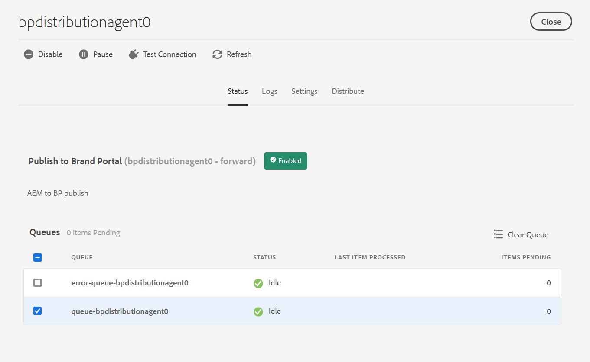

# Configure AEM Assets as a Cloud Service with Brand Portal {#configure-aem-assets-with-brand-portal}

Adobe Experience Manager 자산 브랜드 포털을 구성하면 승인된 브랜드 자산을 Adobe Experience Manager 인스턴스로 Cloud Service 자산에서 브랜드 포털에 게시하고 브랜드 포털 사용자에게 배포할 수 있습니다.

**구성 워크플로우**

Cloud Service으로 AEM Assets은 브랜드 포털 테넌트의 승인을 위해 Adobe Identity Management 서비스(IMS) 계정 토큰을 구입하는 Adobe 개발자 콘솔을 통해 브랜드 포털로 구성됩니다. 여기에는 Adobe 개발자 콘솔뿐만 아니라 AEM Assets에 구성이 필요합니다.

1. AEM Assets에서 IMS 계정을 만들고 공개 키(인증서)를 생성합니다.
1. Adobe 개발자 콘솔에서 Brand Portal 테넌트(조직)에 대한 프로젝트를 만듭니다.
1. 프로젝트 아래에서 공개 키를 사용하여 API를 구성하여 서비스 계정 연결을 만듭니다.
1. 서비스 계정 자격 증명과 JWT(JSON Web Token) 페이로드 정보를 가져옵니다.
1. AEM Assets에서 서비스 계정 자격 증명과 JWT 페이로드를 사용하여 IMS 계정을 구성합니다.
1. AEM Assets에서 IMS 계정 및 브랜드 포털 끝점(조직 URL)을 사용하여 브랜드 포털 클라우드 서비스를 구성합니다.
1. AEM Assets에서 브랜드 포털에 자산을 게시하여 구성을 테스트합니다.

>[!NOTE]
>
>Cloud Service 인스턴스로 AEM Assets은 하나의 브랜드 포털 테넌트로 구성되어야 합니다.

## 전제 조건 {#prerequisites}

Brand Portal을 사용하여 AEM Assets를 구성하려면 다음 항목이 필요합니다.

* Cloud Service 인스턴스로 AEM Assets 실행
* 브랜드 포털 테넌트 URL
* Brand Portal 임차인의 IMS 조직에 대한 시스템 관리자 권한이 있는 사용자

## 구성 만들기 {#create-new-configuration}

브랜드 포털에서 AEM Assets을 구성하려면 지정된 시퀀스에서 다음 단계를 수행하십시오.

1. [공개 인증서 받기](#public-certificate)
1. [서비스 계정(JWT) 연결 만들기](#createnewintegration)
1. [IMS 계정 구성](#create-ims-account-configuration)
1. [클라우드 서비스 구성](#configure-the-cloud-service)
1. [구성 테스트](#test-configuration)

### IMS 구성 만들기 {#create-ims-configuration}

IMS 구성은 브랜드 포털 테넌트가 있는 Cloud Service 인스턴스로 AEM Assets을 인증합니다.

IMS 구성에는 두 단계가 포함됩니다.

* [공개 인증서 받기](#public-certificate)
* [IMS 계정 구성](#create-ims-account-configuration)

### 공개 인증서 받기 {#public-certificate}

공개 키(인증서)는 Adobe 개발자 콘솔에서 프로필을 인증합니다.

1. AEM Assets에 로그인합니다.

1. From the **Tools** panel, navigate to **[!UICONTROL Security]** > **[!UICONTROL Adobe IMS Configurations]**.

1. Adobe IMS 구성 페이지에서 **[!UICONTROL 만들기]**&#x200B;를 클릭합니다. It will redirect to the **[!UICONTROL Adobe IMS Technical Account Configuration]** page. 기본적으로 **인증서** 탭이 열립니다.

1. **[!UICONTROL 클라우드 솔루션 드롭다운 목록에서 Adobe 브랜드 포털]** 을 **** 선택합니다.

1. 새 인증서 **[!UICONTROL 만들기]** 확인란을 선택하고 공개 키에 **대한 별칭을** 지정합니다. 별칭은 공개 키 이름 역할을 합니다.

1. **[!UICONTROL 인증서 만들기]**&#x200B;를 클릭합니다. Then, click **[!UICONTROL OK]** to generate the public key.

   

1. Click the **[!UICONTROL Download Public Key]** icon and save the public key (.crt) file on your machine.

   공개 키는 나중에 브랜드 포털 테넌트에 대한 API를 구성하고 Adobe 개발자 콘솔에서 서비스 계정 자격 증명을 생성하는 데 사용됩니다.

   

1. **[!UICONTROL 다음]**&#x200B;을 클릭합니다.

   [ **계정** ] 탭에서 Adobe 개발자 콘솔에서 생성된 서비스 계정 자격 증명이 필요한 Adobe IMS 계정이 만들어집니다. 우선은 이 페이지를 열어 두십시오.

   새 탭을 열고 [Adobe 개발자 콘솔에 서비스 계정(JWT) 연결을 만들어](#createnewintegration) IMS 계정을 구성하기 위한 자격 증명과 JWT 페이로드를 가져옵니다.

### 서비스 계정(JWT) 연결 만들기 {#createnewintegration}

Adobe 개발자 콘솔에서 프로젝트 및 API는 브랜드 포털 테넌트(조직) 수준에서 구성됩니다. API를 구성하면 서비스 계정(JWT) 연결이 만들어집니다. 키 쌍(개인 및 공개 키)을 생성하거나 공개 키를 업로드하여 API를 구성하는 두 가지 방법이 있습니다. 브랜드 포털에서 AEM Assets을 구성하려면 AEM Assets에서 공개 키(인증서)를 생성하고 공개 키를 업로드하여 Adobe 개발자 콘솔에서 자격 증명을 만들어야 합니다. 이러한 자격 증명은 AEM Assets에서 IMS 계정을 구성하는 데 필요합니다. IMS 계정이 구성되면 AEM Assets에서 브랜드 포털 클라우드 서비스를 구성할 수 있습니다.

서비스 계정 자격 증명과 JWT 페이로드를 생성하려면 다음 단계를 수행합니다.

1. IMS 조직(Brand Portal 테넌트)에 대한 시스템 관리자 권한으로 Adobe 개발자 콘솔에 로그인합니다. 기본 URL은 [https://www.adobe.com/go/devs_console_ui](https://www.adobe.com/go/devs_console_ui).

   >[!NOTE]
   >
   >오른쪽 위 모서리에 있는 드롭다운(조직) 목록에서 올바른 IMS 조직(브랜드 포털 테넌트)을 선택했는지 확인합니다.

1. **[!UICONTROL 새 프로젝트 만들기]**&#x200B;를 클릭합니다. 조직에 대해 시스템에서 생성된 이름을 가진 빈 프로젝트가 만들어집니다.

   **[!UICONTROL 프로젝트 편집]**&#x200B;을 클릭하여 **[!UICONTROL 프로젝트 제목]** 및 **[!UICONTROL 설명]**&#x200B;을 업데이트하고 **[!UICONTROL 저장]**&#x200B;을 클릭합니다.

1. In the **[!UICONTROL Project overview]** tab, click **[!UICONTROL Add API]**.

1. In the **[!UICONTROL Add an API window]**, select **[!UICONTROL AEM Brand Portal]** and click **[!UICONTROL Next]**.

   AEM Brand Portal 서비스에 대한 액세스 권한이 있는지 확인합니다.

1. In the **[!UICONTROL Configure API]** window, click **[!UICONTROL Upload your public key]**. Then, click **[!UICONTROL Select a File]** and upload the public key (.crt file) that you have downloaded in the [obtain public certificate](#public-certificate) section.

   **[!UICONTROL 다음]**&#x200B;을 클릭합니다.

   

1. Verify the public key and click **[!UICONTROL Next]**.

1. 기본 **[!UICONTROL 제품 프로필로 Assets 브랜드 포털]** 을 선택하고 구성된 API **[!UICONTROL 저장을 클릭합니다]**.

   <!-- 
   In Brand Portal, a default profile is created for each organization. The Product Profiles are created in admin console for assigning users to groups (based on the roles and permissions). For configuration with Brand Portal, the OAuth token is created at organization level. Therefore, you must configure the default Product Profile for your organization. 
   -->

   

1. API가 구성되면 API 개요 페이지로 리디렉션됩니다. From the left navigation under **[!UICONTROL Credentials]**, click on the **[!UICONTROL Service Account (JWT)]** option.

   >[!NOTE]
   >
   >자격 증명을 보고 JWT 토큰 생성, 자격 증명 세부 사항 복사, 클라이언트 암호 검색 등과 같은 작업을 수행할 수 있습니다.

1. **[!UICONTROL 클라이언트 자격 증명]** 탭에서 **[!UICONTROL 클라이언트 ID]**&#x200B;를 복사합니다.

   **[!UICONTROL 클라이언트 암호 검색]**&#x200B;을 클릭하고 **[!UICONTROL 클라이언트 암호 키]**&#x200B;를 복사합니다.

   

1. Navigate to the **[!UICONTROL Generate JWT]** tab and copy the **[!UICONTROL JWT Payload]** information.

You can now use the client ID (API key), client secret, and JWT payload to [configure the IMS account](#create-ims-account-configuration) in AEM Assets.

<!--
1. Click **[!UICONTROL Create Integration]**.

1. Select **[!UICONTROL Access an API]**, and click **[!UICONTROL Continue]**.

   

1. Create a new integration page opens. 
   
   Select your organization from the drop-down list.

   In **[!UICONTROL Experience Cloud]**, Select **[!UICONTROL AEM Brand Portal]** and click **[!UICONTROL Continue]**. 

   If the Brand Portal option is disabled for you, ensure that you have selected correct organization from the drop-down box above the **[!UICONTROL Adobe Services]** option. If you do not know your organization, contact your administrator.

   

1. Specify a name and description for the integration. Click **[!UICONTROL Select a File from your computer]** and upload the `AEM-Adobe-IMS.crt` file downloaded in the [obtain public certificates](#public-certificate) section.

1. Select the profile of your organization. 

   Or, select the default profile **[!UICONTROL Assets Brand Portal]** and click **[!UICONTROL Create Integration]**. The integration is created.

1. Click **[!UICONTROL Continue to integration details]** to view the integration information. 

   Copy the **[!UICONTROL API Key]** 
   
   Click **[!UICONTROL Retrieve Client Secret]** and copy the Client Secret key.

   

1. Navigate to **[!UICONTROL JWT]** tab, and copy the **[!UICONTROL JWT payload]**.

   The API Key, Client Secret key, and JWT payload information will be used to create IMS account configuration.

-->

### IMS 계정 구성 {#create-ims-account-configuration}

다음 절차를 수행했는지 확인하십시오.

* [공개 인증서 받기](#public-certificate)
* [서비스 계정(JWT) 연결 만들기](#createnewintegration)

IMS 계정을 구성하려면 다음 단계를 수행하십시오.

1. Open the IMS Configuration and navigate to the **[!UICONTROL Account]** tab. You kept the page open while [obtaining the public certificate](#public-certificate).

1. IMS 계정에 대한 **[!UICONTROL 제목]**&#x200B;을 지정합니다.

   In the **[!UICONTROL Authorization Server]** field, specify the URL: [https://ims-na1.adobelogin.com/](https://ims-na1.adobelogin.com/)

   Specify client ID in the **[!UICONTROL API key]** field, **[!UICONTROL Client Secret]**, and **[!UICONTROL Payload]** (JWT payload) that you have copied while [creating the service account (JWT) connection](#createnewintegration).

   **[!UICONTROL 만들기]**&#x200B;를 클릭합니다.

   IMS 계정이 구성되었습니다.

   

1. Select the IMS account configuration and click **[!UICONTROL Check Health]**.

   대화 상자에서 **[!UICONTROL 확인]**&#x200B;을 클릭합니다. 구성이 성공하면 *토큰이 성공적으로 검색되었습니다.*&#x200B;라는 메시지가 나타납니다.

   

>[!CAUTION]
>
>IMS 구성은 하나만 있어야 합니다.
>
>IMS 구성이 상태 검사를 통과하는지 확인합니다. 구성이 상태 검사를 통과하지 않으면 구성이 잘못된 것입니다. 이 구성을 삭제하고 유효한 새 구성을 만들어야 합니다.

### 클라우드 서비스 구성 {#configure-the-cloud-service}

브랜드 포털 클라우드 서비스를 구성하려면 다음 단계를 수행하십시오.

1. AEM Assets에 로그인합니다.

1. From the **Tools** panel, navigate to **[!UICONTROL Cloud Services]** > **[!UICONTROL AEM Brand Portal]**.

1. Brand Portal 구성 페이지에서 **[!UICONTROL 만들기]**&#x200B;를 클릭합니다.

1. 구성에 대한 **[!UICONTROL 제목]**&#x200B;을 지정합니다.

   Select the IMS configuration that you created while [configuring the IMS account](#create-ims-account-configuration).

   In the **[!UICONTROL Service URL]** field, specify your Brand Portal tenant (organization) URL.

   

1. **[!UICONTROL 저장 후 닫기]**&#x200B;를 클릭합니다. 클라우드 구성이 만들어집니다.

   이제 Cloud Service 인스턴스로 AEM Assets이 브랜드 포털 테넌트로 구성됩니다.

### 구성 테스트 {#test-configuration}

다음 단계를 수행하여 구성을 확인합니다.

1. AEM Assets에 로그인합니다.

1. From the **Tools** panel, navigate to **[!UICONTROL Deployment]** > **[!UICONTROL Distribution]**.

   

   A Brand Portal distribution agent (**[!UICONTROL bpdistributionagent0]**) is created under **[!UICONTROL Publish to Brand Portal]**.

   

1. 브랜드 **[!UICONTROL 포털에 게시를]** 클릭하여 배포 에이전트를 엽니다.

   상태 **[!UICONTROL 탭 아래에서 배포 대기열을]** 볼 수 있습니다.

   분배 에이전트에는 두 개의 큐가 있습니다.
   * **처리 큐**:를 참조하십시오.

   * **error-queue**:for the assets where distribution has failed.
   >[!NOTE]
   >
   >오류를 검토하고 **오류 큐를 정기적으로 지우는 것이** 좋습니다.

   

1. Cloud Service 및 브랜드 포털로 AEM Assets 간의 연결을 확인하려면 연결 **[!UICONTROL 테스트]** 아이콘을 클릭합니다.

   

   A message appears at the bottom of the page that your *test package is successfully delivered*.

   >[!NOTE]
   >
   >자산 분배(큐에서 실행)가 실패하는 원인이 될 수 있으므로 분배 에이전트를 비활성화하지 마십시오.

이제 다음을 수행할 수 있습니다.

* [AEM Assets에서 Brand Portal에 자산 게시](publish-to-brand-portal.md)
* [AEM Assets의 폴더를 Brand Portal에 게시](publish-to-brand-portal.md#publish-folders-to-brand-portal)
* [AEM Assets의 컬렉션을 Brand Portal에 게시](publish-to-brand-portal.md#publish-collections-to-brand-portal)

* [사전 설정, 스키마 및 패싯을 Brand Portal에 게시](https://docs.adobe.com/content/help/ko-KR/experience-manager-brand-portal/using/publish/publish-schema-search-facets-presets.html)
* [태그를 Brand Portal에 게시](https://docs.adobe.com/content/help/ko-KR/experience-manager-brand-portal/using/publish/brand-portal-publish-tags.html)

See [Brand Portal documentation](https://docs.adobe.com/content/help/ko-KR/experience-manager-brand-portal/using/home.html) for more information.

## 분배 로그 {#distribution-logs}

자산 게시 워크플로우에 대한 배포 에이전트 로그를 모니터링할 수 있습니다.

예를 들어, 구성을 확인하기 위해 AEM Assets에서 브랜드 포털에 자산을 게시했습니다.

1. Follow the steps (from 1 to 4) as shown in the [Test Configuration](#test-configuration) section and navigate to the distribution agent page.

1. 처리 **[!UICONTROL 및]** 오류 로그를 보려면 로그를 클릭합니다.

   

배포 에이전트가 다음 로그를 생성했습니다.

* 정보:배포 에이전트의 성공적인 구성을 트리거하는 시스템 생성 로그입니다.
* DSTRQ1(요청 1):테스트 연결에 대해 트리거합니다.

자산을 게시할 때 다음 요청 및 응답 로그가 생성됩니다.

**분배 에이전트 요청**:
* DSTRQ2(요청 2): 자산 게시 요청이 트리거됩니다.
* DSTRQ3(요청 3):시스템이 다른 요청을 트리거하여 자산이 있는 AEM Assets 폴더를 게시하고 브랜드 포털의 폴더를 복제합니다.

**분배 에이전트 응답**:
* queue-bpdistributionagent0(DSTRQ2): 자산이 Brand Portal에 게시됩니다.
* queue-bdistribution-agent0(DSTRQ3):시스템이 브랜드 포털에서 AEM Assets 폴더(자산 포함)를 복제합니다.

위의 예에서 추가적인 요청 및 응답이 트리거됩니다. 자산이 처음으로 게시되었기 때문에 시스템이 브랜드 포털에서 상위 폴더(경로 추가)를 찾을 수 없으므로 자산이 게시된 브랜드 포털에서 동일한 이름의 상위 폴더를 만들기 위한 추가 요청을 트리거했습니다.

>[!NOTE]
>
>상위 폴더가 브랜드 포털에 없거나 AEM Assets에서 수정된 경우에 대한 추가 요청이 생성됩니다.

<!--

## Additional information {#additional-information}

Go to `/system/console/slingmetrics` for statistics related to the distributed content:

1. **Counter metrics**
   * sling: `mac_sync_request_failure`
   * sling: `mac_sync_request_received`
   * sling: `mac_sync_request_success`

1. **Time metrics**
   * sling: `mac_sync_distribution_duration`
   * sling: `mac_sync_enqueue_package_duration`
   * sling: `mac_sync_setup_request_duration`

-->

<!--
   Comment Type: draft

   <li> </li>
   -->

<!--
   Comment Type: draft

   <li>Step text</li>
   -->
