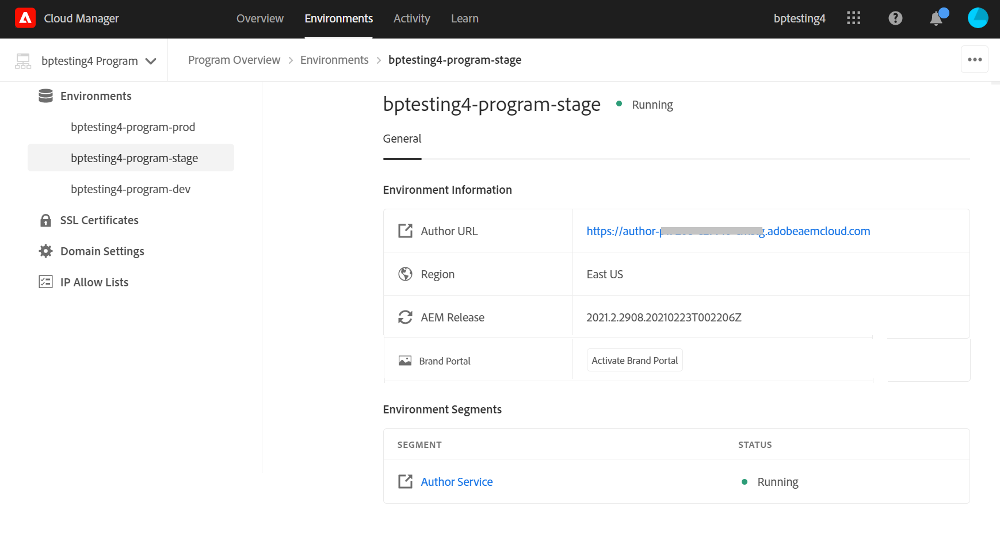

# Brand Portal로 Experience Manager Assets 구성 {#configure-aem-assets-with-brand-portal}

<table>
    <tr>
        <td>
            <i>신규</i> <a href="/help/assets/dynamic-media/dm-prime-ultimate.md"><b>Dynamic Media Prime 및 Ultimate</b></a>
        </td>
        <td>
            <i>신규</i> <a href="/help/assets/assets-ultimate-overview.md"><b>AEM Assets Ultimate</b></a>
        </td>
        <td>
            <i>신규</i> <a href="/help/assets/integrate-aem-assets-edge-delivery-services.md"><b>Edge Delivery Services와의 AEM Assets 통합</b></a>
        </td>
        <td>
            <i>신규</i> <a href="/help/assets/aem-assets-view-ui-extensibility.md"><b>UI 확장성</b></a>
        </td>
          <td>
            <i>신규</i> <a href="/help/assets/dynamic-media/enable-dynamic-media-prime-and-ultimate.md"><b>Dynamic Media Prime 및 Ultimate 활성화</b></a>
        </td>
    </tr>
    <tr>
        <td>
            <a href="/help/assets/search-best-practices.md"><b>모범 사례 검색</b></a>
        </td>
        <td>
            <a href="/help/assets/metadata-best-practices.md"><b>메타데이터 모범 사례</b></a>
        </td>
        <td>
            <a href="/help/assets/product-overview.md"><b>Content Hub</b></a>
        </td>
        <td>
            <a href="/help/assets/dynamic-media-open-apis-overview.md"><b>OpenAPI 기능이 포함된 Dynamic Media</b></a>
        </td>
        <td>
            <a href="https://developer.adobe.com/experience-cloud/experience-manager-apis/"><b>AEM Assets 개발자 설명서</b></a>
        </td>
    </tr>
</table>

| 버전 | 문서 링크 |
| -------- | ---------------------------- |
| AEM 6.5 | [여기 클릭](https://experienceleague.adobe.com/docs/experience-manager-65/assets/brandportal/configure-aem-assets-with-brand-portal.html?lang=ko) |
| AEM as a Cloud Service | 이 문서 |

Adobe Experience Manager Assets Brand Portal을 구성하면 승인된 브랜드 자산을 Adobe Experience Manager Assets에서 [!DNL Cloud Service] 인스턴스로 Brand Portal에 게시하고 Brand Portal 사용자에게 배포할 수 있습니다.

>[!IMPORTANT]
>
> * Brand Portal은 현재 유지 관리 중입니다.
> * Cloud Manager을 사용하여 Brand Portal을 활성화하기 위한 사용 사례 및 특정 요구 사항에 대한 자세한 내용은 Adobe 담당자에게 문의하십시오.
> * Brand Portal은 Assets Prime 또는 Assets Ultimate에서 사용할 수 없습니다. 그러나 이미 Assets에 액세스할 수 있는 기존 Brand Portal Cloud Services 고객은 Assets Ultimate으로 전환할 때 해당 계정을 유지할 수 있습니다.

<!--

## Activate Brand Portal using Cloud Manager {#activate-brand-portal}

The Cloud Manager user activates Brand Portal for an Experience Manager Assets as a [!DNL Cloud Service] instance. The activation workflow creates the required configurations (authorization token, IMS configuration, and Brand Portal cloud service) at the backend and reflects the status of the Brand Portal tenant in Cloud Manager. Activating Brand Portal enables the Experience Manager Assets users to publish assets to Brand Portal and distribute them to the Brand Portal users.  

**Prerequisites** 

You require the following to activate Brand Portal on your Experience Manager Assets as a [!DNL Cloud Service] instance:

* An up and running Experience Manager Assets as a [!DNL Cloud Service] instance.
* A user having access to Cloud Manager, assigned to Profiles of the Cloud Manager Product. See [accessing Cloud Manager](https://experienceleague.adobe.com/docs/experience-manager-cloud-service/security/ims-support.html#accessing-cloud-manager) for more information. 

>[!NOTE]
>
>A configured production environment is required to an Experience Manager Assets as a [!DNL Cloud Service] instance to connect with Brand Portal tenant.

**Steps to activate Brand Portal**

You can activate Brand Portal while creating the production environments for your Experience Manager Assets as a [!DNL Cloud Service] instance, or separately. Let us assume that the environment was already created, and you are now required to activate Brand Portal.

1. Login to Adobe Cloud Manager and navigate to **[!UICONTROL Environments]**.
   
   The **[!UICONTROL Environments]** page displays the list of all the existing environments.

1. Select the environments (one by one) from the list to view the environment details.

   Brand Portal is entitled to one of the available environments and is reflected under the **[!UICONTROL Environment Information]**.

   Once you find the environment associated with Brand Portal, click the **[!UICONTROL Activate Brand Portal]** button to begin the activation workflow.

   

1. It takes few mins to activate the Brand Portal tenant as the activation workflow creates the required configurations at the backend. Once the Brand Portal tenant is activated, the status changes to Activated. 

   

>[!NOTE]
>
>Brand Portal must be activated on the same IMS org as of the Experience Manager Assets as a [!DNL Cloud Service] instance.
>
>If you have an existing Brand Portal cloud configuration ([manually configured using Adobe Developer Console](#manual-configuration)) for an IMS org (org1-existing) and your Experience Manager Assets as a [!DNL Cloud Service] instance is configured for another IMS org (org2-new), activating Brand Portal from the Cloud Manager resets the Brand Portal IMS org to `org2-new`. Although the manually configured cloud configuration on `org1-existing` is visible in the Experience Manager Assets author instance but will no longer be in use after activating Brand Portal from the Cloud Manager. 
>
>If the existing Brand Portal cloud configuration and Experience Manager Assets as a [!DNL Cloud Service] instance are using the same IMS org (org1), you only have to activate Brand Portal from the Cloud Manager. 
>
>Do not modify any autogenerated settings.

**See also**:

* [Add users and roles in Experience Manager Assets as a Cloud Service](https://experienceleague.adobe.com/docs/experience-manager-cloud-manager/using/requirements/setting-up-users-and-roles.html)

* [Manage environments in Cloud Manager](https://experienceleague.adobe.com/docs/experience-manager-cloud-service/implementing/using-cloud-manager/manage-environments.html#adding-environments)

**Login to your Brand Portal tenant**:

After activation of your Brand Portal tenant in Cloud Manager, you can login to Brand Portal from Admin Console or by directly using the tenant URL.

The default URL of your Brand Portal tenant is: `https://<tenant-id>.brand-portal.adobe.com/`.

Wherein, the Tenant id is the IMS org.

Perform the following steps if you are not sure of the Brand Portal URL:

1. Login to [Admin Console](https://adminconsole.adobe.com/) and navigate to **[!UICONTROL Products]**.
1. From the left panel, select **[!UICONTROL Adobe Experience Manager Brand Portal – Brand Portal]**.
1. Click **[!UICONTROL Go to Brand Portal]** to directly open Brand Portal in the browser.

   Or copy the Brand Portal tenant URL from the **[!UICONTROL Go to Brand Portal]** link and paste it in your browser to open the Brand Portal interface.

   

**Test connection**

Perform the following steps to validate the connection between your Experience Manager Assets as a [!DNL Cloud Service] instance and Brand Portal tenant:

1. Login to Experience Manager Assets.

1. From the **Tools** panel, navigate to **[!UICONTROL Deployment]** > **[!UICONTROL Distribution]**.

    

   A Brand Portal distribution agent (**[!UICONTROL bpdistributionagent0]**) is created under **[!UICONTROL Publish to Brand Portal]**.

   

1. Click **[!UICONTROL Publish to Brand Portal]** to open the distribution agent. 

   You can see the distribution queues under the **[!UICONTROL Status]** tab. 
   
   A distribution agent contains two queues: 
   * **processing-queue**: for the distribution of assets to Brand Portal. 

   * **error-queue**: for the assets where distribution has failed. 
   
   >[!NOTE]
   >
   >It is recommended to review the failures and  clear the **error-queue** periodically.  

   

1. To verify the connection between Experience Manager Assets as a [!DNL Cloud Service] and Brand Portal, click the **[!UICONTROL Test Connection]** icon.

   

   A message appears that your *test package is successfully delivered*.

   >[!NOTE]
   >
   >Avoid disabling the distribution agent, as it can cause the distribution of the assets (running-in-queue) to fail.

To verify the connection between your Experience Manager Assets as a [!DNL Cloud Service] instance and Brand Portal tenant, publish an asset from Experience Manager Assets to Brand Portal. If the connection is successful, the published asset is visible in the Brand Portal interface.

You can now:

* [Publish assets from Experience Manager Assets to Brand Portal](publish-to-brand-portal.md)
* [Publish folders from Experience Manager Assets to Brand Portal](publish-to-brand-portal.md#publish-folders-to-brand-portal)
* [Publish collections from Experience Manager Assets to Brand Portal](publish-to-brand-portal.md#publish-collections-to-brand-portal)
* [Publish assets from Brand Portal to Experience Manager Assets](https://experienceleague.adobe.com/docs/experience-manager-brand-portal/using/asset-sourcing-in-brand-portal/brand-portal-asset-sourcing.html) - Asset Sourcing in Brand Portal
* [Publish presets, schemas, and facets to Brand Portal](https://experienceleague.adobe.com/docs/experience-manager-brand-portal/using/publish/publish-schema-search-facets-presets.html)
* [Publish tags to Brand Portal](https://experienceleague.adobe.com/docs/experience-manager-brand-portal/using/publish/brand-portal-publish-tags.html)

See [Brand Portal documentation](https://experienceleague.adobe.com/docs/experience-manager-brand-portal/using/home.html) for more information.

**Distribution logs**

You can monitor the distribution agent logs for the asset publishing workflow. 

Let us now publish an asset from Experience Manager Assets to Brand Portal and see the logs. 

1. Follow the steps (from 1 to 4) as shown in the **Test connection** section and navigate to the distribution agent page.
1. Click **[!UICONTROL Logs]** to view the processing and error logs.

   

The distribution agent has generated the following logs:

* INFO: It is a system-generated log that triggers on successful configuration of the distribution agent. 
* DSTRQ1 (Request 1): Triggers on test connection.

On publishing the asset, the following request and response logs are generated:

**Distribution agent request**:

* DSTRQ2 (Request 2): The asset publishing request is triggered.
* DSTRQ3 (Request 3): The system triggers another request to publish the Experience Manager Assets folder (in which the asset exists) and replicates the folder in Brand Portal.

**Distribution agent response**:

* queue-bpdistributionagent0 (DSTRQ2): The asset is published to Brand Portal.
* queue-bpdistributionagent0 (DSTRQ3): The system replicates the Experience Manager Assets folder (containing the asset) in Brand Portal.

In the above example, an additional request and response are triggered. The system could not find the parent folder (Add Path) in Brand Portal because the asset was published for the first time, therefore, it triggered an additional request to create a parent folder with the same name in Brand Portal where the asset is published.  

>[!NOTE]
>
>Additional request is generated in case the parent folder does not exist in Brand Portal or has been modified in Experience Manager Assets. 

Along with the automation workflow to activate Brand Portal on Experience Manager Assets as a [!DNL Cloud Service], there exists another method to manually configure Experience Manager Assets as a [!DNL Cloud Service] with Brand Portal using Adobe Developer Console which is not recommended anymore.

>[!NOTE]
>
>Contact Customer Support if you are facing any problem while activating your Brand Portal tenant.
-->

## Adobe Developer Console을 사용한 수동 구성 {#manual-configuration}

>[!NOTE]
>
> 2024년 6월 이후부터는 새 JWT 자격 증명을 만들 수 없습니다. 앞으로 OAuth 자격 증명만 생성됩니다.
> > 자세한 내용은 [OAuth 구성 만들기](https://experienceleague.adobe.com/en/docs/experience-manager-cloud-service/content/security/setting-up-ims-integrations-for-aem-as-a-cloud-service#creating-oauth-configuration:~:text=For%20example%3A-,Creating%20an%20OAuth%20configuration,-To%20create%20a)를 참조하십시오.

다음 섹션에서는 Adobe Developer Console을 사용하여 Brand Portal을 사용하여 Experience Manager Assets as a [!DNL Cloud Service]을(를) 수동으로 구성하는 방법에 대해 설명합니다.

이전에는 Experience Manager Assets as a [!DNL Cloud Service]이(가) Brand Portal 테넌트의 인증을 위해 Adobe IMS(Identity Management Services) 계정 토큰을 조달하는 Adobe Developer Console을 통해 Brand Portal으로 수동으로 구성되었습니다. Experience Manager Assets 및 Adobe Developer Console 모두에서 구성이 필요합니다.

<!--1. In Experience Manager Assets, create an IMS account and generate a public key (certificate).-->
<!--1. Under the project, configure an API using the public key to create a service account connection.
1. Get the service account credentials and JSON Web Token (JWT) payload information.
1. In Experience Manager Assets, configure the IMS account using the service account credentials and JWT payload.-->
1. Adobe 개발자 콘솔에서 Brand Portal 테넌트(조직)에 대한 프로젝트를 만듭니다.
1. Experience Manager Assets에서 IMS 계정 및 Brand Portal 끝점(조직 URL)을 사용하여 Brand Portal 클라우드 서비스를 구성합니다.
1. Experience Manager Assets에서 Brand Portal으로 자산을 게시하여 구성을 테스트합니다.

>[!NOTE]
>
>Experience Manager Assets as a [!DNL Cloud Service] 인스턴스는 하나의 Brand Portal 테넌트로만 구성해야 합니다.

**사전 요구 사항**

Brand Portal을 사용하여 Experience Manager Assets을 구성하려면 다음 항목이 필요합니다.

* 실행 중인 Experience Manager Assets을 [!DNL Cloud Service] 인스턴스로
* Brand Portal 테넌트 URL
* Brand Portal 테넌트의 IMS 조직에 대한 시스템 관리자 권한이 있는 사용자

## 구성 만들기 {#create-new-configuration}

지정된 시퀀스에서 다음 단계를 수행하여 Brand Portal을 사용하여 Experience Manager Assets을 구성합니다.

1. [Adobe Developer Console에서 OAuth 자격 증명 구성](#config-oauth)
1. [OAuth를 사용하여 새 Adobe IMS 통합 만들기](#create-ims-account-configuration)
1. [클라우드 서비스 구성](#configure-cloud-service)
   <!--1. [Obtain public certificate](#public-certificate)-->
<!--1. [Create service account (JWT) connection](#createnewintegration) 
1. [Configure IMS account](#create-ims-account-configuration)-->

<!--
### Create IMS configuration {#create-ims-configuration}

The IMS configuration authenticates your Experience Manager Assets as a [!DNL Cloud Service] instance with the Brand Portal tenant. 

IMS configuration includes two steps:

* [Obtain public certificate](#public-certificate) 
* [Configure IMS account](#create-ims-account-configuration)
-->
<!--

### Obtain public certificate {#public-certificate}

The public key (certificate) authenticates your profile on Adobe Developer Console.

1. Login to Experience Manager Assets.
1. From the **Tools** panel, navigate to **[!UICONTROL Security]** > **[!UICONTROL Adobe IMS Configurations]**.
1. In Adobe IMS Configurations page, click **[!UICONTROL Create]**. It will redirect to the **[!UICONTROL Adobe IMS Technical Account Configuration]** page. By default, the **Certificate** tab opens.
1. Select **[!UICONTROL Adobe Brand Portal]** in the **[!UICONTROL Cloud Solution]** drop-down list.  
1. Select the **[!UICONTROL Create new certificate]** check box and specify an **alias** for the public key. The alias serves as name of the public key. 
1. Click **[!UICONTROL Create certificate]**. Then, click **[!UICONTROL OK]** to generate the public key.

   

1. Click the **[!UICONTROL Download Public Key]** icon and save the public key (CRT) file on your machine.

   The public key is used later to configure API for your Brand Portal tenant and generate service account credentials in Adobe Developer Console.  

   

1. Click **[!UICONTROL Next]**.

    In the **Account** tab, Adobe IMS account is created which requires the service account credentials that are generated in Adobe Developer Console. Keep this page open for now.

    Open a new tab and [create a service account (JWT) connection in Adobe Developer Console](#createnewintegration) to get the credentials and JWT payload for configuring the IMS account. 
-->
<!--

### Create service account (JWT) connection {#createnewintegration}

In Adobe Developer Console, projects and APIs are configured at Brand Portal tenant (organization) level. Configuring an API creates a service account (JWT) connection. There are two methods to configure API, by generating a key pair (private and public keys) or by uploading a public key. To configure Experience Manager Assets with Brand Portal, you must generate a public key (certificate) in Experience Manager Assets and create credentials in Adobe Developer Console by uploading the public key. These credentials are required to configure the IMS account in Experience Manager Assets. Once the IMS account is configured, you can configure the Brand Portal cloud service in Experience Manager Assets.

Perform the following steps to generate the service account credentials and JWT payload:

1. Login to Adobe Developer Console with system administrator privileges on the IMS organization (Brand Portal tenant). The default URL is [https://www.adobe.com/go/devs_console_ui](https://www.adobe.com/go/devs_console_ui).

   >[!NOTE]
   >
   >Ensure that you have selected the correct IMS organization (Brand Portal tenant) from the drop-down (organization) list located at the upper-right corner.

1. Click **[!UICONTROL Create new project]**. A blank project with a system-generated name is created for your organization. 

   Click **[!UICONTROL Edit project]** to update the **[!UICONTROL Project Title]** and **[!UICONTROL Description]**, and click **[!UICONTROL Save]**.
   
1. In the **[!UICONTROL Project overview]** tab, click **[!UICONTROL Add API]**.

1. In the **[!UICONTROL Add an API window]**, select **[!UICONTROL AEM Brand Portal]** and click **[!UICONTROL Next]**. 

   Ensure that you have access to the Experience Manager Brand Portal service.

1. In the **[!UICONTROL Configure API]** window, click **[!UICONTROL Upload your public key]**. Then, click **[!UICONTROL Select a File]** and upload the public key (.crt file) that you have downloaded in the [obtain public certificate](#public-certificate) section. 

   Click **[!UICONTROL Next]**.

   

1. Verify the public key and click **[!UICONTROL Next]**.

1. Select **[!UICONTROL Assets Brand Portal]** as the default product profile and click **[!UICONTROL Save configured API]**. 

   

1. Once the API is configured, you are redirected to the API overview page. From the left navigation under **[!UICONTROL Credentials]**, click the **[!UICONTROL Service Account (JWT)]** option.

   >[!NOTE] 
   >
   >* You can view the credentials and perform actions such as generate JWT tokens, copy credential details, retrieve client secret, and so on.
   >* Currently, only the Adobe's Developer Console Service Account (JWT) credential type is supported. Do not use the `OAuth Server-to-Server` credential type until it is supported in mid-April. Read more at [JWT Credentials Deprecation in Adobe Developer Console](https://experienceleague.adobe.com/docs/experience-manager-cloud-service/content/security/jwt-credentials-deprecation-in-adobe-developer-console.html).

1. From the **[!UICONTROL Client Credentials]** tab, copy the **[!UICONTROL client ID]**. 

   Click **[!UICONTROL Retrieve Client Secret]** and copy the **[!UICONTROL client secret]**.

   

1. Navigate to the **[!UICONTROL Generate JWT]** tab and copy the **[!UICONTROL JWT Payload]** information. 

You can now use the client ID (API key), client secret, and JWT payload to [configure the IMS account](#create-ims-account-configuration) in Experience Manager Assets.
-->
<!--
1. Click **[!UICONTROL Create Integration]**.

1. Select **[!UICONTROL Access an API]**, and click **[!UICONTROL Continue]**.

   

1. Create an integration page. 
   
   Select your organization from the drop-down list.

   In **[!UICONTROL Experience Cloud]**, Select **[!UICONTROL AEM Brand Portal]** and click **[!UICONTROL Continue]**. 

   If the Brand Portal option is disabled for you, ensure that you have selected correct organization from the drop-down box above the **[!UICONTROL Adobe Services]** option. If you do not know your organization, contact your administrator.

   

1. Specify a name and description for the integration. Click **[!UICONTROL Select a File from your computer]** and upload the `AEM-Adobe-IMS.crt` file downloaded in the [obtain public certificates](#public-certificate) section.

1. Select the profile of your organization. 

   Or, select the default profile **[!UICONTROL Assets Brand Portal]** and click **[!UICONTROL Create Integration]**. The integration is created.

1. Click **[!UICONTROL Continue to integration details]** to view the integration information. 

   Copy the **[!UICONTROL API Key]** 
   
   Click **[!UICONTROL Retrieve Client Secret]** and copy the Client Secret key.

   

1. Navigate to **[!UICONTROL JWT]** tab, and copy the **[!UICONTROL JWT payload]**.

   The API Key, Client Secret key, and JWT payload information is used to create IMS account configuration.

-->

### Adobe Developer Console에서 OAuth 자격 증명 구성 {#config-oauth}

[Adobe Developer Console에서 OAuth 자격 증명을 구성하고](https://experienceleague.adobe.com/en/docs/experience-manager-cloud-service/content/security/setting-up-ims-integrations-for-aem-as-a-cloud-service#credentials-in-the-developer-console) Brand Portal API를 선택합니다.

### OAuth를 사용하여 새 Adobe IMS 통합 만들기 {#create-ims-account-configuration}

[OAuth를 사용하여 새 Adobe IMS 통합을 만들고](https://experienceleague.adobe.com/en/docs/experience-manager-cloud-service/content/security/setting-up-ims-integrations-for-aem-as-a-cloud-service#creating-oauth-configuration) 클라우드 솔루션 아래의 드롭다운에서 Brand Portal을 선택합니다.

<!--
Ensure that you have performed the following steps:

* [Obtain public certificate](#public-certificate)
* [Create service account (JWT) connection](#createnewintegration)
-->

<!--1. Open the IMS Configuration and navigate to the **[!UICONTROL Account]** tab. Keep the page open while [obtaining the public certificate](#public-certificate).

1. Specify a **[!UICONTROL Title]** for the IMS account.

   In the **[!UICONTROL Authorization Server]** field, specify the URL: [https://ims-na1.adobelogin.com/](https://ims-na1.adobelogin.com/)  
-->
<!--
1. Complete the configuration based on details from the [Developer Console](https://developer.adobe.com/developer-console/docs/guides/authentication/ServerToServerAuthentication/implementation/). Click **[!UICONTROL Create]**.
-->
<!--Specify client ID in the **[!UICONTROL API key]** field, **[!UICONTROL Client Secret]**, and **[!UICONTROL Payload]** (JWT payload) that you have copied while [creating the service account (JWT) connection](#createnewintegration).

   The IMS account is configured. 

   

 <!--  
1. Select the IMS account configuration and click **[!UICONTROL Check Health]**.

   Click **[!UICONTROL Check]** in the dialog box. On successful configuration, a message appears that the *Token is retrieved successfully*.

   
-->
<!--
>[!CAUTION]
>
>You must have only one IMS configuration.
>
>Ensure that the IMS configuration passes the health check. If the configuration does not pass the health check, it is invalid. You must delete it and create another valid configuration.
-->

### 클라우드 서비스 구성 {#configure-cloud-service}

Brand Portal 클라우드 서비스를 구성하려면 다음 단계를 수행하십시오.

1. Experience Manager Assets에 로그인합니다.

1. **도구** 패널에서 **[!UICONTROL 클라우드 서비스]** > **[!UICONTROL AEM Brand Portal]**(으)로 이동합니다.

1. Brand Portal 구성 페이지에서 **[!UICONTROL 만들기]**&#x200B;를 클릭합니다.

1. 구성에 대한 **[!UICONTROL 제목]**&#x200B;을 지정합니다.

   [IMS 계정을 구성](#create-ims-account-configuration)하는 동안 만든 IMS 구성을 선택하십시오.

   **[!UICONTROL 서비스 URL]** 필드에 Brand Portal 테넌트 URL을 지정하십시오.

   

1. **[!UICONTROL 저장 및 닫기]**&#x200B;를 클릭합니다. 클라우드 구성이 생성됩니다.

   이제 Experience Manager Assets as a [!DNL Cloud Service] 인스턴스가 Brand Portal 테넌트로 구성되었습니다.

이제 분배 에이전트를 확인하고 자산을 Brand Portal에 게시하여 구성을 테스트할 수 있습니다.

SPS에서 보안 IP 미리 보기가 활성화된 경우 **허용 목록에 추가하다**
회사에 대해 [보안 미리 보기가 활성화](#https://experienceleague.adobe.com/docs/dynamic-media-classic/using/upload-publish/testing-assets-making-them-public.html?lang=en)된 Dynamic Media-Scene7을 사용하는 경우 SPS(Scene7 Publishing System) 플래시 UI를 사용하여 각 지역에 대해 Scene7 회사 관리자 [공개 이그레스 IP를 허용 목록](#https://experienceleague.adobe.com/docs/dynamic-media-classic/using/upload-publish/testing-assets-making-them-public.html?lang=en#testing-the-secure-testing-service)하는 것이 좋습니다.
이그레스 IP는 다음과 같습니다.

| **지역** | **이그레스 IP** |
|--- |--- |
| NA | 130.248.160.68, 20.94.203.130 |
| EMEA | 51.132.146.75, 130.248.244.202, 130.248.244.203, 130.248.244.204, 130.248.244.210, 130.248.244.211, 130.248.244.212 |
| APAC | 63.140.44.54 |

<!--
### Test configuration {#test-configuration}

Perform the following steps to validate the configuration:

1. Login to AEM Assets.

1. From the **Tools** panel, navigate to **[!UICONTROL Deployment]** > **[!UICONTROL Distribution]**.

    

   A Brand Portal distribution agent (**[!UICONTROL bpdistributionagent0]**) is created under **[!UICONTROL Publish to Brand Portal]**.

   

1. Click **[!UICONTROL Publish to Brand Portal]** to open the distribution agent. 

   You can see the distribution queues under the **[!UICONTROL Status]** tab. 
   
   A distribution agent contains two queues: 
   * **processing-queue**: for the distribution of assets to Brand Portal. 

   * **error-queue**: for the assets where distribution has failed. 
   
   >[!NOTE]
   >
   >It is recommended to review the failures and  clear the **error-queue** periodically.  

   

1. To verify the connection between AEM Assets as a [!DNL Cloud Service] and Brand Portal, click the **[!UICONTROL Test Connection]** icon.

   

   A message appears that your *test package is successfully delivered*.

   >[!NOTE]
   >
   >Avoid disabling the distribution agent, as it can cause the distribution of the assets (running-in-queue) to fail.

You can now:

* [Publish assets from AEM Assets to Brand Portal](publish-to-brand-portal.md)
* [Publish folders from AEM Assets to Brand Portal](publish-to-brand-portal.md#publish-folders-to-brand-portal)
* [Publish collections from AEM Assets to Brand Portal](publish-to-brand-portal.md#publish-collections-to-brand-portal)
* [Publish assets from Brand Portal to AEM Assets](https://experienceleague.adobe.com/docs/experience-manager-brand-portal/using/asset-sourcing-in-brand-portal/brand-portal-asset-sourcing.html) - Asset Sourcing in Brand Portal
* [Publish presets, schemas, and facets to Brand Portal](https://experienceleague.adobe.com/docs/experience-manager-brand-portal/using/publish/publish-schema-search-facets-presets.html)
* [Publish tags to Brand Portal](https://experienceleague.adobe.com/docs/experience-manager-brand-portal/using/publish/brand-portal-publish-tags.html)

See [Brand Portal documentation](https://experienceleague.adobe.com/docs/experience-manager-brand-portal/using/home.html) for more information.

## Distribution logs {#distribution-logs}

You can monitor the distribution agent logs for the asset publishing workflow. 

For example, we have published an asset from AEM Assets to Brand Portal to validate the configuration. 

1. Follow the steps (from 1 to 4) as shown in the [Test Configuration](#test-configuration) section and navigate to the distribution agent page.
1. Click **[!UICONTROL Logs]** to view the processing and error logs.

   

The distribution agent has generated the following logs:

* INFO: This is a system-generated log that triggers on successful configuration of the distribution agent. 
* DSTRQ1 (Request 1): Triggers on test connection.

On publishing the asset, the following request and response logs are generated:

**Distribution agent request**:

* DSTRQ2 (Request 2): The asset publishing request is triggered.
* DSTRQ3 (Request 3): The system triggers another request to publish the AEM Assets folder (in which the asset exists) and replicates the folder in Brand Portal.

**Distribution agent response**:

* queue-bpdistributionagent0 (DSTRQ2): The asset is published to Brand Portal.
* queue-bpdistributionagent0 (DSTRQ3): The system replicates the AEM Assets folder (containing the asset) in Brand Portal.

In the above example, an additional request and response is triggered. The system could not find the parent folder (Add Path) in Brand Portal because the asset was published for the first time, therefore, it triggered an additional request to create a parent folder with the same name in Brand Portal where the asset is published.  

>[!NOTE]
>
>Additional request is generated in case the parent folder does not exist in Brand Portal or has been modified in AEM Assets. 
-->

<!--

## Additional information {#additional-information}

Go to `/system/console/slingmetrics` for statistics related to the distributed content:

1. **Counter metrics**
   * sling: `mac_sync_request_failure`
   * sling: `mac_sync_request_received`
   * sling: `mac_sync_request_success`

1. **Time metrics**
   * sling: `mac_sync_distribution_duration`
   * sling: `mac_sync_enqueue_package_duration`
   * sling: `mac_sync_setup_request_duration`

-->

<!--
   Comment Type: draft

   <li> </li>
   -->

<!--
   Comment Type: draft

   <li>Step text</li>
-->

**추가 참조**

* [자산 번역](translate-assets.md)
* [Assets HTTP API](mac-api-assets.md)
* [자산이 지원되는 파일 형식](file-format-support.md)
* [자산 검색](search-assets.md)
* [연결된 자산](use-assets-across-connected-assets-instances.md)
* [자산 보고서](asset-reports.md)
* [메타데이터 스키마](metadata-schemas.md)
* [자산 다운로드](download-assets-from-aem.md)
* [메타데이터 관리](manage-metadata.md)
* [검색 패싯](search-facets.md)
* [컬렉션 관리](manage-collections.md)
* [일괄 메타데이터 가져오기](metadata-import-export.md)
* [AEM 및 Dynamic Media에 자산 게시](/help/assets/publish-assets-to-aem-and-dm.md)
