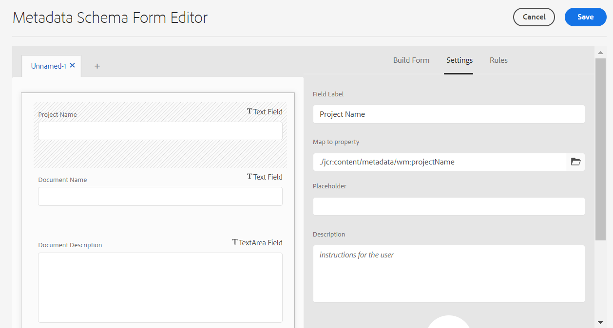

# Adobe Workfront과 Experience Manager Assets 간의 에셋 메타데이터 매핑 구성 {#asset-metadata-mapping-workfront-aem-assets}

Adobe Workfront과 Experience Manager as a Cloud Service 애플리케이션 간에 에셋 메타데이터 필드를 매핑할 수 있습니다. 메타데이터 필드를 매핑한 결과, Workfront에서 Experience Manager Assets으로 에셋을 전송하면 Experience Manager Assets에서 매핑된 에셋 메타데이터를 볼 수 있습니다.

예를 들어 이미지를 Workfront으로 보낼 때 Experience Manager Assets에서 이름, 설명 및 이미지가 속한 프로젝트와 같은 이미지에 대한 메타데이터 필드를 유지해야 하는 경우 이러한 필드를 구성하고 Experience Manager Assets 속성에 매핑합니다.

**사용 사례**

이미지 `add-users-workfront.png` 다음에 있음: `Metadata Syncs` Adobe Workfront 애플리케이션의 프로젝트입니다. 다음 메타데이터를 사용하여 해당 이미지를 Experience Manager Assets에 as a Cloud Service으로 전송해야 합니다.

* 프로젝트 이름

* 문서 이름

* 문서 설명

## 사전 요구 사항 {#prerequisites}

* 관리자가 Workfront 및 Experience Manager Assets as a Cloud Service 애플리케이션에 액세스할 수 있습니다.

* 다음 사이에 통합 [Workfront 및 Experience Manager Assets as a Cloud Service 애플리케이션](https://one.workfront.com/s/document-item?bundleId=the-new-workfront-experience&amp;topicId=Content%2FDocuments%2FAdobe_Workfront_for_Experience_Manager_Assets_Essentials%2Fsetup-asset-essentials.htm&amp;_LANG=enus).

## Workfront에서 메타데이터 매핑 설정 {#set-up-metadata-mapping}

Workfront의 프로젝트 이름, 문서 이름 및 문서 설명 필드에 대한 메타데이터 매핑을 설정하려면 다음을 수행하십시오.

1. 메인 메뉴 아이콘 클릭  Adobe Workfront 애플리케이션의 오른쪽 상단에서 사용 가능한 다음 을 클릭합니다. **[!UICONTROL 설정]**.

1. 선택 **[!UICONTROL 문서]** 왼쪽 패널에서 을 선택합니다. **[!UICONTROL Experience Manager Assets]**.

1. Experience Manager Assets 통합을 선택하고 **[!UICONTROL 편집]**.

1. 클릭 **[!UICONTROL 메타데이터]**. 다음에서 **[!UICONTROL 에셋]** 탭, 매핑 [!UICONTROL 프로젝트] > [!UICONTROL 이름] 에 대한 Workfront 필드 `wm:projectName` Experience Manager Assets 필드. Adobe 정확한 일치 항목을 찾지 못한 경우 Workfront 및 Experience Manager Assets 필드를 매핑할 수 있는 가장 적합한 항목을 찾는 것이 좋습니다. 서로 다른 데이터 유형의 필드를 매핑하지 않아도 됩니다. 예를 들어 날짜 Workfront 필드를 설명 에셋 필드에 매핑합니다.
1. 매핑 [!UICONTROL 문서] > [!UICONTROL 이름] 에 대한 Workfront 필드 `wm:documentName` Experience Manager Assets 필드.

   

1. 매핑 [!UICONTROL 문서] > [!UICONTROL 설명] 에 대한 Workfront 필드 `dc:description` Experience Manager Assets 필드.

   >[!VIDEO](https://video.tv.adobe.com/v/344255)

## Workfront에서 Experience Manager Assets으로 이미지 보내기 {#send-image-workfront-assets}

Workfront에서 Experience Manager Assets으로 이미지를 전송하려면 다음을 수행하십시오.

1. 메인 메뉴 아이콘 클릭  Adobe Workfront 애플리케이션의 오른쪽 상단에서 사용 가능한 다음 을 클릭합니다. **[!UICONTROL 프로젝트]**.

1. 클릭 **[!UICONTROL 새 프로젝트]** 을 클릭하여 프로젝트를 만듭니다.

1. 클릭 **[!UICONTROL 문서]** 왼쪽 창에서 사용할 수 있는 옵션을 드래그한 다음 Experience Manager Assets으로 보내야 하는 이미지를 선택합니다.

1. 클릭 **[!UICONTROL 전송 대상]**&#x200B;그런 다음 Experience Manager Assets Essentials 통합 이름을 선택합니다.

   

1. 에셋의 대상 폴더를 선택한 다음 **[!UICONTROL 폴더 선택]**.

1. **[!UICONTROL 저장]**&#x200B;을 클릭합니다.

## Experience Manager as a Cloud Service으로 에셋 메타데이터 매핑 구성 {#metadata-mapping-aem}

다음 이후 [Adobe Workfront에서 에셋 메타데이터 매핑 구성](#set-up-metadata-mapping)이미지에 적합한 메타데이터 결과를 표시하려면 Experience Manager Assets as a Cloud Service 애플리케이션에서 동일한 매핑을 사용해야 합니다.

메타데이터 매핑은 Experience Manager Assets의 메타데이터 스키마를 사용하여 수행됩니다. 새로 추가된 메타데이터 스키마 양식 또는 기존 메타데이터 스키마 양식을 편집할 수 있습니다. 메타데이터 스키마 양식에는 탭과 탭 내의 양식 항목이 포함됩니다. 이러한 양식 항목을 CRX 저장소의 메타데이터 노드 내에 있는 필드에 매핑/구성할 수 있습니다. 메타데이터 스키마 양식에 탭이나 양식 항목을 추가할 수 있습니다. 자세한 내용은 [메타데이터 스키마](metadata-schemas.md).

Experience Manager Assets as a Cloud Service에서 새 메타데이터 양식을 사용하여 메타데이터 매핑을 구성하려면 다음 작업을 수행하십시오.

1. 다음으로 이동 **[!UICONTROL 도구]** > **[!UICONTROL 에셋]** > **[!UICONTROL 메타데이터 스키마]**.

1. 클릭 **[!UICONTROL 만들기]** 을 클릭합니다. 대화 상자에서 스키마 양식의 제목을 입력하고 를 클릭합니다 **[!UICONTROL 만들기]** 을 클릭하여 양식 만들기 프로세스를 완료합니다.

1. 스키마 양식을 선택하고 **[!UICONTROL 편집]**.

1. (선택 사항) 메타데이터 스키마 양식 편집기에서 `+` 을 클릭하여 Workfront 필드에 대한 탭을 만듭니다.

1. 다음을 클릭합니다. **[!UICONTROL 양식 작성]** 탭을 누른 다음 드래그 **[!UICONTROL 한 줄 텍스트]** 구성 요소를 양식에 추가합니다. 양식에서 구성 요소를 클릭합니다. 다음에서 **[!UICONTROL 양식 작성]** 탭:

   1. 지정 `Project Name` 다음에서 **[!UICONTROL 필드 레이블]** 필드.

   1. 지정 `./jcr:content/metadata/wm:projectName` 다음에서 **[!UICONTROL 속성에 매핑]** 필드. 가이드라인으로서, 다음 템플릿을 사용하여 Experience Manager Assets의 필드 매핑을 정의합니다.
      `./jcr:content/metadata/<mapping defined for the field in workfront>`

      Workfront에서 매핑을 구성하는 동안 매핑했습니다. `wm:projectName` Experience Manager Assets 필드에서 프로젝트 > 이름 Workfront 필드로 이동합니다.

      `wm` 는 네임스페이스 이름을 참조하고 `projectName` 는 속성 제목을 나타냅니다. 사용 `namespace:propertyTitle` 메타데이터 필드 매핑을 정의하는 형식입니다.

      

1. 다음을 클릭합니다. **[!UICONTROL 양식 작성]** 탭을 누른 다음 드래그 **[!UICONTROL 한 줄 텍스트]** 구성 요소를 양식에 추가합니다. 양식에서 구성 요소를 클릭합니다. 다음에서 **[!UICONTROL 양식 작성]** 탭:

   1. 지정 `Document Name` 다음에서 **[!UICONTROL 필드 레이블]** 필드.

   1. 지정 `./jcr:content/metadata/wm:documentName` 다음에서 **[!UICONTROL 속성에 매핑]** 필드.
Workfront에서 매핑을 구성하는 동안 매핑했습니다. `wm:documentName` Experience Manager Assets 필드에서 문서 > 이름 Workfront 필드로 이동합니다.

1. 다음을 클릭합니다. **[!UICONTROL 양식 작성]** 탭을 누른 다음 드래그 **[!UICONTROL 여러 줄 텍스트]** 구성 요소를 양식에 추가합니다. 양식에서 구성 요소를 클릭합니다. 다음에서 **[!UICONTROL 양식 작성]** 탭:

   1. 지정 `Document Description` 다음에서 **[!UICONTROL 필드 레이블]** 필드.

   1. 지정 `./jcr:content/metadata/dc:description` 다음에서 **[!UICONTROL 속성에 매핑]** 필드.
Workfront에서 매핑을 구성하는 동안 매핑했습니다. `dc:description` Experience Manager Assets 필드에서 문서 > 설명 Workfront 필드로 이동합니다.

1. 클릭 **[!UICONTROL 저장]** 변경 내용을 저장합니다.

   >[!VIDEO](https://video.tv.adobe.com/v/344314)

## 이미지 폴더에 메타데이터 설정 적용 {#apply-metadata-settings-image-folder}

Experience Manager as a Cloud Service 애플리케이션에서 메타데이터 설정을 구성한 후 해당 설정을 [Workfront 애플리케이션에서 전송된 이미지가 포함된 폴더](#send-image-workfront-assets).

이미지 폴더에 메타데이터 설정을 적용하려면 다음을 수행합니다.

1. 다음으로 이동 **[!UICONTROL 도구]** > **[!UICONTROL 에셋]** > **[!UICONTROL 메타데이터 스키마]**.

1. 사용 가능한 목록에서 메타데이터 스키마를 선택하고 **[!UICONTROL 폴더에 적용]**.

1. 대상 폴더를 선택하십시오. [이미지가 Adobe Workfront 애플리케이션에서 전송됩니다](#send-image-workfront-assets) 및 클릭 **[!UICONTROL 적용]**.

Experience Manager Assets에서 이미지로 이동하여 이미지와 관련된 메타데이터를 볼 수 있습니다. 이미지를 선택하고 **[!UICONTROL 속성]** 이미지 메타데이터를 봅니다.

**추가 참조**

* [자산 번역](translate-assets.md)
* [Assets HTTP API](mac-api-assets.md)
* [자산이 지원되는 파일 형식](file-format-support.md)
* [자산 검색](search-assets.md)
* [연결된 자산](use-assets-across-connected-assets-instances.md)
* [자산 보고서](asset-reports.md)
* [메타데이터 스키마](metadata-schemas.md)
* [자산 다운로드](download-assets-from-aem.md)
* [메타데이터 관리](manage-metadata.md)
* [검색 패싯](search-facets.md)
* [컬렉션 관리](manage-collections.md)
* [일괄 메타데이터 가져오기](metadata-import-export.md)
