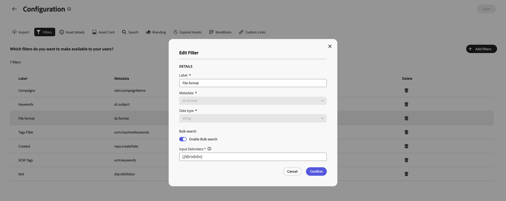

# Content Hub 사용자 인터페이스 구성 {#configure-content-hub-user-interface}

>[!CONTEXTUALHELP]
>id="configure_content_hub"
>title="Content Hub 사용자 인터페이스 구성"
>abstract="Experience Manager Assets를 통해 관리자는 Content Hub 사용자 인터페이스에서 사용 가능한 옵션을 구성할 수 있습니다. 관리자가 선택한 구성 옵션에 따라 Content Hub 사용자는 Content Hub에서 필드를 조회할 수 있습니다. 구성 옵션에는 자산을 가져올 때의 메타데이터, 필터, 자산 속성, 자산을 검색할 때의 메타데이터, 개인화된 브랜딩 및 모든 사용자 정의 링크가 포함됩니다."
>additional-url="https://images-tv.adobe.com/mpcv3/4477/74a81d1c-0cfe-41f4-8a06-18ff70604e45_1732023385.854x480at800_h264.mp4" text="비디오 시청"

<!--  -->

Experience Manager Assets를 통해 관리자는 Content Hub 사용자 인터페이스에서 사용 가능한 옵션을 구성할 수 있습니다. 관리자가 선택한 구성 옵션에 따라 Content Hub 사용자는 Content Hub에서 필드를 조회할 수 있습니다. 구성 옵션은 다음과 같습니다.

* 에셋을 검색하는 동안 사용자가 사용할 수 있는 필터.

* 각 에셋에 대해 사용할 수 있는 에셋 세부 정보 또는 속성.

* Content Hub에 에셋을 추가하는 동안 사용자가 사용할 수 있는 메타데이터 필드.

* Content Hub에서 검색할 수 있는 에셋 메타데이터 필드입니다.

* 조직에 표시해야 하는 브랜딩 콘텐츠입니다.

* 에셋, 컬렉션 및 인사이트 외에 Content Hub에 포함해야 하는 모든 사용자 지정 링크입니다.

## 사전 요구 사항 {#prerequisites-configuration-ui}

[Content Hub 관리자](/help/assets/deploy-content-hub.md#step-3-onboard-content-hub-administrator)는 조직 내의 다른 사용자에 대한 구성 옵션을 설정할 수 있습니다.

## Content Hub의 구성 옵션 액세스 {#access-configuration-options-content-hub}

Content Hub에서 구성 옵션에 액세스하려면 다음을 수행하십시오.

1. 오른쪽 창의 사용자 아이콘을 클릭합니다.

1. **[!UICONTROL 제품 설정]** 섹션에서 **[!UICONTROL 구성]**&#x200B;을 선택합니다.

   

## Content Hub에서 구성 옵션 관리 {#manage-configuration-options}

관리자는 사용자에 대해 다음 구성 옵션을 관리합니다.

* [가져오기](#configure-import-options-content-hub)

* [필터](#configure-filters-content-hub)

* [자산 세부 정보](#configure-asset-details-content-hub)
* [자산 카드](#asset-card)

* [검색](#configure-metadata-search-content-hub)

* [브랜딩](#configure-branding-content-hub)

* [만료된 자산](#expired-assets-content-hub)

* [렌디션](#renditions-content-hub)

* [사용자 정의 링크](#configure-custom-links-content-hub)

* [컬렉션 및 공유](#configure-collections-content-hub)

<!--* [Enable public link sharing](#enable-public-link-sharing)-->

### 가져오기 {#configure-import-options-content-hub}

Content Hub 포털에 자산을 업로드하거나 가져오는 동안 사용자에게 표시되는 메타데이터 필드(예: 캠페인 이름, 키워드, 채널, 일정, 지역 등)를 구성할 수 있습니다. 이렇게 하려면 다음 단계를 실행합니다.

1. [구성](#access-configuration-options-content-hub) 사용자 인터페이스에서 **[!UICONTROL 가져오기]**&#x200B;를 클릭합니다.

1. **[!UICONTROL 메타데이터 추가]**&#x200B;를 클릭합니다.

1. 속성에 대한 레이블을 지정하고 **[!UICONTROL 메타데이터]** 필드를 사용하여 속성에 매핑한 다음 새 자산 메타데이터에 대한 입력 유형을 선택합니다.

1. **[!UICONTROL 필수 필드]** 전환을 클릭하여 새 자산을 업로드하는 동안 사용자에 대해 새 메타데이터 필드를 지정해야 합니다.

1. **[!UICONTROL 확인]**&#x200B;을 클릭합니다. 새 메타데이터가 기존 에셋 속성 목록에 표시됩니다.

1. 변경 내용을 적용하려면 **[!UICONTROL 저장]**&#x200B;을 클릭하세요.

마찬가지로 사용 가능한 각 속성 옆에 있는 을 클릭하여 레이블을 편집하거나, **[!UICONTROL 필수 필드]** 전환을 사용하여 에셋을 업로드하는 동안 이러한 필드를 사용자에게 필수 또는 비필수로 설정하거나, 삭제 아이콘을 클릭하여 메타데이터 속성을 삭제할 수 있습니다.

Experience Manager Assets 저장소에 추가하는 모든 자산을 Content Hub에서 즉시 사용할 수 있도록 자동 승인해야 하는 경우 **[!UICONTROL 자동 승인]** 전환을 클릭합니다. 그렇지 않으면 DAM 작성자 또는 관리자가 Content Hub에서 사용할 수 있도록 에셋을 수동으로 승인해야 합니다. 토글(Toggle)은 기본적으로 꺼짐(Off) 상태로 설정됩니다.

변경 사항을 적용하려면 모든 수정 작업을 수행한 후 **[!UICONTROL 저장]**&#x200B;을 클릭하세요.

구성 사용자 인터페이스에서 활성화된 메타데이터는 에셋 업로드 페이지에 표시됩니다.

### 필터 {#configure-filters-content-hub}

Content Hub을 사용하면 관리자가 에셋을 검색하는 동안 표시되는 필터를 구성할 수 있습니다. 다음 단계를 실행하여 새 필터를 추가합니다.

1. [구성](#access-configuration-options-content-hub) 사용자 인터페이스에서 **[!UICONTROL 필터]**&#x200B;를 클릭합니다.

1. **[!UICONTROL 필터 추가]**&#x200B;를 클릭합니다.

1. 필터에 대한 레이블을 지정하고, **[!UICONTROL 메타데이터]** 필드를 사용하여 해당 레이블을 속성에 매핑한 다음 새 필터에 대한 입력 유형을 선택하십시오.
1. **[!UICONTROL 확인]**&#x200B;을 클릭합니다. 새 필터가 기존 필터 목록에 표시됩니다.

1. 자산을 필터링하는 동안 검색 페이지에 새 필터가 표시되도록 변경 내용을 적용하려면 **[!UICONTROL 저장]**&#x200B;을 클릭하십시오.

   >[!NOTE]
   >
   >저장소에 필터 기준과 일치하는 에셋이 하나 이상 있는 경우에만 새 필터가 검색 페이지에 표시됩니다.

마찬가지로 사용 가능한 각 필터 옆에 있는 을 클릭하여 레이블을 편집하거나 삭제 아이콘을 클릭하여 기존 필터를 삭제할 수 있습니다. 변경 사항을 적용하려면 모든 수정 작업을 수행한 후 **[!UICONTROL 저장]**&#x200B;을 클릭하세요.

구성 사용자 인터페이스에서 활성화된 필터가 [검색] 페이지에 표시됩니다.

#### 일괄 검색 {#bulk-search-configuration}

[!DNL Content Hub]에서 한 번에 여러 자산을 검색할 수 있도록 설정하려면 아래 단계를 수행하십시오.

1. [구성](#access-configuration-options-content-hub) 사용자 인터페이스에서 **[!UICONTROL 필터]**&#x200B;를 클릭합니다.

1. 사용 가능한 각 필터 옆의 사용 가능 아이콘을 클릭합니다.

1. **[!UICONTROL 일괄 검색]** 전환을 사용하도록 설정합니다. 기본 구분 기호 `[ , | \t | \r\n | \r | \n ]`이(가) 자동으로 표시됩니다. 또한 구분 기호를 추가할 수도 있습니다. 이렇게 하려면 `pipe symbol (|)`(으)로 구분된 입력 상자에 구분 기호를 지정합니다.

   

1. 변경 내용을 저장하려면 **[!UICONTROL 확인]**&#x200B;을 클릭합니다. 작동 중인 [Content Hub에서 일괄 검색](search-assets-content-hub.md#bulk-search)을 참조하세요.

### 자산 세부 정보 {#configure-asset-details-content-hub}

파일 이름, 제목, 형식, 크기 등과 같은 각 에셋에 대해 표시되는 에셋 속성을 구성할 수도 있습니다. 이렇게 하려면 다음 단계를 실행합니다.

1. [구성](#access-configuration-options-content-hub) 사용자 인터페이스에서 **[!UICONTROL 자산 세부 정보]**&#x200B;를 클릭합니다.

1. **[!UICONTROL 메타데이터 추가]**&#x200B;를 클릭합니다.

1. 속성에 대한 레이블을 지정하고 **[!UICONTROL 메타데이터]** 필드를 사용하여 속성에 매핑한 다음 새 자산 메타데이터에 대한 입력 유형을 선택합니다.
1. **[!UICONTROL 확인]**&#x200B;을 클릭합니다. 새 메타데이터가 기존 에셋 속성 목록에 표시됩니다.

1. **[!UICONTROL 저장]**&#x200B;을 클릭하여 새 속성이 자산 세부 정보 페이지에 표시되도록 변경 내용을 적용합니다.

마찬가지로 사용 가능한 각 속성 옆에 있는 을 클릭하여 레이블을 편집하거나 삭제 아이콘을 클릭하여 기존 에셋 세부 정보를 삭제할 수 있습니다. 변경 사항을 적용하려면 모든 수정 작업을 수행한 후 **[!UICONTROL 저장]**&#x200B;을 클릭하세요.

구성 사용자 인터페이스에서 활성화된 속성이 [자산 세부 정보] 페이지에 표시됩니다.

### 자산 카드 {#asset-card}

최대 6개의 필드를 **자산 카드**&#x200B;에 표시해야 하는 주요 메타데이터 속성을 구성할 수도 있습니다.
자산 카드의 
다음 단계를 실행하여 메타데이터 속성을 구성하여 **[!UICONTROL 자산 카드]**&#x200B;에 표시합니다.

1. [구성](#access-configuration-options-content-hub) 사용자 인터페이스에서 **자산 카드**&#x200B;를 클릭합니다.
2. **메타데이터 추가**&#x200B;를 클릭합니다. **자산 카드 메타데이터 추가** 대화 상자가 표시됩니다.
3. **레이블** 필드에 메타데이터 이름을 지정하고 **메타데이터** 필드에서 메타데이터 속성을 선택합니다.
4. **확인**&#x200B;을 클릭한 다음 **저장**&#x200B;을 클릭하여 자산 세부 정보 페이지에 새 속성이 표시되도록 변경 사항을 적용합니다.
   
마찬가지로 사용 가능한 각 속성 옆에 있는 을 클릭하여 필요한 수정 작업을 수행하거나 를 클릭하여 기존 메타데이터 속성을 삭제합니다. 변경 사항을 적용하려면 모든 수정 작업을 수행한 후 **저장**&#x200B;을 클릭하세요.

### 검색 {#configure-metadata-search-content-hub}

관리자는 사용자가 Content Hub에서 검색 기준을 지정할 때 검색되는 메타데이터 필드를 정의할 수 있습니다. 다음 단계를 실행합니다.

1. [구성](#access-configuration-options-content-hub) 사용자 인터페이스에서 **[!UICONTROL 메타데이터 추가]**&#x200B;를 클릭합니다.

1. 메타데이터 필드를 지정하고 **[!UICONTROL 확인]**&#x200B;을 클릭합니다.

1. 새 메타데이터 속성이 메타데이터 필드 목록에 표시되도록 변경 사항을 적용하려면 **[!UICONTROL 저장]**&#x200B;을 클릭하십시오.

마찬가지로 사용 가능한 각 메타데이터 속성 옆에 있는 을 클릭하여 속성을 편집하거나 삭제 아이콘을 클릭하여 기존 속성을 삭제할 수 있습니다. 변경 사항을 적용하려면 모든 수정 작업을 수행한 후 **[!UICONTROL 저장]**&#x200B;을 클릭하세요.

### 브랜딩 {#configure-branding-content-hub}

관리자는 브랜딩 요구 사항에 맞게 [!DNL Content Hub] 포털을 사용자 지정합니다.

 **[!UICONTROL 브랜딩]** 페이지에서 **[!UICONTROL 배너]**, **[!UICONTROL 색상]** 및 **[!UICONTROL 배너 이미지]** 섹션을 사용하여 다음 사용자 지정을 실행하십시오.

1. [[!UICONTROL 로고 이미지] 섹션에서 로고 이미지 변경](#Change-the-logo-image)
1. [[!UICONTROL 배너 이미지] 섹션에서 배너 이미지 변경](#Change-the-banner-image)
1. [배너의 제목과 본문을 업데이트하고 [!UICONTROL 배너] 섹션에서 텍스트 색을 변경합니다.](#Add-title-and-body-text-to-your-banner-and-change-the-text-color)
1. [기본 및 보조 색상을 [!UICONTROL 색상] 섹션에서 변경하여 브랜드 테마에 맞는 색 구성표를 적용하십시오](#Change-the-primary-and-secondary-color)

변경 내용을 되돌리고 기본 테마를 복원하려면 **[!UICONTROL 기본값 재설정]** 옵션을 선택하십시오.

#### 로고 이미지 변경{#change-the-logo-image}

 **[!UICONTROL 브랜딩]** 페이지에서 다음 단계를 실행하여 [!DNL Content Hub] 배포의 로고 이미지를 변경합니다.

1. 자산 선택기 대화 상자를 사용하여 로고 이미지를 선택하려면  **[!UICONTROL 이미지 선택]**&#x200B;을 클릭합니다. 에셋 선택기에는 승인된 이미지만 표시됩니다.
1. 이미지를 선택하고 **[!UICONTROL 선택]**&#x200B;을 클릭한 다음 **[!UICONTROL 저장]**&#x200B;을 클릭하여 [!DNL Content Hub] 배포의 로고 이미지로 표시합니다.
   

#### 배너 이미지 변경{#Change-the-banner-image}

 **[!UICONTROL 브랜딩]** 페이지에서 다음 단계를 실행하여 [!DNL Content Hub] 배포의 배너 이미지를 변경합니다.

1. 자산 선택기 대화 상자를 사용하여 배너 이미지를 선택하려면  **[!UICONTROL 갤러리에서 선택]**&#x200B;을 클릭합니다. 에셋 선택기에는 승인된 이미지만 표시됩니다.
1. 이미지를 선택하고 **[!UICONTROL 선택]**&#x200B;을 클릭한 다음 **[!UICONTROL 저장]**&#x200B;을 클릭하여 [!DNL Content Hub] 배포의 배너 이미지로 표시합니다.
   

>[!NOTE]
>
> * **배너 이미지**&#x200B;의 권장 크기는 `height = 200 to 450px` 및 `width = 1920 to 2560px`입니다.
> * **로고 이미지**&#x200B;의 권장 크기는 `height = 80 to 120px` 및 `width = 120 to 200px`입니다.
> * 배너 및 로고 이미지 모두에 대해 **지원되는 MIME 유형**&#x200B;은(는) `'JPG', value: 'image/jpeg'`, `'PNG', value: 'image/png'`, `'WEBP', value: 'image/webp'`, `'TIFF', value: 'image/tiff'`, `'SVG', value: 'image/svg+xml'`, `'GIF', value: 'image/gif'`입니다.

#### 배너에 제목 및 본문 추가 및 텍스트 색상 변경{#Add-title-and-body-text-to-your-banner-and-change-the-text-color}

 **[!UICONTROL 브랜딩]** 페이지에서 **[!UICONTROL 배너]** 섹션의 각 필드를 사용하여 제목과 본문을 배너에 추가하십시오.
**[!UICONTROL 배너 텍스트 색]** 옆에 있는 사각형 상자를 클릭하여 배너 텍스트에 대한 색 선택기에서 텍스트 색을 선택하거나 색 선택기 사각형 상자 옆에 있는 필드에 색의 16진수 코드를 지정합니다.

#### 기본 및 보조 색상 변경{#Change-the-primary-and-secondary-color}

 **[!UICONTROL 브랜딩]** 페이지에서 **[!UICONTROL 색상]** 섹션을 사용하여 기본 및 보조 색상을 설정하거나 색상 선택기를 사용하여 선택하거나 색상의 16진수 코드를 정의합니다. 이러한 색상은 [!DNL Content Hub] UI를 브랜드 테마에 맞게 정렬하기 위해 UI 요소의 배경, 텍스트 및 아이콘 색상을 설정합니다.

**[!UICONTROL 기본 색상]:** 기본 색상 구성표는 선택 작업, 확인란, 검색 창, 토글 스위치와 같은 대화형 요소에 적용되며 [!DNL Content Hub] 홈 페이지 및 [!DNL Content Hub]구성[!UICONTROL &#x200B; 페이지를 포함한 &#x200B;]의 전환 스위치에 적용됩니다. [!DNL Content Hub]모든 Assets **[!UICONTROL 및]**&#x200B;컬렉션&#x200B;**[!UICONTROL 페이지에서 사용할 수 있는 옵션과 같이 기본]** 인터페이스에서 사용할 수 있는 작업 옵션에도 적용됩니다.

**[!UICONTROL 보조 색상]:** [!DNL Content Hub] 홈 페이지에서 보조 색상 구성표가 대화 상자에서 사용할 수 있는 UI 옵션 및 입력 필드에 적용됩니다. 선택 작업, 확인란, 검색 창 및 전환 스위치를 제외한 [!UICONTROL 구성] 페이지에서 사용할 수 있는 모든 구성 메뉴 옵션에 적용됩니다.

### 자산 가시성{#asset-visibility-content-hub}

관리자는 만료된 에셋을 Content Hub에 표시해야 하는지 여부를 제어할 수 있습니다. 만료된 자산이 표시되면 사용자가 해당 자산을 다운로드할 수 있는지 여부도 정의할 수 있습니다.

만료된 에셋은 기본적으로 Content Hub에 표시되지 않습니다.

이렇게 하려면 다음 단계를 실행합니다.

1. [구성](#access-configuration-options-content-hub) 사용자 인터페이스에서 **[!UICONTROL 자산 가시성]**&#x200B;을 클릭합니다.

1. **[!UICONTROL 표시]** 섹션에서 **[!UICONTROL 사용자가 만료된 에셋을 볼 수 있도록 허용]** 전환을 활성화하여 만료된 모든 에셋을 Content Hub에 표시합니다.

1. 에셋의 가시성을 활성화한 후 **[!UICONTROL 사용자가 만료된 에셋을 다운로드할 수 있도록 허용]** 전환을 사용하여 만료된 에셋을 다운로드하는 기능을 활성화하거나 비활성화할 수 있습니다.
1. **[!UICONTROL 사용자가 배달에 대해 승인된 에셋을 볼 수 있도록 허용]** 전환을 활성화하여 Content Hub에서 배달에 대해 승인된 모든 에셋을 표시합니다.
1. 변경 내용을 적용하려면 **[!UICONTROL 저장]**&#x200B;을 클릭하세요.

   

에셋의 가시성을 활성화한 후 다음 이미지에 표시된 대로 Content Hub에서 만료된 에셋을 볼 수 있습니다.

관리자가 다운로드를 활성화한 경우 Content Hub 사용자는 이미지에 강조 표시된 대로 다운로드할 수도 있습니다.

만료된 에셋에 대한 가시성이 활성화된 경우 Content Hub에서는 에셋 카드의 `Expiring in n days` 메시지를 사용하여 향후 15일 이내에 만료되는 에셋도 강조 표시합니다.

### 렌디션 {#renditions-content-hub}

렌디션은 최적의 성능을 보장하기 위해 다양한 디바이스 및 플랫폼에 맞게 디자인된 이미지, 문서 등과 같은 디지털 에셋의 사용자 지정 버전입니다. Adobe Experience Manager Assets의 [렌디션](https://experienceleague.adobe.com/en/docs/experience-manager-cloud-service/content/assets/assets-view/renditions)에 대해 자세히 알아보세요.

이렇게 하려면 다음 단계를 실행합니다.

[구성](#access-configuration-options-content-hub) 사용자 인터페이스에서 **[!UICONTROL 표현물]**&#x200B;을(를) 클릭합니다. 다음 옵션을 사용할 수 있습니다.

* [!UICONTROL 렌디션의 사용 가능] 전환을 활성화하여 모든 렌디션을 Content Hub에 표시합니다.

* **[!UICONTROL 사용자가 원본 에셋을 다운로드할 수 있도록 허용]** 토글을 활성화하거나 비활성화하여 원본 에셋 다운로드 가능 여부를 제어합니다.

  

Content Hub에서 렌디션을 보고 다운로드하는 방법에 대한 자세한 내용은 [Content Hub에서 에셋 다운로드](/help/assets/download-assets-content-hub.md)를 참조하십시오.

### 사용자 정의 링크 {#configure-custom-links-content-hub}

배너 바로 아래에 있는 Content Hub 포털에서 표준 **[!UICONTROL 모든 Assets]**, **[!UICONTROL 컬렉션]** 및 **[!UICONTROL 인사이트]** 탭 외에 사용자 지정 탭을 추가할 수도 있습니다. 이렇게 하려면 다음 단계를 실행합니다.

1. [구성](#access-configuration-options-content-hub) 사용자 인터페이스에서 **[!UICONTROL 사용자 지정 링크]**&#x200B;를 클릭합니다.

1. **[!UICONTROL 링크 추가]**&#x200B;를 클릭합니다.

1. **[!UICONTROL 레이블]** 및 **[!UICONTROL URL]** 필드에 텍스트를 지정하십시오. 정의한 레이블은 탭으로 표시되고 레이블을 클릭하면 **[!UICONTROL URL]** 필드에 정의된 URL로 이동합니다.

1. **[!UICONTROL 확인]**&#x200B;을 클릭합니다.

1. 변경 내용을 적용하려면 **[!UICONTROL 저장]**&#x200B;을 클릭하세요.

마찬가지로 각 URL 옆에 있는 을 클릭하여 링크를 편집하거나 삭제 아이콘을 클릭하여 기존 URL을 삭제할 수 있습니다. 변경 사항을 적용하려면 모든 수정 작업을 수행한 후 **[!UICONTROL 저장]**&#x200B;을 클릭하세요.

사용자 지정 링크는 Content Hub 홈 페이지의 Insights 탭 옆에 새 탭으로 표시됩니다.

### 컬렉션 및 공유 {#configure-collections-content-hub}

관리자는 컬렉션을 만드는 동안 사용자 권한을 정의할 수 있습니다. 이러한 설정을 활성화하려면 다음 단계를 수행합니다.

1. [구성](#access-configuration-options-content-hub) 사용자 인터페이스에서 **[!UICONTROL 컬렉션]**&#x200B;을(를) 클릭합니다.

1. 외부 사용자가 Content Hub에 로그인하지 않고도 에셋에 액세스하고 다운로드하는 데 사용할 수 있는 공개 링크를 만들 수 있도록 **[!UICONTROL 공개 링크 사용]** 토글을 활성화합니다.

1. 모든 사용자가 액세스할 수 있지만 작성자와 관리자만 편집할 수 있는 컬렉션을 허용하도록 **[!UICONTROL 컬렉션만 보기]** 전환을 활성화합니다.

1. 모든 사용자가 액세스할 수 있고 편집할 수 있는 컬렉션을 허용하도록 **[!UICONTROL 공용 컬렉션]** 토글을 활성화합니다. **[!UICONTROL 컬렉션만 보기]** 및 **[!UICONTROL 공용 컬렉션]** 전환이 비활성화된 경우 기본적으로 관리자가 아닌 사용자는 전용 컬렉션만 만들 수 있습니다.

1. 변경 내용을 적용하려면 **[!UICONTROL 저장]**&#x200B;을 클릭하세요.

   

<!--
### Enable public link sharing {#enable-public-link-sharing}

Enable the following setting on the Configurations user interface to allow Content Hub users to generate a public link:

1. On the [Configurations](#access-configuration-options-content-hub) user interface, click **[!UICONTROL Collections and Sharing]**.

1. Enable the **[!UICONTROL Enable Public Link]** toggle and click **[!UICONTROL Save]** to apply the changes.

    

-->

[에서  [!DNL Content Hub]](share-assets-content-hub.md)에셋 공유에 대해 자세히 알아보세요.

