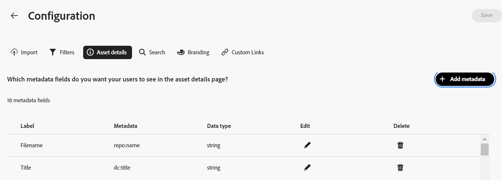

# Content Hub 사용자 인터페이스 구성 {#configure-content-hub-user-interface}

<!--  -->

Experience Manager Assets을 사용하면 관리자가 Content Hub 사용자 인터페이스에서 사용할 수 있는 옵션을 구성할 수 있습니다. 관리자가 선택한 구성 옵션에 따라 Content Hub 사용자는 Content Hub의 필드를 볼 수 있습니다. 구성 옵션은 다음과 같습니다.

* 에셋을 검색하는 동안 사용자가 사용할 수 있는 필터.

* 각 에셋에 대해 사용할 수 있는 에셋 세부 정보 또는 속성.

* Content Hub에 에셋을 추가하는 동안 사용자가 사용할 수 있는 메타데이터 필드.

* Content Hub에서 검색할 수 있는 에셋 메타데이터 필드입니다.

* 조직에 표시해야 하는 브랜딩 콘텐츠입니다.

* 에셋, 컬렉션 및 인사이트 외에 Content Hub에 포함해야 하는 모든 사용자 지정 링크입니다.

## 사전 요구 사항 {#prerequisites-configuration-ui}

[Content Hub 관리자](/help/assets/deploy-content-hub.md#step-3-onboard-content-hub-administrator) 는 조직 내의 다른 사용자에 대한 구성 옵션을 설정할 수 있습니다.

## Content Hub의 구성 옵션 액세스 {#access-configuration-options-content-hub}

Content Hub에서 구성 옵션에 액세스하려면 다음을 수행하십시오.

1. 오른쪽 창에서 사용자 아이콘을 클릭합니다.

1. 다음에서 **[!UICONTROL 제품 설정]** 섹션, 선택 **[!UICONTROL 구성]**.

   

## Content Hub에서 구성 옵션 관리 {#manage-configuration-options}

사용자를 위한 다음 구성 옵션을 관리합니다.

* [가져오기](#configure-import-options-content-hub)

* [필터](#configure-filters-content-hub)

* [에셋 세부 정보](#configure-asset-details-content-hub)

* [검색](#configure-metadata-search-content-hub)

* [브랜딩](#configure-branding-content-hub)

* [사용자 정의 링크](#configure-custom-links-content-hub)

### 가져오기 {#configure-import-options-content-hub}

Content Hub 포털에 자산을 업로드하거나 가져오는 동안 사용자에게 표시되는 메타데이터 필드(예: 캠페인 이름, 키워드, 채널, 일정, 지역 등)를 구성할 수 있습니다. 이렇게 하려면 다음 단계를 실행합니다.

1. 다음에서 [구성](#access-configuration-options-content-hub) 사용자 인터페이스, 클릭 **[!UICONTROL 가져오기]**.

1. 클릭 **[!UICONTROL 메타데이터 추가]**.

1. 속성에 대한 레이블을 지정하고 다음을 사용하여 속성에 매핑합니다 **[!UICONTROL 메타데이터]** 필드에 새 에셋 메타데이터의 입력 유형을 선택합니다.

1. 다음을 클릭합니다. **[!UICONTROL 필수 필드]** 토글 - 새 자산을 업로드하는 동안 사용자에게 새 메타데이터 필드를 지정해야 합니다.

1. 클릭 **[!UICONTROL 확인]**. 새 메타데이터가 기존 에셋 속성 목록에 표시됩니다.

1. 클릭 **[!UICONTROL 저장]** 를 눌러 변경 사항을 적용합니다.

마찬가지로 다음을 클릭할 수 있습니다 사용 가능한 각 속성 옆에 있는 에서 레이블을 편집할 수 있습니다. 을 사용하여 에셋을 업로드하는 동안 이러한 필드를 사용자에게 필수 또는 비필수로 설정하십시오. **[!UICONTROL 필수 필드]** 메타데이터 속성을 삭제하려면 전환하거나 삭제 아이콘을 클릭합니다.

다음을 클릭합니다. **[!UICONTROL 자동 승인]** Experience Manager Assets 저장소에 추가하는 모든 에셋을 Content Hub에서 즉시 사용할 수 있도록 자동 승인해야 하는 경우 전환합니다. 그렇지 않으면 DAM 작성자 또는 관리자가 Content Hub에서 사용할 수 있도록 에셋을 수동으로 승인해야 합니다. 토글(Toggle)은 기본적으로 꺼짐(Off) 상태로 설정됩니다.

클릭 **[!UICONTROL 저장]** 모든 수정 작업을 수행하여 변경 사항을 적용한 후.

구성 사용자 인터페이스에서 활성화된 메타데이터는 에셋 업로드 페이지에 표시됩니다.

### 필터 {#configure-filters-content-hub}

Content Hub을 사용하면 관리자가 에셋을 검색하는 동안 표시되는 필터를 구성할 수 있습니다. 다음 단계를 실행하여 새 필터를 추가합니다.

1. 다음에서 [구성](#access-configuration-options-content-hub) 사용자 인터페이스, 클릭 **[!UICONTROL 필터]**.

1. 클릭 **[!UICONTROL 필터 추가]**.

1. 필터에 대한 레이블을 지정하고 다음을 사용하여 속성에 매핑합니다 **[!UICONTROL 메타데이터]** 필드에 새 필터의 입력 유형을 선택합니다.
1. 클릭 **[!UICONTROL 확인]**. 새 필터가 기존 필터 목록에 표시됩니다.

1. 클릭 **[!UICONTROL 저장]** 을 클릭하여 자산을 필터링하는 동안 검색 페이지에 새 필터가 표시되도록 변경 사항을 적용합니다.

   >[!NOTE]
   >
   >저장소에 필터 조건과 일치하는 에셋이 하나 이상 있는 경우에만 새 필터가 검색 페이지에 표시됩니다.

마찬가지로 다음을 클릭할 수 있습니다 사용 가능한 각 필터 옆에서 레이블을 편집하거나 삭제 아이콘을 클릭하여 기존 필터를 삭제할 수 있습니다. 클릭 **[!UICONTROL 저장]** 모든 수정 작업을 수행하여 변경 사항을 적용한 후.

구성 사용자 인터페이스에서 활성화된 필터가 [검색] 페이지에 표시됩니다.

### 에셋 세부 정보 {#configure-asset-details-content-hub}

파일 이름, 제목, 형식, 크기 등과 같은 각 에셋에 대해 표시되는 에셋 속성을 구성할 수도 있습니다. 이렇게 하려면 다음 단계를 실행합니다.

1. 다음에서 [구성](#access-configuration-options-content-hub) 사용자 인터페이스, 클릭 **[!UICONTROL 자산 세부 사항]**.

1. 클릭 **[!UICONTROL 메타데이터 추가]**.

1. 속성에 대한 레이블을 지정하고 다음을 사용하여 속성에 매핑합니다 **[!UICONTROL 메타데이터]** 필드에 새 에셋 메타데이터의 입력 유형을 선택합니다.
1. 클릭 **[!UICONTROL 확인]**. 새 메타데이터가 기존 에셋 속성 목록에 표시됩니다.

1. 클릭 **[!UICONTROL 저장]** 새 속성이 에셋 세부 사항 페이지에 표시되도록 변경 사항을 적용합니다.

마찬가지로 다음을 클릭할 수 있습니다 사용 가능한 각 속성 옆에 있는 에서 레이블을 편집하거나 삭제 아이콘을 클릭하여 기존 에셋 세부 정보를 삭제할 수 있습니다. 클릭 **[!UICONTROL 저장]** 모든 수정 작업을 수행하여 변경 사항을 적용한 후.

구성 사용자 인터페이스에서 활성화된 속성이 [자산 세부 정보] 페이지에 표시됩니다.

### 검색 {#configure-metadata-search-content-hub}

관리자는 사용자가 Content Hub에서 검색 기준을 지정할 때 검색되는 메타데이터 필드를 정의할 수 있습니다. 다음 단계를 실행합니다.

1. 다음에서 [구성](#access-configuration-options-content-hub) 사용자 인터페이스, 클릭 **[!UICONTROL 메타데이터 추가]**.

1. 메타데이터 필드를 지정하고 다음을 클릭하십시오. **[!UICONTROL 확인]**.

1. 클릭 **[!UICONTROL 저장]** 새 메타데이터 속성이 메타데이터 필드 목록에 표시되도록 변경 사항을 적용합니다.

마찬가지로 다음을 클릭할 수 있습니다 사용 가능한 각 메타데이터 속성 옆에 있는 를 사용하여 속성을 편집하거나 삭제 아이콘을 클릭하여 기존 속성을 삭제할 수 있습니다. 클릭 **[!UICONTROL 저장]** 모든 수정 작업을 수행하여 변경 사항을 적용한 후.

### 브랜딩 {#configure-branding-content-hub}

관리자는 또한 브랜딩 요구 사항에 따라 Content Hub 포털 배너에서 제목과 본문을 개인화할 수 있습니다. 이렇게 하려면 다음 단계를 실행합니다.

1. 다음에서 [구성](#access-configuration-options-content-hub) 사용자 인터페이스, 클릭 **[!UICONTROL 브랜딩]**.

1. 텍스트 지정 위치 **[!UICONTROL 배너의 제목 텍스트]** 및 **[!UICONTROL 배너의 본문]** 필드.

1. 클릭 **[!UICONTROL 저장]** 를 눌러 변경 사항을 적용합니다.

구성 사용자 인터페이스에서 활성화된 브랜딩 업데이트가 Content Hub 포털 배너에 표시됩니다.

### 사용자 정의 링크 {#configure-custom-links-content-hub}

표준 외에 사용자 정의 탭을 추가할 수도 있습니다 **[!UICONTROL 모든 Assets]**, **[!UICONTROL 컬렉션]**, 및 **[!UICONTROL Insights]** 배너 바로 아래에 있는 Content Hub 포털의 탭 이렇게 하려면 다음 단계를 실행합니다.

1. 다음에서 [구성](#access-configuration-options-content-hub) 사용자 인터페이스, 클릭 **[!UICONTROL 사용자 지정 링크]**.

1. 클릭 **[!UICONTROL 링크 추가]**.

1. 텍스트 지정 위치 **[!UICONTROL 레이블]** 및 **[!UICONTROL URL]** 필드. 정의한 레이블은 탭으로 표시되며, 레이블을 클릭하면 다음에 정의된 URL로 이동합니다. **[!UICONTROL URL]** 필드.

1. 클릭 **[!UICONTROL 확인]**.

1. 클릭 **[!UICONTROL 저장]** 를 눌러 변경 사항을 적용합니다.

마찬가지로 다음을 클릭할 수 있습니다 각 URL 옆에 있는 를 사용하여 링크를 편집하거나 삭제 아이콘을 클릭하여 기존 URL을 삭제합니다. 클릭 **[!UICONTROL 저장]** 모든 수정 작업을 수행하여 변경 사항을 적용한 후.

사용자 지정 링크는 Content Hub 홈 페이지의 Insights 탭 옆에 새 탭으로 표시됩니다.

