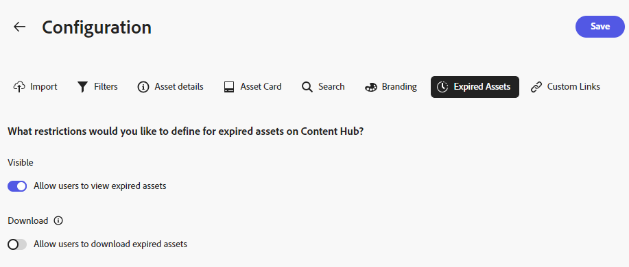

# Content Hub 사용자 인터페이스 구성 {#configure-content-hub-user-interface}

| [모범 사례 검색](/help/assets/search-best-practices.md) | [메타데이터 모범 사례](/help/assets/metadata-best-practices.md) | [Content Hub](/help/assets/product-overview.md) | [OpenAPI 기능 포함 Dynamic Media](/help/assets/dynamic-media-open-apis-overview.md) | [AEM Assets 개발자 설명서](https://developer.adobe.com/experience-cloud/experience-manager-apis/) |
| ------------- | --------------------------- |---------|----|-----|

>[!CONTEXTUALHELP]
>id="configure_content_hub"
>title="Content Hub 사용자 인터페이스 구성"
>abstract="Experience Manager Assets를 통해 관리자는 Content Hub 사용자 인터페이스에서 사용 가능한 옵션을 구성할 수 있습니다. 관리자가 선택한 구성 옵션에 따라 Content Hub 사용자는 Content Hub에서 필드를 조회할 수 있습니다. 구성 옵션에는 자산을 가져올 때의 메타데이터, 필터, 자산 속성, 자산을 검색할 때의 메타데이터, 개인화된 브랜딩 및 모든 사용자 정의 링크가 포함됩니다."

<!--  -->

Experience Manager Assets를 통해 관리자는 Content Hub 사용자 인터페이스에서 사용 가능한 옵션을 구성할 수 있습니다. 관리자가 선택한 구성 옵션에 따라 Content Hub 사용자는 Content Hub에서 필드를 조회할 수 있습니다. 구성 옵션은 다음과 같습니다.

* 에셋을 검색하는 동안 사용자가 사용할 수 있는 필터.

* 각 에셋에 대해 사용할 수 있는 에셋 세부 정보 또는 속성.

* Content Hub에 에셋을 추가하는 동안 사용자가 사용할 수 있는 메타데이터 필드.

* Content Hub에서 검색할 수 있는 에셋 메타데이터 필드입니다.

* 조직에 표시해야 하는 브랜딩 콘텐츠입니다.

* 에셋, 컬렉션 및 인사이트 외에 Content Hub에 포함해야 하는 모든 사용자 지정 링크입니다.

## 사전 요구 사항 {#prerequisites-configuration-ui}

[Content Hub 관리자](/help/assets/deploy-content-hub.md#step-3-onboard-content-hub-administrator)는 조직 내의 다른 사용자에 대한 구성 옵션을 설정할 수 있습니다.

## Content Hub의 구성 옵션 액세스 {#access-configuration-options-content-hub}

Content Hub에서 구성 옵션에 액세스하려면 다음을 수행하십시오.

1. 오른쪽 창에서 사용자 아이콘을 클릭합니다.

1. **[!UICONTROL 제품 설정]** 섹션에서 **[!UICONTROL 구성]**&#x200B;을 선택합니다.

   

## Content Hub에서 구성 옵션 관리 {#manage-configuration-options}

관리자는 사용자에 대해 다음 구성 옵션을 관리합니다.

* [가져오기](#configure-import-options-content-hub)

* [필터](#configure-filters-content-hub)

* [에셋 세부 정보](#configure-asset-details-content-hub)
* [자산 카드](#asset-card)

* [검색](#configure-metadata-search-content-hub)

* [브랜딩](#configure-branding-content-hub)

* [만료된 자산](#expired-assets-content-hub)

* [사용자 정의 링크](#configure-custom-links-content-hub)

### 가져오기 {#configure-import-options-content-hub}

Content Hub 포털에 자산을 업로드하거나 가져오는 동안 사용자에게 표시되는 메타데이터 필드(예: 캠페인 이름, 키워드, 채널, 일정, 지역 등)를 구성할 수 있습니다. 이렇게 하려면 다음 단계를 실행합니다.

1. [구성](#access-configuration-options-content-hub) 사용자 인터페이스에서 **[!UICONTROL 가져오기]**&#x200B;를 클릭합니다.

1. **[!UICONTROL 메타데이터 추가]**&#x200B;를 클릭합니다.

1. 속성에 대한 레이블을 지정하고 **[!UICONTROL 메타데이터]** 필드를 사용하여 속성에 매핑한 다음 새 자산 메타데이터에 대한 입력 유형을 선택합니다.

1. **[!UICONTROL 필수 필드]** 전환을 클릭하여 새 자산을 업로드하는 동안 사용자에 대해 새 메타데이터 필드를 지정해야 합니다.

1. **[!UICONTROL 확인]**&#x200B;을 클릭합니다. 새 메타데이터가 기존 에셋 속성 목록에 표시됩니다.

1. 변경 내용을 적용하려면 **[!UICONTROL 저장]**&#x200B;을 클릭하세요.

마찬가지로, 사용 가능한 각 속성 옆에 있는 을 클릭하여 레이블을 편집하거나, **[!UICONTROL 필수 필드]** 전환을 사용하여 에셋을 업로드하는 동안 이러한 필드를 사용자에게 필수 또는 비필수로 설정하거나, 삭제 아이콘을 클릭하여 메타데이터 속성을 삭제할 수 있습니다.

Experience Manager Assets 저장소에 추가하는 모든 자산을 Content Hub에서 즉시 사용할 수 있도록 자동 승인해야 하는 경우 **[!UICONTROL 자동 승인]** 전환을 클릭합니다. 그렇지 않으면 DAM 작성자 또는 관리자가 Content Hub에서 사용할 수 있도록 에셋을 수동으로 승인해야 합니다. 토글(Toggle)은 기본적으로 꺼짐(Off) 상태로 설정됩니다.

변경 사항을 적용하려면 모든 수정 작업을 수행한 후 **[!UICONTROL 저장]**&#x200B;을 클릭하세요.

구성 사용자 인터페이스에서 활성화된 메타데이터는 에셋 업로드 페이지에 표시됩니다.

### 필터 {#configure-filters-content-hub}

Content Hub을 사용하면 관리자가 에셋을 검색하는 동안 표시되는 필터를 구성할 수 있습니다. 다음 단계를 실행하여 새 필터를 추가합니다.

1. [구성](#access-configuration-options-content-hub) 사용자 인터페이스에서 **[!UICONTROL 필터]**&#x200B;를 클릭합니다.

1. **[!UICONTROL 필터 추가]**&#x200B;를 클릭합니다.

1. 필터에 대한 레이블을 지정하고, **[!UICONTROL 메타데이터]** 필드를 사용하여 해당 레이블을 속성에 매핑한 다음 새 필터에 대한 입력 유형을 선택하십시오.
1. **[!UICONTROL 확인]**&#x200B;을 클릭합니다. 새 필터가 기존 필터 목록에 표시됩니다.

1. 자산을 필터링하는 동안 검색 페이지에 새 필터가 표시되도록 변경 내용을 적용하려면 **[!UICONTROL 저장]**&#x200B;을 클릭하십시오.

   >[!NOTE]
   >
   >저장소에 필터 조건과 일치하는 에셋이 하나 이상 있는 경우에만 새 필터가 검색 페이지에 표시됩니다.

마찬가지로 사용 가능한 각 필터 옆에 있는 을 클릭하여 레이블을 편집하거나 삭제 아이콘을 클릭하여 기존 필터를 삭제할 수 있습니다. 변경 사항을 적용하려면 모든 수정 작업을 수행한 후 **[!UICONTROL 저장]**&#x200B;을 클릭하세요.

구성 사용자 인터페이스에서 활성화된 필터가 [검색] 페이지에 표시됩니다.

### 에셋 세부 정보 {#configure-asset-details-content-hub}

파일 이름, 제목, 형식, 크기 등과 같은 각 에셋에 대해 표시되는 에셋 속성을 구성할 수도 있습니다. 이렇게 하려면 다음 단계를 실행합니다.

1. [구성](#access-configuration-options-content-hub) 사용자 인터페이스에서 **[!UICONTROL 자산 세부 정보]**&#x200B;를 클릭합니다.

1. **[!UICONTROL 메타데이터 추가]**&#x200B;를 클릭합니다.

1. 속성에 대한 레이블을 지정하고 **[!UICONTROL 메타데이터]** 필드를 사용하여 속성에 매핑한 다음 새 자산 메타데이터에 대한 입력 유형을 선택합니다.
1. **[!UICONTROL 확인]**&#x200B;을 클릭합니다. 새 메타데이터가 기존 에셋 속성 목록에 표시됩니다.

1. **[!UICONTROL 저장]**&#x200B;을 클릭하여 새 속성이 자산 세부 정보 페이지에 표시되도록 변경 내용을 적용합니다.

마찬가지로 사용 가능한 각 속성 옆에 있는 을 클릭하여 레이블을 편집하거나 삭제 아이콘을 클릭하여 기존 에셋 세부 정보를 삭제할 수 있습니다. 변경 사항을 적용하려면 모든 수정 작업을 수행한 후 **[!UICONTROL 저장]**&#x200B;을 클릭하세요.

구성 사용자 인터페이스에서 활성화된 속성이 [자산 세부 정보] 페이지에 표시됩니다.

### 자산 카드 {#asset-card}

Content Hub UI에서 에셋 수준 보기는 승인된 에셋의 **에셋 카드**&#x200B;를 표시합니다. 에셋 카드에는 사용자에 대한 주요 에셋 세부 정보가 표시됩니다. 에셋 카드에는 에셋 썸네일, 에셋 메타데이터 및 기타 실행 가능한 옵션이 있습니다. Content Hub 관리자는 저장소 수준에서 메타데이터 필드를 추가하여 메타데이터 이름과 메타데이터 값을 모든 에셋의 에셋 카드에 한 번에 표시합니다. 에셋 카드는 6개의 메타데이터 필드를 허용합니다. 메타데이터 필드에는 메타데이터 이름 및 메타데이터 속성이 포함됩니다. 에셋 카드에 메타데이터 및 해당 메타데이터 값이 표시됩니다. 관리자가 메타데이터 이름을 지정하고 올바른 메타데이터 속성에 매핑합니다. 메타데이터 속성은 에셋 카드의 메타데이터 값을 렌더링합니다. 메타데이터 속성은 에셋의 속성에 연결되므로 렌더링된 메타데이터 값이 모든 에셋 카드에 대해 달라집니다. 예를 들어 관리자는 자산 카드에 메타데이터 **라이선스가 부여된**&#x200B;을(를) 추가하고 이 **라이선스가 부여된** 메타데이터를 올바른 메타데이터 속성에 매핑합니다. Content Hub UI의 에셋 카드에 이 **라이선스가 부여된** 메타데이터와 해당 메타데이터 값(**예** 또는 **아니요**)이 표시됩니다. 이 예제에서 라이선스가 있는 Assets은 에셋 카드에 **예**&#x200B;를 표시하고 라이선스가 없는 에셋은 **아니요**&#x200B;를 표시합니다.

#### 에셋 카드에서 메타데이터 추가, 편집 또는 삭제 {#add-edit-delete-metadata}

에셋에 메타데이터를 추가하려면 아래 지침을 참조하십시오.

1. [구성](#access-configuration-options-content-hub) 사용자 인터페이스에서 **자산 카드**&#x200B;를 클릭합니다.
2. **메타데이터 추가**&#x200B;를 클릭합니다. **자산 카드 메타데이터 추가** 대화 상자가 표시됩니다.
3. **레이블** 필드에 메타데이터 이름을 지정하고 **메타데이터** 필드에서 메타데이터 속성을 선택합니다. 예를 들어 메타데이터 이름을 **Licensed**(으)로 지정하고 **dc:license**&#x200B;을(를) 메타데이터 속성으로 선택합니다. 선택한 메타데이터 속성은 Content Hub UI에서 메타데이터와 함께 표시되는 값에 매핑됩니다. 이 예제에서는 **dc:license** 속성이 라이선스 ID에 매핑됩니다. 이 속성은 지정된 에셋(PDF 라이선스) 경로를 따라 해당 에셋을 찾고 이에 따라 에셋의 현재 상태에 따라 UI에서 부울 값(**예** 또는 **아니요**)을 렌더링합니다. 라이선스 PDF이 있으면 **예**&#x200B;가 표시됩니다. 그렇지 않으면 **아니요**&#x200B;가 표시됩니다. 따라서 Content Hub UI에서 라이선스 ID가 있는 자산은 **예**&#x200B;를 표시하지만 라이선스 ID가 없는 자산은 **아니요**&#x200B;를 표시합니다.
4. **확인**&#x200B;을 클릭한 다음 **저장**을 클릭하여 자산 세부 정보 페이지에 새 속성이 표시되도록 변경 사항을 적용합니다.
   

마찬가지로 각 사용 가능한 속성 옆에 있는 을 클릭하여 필요한 수정 작업을 수행하거나 을 클릭하여 기존 메타데이터 속성을 삭제합니다. 변경 사항을 적용하려면 모든 수정 작업을 수행한 후 **저장**&#x200B;을 클릭하세요.

### 검색 {#configure-metadata-search-content-hub}

관리자는 사용자가 Content Hub에서 검색 기준을 지정할 때 검색되는 메타데이터 필드를 정의할 수 있습니다. 다음 단계를 실행합니다.

1. [구성](#access-configuration-options-content-hub) 사용자 인터페이스에서 **[!UICONTROL 메타데이터 추가]**&#x200B;를 클릭합니다.

1. 메타데이터 필드를 지정하고 **[!UICONTROL 확인]**&#x200B;을 클릭합니다.

1. 새 메타데이터 속성이 메타데이터 필드 목록에 표시되도록 변경 사항을 적용하려면 **[!UICONTROL 저장]**&#x200B;을 클릭하십시오.

마찬가지로 사용 가능한 각 메타데이터 속성 옆에 있는 을 클릭하여 속성을 편집하거나 삭제 아이콘을 클릭하여 기존 속성을 삭제할 수 있습니다. 변경 사항을 적용하려면 모든 수정 작업을 수행한 후 **[!UICONTROL 저장]**&#x200B;을 클릭하세요.

### 브랜딩 {#configure-branding-content-hub}

관리자는 또한 브랜딩 요구 사항에 따라 Content Hub 포털 배너에서 제목과 본문을 개인화할 수 있습니다. 이렇게 하려면 다음 단계를 실행합니다.

1. [구성](#access-configuration-options-content-hub) 사용자 인터페이스에서 **[!UICONTROL 브랜딩]**&#x200B;을(를) 클릭합니다.

1. **[!UICONTROL 배너의 제목 텍스트]** 및 **[!UICONTROL 배너의 본문 텍스트]** 필드에 텍스트를 지정합니다.

1. 변경 내용을 적용하려면 **[!UICONTROL 저장]**&#x200B;을 클릭하세요.

구성 사용자 인터페이스에서 활성화된 브랜딩 업데이트가 Content Hub 포털 배너에 표시됩니다.

### 만료된 자산{#expired-assets-content-hub}

관리자는 만료된 에셋을 Content Hub에 표시해야 하는지 여부를 제어할 수 있습니다. 만료된 자산이 표시되면 사용자가 해당 자산을 다운로드할 수 있는지 여부도 정의할 수 있습니다.

만료된 에셋은 기본적으로 Content Hub에 표시되지 않습니다.

이렇게 하려면 다음 단계를 실행합니다.

1. [구성](#access-configuration-options-content-hub) 사용자 인터페이스에서 **[!UICONTROL 만료된 Assets]**&#x200B;을(를) 클릭합니다.

1. **[!UICONTROL 표시]** 섹션에서 **[!UICONTROL 사용자가 만료된 에셋을 볼 수 있도록 허용]** 전환을 활성화하여 만료된 모든 에셋을 Content Hub에 표시합니다.

1. 에셋의 가시성을 활성화한 후 **[!UICONTROL 사용자가 만료된 에셋을 다운로드할 수 있도록 허용]** 전환을 사용하여 만료된 에셋을 다운로드하는 기능을 활성화하거나 비활성화할 수 있습니다.

1. 변경 내용을 적용하려면 **[!UICONTROL 저장]**&#x200B;을 클릭하세요.

   

에셋의 가시성을 활성화한 후 다음 이미지에 표시된 대로 Content Hub에서 만료된 에셋을 볼 수 있습니다.

관리자가 다운로드를 활성화한 경우 Content Hub 사용자는 이미지에 강조 표시된 대로 다운로드할 수도 있습니다.

만료된 에셋에 대한 가시성이 활성화된 경우 Content Hub에서는 에셋 카드의 `Expiring in n days` 메시지를 사용하여 향후 15일 이내에 만료되는 에셋도 강조 표시합니다.

### 사용자 정의 링크 {#configure-custom-links-content-hub}

배너 바로 아래에 있는 Content Hub 포털에서 표준 **[!UICONTROL 모든 Assets]**, **[!UICONTROL 컬렉션]** 및 **[!UICONTROL 인사이트]** 탭 외에 사용자 지정 탭을 추가할 수도 있습니다. 이렇게 하려면 다음 단계를 실행합니다.

1. [구성](#access-configuration-options-content-hub) 사용자 인터페이스에서 **[!UICONTROL 사용자 지정 링크]**&#x200B;를 클릭합니다.

1. **[!UICONTROL 링크 추가]**&#x200B;를 클릭합니다.

1. **[!UICONTROL 레이블]** 및 **[!UICONTROL URL]** 필드에 텍스트를 지정하십시오. 정의한 레이블은 탭으로 표시되고 레이블을 클릭하면 **[!UICONTROL URL]** 필드에 정의된 URL로 이동합니다.

1. **[!UICONTROL 확인]**&#x200B;을 클릭합니다.

1. 변경 내용을 적용하려면 **[!UICONTROL 저장]**&#x200B;을 클릭하세요.

마찬가지로 각 URL 옆에 있는 을 클릭하여 링크를 편집하거나 삭제 아이콘을 클릭하여 기존 URL을 삭제할 수 있습니다. 변경 사항을 적용하려면 모든 수정 작업을 수행한 후 **[!UICONTROL 저장]**&#x200B;을 클릭하세요.

사용자 지정 링크는 Content Hub 홈 페이지의 Insights 탭 옆에 새 탭으로 표시됩니다.

