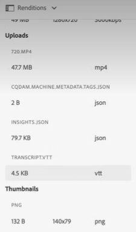

# [!DNL Experience Manager Assets]에서 트랜스크립션 구성 {#configure-transcription-service}

트랜스크립션은 음성 인식 기술을 사용하여 오디오 또는 비디오 파일의 오디오를 텍스트로 변환(음성 텍스트 변환)하는 프로세스입니다.
[!DNL Adobe Experience Manager Assets]는 WebVTT (Vtt) 양식의 지원되는 오디오 또는 비디오 파일에서 음성 언어의 텍스트 트랜스크립션을 자동 생성하는 [!DNL Azure Media Services]로 구성되어 있습니다. 오디오 또는 비디오 에셋이 [!DNL Experience Manager Assets]에서 처리되면 트랜스크립션 서비스는 오디오 또는 비디오 에셋의 텍스트 트랜스크립션 렌더링을 자동으로 생성하고 원본 에셋이 있는 Assets 저장소 내의 동일한 위치에 저장합니다. 다음 [!DNL Experience Manager Assets] 트랜스크립션 서비스를 통해 마케터는 텍스트 콘텐츠의 검색 기능을 추가하여 오디오 및 비디오 콘텐츠를 효율적으로 관리하고, 접근성 및 현지화 기능을 지원하여 ROI를 높일 수 있습니다.

트랜스크립트는 음성 콘텐츠의 텍스트 버전입니다. 예를 들어, 종종 접근성을 향상시키거나 다른 언어로 된 콘텐츠를 소비하기 위한 캡션을 포함하는 OTT 플랫폼에서 시청 중인 영화가 있습니다. 마케팅, 학습이나 엔터테인먼트용으로 사용되는 모든 오디오 또는 비디오 파일입니다. 이들 경험은 필요한 경우 서식이 지정되거나 변환되는 트랜스크립션으로 시작됩니다. 수동으로 수행하는 경우 오디오 또는 비디오 기록 프로세스는 시간이 많이 들고 오류를 발생시킵니다. 오디오-비디오 콘텐츠에 대한 요구 사항이 계속 증가하면서 수동 프로세스 조정이 어려워질 수도 있습니다. [!DNL Experience Manager Assets] 는 대규모 오디오 및 비디오 에셋을 처리하고 타임스탬프 세부 정보와 함께 텍스트 트랜스크립트(.vtt 파일)을 생성하는 Azure의 AI 기반 트랜스크립션을 사용합니다. 에셋과 함께 트랜스크립션 기능도 Dynamic Media에서 지원됩니다.

트랜스크립션 기능은 [!DNL Experience Manager Assets]에서 무상으로 제공됩니다. 단, 트랜스크립션 서비스를 구성하려면 관리자는 사용자의 Azure 자격 증명이 필요합니다. [!DNL Experience Manager Assets]. Microsoft®에서 직접 [체험판 자격 증명을 획득](https://azure.microsoft.com/en-us/pricing/details/media-services/)하여 에셋의 오디오 또는 비디오 트랜스크립션 기능을 체험할 수도 있습니다.

## 트랜스크립션 사전 요구 사항 {#prerequisites}

1. 실행 중인 [!DNL Experience Manager Assets as a Cloud Service] 인스턴스
1. [!DNL Experience Manager Assets]에서 구성하는 경우 다음 Azure 자격 증명이 필요합니다.

   * 클라이언트 ID(API 키)
   * 클라이언트 비밀 키
   * 테넌트 끝점(도메인)
   * 미디어 계정
   * 리소스 그룹
   * 구독 ID

   자격 증명을 획득하여 Azure Media Services API에 액세스하려면 [Azure 설명서](https://docs.microsoft.com/en-us/azure/media-services/latest/access-api-howto?tabs=portal)를 참조하십시오.

1. Azure 계정에 새 요청을 처리할 충분한 크레딧이 있는지 확인합니다.

## [!DNL Experience Manager Assets]에서 트랜스크립션 구성 {#configure-transcription}

[!DNL Experience Manager Assets]에서 트랜스크립션 기능을 활성화하는 데 필요한 구성은 다음과 같습니다.

1. [Azure Media Services 구성](#configure-azure-media-service)
1. [오디오/비디오 트랜스크립션에 대한 처리 프로필 구성](#configure-processing-profile-for-transcription)

### Azure Media Services 구성 {#configure-azure-media-services}

[!DNL Experience Manager Assets]는 WebVTT (Vtt) 양식의 [지원되는 오디오 또는 비디오 파일](#supported-file-formats-for-transcription)에서 음성 언어의 텍스트 트랜스크립트를 자동 생성하는 [!DNL Azure Media Services]를 사용합니다. 관리자는 Azure 자격 증명을 사용하여 [!DNL Experience Manager Assets]에서 [!DNL Azure Media Services]를 구성할 수 있습니다. [트랜스크립션 사전 요구 사항](#transcription-prerequisites)에 구성에 필요한 [!DNL Azure] 자격 증명이 나열됩니다. [!DNL Azure] 계정 및 자격 증명이 없는 경우 체험판 자격 증명을 획득하려면 [Azure Media Services 설명서](https://azure.microsoft.com/en-us/pricing/details/media-services/)를 참조하십시오.

서비스 유형: 

**[!UICONTROL 도구]** > **[!UICONTROL Cloud Services]** > **[!UICONTROL Azure Media Services 구성]**&#x200B;으로 이동합니다. 왼쪽 레일에서 폴더(위치)를 선택하고 [!UICONTROL 만들기] 과의 연결을 구성하는 단추 [!DNL Azure] 계정입니다. 이 폴더는 Experience Manager Assets에서 [!DNL Azure] 클라우드 구성이 저장되는 위치입니다. [!DNL Azure] 자격 증명을 입력하고 **[!UICONTROL 저장 및 닫기]**&#x200B;를 클릭합니다.

### 트랜스크립션에 대한 프로필 처리 구성 {#configure-processing-profile}

[!DNL Azure Media Services]가 Experience Manager Assets에 구성되면 다음 단계에서 에셋 처리 프로필을 만들어 오디오 및 비디오 에셋의 AI 기반 트랜스크립션을 생성합니다. AI 기반 처리 프로필은 [지원된 오디오 또는 비디오 에셋](#supported-file-formats-for-transcription)의 트랜스크립트를 Experience Manager Assets의 렌디션으로 생성하고 원본 에셋이 있는 동일한 폴더에 트랜스크립트(.vtt 파일)를 저장합니다. 따라서 사용자는 에셋과 스크립트 렌디션을 보다 쉽게 검색하고 찾을 수 있습니다.

다음으로 이동 **[!UICONTROL 도구]** > **[!UICONTROL 에셋]** > **[!UICONTROL 처리 프로필]** 을(를) 클릭하고 **[!UICONTROL 만들기]** 오디오 및 비디오 파일의 트랜스크립션을 생성하는 AI 기반 처리 프로필을 만드는 단추입니다. 기본적으로 처리 프로필 페이지는 3가지 탭(이미지, 비디오 및 사용자 지정)만을 반영합니다. 단, [!DNL Azure Media Services]가 [!DNL Experience Manager Assets] 인스턴스 에 구성되면 **[!UICONTROL 콘텐츠 AI]** 탭이 표시됩니다. 처리 프로필을 만드는 동안 **[!UICONTROL 콘텐츠 AI]** 탭이 표시되지 않는 경우 [!DNL Azure] 자격 증명을 확인합니다.

다음에서 **[!UICONTROL 콘텐츠 AI]** 탭을 클릭하고 **[!UICONTROL 새로 추가]** 버튼을 클릭하여 트랜스크립션을 구성합니다. 드롭다운 목록에서 파일 유형을 선택하여 트랜스크립트를 생성하는 파일 형식(MIME 유형)을 여기에 포함하고 제외할 수 있습니다. 다음 일러스트레이션에서 지원되는 모든 오디오 및 비디오 파일은 포함되고 텍스트 파일은 제외됩니다.

**[!UICONTROL 동일한 디렉터리에 VTT 트랜스크립트 만들기]** 토글을 활성화하여 원본 에셋이 있는 동일한 폴더에서 트랜스크립트 렌디션(.vtt 파일)을 만들고 저장합니다. 이 설정에 관계 없이 기본 DAM 에셋 처리 워크플로에서 다른 렌디션이 생성되기도 합니다.

서비스 유형: 

다음 일러스트레이션에서는 Experience Manager Assets에서 생성되는 사용자 지정 비디오 프로필에 대해 자세히 설명합니다.

서비스 유형: 

비디오 프로필에는 다음 사용자 지정 구성도 포함됩니다. 사용자 지정 처리 프로필을 제작하는 방법에 대한 자세한 내용은 [처리 프로필 설명서](/help/assets/asset-microservices-configure-and-use.md)를 참조하십시오.

서비스 유형: 

이제 이 비디오 프로필에서 트랜스크립션을 구성해 주시기 바랍니다. 다음 위치로 이동 **[!UICONTROL 콘텐츠 AI]** 탭을 클릭하고 **[!UICONTROL 새로 추가]** 단추를 클릭합니다. 오디오 및 비디오 파일은 포함하고 이미지 및 애플리케이션 파일은 제외합니다. **[!UICONTROL 동일한 디렉터리에 VTT 트랜스크립트 만들기]** 토글을 활성화하고 구성을 저장합니다.

서비스 유형: 

처리 프로필이 오디오 및 비디오 파일의 트랜스크립션에 맞게 구성되면 다음 방법 중 하나를 사용하여 이 처리 프로필을 폴더에 적용할 수 있습니다.

* 에서 처리 프로필 정의를 선택합니다. **[!UICONTROL 도구]** > **[!UICONTROL 에셋]** > **[!UICONTROL 처리 프로필]**, 및 사용 **[!UICONTROL 폴더에 프로필 적용]** 작업. 콘텐츠 브라우저를 사용하여 특정 폴더로 이동하고, 폴더를 선택하고, 프로필의 애플리케이션을 확인할 수 있습니다.
* Assets 사용자 인터페이스에서 폴더를 선택하고 **[!UICONTROL 속성]** 액션을 클릭하여 폴더 속성을 엽니다. **[!UICONTROL 에셋 처리]** 탭을 클릭하고 **[!UICONTROL 처리 프로필]** 목록에서 폴더에 적합한 처리 프로필을 선택합니다. 변경 내용을 저장하려면 **[!UICONTROL 저장 및 닫기]**&#x200B;를 클릭합니다.

  서비스 유형: 

* 사용자는 Assets 사용자 인터페이스에서 폴더 또는 특정 에셋을 선택하여 처리 프로필을 적용한 다음 맨 위에 제공되는 옵션에서 **[!UICONTROL 에셋 재처리]** 옵션을 선택합니다.

>[!TIP]
>한 개의 처리 프로필만이 폴더에 적용될 수 있습니다.
>
>처리 프로필이 폴더에 적용되면 구성된 추가 처리 프로필을 시용하여 이 폴더에 업로드된(또는 업데이트된) 새로운 에셋 또는 하위 폴더를 모두 처리합니다. 이 처리는 표준 기본 프로필에 포함됩니다.

>[!NOTE]
>
>하위 폴더에 다른 프로필이 적용되면 전체 트리의 폴더 작업에 적용되는 처리 프로필을 재정의할 수 있습니다.
>
>에셋이 폴더에 업로드되면 Experience Manager은 포함 폴더의 속성과 통신하여 처리 프로필을 식별합니다. 프로필이 적용되지 않은 경우 계층 구조의 상위 폴더에서 적용할 처리 프로필을 확인합니다.

## 오디오 또는 비디오 에셋의 트랜스크립션 생성 {#generate-transcription}

비디오 에셋을 처리하는 경우 [AI 기반 처리 프로필](#configure-processing-profile-for-transcription)은 동일한 폴더 내 원본 에셋과 함께 트랜스크립트(.vtt 파일)를 렌디션으로 자동 생성합니다.

서비스 유형: 

원본 비디오 에셋의 렌디션에 액세스하여 트랜스크립트 렌디션을 확인할 수도 있습니다. **[!UICONTROL 렌디션]** 패널에 액세스하려면 원본 비디오 에셋을 선택하고 왼쪽 레일을 엽니다. 트랜스크립트 렌디션(.vtt 파일)이 **[!UICONTROL TRANSCRIPTVTT]** 헤드 아래에 표시되는지 확인할 수 있습니다.

서비스 유형: 

에셋의 렌디션을 모두 다운로드하여 폴더에서 직접 또는 원본 에셋의 **[!UICONTROL 렌디션]** 패널 내에서 트랜스크립트를 개별 에셋 렌디션으로 다운로드할 수 있습니다.

현재 Experience Manager는 기본적으로 전체 텍스트 미리보기 기능 또는 VTT 파일 편집을 지원하지 않습니다. 단, 트랜스크립트 렌디션을 다운로드하고 텍스트 편집기를 사용하거나 트랜스크립트를 확인할 수 있습니다. 트랜스크립트는 특정 비디오 타임스탬프에서 트랜스크립션의 신뢰도 점수(정확도)와 함께 음성 언어(기록된 텍스트)를 텍스트로 반영합니다.

서비스 유형: 

## Dynamic Media에서 트랜스크립션 사용 중 {#using-transcription-in-dynamic-media}

Experience Manager Assets 인스턴스에 [Dynamic Media가 구성](/help/assets/dynamic-media/config-dm.md)되면 에셋(오디오 또는 비디오 파일)과 트랜스크립트(.vtt 파일)를 Dynamic Media에 게시할 수 있습니다. 이렇게 하면 원본 에셋(오디오 또는 비디오 파일)과 기록된 렌디션(.vtt 파일)이 동일한 폴더 내 Dynamic Media에 게시됩니다. Dynamic Media 관리자는 트랜스크립트 렌디션(.vtt 파일)을 사용하여 오디오 또는 비디오 파일의 [CC 자막 경험을 활성화](/help/assets/dynamic-media/video.md#adding-captions-to-video)할 수 있습니다.

추가 참조:

* [Dynamic Media 비디오에 CC 자막을 추가하는 방법에 대한 비디오 튜토리얼](https://experienceleague.adobe.com/docs/experience-manager-learn/assets/dynamic-media/dynamic-media-overview-feature-video-use.html#add-cc-closed-captioning-to-dynamic-media-video)
* [YouTube에 Dynamic Media 비디오 게시](/help/assets/dynamic-media/video.md#publishing-videos-to-youtube)

다음 일러스트레이션에서 URL은 트랜스크립션(.vtt 파일)을 참조하는 캡션 부분을 반영합니다. 비디오는 특정 비디오 타임스탬프에서 음성 언어(기록된 텍스트)를 **[!UICONTROL 자막]**&#x200B;으로 반영합니다. 사용자는 **[!UICONTROL CC]** 버튼을 사용하여 캡션을 활성화하거나 비활성화할 수 있습니다.

서비스 유형: 

## 트랜스크립션에 지원되는 파일 양식 {#supported-file-format}

다음 오디오 및 비디오 파일 양식은 트랜스크립션이 지원됩니다.

| 지원되는 오디오/비디오 양식 | 확장 |
|----|----|
| FLV(H.264 및 AAC 코덱 포함) | (.flv) |
| MXF | (.mxf) |
| MPEG2-PS, MPEG2-TS, 3GP | (.ts, .ps, .3gp, .3gpp, .mpg) |
| Windows Media Video (WMV)/ASF | (.wmv, .asf) |
| AVI(압축되지 않은 8비트/10비트) | (.avi) |
| MP4 | (.mp4, .m4a, .m4v) |
| Microsoft® Digital Video Recording (DVR-MS) | (.dvr-ms) |
| Matroska/WebM | (.mkv) |
| WAVE/WAV | (.wav) |
| QuickTime | (.mov) |

>[!NOTE]
>
>애플리케이션 유형인 에셋(오디오 또는 비디오 파일)은 트랜스크립션이 지원되지 않습니다.

## 알려진 제한 사항 {#known-limitations}

* 트랜스크립션 기능은 최대 10분 동안 비디오가 지원됩니다.
* 비디오 제목은 80자 이하여야 합니다.
* 지원되는 파일 크기는 최대 15GB입니다.
* 지원되는 최대 처리 시간은 60분입니다.
* 유료 [!DNL Azure] 계정에서 분당 최대 50개의 동영상을 업로드할 수 있습니다. 단, 체험판 계정에서는 분당 최대 5개의 동영상을 업로드할 수 있습니다.

## 문제 해결 팁 {#troubleshooting}

(구성에 사용한) 동일한 자격 증명으로 [!DNL Azure Media Services]에 로그인하여 요청 상태를 확인합니다. 요청이 정상적으로 처리되지 않은 경우 [!DNL Azure] 지원 센터에 문의하십시오.

**추가 참조**

* [자산 번역](translate-assets.md)
* [Assets HTTP API](mac-api-assets.md)
* [자산이 지원되는 파일 형식](file-format-support.md)
* [자산 검색](search-assets.md)
* [연결된 자산](use-assets-across-connected-assets-instances.md)
* [자산 보고서](asset-reports.md)
* [메타데이터 스키마](metadata-schemas.md)
* [자산 다운로드](download-assets-from-aem.md)
* [메타데이터 관리](manage-metadata.md)
* [검색 패싯](search-facets.md)
* [컬렉션 관리](manage-collections.md)
* [일괄 메타데이터 가져오기](metadata-import-export.md)
* [AEM 및 Dynamic Media에 자산 게시](/help/assets/publish-assets-to-aem-and-dm.md)
