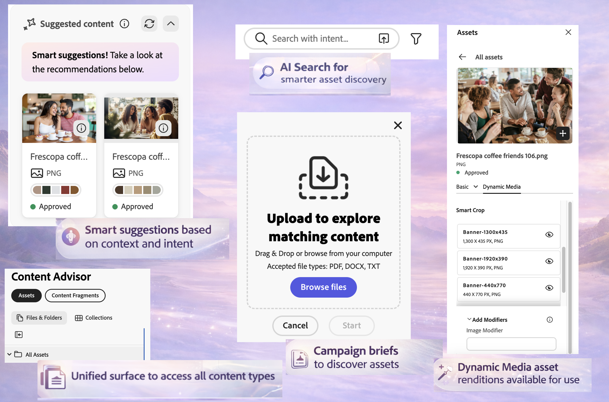

# 콘텐츠 관리자를 사용하여 Adobe 애플리케이션의 AEM 콘텐츠에 액세스{#content-advisor-aem-assets-adobe-applications}

Content Advisor는 Adobe 애플리케이션 전반에 걸쳐 통합 컨텐츠 검색 환경을 제공합니다. Adobe Workfront, AJO B2C(출시 예정), AEM Sites 및 기타 애플리케이션과 기본적으로 통합되는 Content Advisor는 하나의 지능형 인터페이스에 콘텐츠(에셋 및 콘텐츠 조각)를 통합합니다. 따라서 워크플로우 내에서 가장 관련성이 높은 컨텐츠를 간편하게 검색, 탐색 및 재사용할 수 있으므로 컨텍스트를 손상하지 않고도 보다 빠르게 이동할 수 있습니다.

>[!IMPORTANT]
> 
> 콘텐츠 조각 알약은 현재 사용할 수 없으며 곧 적절한 Adobe 애플리케이션에 대해 지원됩니다.

Content Advisor는 지능적이고 상황에 맞는 검색 기능을 작성 환경에 바로 제공하여 사용자의 의도에 따라 관련성이 있고 승인된 컨텐츠를 신속하게 찾을 수 있도록 지원합니다. 스마트 제안, Dynamic Media 렌디션 및 세부 에셋 메타데이터와 같은 기능을 통해 애플리케이션 인터페이스를 벗어나지 않고도 콘텐츠를 효율적으로 평가하고 재사용할 수 있으므로 브랜드 일관성을 유지하면서 콘텐츠 생성 시간을 단축할 수 있습니다.

## 사전 요구 사항 {#prerequisites}

* AEM Assets as a Cloud Service 환경에 액세스합니다.

* 작성된 콘텐츠 조각을 사용하여 AEM Sites 환경에 액세스(콘텐츠 조각 작업에만 필요). 이진 자산 또는 AEM Assets에 액세스하는 데는 필요하지 않습니다.

## Content Advisor를 통한 지능형 자산 검색 {#intelligent-asset-discovery-content-advisor}

컨텐츠 권고자는 호스트 Adobe 애플리케이션 컨텐츠나 캠페인 개요를 기반으로 하는 지능적이고 상황에 맞는 권장 사항을 사용하여 관련 컨텐츠를 검색하는 데 도움이 됩니다. 또한 사용 사례에 최적화된 채널 기반 Dynamic Media 렌디션을 선택할 수도 있습니다.

>[!IMPORTANT]
> 
>**저장소** 드롭다운 목록에서 **작성자** 저장소를 선택해야 합니다. **게재** 저장소에 콘텐츠 관리자 기능이 표시되지 않습니다.
>
> 또한 **게재** 리포지토리에는 폴더 및 컬렉션에 구성된 컨텐츠가 없습니다. 콘텐츠는 루트 수준에서 플랫 구조로 표시됩니다.

컨텐츠 권고자는 다음과 같은 주요 기능을 제공합니다.

* [보다 스마트한 에셋 검색을 위한 AI 검색](#content-advisor-ai-search)

* [컨텍스트 및 의도를 기반으로 한 스마트 제안](#smart-suggestions-content-advisor)

* [관련 자산을 검색하는 캠페인 개요](#campaign-briefs-content-advisor)

* [Dynamic Media 자산 렌디션 사용 가능](#dynamic-media-renditions-content-advisor)

* [컨텐츠 조각과 원활한 통합](#content-fragments-integration-content-advisor)

* [Assets 보기와 일관된 에셋 메타데이터 액세스](#asset-metadata-content-advisor)

* [Assets 보기와 일치하는 필터에 액세스](#filters-content-advisor)

* [최근 검색 및 저장된 검색 액세스 및 재사용](#saved-searches-content-advisor)

* [컬렉션의 에셋 및 내부 에셋 검색](#search-collections-content-advisor)

### 보다 스마트한 에셋 검색을 위한 AI 검색 {#content-advisor-ai-search}

콘텐츠 관리자는 정확한 키워드 일치 여부에 의존하지 않고 사용자 쿼리 뒤에 있는 의미와 의도를 이해하는 고급 검색 기능을 사용합니다. 인공지능(AI)과 머신러닝을 활용해 보다 정확하고 상황에 맞는 결과를 전달한다.

정확한 용어를 찾는 기존 키워드 기반 검색과 달리 AI 검색은 단어, 개념, 사용자 의도 간 관계를 해석한다. 이렇게 하면 쿼리가 다르게 표현되거나, 오타가 있거나, 다른 언어로 되어 있더라도 사용자가 찾고 있는 항목을 찾을 수 있습니다.

콘텐츠 관리자의 자산에 대한 

몇 가지 주요 이점은 다음과 같습니다.

* 다국어 지원: 정확한 번역 없이 여러 언어를 검색할 수 있습니다. 사용자는 쿼리 언어에 관계없이 관련 콘텐츠를 찾을 수 있습니다.

* 오자 처리: 오타 및 맞춤법 오류를 해석하여 입력이 불완전해도 정확한 결과를 보장합니다.

* 동의어 이해: 관련 용어 및 구에 대한 결과를 제공하므로 사용자가 올바른 키워드를 추측할 필요가 없습니다.

* 컨텍스트 인식 검색: 정확한 단어뿐만 아니라 쿼리 뒤에 있는 의도를 인식합니다.

>[!IMPORTANT]
> 
>* 콘텐츠 관리자 내의 AI 검색에 액세스하는 데 필요한 최소 AEM 릴리스 버전은 `21994`입니다.
>* 콘텐츠 조각에 대한 AI 검색 지원이 곧 제공될 예정입니다.

### 컨텍스트 및 의도를 기반으로 한 스마트 제안 {#smart-suggestions-content-advisor}

컨텐츠 권고자는 호스트 Adobe 애플리케이션의 컨텍스트에 따라 스마트 제안을 표시합니다. 따라서 시간이 많이 소요되는 수동 검색 없이 콘텐츠 요구 사항에 맞는 에셋을 빠르게 검색하고 사용할 수 있습니다.

>[!IMPORTANT]
> 
>* Content Advisor 내에서 이 기능에 액세스하려면 GenAI 라이더에 서명해야 합니다. GenAI 라이더에 서명하려면 Adobe 담당자에게 문의하십시오.
>* 이 기능에 액세스하는 데 필요한 최소 AEM 릴리스 버전은 `21994`입니다.
>* 컨텐츠 권고자는 호스트 Adobe 애플리케이션 내에서 사용할 수 있는 컨텐츠의 컨텍스트와 의도를 기반으로 스마트 제안을 표시합니다. 이미지를 기반으로 결과를 표시하지 않습니다. 이 기능을 지원하는 지원되는 Adobe 응용 프로그램 목록은 [Adobe 응용 프로그램에서 콘텐츠 관리자 기능 지원](#content-advisor-feature-support-adobe-applications)을 참조하십시오.

### 관련 자산을 검색하는 캠페인 개요 {#campaign-briefs-content-advisor}

콘텐츠 관리자를 사용하면 검색 키워드를 수동으로 입력하지 않고도 캠페인 개요 문서를 업로드하여 관련 에셋을 검색할 수 있습니다. 콘텐츠 관리자는 캠페인 개요의 정보를 분석하여 캠페인의 의도를 파악하고 AEM Assets에서 사용할 수 있는 관련 에셋을 권장합니다.

>[!IMPORTANT]
>
>* 콘텐츠 관리자는 캠페인 개요에서 텍스트로 사용할 수 있는 정보를 분석하여 관련 에셋을 추천합니다. 캠페인 개요에서 이미지로 사용할 수 있는 정보는 분석하지 않습니다.
>* 캠페인 브리핑으로 업로드할 수 있는 지원되는 파일 형식에는 PDF, DOCX 및 TXT 문서가 포함됩니다.
>* Content Advisor 내에서 이 기능에 액세스하려면 GenAI 라이더에 서명해야 합니다. GenAI 라이더에 서명하려면 Adobe 담당자에게 문의하십시오.
>* 이 기능에 액세스하는 데 필요한 최소 AEM 릴리스 버전은 `21994`입니다.
>* 콘텐츠 조각에 대한 Campaign Brief 업로드 지원이 곧 제공됩니다.

### Dynamic Media 자산 렌디션 사용 가능 {#dynamic-media-renditions-content-advisor}

Dynamic Media 렌디션은 [이미지 사전 설정](/help/assets/dynamic-media/managing-image-presets.md), [스마트 자르기](/help/assets/dynamic-media/image-profiles.md), 형식 유형 및 색상 프로필을 포함하여 채널에 최적화된 사용 가능 버전을 제공합니다. 이러한 렌디션을 사용하면 수동으로 편집하거나 에셋을 복제할 필요 없이 선택한 에셋이 채널 및 디자인 요구 사항을 충족할 수 있습니다.

Dynamic Media 수정자를 적용하여 호스트 Adobe 애플리케이션에 대한 렌디션을 선택하기 전에 실시간으로 조정 내용을 미리 볼 수 있으므로 에셋 일관성과 품질을 유지하면서 가장 적절한 렌디션을 보다 빠르게 선택할 수 있습니다.

에셋 카드에서  아이콘을 클릭하고 **[!UICONTROL Dynamic Media]** 탭을 선택하여 에셋에 사용할 수 있는 렌디션을 봅니다. [Dynamic Media Scene7](/help/assets/dynamic-media/dynamic-media.md) 표현물 또는 [OpenAPI를 사용하는 Dynamic Media](/help/assets/dynamic-media-open-apis-overview.md) 표현물을 보도록 선택할 수 있습니다. 에셋에 대해 **[!UICONTROL OpenAPI]**&#x200B;를 선택하면 에셋이 승인되고 OpenAPI를 통해 Dynamic Media에 사용할 수 있는 경우에만 사용 가능한 렌디션이 표시됩니다.

Dynamic Media 탭을 보려면 유효한 AEM Dynamic Media 라이센스가 있어야 합니다.

 아이콘을 클릭하여 표현물을 미리 보거나 표현물 이름을 클릭한 다음 **[!UICONTROL 선택]**&#x200B;을 클릭하여 호스트 응용 프로그램에서 표현물을 사용할 수 있도록 합니다.

**[!UICONTROL 수정자 추가]**&#x200B;를 클릭하고 텍스트 상자에 수정자를 지정한 다음 Enter 키를 눌러 변형을 모든 에셋 변환에 실시간으로 적용합니다. 마찬가지로 변환에 여러 수정자를 추가하고 이러한 변형을 미리 볼 수 있습니다. 렌디션 이름을 클릭하고 **[!UICONTROL 선택]**&#x200B;을 클릭하여 호스트 응용 프로그램에서 렌디션을 사용할 수 있도록 합니다. 이러한 수정자를 적용한 후의 렌디션은 저장되지 않습니다. [Dynamic Media Scene7](https://experienceleague.adobe.com/en/docs/dynamic-media-developer-resources/image-serving-api/image-serving-api/http-protocol-reference/command-reference/c-command-reference) 및 [OpenAPI를 사용하는 Dynamic Media](https://developer.adobe.com/experience-cloud/experience-manager-apis/api/stable/assets/delivery/#operation/getAssetSeoFormat)에 대해 지원되는 수정자 목록을 참조하십시오.

### 콘텐츠 조각 검색 {#content-fragments-discovery-content-advisor}

Content Advisor는 콘텐츠 조각 검색을 제공하여 지원되는 Adobe 애플리케이션에 조각을 쉽게 검색하고 통합할 수 있도록 지원합니다. 콘텐츠 조각 목록을 검색하고 현재 워크플로를 종료하지 않고 가장 관련성이 높은 콘텐츠를 선택합니다.

각 콘텐츠 조각은 콘텐츠에서 생성된 라이브 썸네일 미리보기가 있는 카드로 표시되므로 올바른 조각을 빠르게 식별할 수 있습니다. 이 카드에는 제목 및 상태(초안, 수정됨 또는 게시됨)와 같은 주요 세부 정보도 표시됩니다. 자세한 정보를 보려면  아이콘을 클릭하여 자세한 속성, 다른 콘텐츠 조각에 대한 참조 및 사용 가능한 변형을 보고 정보에 입각한 콘텐츠를 선택하고 다시 사용할 수 있습니다.

>[!IMPORTANT]
> 
>* AI 검색, 스마트 제안, 캠페인 브리프 업로드 및 미리 보기 기능은 아직 Content Advisor의 콘텐츠 조각에서 지원되지 않습니다.

### Assets 보기와 일관된 에셋 메타데이터 액세스 {#asset-metadata-content-advisor}

컨텐츠 권고자는 Assets 보기에서 사용할 수 있는 메타데이터를 포함하여 AEM Assets에 정의된 자산 속성에 대한 액세스를 제공합니다. 컨텐츠 권고자는 Assets 보기와 동일한 메타데이터 구성을 사용하여 Assets 보기 자산 세부 사항 페이지의 메타데이터 탭 및 컨텐츠 목록을 복제합니다. 이렇게 하면 에셋을 선택하기 전에 제목, 설명, 형식, 크기 및 기타 메타데이터와 같은 주요 에셋 세부 사항을 검토할 수 있습니다. 에셋 속성에 액세스하면 콘텐츠에 대해 올바르고 승인된 에셋을 선택할 수 있습니다.

에셋 카드의  아이콘을 클릭하고 **[!UICONTROL 기본]** 탭을 선택하여 에셋 메타데이터를 봅니다. Assets 보기에 있는 에셋 메타데이터와 일관되게 제품, 캠페인 및 태그와 같은 다른 에셋 메타데이터 탭을 볼 수도 있습니다.

컨텐츠 권고자는 읽기 전용 보기에서 파일에 대한 속성(메타데이터)을 표시합니다. 컬렉션과 폴더의 속성은 표시되지 않습니다.

### Assets 보기와 일치하는 필터에 액세스 {#filters-content-advisor}

컨텐츠 권고자는 Assets 보기에서 사용할 수 있는 호스트 Adobe 애플리케이션 내의 동일한 필터링 기능을 제공하여 사전 정의된 필터를 사용하여 자산을 세분화할 수 있도록 합니다. Assets 보기에서 사용할 수 있는 것과 동일한 필터링 기능은 파일, 폴더 및 컬렉션과 같은 콘텐츠 유형과 관련된 필터에도 적용됩니다. 따라서 일관된 에셋 검색 환경을 보장하고 호스트 Adobe 애플리케이션 내에서 관련 에셋을 효율적으로 찾을 수 있습니다.

필터 스키마를 통해 Assets 보기에 설정된 필터가 없는 경우 컨텐츠 권고자는 파일 유형, 파일 형식, 에셋 상태, 파일 크기, 이미지 너비, 이미지 높이, 수정 날짜 및 생성 날짜 등 기본 제공 필터를 표시합니다.

사용자 지정 필터 스키마는 Assets(파일)에 대해 지원되지만 폴더 및 컬렉션에 대해서는 아직 지원되지 않습니다.

### 최근 검색 및 저장된 검색 액세스 및 재사용 {#saved-searches-content-advisor}

Assets 보기에서 만든 저장된 검색도 사용할 수 있으므로 사전 정의된 검색 기준을 재사용할 수 있습니다. 저장된 검색은 브라우저 전체에서 Assets 보기와 Content Advisor 간에 일관되게 작동합니다. 이렇게 하면 AEM Assets 및 기타 Adobe 애플리케이션에서 일관된 검색 패턴을 사용하여 에셋을 효율적으로 찾을 수 있습니다.

콘텐츠 관리자를 사용하여 자주 사용하는 검색을 저장하려면 다음을 수행합니다.

1. 검색어(선택 사항)를 지정하고 필터 아이콘을 클릭한 다음 요구 사항에 따라 옵션을 선택하여 검색 쿼리를 만듭니다.

1. **저장된 검색 관리** > **저장된 새 검색 만들기**&#x200B;를 클릭합니다.

1. 검색 이름을 지정하고 을 클릭하여 저장합니다. 항목 목록에 검색이 표시됩니다.

   

저장된 검색 항목을 적용하려면 **[!UICONTROL 저장된 검색]** 드롭다운 목록에서 검색 항목을 선택하십시오. 콘텐츠 권고자는 검색 쿼리를 기반으로 결과를 표시합니다.

컨텐츠 권고자를 사용하면 최근 검색을 저장할 뿐만 아니라 나중에 빠르게 액세스할 수 있도록 자주 사용하는 검색을 저장할 수 있습니다. 최근 검색 목록이 Assets 보기와 컨텐츠 권고자 간에 일치하지 않습니다. 동일한 사용자가 Assets 보기 및 콘텐츠 관리자에서 서로 다른 최근 검색 세트를 가질 수 있습니다. 시크릿 모드를 사용하여 콘텐츠 권고자에 액세스하는 경우 최근 검색 목록을 사용할 수 없습니다. 또한 최근 검색은 동일한 사용자에 대해 서로 다른 브라우저에서 공유되지 않으며 AEM 환경에 따라 다릅니다.

Assets 보기에서 사용할 수 있는 기본 저장된 검색 기능은 아직 콘텐츠 권고자에서 사용할 수 없습니다.

### 컬렉션의 에셋 및 내부 에셋 검색 {#search-collections-content-advisor}

콘텐츠 관리자를 사용하면 모든 컬렉션에서 에셋 또는 컬렉션을 검색하거나 특정 컬렉션으로 검색을 제한할 수 있습니다. 이렇게 하면 의도한 조직 컨텍스트를 유지하면서 조정된 컬렉션에서 자산을 빠르게 찾고 사용할 수 있습니다.

## Adobe 애플리케이션 전반에 걸쳐 컨텐츠 권고자 기능 지원 {#content-advisor-feature-support-adobe-applications}

다음 표는 Adobe 애플리케이션 전반에 걸친 Content Advisor 기능 지원을 보여 줍니다.

>[!IMPORTANT]
> 
> Content Advisor가 추가 Adobe 애플리케이션으로 확장됨에 따라 이 표가 최신 지원을 반영하도록 업데이트됩니다.

| 애플리케이션 | Assets 검색을 위한 간략한 업로드 지원 | Assets을 검색하는 동안 제안된 콘텐츠 패널 지원 | Assets을 검색하는 동안 Dynamic Media 패널 지원 | 콘텐츠 조각 검색 지원 |
|--------------------------------------|----------------------------------------------|-----------------------------------------------------------|--------------------------------------------------------|------------------------------------------|
| [AEM Sites - 문서 작성](https://www.aem.live/docs/authoring-guide#document-authoring) | ✓ | ✓ | ✓ | − |
| [AEM Sites - 유니버설 편집기](https://www.aem.live/docs/authoring-guide#universal-editor-in-aem-sites) | ✓ | ✓ | ✓ | − |
| AEM Sites - [GoogleDrive](https://www.aem.live/docs/authoring-guide#google-drive)/[Sharepoint 작성](https://www.aem.live/docs/authoring-guide#microsoft-sharepoint) | ✓ | − | ✓ | − |
| AEM Sites(컨텐츠 조각 편집기) | ✓ | ✓ | ✓ | − |
| Adobe Workfront 워크플로 | ✓ | ✓ | − | ✓ |
| Adobe Workfront 계획 | ✓ | ✓ | − | ✓ |
