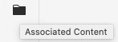

# 관련 컨텐츠{#associated-content}

AEM 관련 컨텐츠 기능은 컨텐츠 페이지에 추가될 때 선택적으로 조각에 자산을 사용할 수 있도록 연결을 제공합니다. 이 기능은 [에서 페이지의 컨텐츠 조각을 사용할 때 액세스할 자산 범위를 제공하는 동시에](/help/sites-cloud/authoring/fundamentals/content-fragments.md#using-associated-content)에서 헤드리스 컨텐츠 전달을 유연하게 할 수 있으며 적절한 자산을 검색하는 데 필요한 시간도 줄일 수 있습니다.

## 연결된 컨텐츠 추가 {#adding-associated-content}

>[!NOTE]
>
>[시각적 자산(예: 이미지)](/help/assets/content-fragments/content-fragments.md#fragments-with-visual-assets)을 조각 및/또는 페이지에 추가하는 다양한 방법이 있습니다.

연결하려면 먼저 [미디어 자산을 컬렉션에 추가](/help/assets/manage-collections.md)해야 합니다. 작업이 완료되면 다음을 수행할 수 있습니다.

1. 조각을 열고 사이드 패널에서 **관련 컨텐츠**&#x200B;를 선택합니다.

   

1. 컬렉션이 이미 연결되어 있는지 여부에 따라 다음 중 하나를 선택합니다.

   * **콘텐츠**  연결 - 이 컬렉션은 처음으로 연결된 컬렉션이 됩니다.
   * **컬렉션**  연결 - 관련 컬렉션이 이미 구성됨

1. 필요한 컬렉션을 선택합니다.

   원할 경우 선택한 컬렉션에 조각 자체를 추가할 수도 있습니다. 이렇게 하면 추적에 유용합니다.

   

1. 확인(**선택**&#x200B;으로) 컬렉션이 연결된 것으로 표시됩니다.

   

## 연결된 컨텐츠 편집 {#editing-associated-content}

컬렉션을 연결하면 다음 작업을 수행할 수 있습니다.

* 연결 **제거**
* 컬렉션에 **자산 추가**
* 추가 작업을 위한 자산 선택
* 자산 편집
