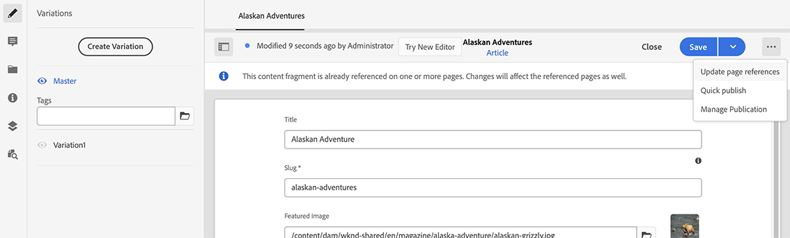

# 컨텐츠 조각 관리 {#managing-content-fragments}

자산 콘솔을 사용하여 헤드리스 컨텐츠의 기반인 AEM 컨텐츠 조각을 관리하는 방법을 알아봅니다.

[컨텐츠 조각 모델](#creating-a-content-model)을 정의한 후 이를 사용하여 [컨텐츠 조각](#creating-a-content-fragment)을 만들 수 있습니다.

[컨텐츠 조각 편집기](#opening-the-fragment-editor)는 다음과 같은 작업을 수행할 수 있도록 다양한 [모드](#modes-in-the-content-fragment-editor)를 제공합니다.

* [컨텐츠 ](#editing-the-content-of-your-fragment) 편집 및  [변형 관리](#creating-and-managing-variations-within-your-fragment)
* [조각에 주석 추가](/help/assets/content-fragments/content-fragments-variations.md#annotating-a-content-fragment)
* [컨텐츠를 조각과 연결](#associating-content-with-your-fragment)
* [메타데이터 구성](#viewing-and-editing-the-metadata-properties-of-your-fragment)
* [구조 트리 보기](/help/assets/content-fragments/content-fragments-structure-tree.md)
* [JSON 표현 미리 보기](/help/assets/content-fragments/content-fragments-json-preview.md)

>[!NOTE]
>
>컨텐츠 조각을 사용할 수 있습니다.
>
>* 페이지 작성 시[컨텐츠 조각으로 페이지 작성](/help/sites-cloud/authoring/fundamentals/content-fragments.md)을 참조하십시오.
>* GraphQL](/help/assets/content-fragments/content-fragments-graphql.md)의 컨텐츠 조각을 사용하여 [헤드리스 컨텐츠 전달의 경우

>[!NOTE]
>
>컨텐츠 조각은 **자산**&#x200B;으로 저장되므로 **자산** 콘솔에서 주로 관리됩니다.

## 컨텐츠 조각 만들기 {#creating-content-fragments}

### 컨텐츠 모델 만들기 {#creating-a-content-model}

구조화된 컨텐츠와 함께 컨텐츠 조각을 생성하기 전에 [컨텐츠 조각 모델](/help/assets/content-fragments/content-fragments-models.md)을 활성화하고 생성할 수 있습니다.

### 컨텐츠 조각 만들기 {#creating-a-content-fragment}

컨텐츠 조각을 만드는 방법은 다음과 같습니다.

1. 조각을 만들려는 **자산** 폴더로 이동합니다.
1. **만들기**&#x200B;를 선택한 후 **컨텐츠 조각**&#x200B;을 선택하여 마법사를 엽니다.
1. 마법사의 첫 번째 단계에서는 새 조각의 기준을 지정해야 합니다.

   * [모델](/help/assets/content-fragments/content-fragments-models.md)  - 구조화된 컨텐츠가 필요한 조각을 생성하는 데 사용됩니다.예를 들어  **** &lt;모험가>

      * 사용 가능한 모든 모델이 표시됩니다.

   선택 후 **다음**&#x200B;을 사용하여 진행하십시오.

   

1. **속성** 단계에서 다음 사항을 지정합니다.

   * **기본**

      * **제목**

         조각 제목.

         필수.

      * **설명**

      * **태그**
   * **고급**

      * **이름**

         이름은 URL을 구성하는 데 사용됩니다.

         필수는 제목에서 자동으로 파생되지만 업데이트할 수 있습니다.

1. **만들기**&#x200B;를 선택하여 작업을 완료한 후 편집할 조각을 **열거나** **완료**&#x200B;를 사용하여 콘솔로 돌아갑니다.

   >[!NOTE]
   >콘솔의 **목록** 모드에서 **설정 보기**&#x200B;를 업데이트하여 **컨텐츠 조각 모델** 열을 활성화할 수 있습니다.

## 자산 콘솔 {#actions-for-a-content-fragment-assets-console}의 컨텐츠 조각에 대한 작업

**자산** 콘솔에서 컨텐츠 조각에 다양한 작업을 사용할 수 있습니다.

* 도구 모음에서 조각을 선택한 후 모든 적절한 작업이 가능합니다.
* 개별 조각 카드에 사용할 수 있는 작업의 일부로서 [빠른 작업](/help/sites-cloud/authoring/getting-started/basic-handling.md#quick-actions)이 있습니다.

조각을 선택하여 적용 가능한 작업이 있는 도구 모음을 표시합니다.

* **자산 재처리**
* **만들기**
* **다운로드**

   * 조각을 ZIP 파일로 저장합니다. 요소, 변형, 메타데이터 포함 여부를 정의할 수 있습니다.

* **체크아웃**
* **속성**

   * 조각의 메타데이터를 보거나 편집할 수 있습니다.

* **편집**

   * 요소, 변형, 관련 컨텐츠 및 메타데이터와 함께 [컨텐츠를 편집할 조각을 열](/help/assets/content-fragments/content-fragments-variations.md) 수 있습니다.

* **빠른 게시**
* **게시 관리**
* **태그 관리**
* **대상 컬렉션**
* **복사** (및  **붙여넣기**)
* **이동**
* **삭제**

>[!NOTE]
>
>이러한 작업 중 대부분은 [자산](/help/assets/manage-digital-assets.md) 및/또는 [AEM 데스크톱 앱에 대한 표준 작업](https://helpx.adobe.com/kr/experience-manager/desktop-app/aem-desktop-app.html)입니다.

## 조각 편집기 열기 {#opening-the-fragment-editor}

편집할 조각을 열려면

>[!CAUTION]
>
>컨텐츠 조각을 편집하려면 [적절한 권한](/help/implementing/developing/extending/content-fragments-customizing.md#asset-permissions)이 있어야 합니다. 문제가 발생하는 경우 시스템 관리자에게 문의하십시오.

>[!CAUTION]
>
>컨텐츠 조각을 편집하려면 적절한 권한이 있어야 합니다. 문제가 발생하는 경우 시스템 관리자에게 문의하십시오.

1. **자산** 콘솔을 사용하여 컨텐츠 조각의 위치로 이동합니다.
1. 다음 방법 중 하나를 사용하여 편집할 조각을 엽니다.

   * 조각 또는 조각 링크를 클릭/탭합니다(콘솔 보기에 따라 다름).
   * 조각을 선택한 후 도구 모음에서 **편집**&#x200B;을 선택합니다.

1. 조각 편집기가 열립니다. 필요에 따라 변경:

   

1. 변경 후에는 필요에 따라 **저장**, **저장 및 닫기** 또는 **닫기**&#x200B;를 사용합니다.

   >[!NOTE]
   >
   >**저장 및** 닫기는 저장 분류를 통해 사용할 수  **** 있습니다.

   >[!NOTE]
   >
   >**저장 및 닫기** 및 **닫기** 모두 편집기를 종료합니다. 다양한 옵션이 컨텐츠 조각에 대해 작동하는 방법에 대한 자세한 내용은 [저장, 닫기 및 버전](#save-close-and-versions)을 참조하십시오.

## 컨텐츠 조각 편집기의 모드 및 작업 {#modes-actions-content-fragment-editor}

컨텐츠 조각 편집기에서 사용할 수 있는 다양한 모드 및 작업이 있습니다.

### 컨텐츠 조각 편집기의 모드 {#modes-in-the-content-fragment-editor}

사이드 패널의 아이콘을 사용하여 다양한 모드를 탐색합니다.

* 변형: [컨텐츠 편집](#editing-the-content-of-your-fragment) 및 [변형 관리](#creating-and-managing-variations-within-your-fragment)

* [주석](/help/assets/content-fragments/content-fragments-variations.md#annotating-a-content-fragment)
* [관련 컨텐츠](#associating-content-with-your-fragment)
* [메타데이터](#viewing-and-editing-the-metadata-properties-of-your-fragment)
* [구조 트리](/help/assets/content-fragments/content-fragments-structure-tree.md)
* [미리 보기](/help/assets/content-fragments/content-fragments-json-preview.md)

### 컨텐츠 조각 편집기의 도구 모음 작업 {#toolbar-actions-in-the-content-fragment-editor}

상단 도구 모음의 일부 기능은 다음과 같은 여러 모드에서 사용할 수 있습니다.

* 이미 컨텐츠 페이지에서 조각을 참조 중이면 메시지가 표시됩니다. **메시지 닫기**&#x200B;를 수행할 수 있습니다.

* 사이드 패널은 **사이드 패널 전환** 아이콘을 사용하여 숨기거나 표시할 수 있습니다.

* 조각 이름 아래에 현재 조각을 만드는 데 사용되는 [컨텐츠 조각 모델](/help/assets/content-fragments/content-fragments-models.md)의 이름이 표시됩니다.

   * 이름은 모델 편집기를 여는 링크이기도 합니다.

* 조각 상태를 확인합니다.예를 들어, 언제 만들었는지, 수정하거나 게시했는지에 대한 정보입니다. 상태도 색상으로 구분됩니다.

   * **새로운 기능**:회색
   * **초안**:파란색
   * **게시됨**:녹색
   * **수정됨**:주황
   * **비활성화됨**:red

* **저장** 기능을 사용하면  **저장 및** 닫기 옵션에 액세스할 수 있습니다.

* 세 점(**..**) 드롭다운에서 추가 작업에 액세스할 수 있습니다.
   * **페이지 참조 업데이트**
      * 이렇게 하면 모든 페이지 참조가 업데이트됩니다.
   * **[빠른 게시](#publishing-and-referencing-a-fragment)**
   * **[게시 관리](#publishing-and-referencing-a-fragment)**

<!--
This updates any page references and ensures that the Dispatcher is flushed as required. -->

## 저장, 닫기 및 버전 {#save-close-and-versions}

>[!NOTE]
>
>버전은 [타임라인에서 만들고, 비교하고, 되돌릴](/help/assets/content-fragments/content-fragments-managing.md#timeline-for-content-fragments) 수도 있습니다.

편집기에는 다양한 옵션이 있습니다.

* **저장** 및  **저장 및 닫기**

   * **저장** 은 최신 변경 내용을 저장하고 편집기에 그대로 남습니다.
   * **저장 및** 닫기를 수행하면 최신 변경 내용이 저장되고 편집기가 종료됩니다.

   >[!CAUTION]
   >
   >컨텐츠 조각을 편집하려면 [적절한 권한](/help/implementing/developing/extending/content-fragments-customizing.md#asset-permissions)이 있어야 합니다. 문제가 발생하는 경우 시스템 관리자에게 문의하십시오.

   >[!NOTE]
   >
   >저장하기 전에 편집기에 계속 변경 작업을 수행할 수 있습니다.

   >[!CAUTION]
   >
   >작업은 변경 내용을 저장하는 것 외에도 모든 참조를 업데이트하고 필요에 따라 디스패처가 플러시되도록 합니다. 이러한 변경 사항은 처리에 시간이 걸릴 수 있습니다. 이로 인해 대형/복합/부하가 큰 시스템의 성능에 영향이 있을 수 있습니다.
   >
   >**저장 및 닫기**&#x200B;를 사용한 다음 조각 편집기를 빠르게 다시 입력하여 추가 변경을 수행하고 저장할 때 이 점을 염두에 두십시오.

* **닫기**

   최신 변경 내용을 저장하지 않고 편집기를 종료합니다(즉, 마지막 **저장** 이후).

컨텐츠 조각 AEM을 편집하는 동안 변경 내용을 취소할 경우 이전 컨텐츠를 복원할 수 있도록 버전을 자동으로 만듭니다(저장하지 않고 **Close** 사용).

1. 편집하기 위해 컨텐츠 조각을 열면 AEM에서는 *편집 세션*&#x200B;이 존재하는지 여부를 나타내는 쿠키 기반 토큰이 있는지 확인합니다.

   1. 토큰을 찾으면 조각은 기존 편집 세션의 일부로 간주됩니다.
   2. 토큰을 사용할 수 *없고* 사용자가 컨텐츠 편집을 시작하는 경우에는 버전이 만들어지고 이 새 편집 세션에 대한 토큰이 클라이언트에 보내져 거기에서 쿠키에 저장됩니다.

2. *활성* 편집 세션이 있는 동안 편집되는 컨텐츠는 600초(기본값)마다 자동으로 저장됩니다.

   >[!NOTE]
   >
   >자동 저장 간격은 `/conf` 메커니즘을 사용하여 구성할 수 있습니다.
   >
   >기본값을 알려면 다음을 참조하십시오.
   >  `/libs/settings/dam/cfm/jcr:content/autoSaveInterval`

3. 사용자가 편집을 취소하면 편집 세션 시작 시 만들어진 버전이 복원되고 토큰이 제거되어 편집 세션이 종료됩니다.
4. 사용자가 편집 내용을 **저장**&#x200B;하도록 선택하면 업데이트된 요소/변형이 유지되고 토큰이 제거되어 편집 세션이 종료됩니다.

## 조각의 컨텐츠 편집 {#editing-the-content-of-your-fragment}

조각을 열면 [변형](/help/assets/content-fragments/content-fragments-variations.md) 탭을 사용하여 컨텐츠를 작성할 수 있습니다.

## 조각 내 변형 생성 및 관리 {#creating-and-managing-variations-within-your-fragment}

마스터 컨텐츠를 만들면 해당 컨텐츠의 [변형](/help/assets/content-fragments/content-fragments-variations.md)을 만들고 관리할 수 있습니다.

## 조각과 컨텐츠 연결 {#associating-content-with-your-fragment}

조각과 [컨텐츠를 연결](/help/assets/content-fragments/content-fragments-assoc-content.md)할 수도 있습니다. 이렇게 하면 조각이 컨텐츠 페이지에 추가될 때 자산(즉, 이미지)을 조각과 함께 필요에 따라 사용할 수 있도록 연결을 제공합니다.

## 조각의 메타데이터(속성) 보기 및 편집 {#viewing-and-editing-the-metadata-properties-of-your-fragment}

[메타데이터](/help/assets/content-fragments/content-fragments-metadata.md) 탭을 사용하여 조각의 속성을 보고 편집할 수 있습니다.

## 컨텐츠 조각에 대한 타임라인 {#timeline-for-content-fragments}

표준 옵션뿐만 아니라 [타임라인](/help/assets/manage-digital-assets.md#timeline)도 컨텐츠 조각과 관련된 정보와 작업을 모두 제공합니다.

* 버전, 댓글 및 주석에 대한 정보 보기
* 버전에 대한 작업

   * **[이 버전으로 되돌리기](#reverting-to-a-version)**(기존 조각을 선택한 후 특정 버전을 선택합니다.)

   * **[현재 항목에 비교](#comparing-fragment-versions)**(기존 조각을 선택한 후 특정 버전을 선택합니다.)

   * **레이블** 및/또는 **댓글** 추가(기존 조각을 선택한 후 특정 버전을 선택합니다.)

   * **다른 버전으로 저장**(기존 조각을 선택한 후 타임라인 하단의 위쪽 화살표를 선택합니다.)

* 주석에 대한 작업

   * **삭제**

>[!NOTE]
댓글은
* 모든 자산에 대한 표준 기능입니다.
* 타임라인에서 만들어집니다.
* 조각 자산과 관련되어 있습니다.

주석(컨텐츠 조각)은
* 조각 편집기에서 입력됩니다.
* 조각 내의 선택된 텍스트 세그먼트에 대한 것입니다.

예:

## 조각 버전 비교 {#comparing-fragment-versions}

**현재 항목에 비교** 작업은 특정 버전을 선택한 후 [타임라인](/help/assets/content-fragments/content-fragments-managing.md#timeline-for-content-fragments)에서 사용할 수 있습니다.

이 옵션을 선택하면 다음 항목이 열립니다.

* **현재**(최신) 버전(왼쪽)

* 선택한 버전 **v&lt;*x.y*>**(오른쪽)

그들은 다음 위치에서 나란히 표시될 것입니다.

* 다른 곳들은 모두 강조 표시됩니다.

   * 삭제된 텍스트 - 빨간색
   * 삽입된 텍스트 - 녹색
   * 대체된 텍스트 - 파란색

* 전체 화면 아이콘을 사용하면 두 버전 중 하나를 자체적으로 열 수 있습니다. 그런 다음 병렬 보기로 다시 전환할 수 있습니다.
* 특정 버전으로 **되돌릴** 수 있습니다.
* **완료**&#x200B;를 선택하면 콘솔로 돌아갑니다.

>[!NOTE]
조각을 비교할 때에는 조각 컨텐츠를 편집할 수 없습니다.

## 버전으로 되돌리기  {#reverting-to-a-version}

조각을 특정 버전으로 되돌릴 수 있습니다.

* [타임라인](/help/assets/content-fragments/content-fragments-managing.md#timeline-for-content-fragments)에서 바로 되돌릴 수 있습니다.

   필요한 버전을 선택한 후 **이 버전으로 되돌리기** 작업을 선택합니다.

* [버전을 현재 버전과 비교](/help/assets/content-fragments/content-fragments-managing.md#comparing-fragment-versions)하는 동안 선택한 버전으로 **되돌릴** 수 있습니다.

## 조각 게시 및 참조 {#publishing-and-referencing-a-fragment}

>[!CAUTION]
조각이 모델을 기반으로 한다면 [모델이 게시되었는지](/help/assets/content-fragments/content-fragments-models.md#publishing-a-content-fragment-model) 확인해야 합니다.
모델이 아직 게시되지 않은 컨텐츠 조각을 게시하는 경우 선택 목록에 이것이 표시되고 모델이 조각과 함께 게시됩니다.

게시 환경에서 사용하려면 컨텐츠 조각을 게시해야 합니다. 게시할 수 있는 시점:

* 생성 후;자산 콘솔](#actions-for-a-content-fragment-assets-console)에서 사용할 수 있는 [작업 사용
* [컨텐츠 조각 편집기](#toolbar-actions-in-the-content-fragment-editor)에서.
* [조각을 사용하는 페이지를 게시](/help/sites-cloud/authoring/fundamentals/content-fragments.md#publishing)할 때. 페이지 참조에 조각이 나열됩니다.

>[!CAUTION]
조각이 게시 및/또는 참조된 후 작성자가 편집을 위해 조각을 다시 열면 AEM에 경고가 표시됩니다. 조각 변경 사항이 참조된 페이지에도 영향을 준다는 것을 경고하기 위한 것입니다.

## 조각 삭제 {#deleting-a-fragment}

조각을 삭제하려면

1. **자산** 콘솔에서 컨텐츠 조각의 위치로 이동합니다.
2. 조각을 선택합니다.

   >[!NOTE]
   **삭제** 작업은 빠른 작업으로 사용할 수 없습니다.

3. 도구 모음에서 **삭제**&#x200B;를 선택합니다.
4. **삭제** 작업을 확인합니다.

   >[!CAUTION]
   조각이 페이지에서 이미 참조되어 있다면 경고 메시지가 표시되고 **강제 삭제**&#x200B;로 진행하겠다고 확인해야 합니다. 해당 컨텐츠 조각 구성 요소와 함께 조각이 모든 컨텐츠 페이지에서 삭제됩니다.
