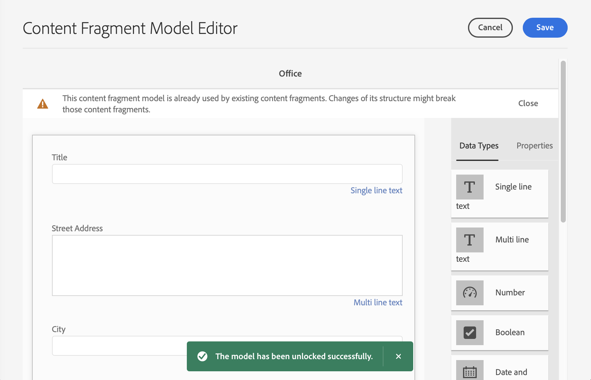

# 콘텐츠 조각 모델 {#content-fragment-models}

AEM의 컨텐츠 조각 모델은 컨텐츠 구조를 정의합니다 [컨텐츠 조각,](/help/assets/content-fragments/content-fragments.md) 헤드리스 컨텐츠의 기초 역할을 합니다.

컨텐츠 조각 모델을 사용하려면 다음을 수행합니다.

1. [인스턴스에 대해 컨텐츠 조각 모델 기능을 사용할 수 있도록 설정](/help/assets/content-fragments/content-fragments-configuration-browser.md)
1. [만들기](#creating-a-content-fragment-model), 및 [구성](#defining-your-content-fragment-model), 컨텐츠 조각 모델
1. [컨텐츠 조각 모델 활성화](#enabling-disabling-a-content-fragment-model) 컨텐츠 조각을 만들 때 사용할 컨텐츠 조각 을 만들 때 사용합니다.
1. [필요한 자산 폴더에서 컨텐츠 조각 모델 을 허용합니다](#allowing-content-fragment-models-assets-folder) 구성 **정책**.

## 콘텐츠 조각 모델 만들기 {#creating-a-content-fragment-model}

1. **도구**, **자산**&#x200B;으로 이동한 후 **컨텐츠 조각 모델**&#x200B;을 엽니다.
1. [구성](/help/assets/content-fragments/content-fragments-configuration-browser.md)에 적절한 폴더로 이동합니다.
1. **만들기**&#x200B;를 사용하여 마법사를 엽니다.

   >[!CAUTION]
   >
   >[컨텐츠 조각 모델 사용이 활성화되지 않은](/help/assets/content-fragments/content-fragments-configuration-browser.md) 경우 **만들기** 옵션을 사용할 수 없습니다.

1. **모델 제목**&#x200B;을 지정합니다. 추가할 수도 있습니다 **태그**, **설명**, 을(를) 선택하고 을(를) 선택합니다. **모델 활성화** to [모델 활성화](#enabling-disabling-a-content-fragment-model) 필요한 경우.

   

1. **만들기**&#x200B;를 사용하여 빈 모델을 저장합니다. 작업의 성공을 나타내는 메시지가 표시되면 **열기**&#x200B;를 선택하여 모델을 즉시 편집하거나 **완료**&#x200B;를 선택하여 콘솔로 돌아갈 수 있습니다.

## 컨텐츠 조각 모델 정의 {#defining-your-content-fragment-model}

컨텐츠 조각 모델은 선택 항목을 사용하여 결과 컨텐츠 조각의 구조를 효과적으로 정의합니다 **[데이터 유형](#data-types)**. 모델 편집기를 사용하여 데이터 유형의 인스턴스를 추가한 다음 필수 필드를 만들도록 구성할 수 있습니다.

>[!CAUTION]
>
>기존 컨텐츠 조각 모델을 편집하면 종속된 조각이 영향을 받을 수 있습니다.

1. **도구**, **자산**&#x200B;으로 이동한 후 **컨텐츠 조각 모델**&#x200B;을 엽니다.

1. 컨텐츠 조각 모델을 포함하는 폴더로 이동합니다.
1. **편집**&#x200B;에 필요한 모델을 엽니다. 빠른 작업을 사용하거나, 모델을 선택한 후 도구 모음에서 작업을 선택하십시오.

   모델 편집기를 열면 다음과 같이 표시됩니다.

   * 왼쪽: 이미 정의된 필드
   * 오른쪽: 필드를 만드는 데 사용할 수 있는 **데이터 유형**(필드가 만들어지면 사용할 **속성**)

   >[!NOTE]
   >
   >필드가 **필수**&#x200B;이면 왼쪽 창에 표시되는 **레이블**&#x200B;이 지정된 레이블은 별표(*****)로 표시됩니다.


1. **필드를 추가하려면**

   * 필수 데이터 유형을 필드에 필요한 위치로 드래그합니다.

      

   * 모델에 필드가 추가되면 오른쪽 패널에 그 특정 데이터 유형에 대해 정의할 수 있는 **속성**&#x200B;이 표시됩니다. 여기에서 해당 필드에 필요한 사항을 정의할 수 있습니다.

      * 자세한 내용은 많은 속성을 직접 설명합니다. [속성](#properties).
      * 입력 **필드 레이블** 이(가) 자동으로 **속성 이름**  - 비어 있는 경우 나중에 수동으로 업데이트할 수 있습니다.

         >[!CAUTION]
         속성을 수동으로 업데이트할 때 **속성 이름** 데이터 유형의 경우 이름에는 특수 문자로 라틴 문자, 숫자 및 밑줄 &quot;_&quot;만 포함해야 합니다.
         이전 버전의 AEM에서 만든 모델에 잘못된 문자가 포함되어 있는 경우 해당 문자를 제거하거나 업데이트하십시오.
      예:

      


1. **필드를 제거하려면**

   필요한 필드를 선택한 후 휴지통 아이콘을 클릭/탭합니다. 작업을 확인하는 메시지가 나타납니다.

   

1. 모든 필수 필드를 추가하고 필요에 따라 관련 속성을 정의합니다. 예:

   

1. 선택 **저장** 을 눌러 정의를 유지합니다.

## 데이터 유형 {#data-types}

모델을 정의하는 데 다양한 데이터 유형을 사용할 수 있습니다.

* **한 줄 텍스트**
   * 단일 텍스트 행의 필드를 하나 이상 추가합니다. 최대 길이를 정의할 수 있습니다
* **여러 줄 텍스트**
   * 리치 텍스트, 일반 텍스트 또는 Markdown일 수 있는 텍스트 영역
* **번호**
   * 숫자 필드를 하나 이상 추가합니다
* **부울**
   * 부울 확인란 추가
* **날짜 및 시간**
   * 날짜 및/또는 시간 추가
* **열거**
   * 확인란, 라디오 단추 또는 드롭다운 필드 세트를 추가합니다
* **태그**
   * 조각 작성자가 태그의 영역에 액세스하고 선택할 수 있습니다
* **콘텐츠 참조**
   * 모든 유형의 다른 컨텐츠를 참조합니다. 다음 용도로 사용할 수 있습니다. [중첩된 컨텐츠 만들기](#using-references-to-form-nested-content)
   * 이미지가 참조되면 축소판을 표시하도록 선택할 수 있습니다
* **조각 참조**
   * 다른 컨텐츠 조각을 참조합니다. 다음 용도로 사용할 수 있습니다. [중첩된 컨텐츠 만들기](#using-references-to-form-nested-content)
   * 조각 작성자가 다음을 수행할 수 있도록 데이터 유형을 구성할 수 있습니다.
      * 참조된 조각을 직접 편집합니다.
      * 적절한 모델을 기반으로 새 컨텐츠 조각을 만듭니다
* **JSON 개체**
   * 컨텐츠 조각 작성자가 조각의 해당 요소에 JSON 구문을 입력할 수 있습니다.
      * 다른 서비스에서 복사/붙여넣기가 수행된 직접 JSON을 AEM에서 저장할 수 있도록 허용합니다.
      * JSON이 전달되고 GraphQL에서 JSON으로 출력됩니다.
      * 컨텐츠 조각 편집기에 JSON 구문 강조, 자동 완료 및 오류 강조 표시가 포함되어 있습니다.
* **탭 플레이스홀더**
   * 컨텐츠 조각 컨텐츠를 편집할 때 사용할 탭을 도입할 수 있습니다.
이렇게 하면 컨텐츠 데이터 유형 목록의 섹션을 구분하여 모델 편집기에서 구분자로 표시됩니다. 각 인스턴스는 새 탭의 시작을 나타냅니다.
조각 편집기에서 각 인스턴스는 탭으로 표시됩니다.

      >[!NOTE]
      이 데이터 유형은 순전히 서식에 사용되며 AEM GraphQL 스키마에서 무시됩니다.

## 속성 {#properties}

많은 속성은 자체 설명이며 특정 속성에 대한 자세한 내용은 다음과 같습니다.

* **속성 이름**

   데이터 유형에 대해 이 속성을 수동으로 업데이트하는 경우 이름이 **반드시** contain *전용* 특수 문자로 라틴 문자, 숫자 및 밑줄 &quot;_&quot;.

   >[!CAUTION]
   이전 버전의 AEM에서 만든 모델에 잘못된 문자가 포함되어 있는 경우 해당 문자를 제거하거나 업데이트하십시오.

* **다음으로 렌더링**
조각의 필드를 구현하거나 렌더링하기 위한 다양한 옵션. 종종 이를 통해 작성자에게 필드의 단일 인스턴스가 표시되는지 또는 여러 인스턴스를 만들 수 있는지를 정의할 수 있습니다.

* **필드 레이블**
입력 
**필드 레이블** 자동으로 생성 **속성 이름**&#x200B;필요한 경우 수동으로 업데이트할 수 있습니다.

* **유효성 검사**
기본 유효성 확인은 다음과 같은 메커니즘에서 사용할 수 있습니다 **필수 여부** 속성을 사용합니다. 일부 데이터 유형에는 추가 유효성 검사 필드가 있습니다. 자세한 내용은 [유효성 검사](#validation) 자세한 내용

* 데이터 유형 **여러 줄 텍스트**&#x200B;의 경우 **기본 유형**&#x200B;을 다음 중 하나로 정의할 수 있습니다.

   * **리치 텍스트**
   * **Markdown**
   * **일반 텍스트**

   지정하지 않으면 이 필드에 기본값인 **리치 텍스트**&#x200B;가 사용됩니다.

   컨텐츠 조각 모델의 **기본 유형** 변경은 해당 조각을 편집기에서 열고 저장한 후에 기존 관련 컨텐츠 조각에만 적용됩니다.

* **고유**
특정 필드의 경우, 컨텐츠는 현재 모델에서 만들어진 모든 컨텐츠 조각에서 고유해야 합니다.

   컨텐츠 작성자가 동일한 모델의 다른 조각에 이미 추가된 컨텐츠를 반복할 수 없도록 하는 데 사용됩니다.

   예: **한 줄 텍스트** 필드 호출 `Country` 컨텐츠 조각 모델에서는 값을 가질 수 없습니다 `Japan` 두 개의 종속 컨텐츠 조각에 있습니다. 두 번째 인스턴스를 시도하면 경고가 표시됩니다.

   >[!NOTE]
   언어 루트별로 고유성이 보장됩니다.

   >[!NOTE]
   변형은 동일할 수 있습니다 *고유* 값은 동일한 조각의 변형으로, 다른 조각의 변형에 사용된 값과 동일한 값은 아닙니다.

* 자세한 내용은 **[컨텐츠 참조](#content-reference)** 를 참조하십시오.

* 자세한 내용은 **[조각 참조(중첩된 조각)](#fragment-reference-nested-fragments)** 를 참조하십시오.

* **번역 가능**

   >[!NOTE]
   이 기능은 사전 릴리스 채널에서 사용할 수 있습니다.
   자세한 내용은 [사전 릴리스 채널 설명서](https://experienceleague.adobe.com/docs/experience-manager-cloud-service/content/release-notes/prerelease.html#enable-prerelease) 을 참조하십시오.

   확인 **번역 가능** 컨텐츠 조각 모델 편집기의 필드에 있는 확인란은 다음과 같습니다.

   * 필드의 속성 이름이 번역 구성, 컨텍스트에 추가되었는지 확인합니다 `/content/dam/<sites-configuration>`: 아직 없는 경우.
   * GraphQL의 경우: 설정 `<translatable>` 컨텐츠 조각 필드의 속성 `yes`변환 가능한 콘텐츠만 있는 JSON 출력에 대해 GraphQL 쿼리 필터를 허용하는 방법.

## 유효성 검사 {#validation}

이제 다양한 데이터 유형에는 결과 조각에 컨텐츠를 입력할 때 에 대한 유효성 검사 요구 사항을 정의할 수 있는 가능성이 포함됩니다.

* **한 줄 텍스트**
   * 사전 정의된 정규 표현식과 비교합니다.
* **번호**
   * 특정 값을 확인합니다.
* **콘텐츠 참조**
   * 특정 유형의 콘텐츠를 테스트합니다.
   * 지정된 파일 크기 이상의 자산만 참조할 수 있습니다.
   * 미리 정의된 너비 및/또는 높이 범위(픽셀 단위) 내의 이미지만 참조할 수 있습니다.
* **조각 참조**
   * 특정 컨텐츠 조각 모델을 테스트합니다.

## 참조를 사용하여 중첩된 컨텐츠 만들기 {#using-references-to-form-nested-content}

컨텐츠 조각은 다음 데이터 유형 중 하나를 사용하여 중첩된 컨텐츠를 만들 수 있습니다.

* **[콘텐츠 참조](#content-reference)**
   * 다른 컨텐츠에 대한 간단한 참조를 제공합니다. 모든 유형의
   * 하나 또는 여러 참조(결과 조각에서)에 대해 구성할 수 있습니다.

* **[조각 참조](#fragment-reference-nested-fragments)** (중첩된 조각)
   * 지정된 특정 모델에 따라 다른 조각을 참조합니다.
   * 구조화된 데이터를 포함/검색할 수 있습니다.

      >[!NOTE]
      이 방법은 특히 [GraphQL에서 컨텐츠 조각을 사용하여 헤드리스 컨텐츠 전달](/help/assets/content-fragments/content-fragments-graphql.md).
   * 하나 또는 여러 참조(결과 조각에서)에 대해 구성할 수 있습니다.

>[!NOTE]
AEM은 다음에 대한 되풀이 보호 기능을 제공합니다.
* 컨텐츠 참조 사용자가 현재 조각에 대한 참조를 추가하지 못하도록 합니다. 이로 인해 빈 조각 참조 선택기 대화 상자가 나타날 수 있습니다.
* GraphQL의 조각 참조 서로 참조하는 여러 컨텐츠 조각을 반환하는 딥 쿼리를 만들면 첫 번째 발생 시 null을 반환합니다.


### 콘텐츠 참조 {#content-reference}

컨텐츠 참조를 사용하면 다른 소스의 컨텐츠를 렌더링할 수 있습니다. 예를 들어 이미지 또는 컨텐츠 조각이 있습니다.

표준 속성 외에 다음을 지정할 수 있습니다.

* 다음 **루트 경로** 참조된 컨텐츠에 대해 설명합니다.
* 참조할 수 있는 컨텐츠 유형입니다
* 파일 크기 제한
* 이미지를 참조한 경우:
   * 썸네일 표시
   * 높이 및 너비의 이미지 제한


### 조각 참조(중첩된 조각) {#fragment-reference-nested-fragments}

조각 참조 는 하나 이상의 컨텐츠 조각을 참조합니다. 여러 레이어로 구조화된 데이터를 검색할 수 있으므로 앱에서 사용할 콘텐츠를 검색할 때 특별히 관심이 있는 기능입니다.

예:

* 사원의 상세내역을 정의하는 모델 이러한 정보에는 다음이 포함됩니다.
   * 고용주(회사)를 정의하는 모델에 대한 참조

```xml
type EmployeeModel {
    name: String
    firstName: String
    company: CompanyModel
}

type CompanyModel {
    name: String
    street: String
    city: String
}
```

>[!NOTE]
이것은 특히 [GraphQL에서 컨텐츠 조각을 사용하여 헤드리스 컨텐츠 전달](/help/assets/content-fragments/content-fragments-graphql.md).

표준 속성 외에 다음을 정의할 수 있습니다.

* **렌더링 형식**:

   * **멀티필드** - 조각 작성자는 여러 개인 참조를 생성할 수 있습니다.

   * **조각 참조** - 조각 작성자가 조각에 대한 단일 참조를 선택할 수 있습니다.

* **모델 유형**
여러 모델을 선택할 수 있습니다. 컨텐츠 조각을 작성할 때 이러한 모델을 사용하여 참조된 조각을 만들어야 합니다.

* **루트 경로**
참조된 조각의 루트 경로를 지정합니다.

* **조각 생성 허용**

   이렇게 하면 조각 작성자가 적절한 모델을 기반으로 새 조각을 만들 수 있습니다.

   * **조각 참조합성** - 여러 조각을 선택하여 조각 작성자가 컴포지션을 작성할 수 있도록 해줍니다

   

>[!NOTE]
재발방지 장치가 마련되었다. 따라서 사용자가 조각 참조에서 현재 컨텐츠 조각을 선택할 수 없습니다. 이로 인해 빈 조각 참조 선택기 대화 상자가 나타날 수 있습니다.
GraphQL에서 조각 참조에 대한 반복 보호도 있습니다. 서로를 참조하는 두 컨텐츠 조각에 딥 쿼리를 만들면 null을 반환합니다.

## 컨텐츠 조각 모델 - 속성 {#content-fragment-model-properties}

을 편집할 수 있습니다 **속성** 컨텐츠 조각 모델 중 하나를 선택합니다.

* **기본**
   * **모델 제목**
   * **태그**
   * **설명**
   * **이미지 업로드**

## 컨텐츠 조각 모델 활성화 또는 비활성화 {#enabling-disabling-a-content-fragment-model}

컨텐츠 조각 모델 사용을 완벽하게 제어하려면 설정할 수 있는 상태가 있습니다.

### 컨텐츠 조각 모델 활성화 {#enabling-a-content-fragment-model}

모델을 만든 후에는 다음을 위해 모델을 활성화해야 합니다.

* 새 컨텐츠 조각을 만들 때 선택할 수 있습니다.
* 컨텐츠 조각 모델 내에서 참조할 수 있습니다.
* GraphQL에서 사용할 수 있습니다. 따라서 스키마가 생성됩니다.

다음 중 하나로 플래그가 지정된 모델을 활성화하려면

* **초안** : mew(활성화되지 않음)
* **비활성화됨** : 이 특별히 비활성화되어 있습니다.

를 사용합니다 **활성화** 옵션:

* 필요한 모델을 선택한 경우 상단 도구 모음입니다.
* 해당 빠른 작업(필요한 모델 위에 마우스 놓기)입니다.


### 컨텐츠 조각 모델 비활성화 {#disabling-a-content-fragment-model}

모델을 비활성화하여 다음 작업을 수행할 수도 있습니다.

* 모델은 생성 기준으로 더 이상 사용할 수 없습니다 *새* 컨텐츠 조각.
* 하지만:
   * GraphQL 스키마는 계속 생성되며 계속 쿼리할 수 있습니다(JSON API에 영향을 주지 않기 위해).
   * 모델을 기반으로 하는 모든 컨텐츠 조각은 여전히 GraphQL 종단점에서 쿼리하고 반환할 수 있습니다.
* 모델을 더 이상 참조할 수 없지만 기존 참조는 그대로 유지되므로 GraphQL 끝점에서 질의 및 반환될 수 있습니다.

로 플래그가 지정된 모델을 비활성화하려면 **활성화됨** 다음 **비활성화** 옵션:

* 필요한 모델을 선택한 경우 상단 도구 모음입니다.
* 해당 빠른 작업(필요한 모델 위에 마우스 놓기)입니다.


## 자산 폴더에서 컨텐츠 조각 모델 허용 {#allowing-content-fragment-models-assets-folder}

컨텐츠 거버넌스를 구현하기 위해 다음을 구성할 수 있습니다 **정책** 자산 폴더에서 조각 만들기에 허용된 컨텐츠 조각 모델을 제어할 수 있습니다.

>[!NOTE]
메커니즘은 다음과 유사합니다 [페이지 템플릿 허용](/help/sites-cloud/authoring/features/templates.md#allowing-a-template-author) 페이지의 고급 속성에 있는 페이지 및 그 하위 항목에 대해

를 구성하려면 **정책** 대상 **허용된 컨텐츠 조각 모델**:

1. 탐색 및 열기 **속성** 을 참조하십시오.

1. 를 엽니다. **정책** 탭, 구성할 수 있는 위치:

   * **상속 위치`<folder>`**

      새 하위 폴더를 만들 때 정책이 자동으로 상속됩니다. 하위 폴더에서 상위 폴더와 다른 모델을 허용해야 하는 경우 정책을 다시 구성할 수 있습니다(및 상속 중단).

   * **경로에서 허용된 컨텐츠 조각 모델**

      여러 모델을 사용할 수 있습니다.

   * **태그별 허용된 컨텐츠 조각 모델**

      여러 모델을 사용할 수 있습니다.
   

1. **저장** 모든 변경 사항.

폴더에 대해 허용되는 컨텐츠 조각 모델은 다음과 같이 해결됩니다.
* 다음 **정책** 대상 **허용된 컨텐츠 조각 모델**.
* 비어 있는 경우 상속 규칙을 사용하여 정책을 결정하십시오.
* 상속 체인이 결과를 전달하지 않으면 **Cloud Services** 해당 폴더에 대한 구성(먼저 상속을 통해 직접 구성)
* 위의 결과 중 어느 것에도 전달되지 않는 경우에는 해당 폴더에 대해 허용되는 모델이 없습니다.

## 컨텐츠 조각 모델 삭제 {#deleting-a-content-fragment-model}

>[!CAUTION]
컨텐츠 조각 모델을 삭제하면 종속된 조각이 영향을 받을 수 있습니다.

컨텐츠 조각 모델을 삭제하려면

1. **도구**, **자산**&#x200B;으로 이동한 후 **컨텐츠 조각 모델**&#x200B;을 엽니다.

1. 컨텐츠 조각 모델을 포함하는 폴더로 이동합니다.
1. 모델을 선택한 후 도구 모음에서 **삭제**&#x200B;를 클릭합니다.

   >[!NOTE]
   참조되는 모델의 경우 경고가 표시됩니다. 적절하게 조치하십시오.

## 컨텐츠 조각 모델 게시 {#publishing-a-content-fragment-model}

컨텐츠 조각 모델은 종속된 컨텐츠 조각이 게시될 때/게시되기 전에 게시해야 합니다.

컨텐츠 조각 모델을 게시하려면

1. **도구**, **자산**&#x200B;으로 이동한 후 **컨텐츠 조각 모델**&#x200B;을 엽니다.

1. 컨텐츠 조각 모델을 포함하는 폴더로 이동합니다.
1. 모델을 선택한 후 도구 모음에서 **게시**를 클릭합니다.
게시된 상태가 콘솔에 표시됩니다.

   >[!NOTE]
   모델이 아직 게시되지 않은 컨텐츠 조각을 게시하는 경우 선택 목록에 이것이 표시되고 모델이 조각과 함께 게시됩니다.

## 컨텐츠 조각 모델 게시 취소 {#unpublishing-a-content-fragment-model}

컨텐츠 조각 모델은 조각에서 참조하지 않는 경우 게시 취소할 수 있습니다.

컨텐츠 조각 모델 게시를 취소하려면,

1. **도구**, **자산**&#x200B;으로 이동한 후 **컨텐츠 조각 모델**&#x200B;을 엽니다.

1. 컨텐츠 조각 모델을 포함하는 폴더로 이동합니다.
1. 모델을 선택한 후 **게시 취소** 를 클릭합니다.
게시된 상태가 콘솔에 표시됩니다.

하나 이상의 조각에서 현재 사용하는 모델을 게시 취소하려고 하면 오류 경고에서 다음 내용을 알려줍니다.


메시지를 통해 [참조](/help/sites-cloud/authoring/getting-started/basic-handling.md#references) 더 자세히 조사하려면 다음을 수행하십시오.


## 잠김(게시된) 컨텐츠 조각 모델 {#locked-published-content-fragment-models}

이 기능은 게시된 컨텐츠 조각 모델에 대한 거버넌스를 제공합니다.

### 과제 {#the-challenge}

* 컨텐츠 조각 모델은 AEM에서 GraphQL 쿼리에 대한 스키마를 결정합니다.

   * AEM GraphQL 스키마는 컨텐츠 조각 모델이 만들어지자마자 생성되며 작성 및 게시 환경 모두에 존재할 수 있습니다.

   * 게시의 스키마는 JSON 형식으로 컨텐츠 조각 컨텐츠를 실시간으로 게재할 수 있는 기반을 제공하므로 가장 중요합니다.

* 컨텐츠 조각 모델이 수정되거나 다른 말로 편집될 때 문제가 발생할 수 있습니다. 즉, 스키마가 변경되고 이는 기존의 GraphQL 쿼리에 영향을 줄 수 있습니다.

* 컨텐츠 조각 모델에 새 필드를 추가하는 것은 일반적으로 유해한 효과가 없어야 합니다. 그러나 기존 데이터 필드(예: 해당 이름)를 수정하거나 필드 정의를 삭제하면 이러한 필드를 요청할 때 기존 GraphQL 쿼리가 중단됩니다.

### 요구 사항 {#the-requirements}

* 라이브 컨텐츠 전달에 이미 사용되는 모델을 편집할 때(다시 말해, 게시된 모델) 사용자에게 위험을 인식하도록 합니다.

* 또한 의도하지 않은 변경을 방지하기 위해

이렇게 하면 수정된 모델이 다시 게시되는 경우 쿼리가 손상될 수 있습니다.

### 솔루션 {#the-solution}

이러한 문제를 해결하기 위해 컨텐츠 조각 모델은 *잠김* 게시되는 즉시 작성자의 읽기 전용 모드로 전환합니다. 이것은 **잠김**:


모델이 인 경우 **잠김** (읽기 전용 모드에서) 모델의 내용 및 구조를 볼 수 있지만 편집할 수는 없습니다.

다음을 관리할 수 있습니다 **잠김** 콘솔 또는 모델 편집기의 모델입니다.

* 콘솔

   콘솔에서 를 사용하여 읽기 전용 모드를 관리할 수 있습니다. **잠금 해제** 및 **잠금** 도구 모음의 작업:

   

   * 다음을 수행할 수 있습니다 **잠금 해제** 편집 기능을 활성화하는 모델.

      선택하는 경우 **잠금 해제** 경고가 표시되고 **잠금 해제** 작업:
      

      그런 다음 편집할 모델을 열 수 있습니다.

   * 다음을 수행할 수도 있습니다 **잠금** 모델이 나중에 표시됩니다.
   * 모델을 다시 게시하면 즉시 **잠김** (읽기 전용) 모드.

* 모델 편집기

   * 잠긴 모델을 열면 다음 세 가지 작업이 표시됩니다. **취소**, **읽기 전용 보기**, **편집**:

      

   * 선택하는 경우 **읽기 전용 보기** 모델의 컨텐츠 및 구조를 확인할 수 있습니다.

      

   * 선택하는 경우 **편집** 업데이트를 편집하고 저장할 수 있습니다.

      

      >[!NOTE]
      맨 위에는 경고가 있을 수 있지만, 이는 모델이 기존 컨텐츠 조각에서 이미 사용 중인 경우입니다.

   * **취소** 콘솔로 돌아갑니다.
