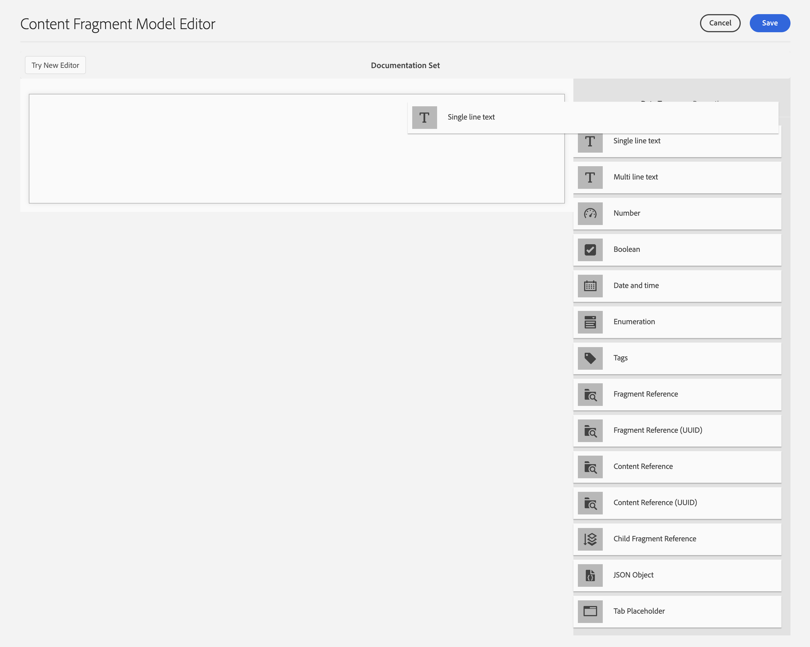

# 콘텐츠 조각 모델 {#content-fragment-models}

AEM의 콘텐츠 조각 모델은 Headless 콘텐츠의 기반 역할을 하는 [콘텐츠 조각](/help/assets/content-fragments/content-fragments.md)에 대한 콘텐츠 구조를 정의합니다.

콘텐츠 조각 모델을 사용하려면 다음 작업을 수행하십시오.

1. [인스턴스에 대해 콘텐츠 조각 모델 기능 활성화](/help/assets/content-fragments/content-fragments-configuration-browser.md)
1. 콘텐츠 조각 모델 [생성](#creating-a-content-fragment-model) 및 [구성](#defining-your-content-fragment-model)
1. 콘텐츠 조각 생성 시 사용할 [콘텐츠 조각 모델 활성화](#enabling-disabling-a-content-fragment-model)
1. **정책**&#x200B;을 구성하여 [필요한 자산 폴더에서 콘텐츠 조각 모델 허용](#allowing-content-fragment-models-assets-folder)

## 콘텐츠 조각 모델 만들기 {#creating-a-content-fragment-model}

1. **도구**, **일반**&#x200B;으로 이동한 다음 **콘텐츠 조각 모델**&#x200B;을 엽니다.
1. [구성 또는 하위 구성](/help/assets/content-fragments/content-fragments-configuration-browser.md)에 적합한 폴더로 이동합니다.
1. **만들기**&#x200B;를 사용하여 마법사를 엽니다.

   >[!CAUTION]
   >
   >[콘텐츠 조각 모델 사용이 활성화되지 않은](/help/assets/content-fragments/content-fragments-configuration-browser.md) 경우 **만들기** 옵션을 사용할 수 없습니다.

1. **모델 제목**을 지정합니다.
다양한 속성을 정의할 수도 있습니다. 예를 들어 **태그**, **설명**&#x200B;을 추가하고, 필요한 경우 **모델 활성화**&#x200B;를 선택하여 [모델을 활성화](#enabling-disabling-a-content-fragment-model)할 수 있습니다.

   >[!NOTE]
   >
   >**기본 미리 보기 URL 패턴**&#x200B;에 대한 자세한 내용은 [콘텐츠 조각 모델 - 속성](#content-fragment-model-properties)을 참조하세요.

   

1. **만들기**&#x200B;를 사용하여 빈 모델을 저장합니다. 작업의 성공을 나타내는 메시지가 표시되면 **열기**&#x200B;를 선택하여 모델을 즉시 편집하거나 **완료**&#x200B;를 선택하여 콘솔로 돌아갈 수 있습니다.

## 콘텐츠 조각 모델 정의 {#defining-your-content-fragment-model}

콘텐츠 조각 모델은 다양한 **[데이터 유형](#data-types)**&#x200B;을 사용하여 최종 콘텐츠 조각의 구조를 효과적으로 정의합니다. 모델 편집기를 사용하여 데이터 유형의 인스턴스를 추가한 다음 필요한 필드를 만들도록 구성할 수 있습니다.

>[!CAUTION]
>
>기존 콘텐츠 조각 모델을 편집하면 종속된 조각이 영향을 받을 수 있습니다.

1. **도구**, **일반**&#x200B;으로 이동한 다음 **콘텐츠 조각 모델**&#x200B;을 엽니다.

1. 콘텐츠 조각 모델을 포함하는 폴더로 이동합니다.
1. **편집**&#x200B;에 필요한 모델을 엽니다. 빠른 작업을 사용하거나, 모델을 선택한 후 도구 모음에서 작업을 선택하십시오.

   모델 편집기를 열면 다음과 같이 표시됩니다.

   * 왼쪽: 이미 정의된 필드
   * 오른쪽: 필드를 만드는 데 사용할 수 있는 **데이터 유형**(필드가 만들어지면 사용할 **속성**)

   >[!NOTE]
   >
   >필드가 **필수**&#x200B;로 표시되는 경우, 왼쪽 창에 나타나는 **레이블**&#x200B;이 별표(**&#42;**)와 함께 표시됩니다.


1. **필드를 추가하려면**

   * 필수 데이터 유형을 필드에 필요한 위치로 드래그합니다.

     

   * 모델에 필드가 추가되면 오른쪽 패널에 해당 특정 데이터 유형에 대해 정의할 수 있는 **속성**&#x200B;이 표시됩니다. 여기에서 해당 필드에 필요한 사항을 정의할 수 있습니다.

      * 설명이 따로 필요하지 않은 다양한 속성들에 대한 자세한 내용은 [속성](#properties)을 참조하십시오.
      * **필드 레이블**&#x200B;을 입력하면 **속성 이름**&#x200B;이 자동으로 채워집니다. 비어 있는 경우 이후에 수동으로 업데이트할 수 있습니다.

        >[!CAUTION]
        >
        데이터 유형의 **속성 이름** 속성을 수동으로 업데이트할 때에는 이름에 A-Z, a-z, 0-9 및 밑줄(_)만 포함해야 합니다.
        >
        이전 버전의 AEM에서 만든 모델에 잘못된 문자가 포함되어 있는 경우, 해당 문자를 제거하거나 업데이트하십시오.

     예:

     

1. **필드를 제거하려면**

   필수 필드를 선택한 다음 휴지통 아이콘을 선택합니다. 작업을 확인하는 메시지가 표시됩니다.

   

1. 모든 필수 필드를 추가하고 필요에 따라 관련 속성을 정의합니다. 예:

   

1. 정의를 유지하려면 **저장**&#x200B;을 선택합니다.

## 데이터 유형 {#data-types}

모델을 정의하는 데 다양한 데이터 유형을 사용할 수 있습니다.

* **한 줄 텍스트**
   * 한 줄 텍스트 행의 필드를 하나 이상 추가합니다. 최대 길이를 정의할 수 있습니다.
* **여러 줄 텍스트**
   * 리치 텍스트, 일반 텍스트 또는 Markdown일 수 있는 텍스트 영역입니다.
* **숫자**
   * 숫자 필드를 하나 이상 추가합니다.
* **부울**
   * 부울 확인란을 추가합니다.
* **날짜 및 시간**
   * 날짜 및/또는 시간을 추가합니다.
* **열거**
   * 확인란, 라디오 버튼 또는 드롭다운 목록 필드 집합 추가
* **태그**
   * 조각 작성자가 태그의 영역에 액세스하고 선택할 수 있습니다.
* **콘텐츠 참조**
   * 모든 유형의 다른 콘텐츠를 참조합니다. [중첩된 콘텐츠를 생성](#using-references-to-form-nested-content)하는 데 사용할 수 있습니다.
   * 이미지가 참조되면 썸네일을 표시하도록 선택할 수 있습니다.
* **조각 참조**
   * 다른 콘텐츠 조각을 참조합니다. [중첩된 콘텐츠를 생성](#using-references-to-form-nested-content)하는 데 사용할 수 있습니다.
   * 조각 작성자가 다음과 같은 작업을 수행할 수 있도록 데이터 유형을 구성할 수 있습니다.
      * 참조된 조각 직접 편집
      * 적절한 모델을 기반으로 새 콘텐츠 조각 생성
* **JSON 오브젝트**
   * 콘텐츠 조각 작성자가 조각의 해당 요소에 JSON 구문을 입력하도록 합니다.
      * AEM이 다른 서비스에서 복사/붙여넣기한 직접 JSON을 저장하도록 합니다.
      * JSON이 전달되고 GraphQL에서 JSON으로 출력됩니다.
      * 콘텐츠 조각 편집기에 JSON 구문 강조, 자동 채우기 및 오류 강조 표시를 포함합니다.
* **탭 플레이스홀더**
   * 콘텐츠 조각 콘텐츠를 편집할 때 사용할 탭을 가져올 수 있습니다.
모델 편집기에서 콘텐츠 데이터 유형 목록의 섹션을 구분하는 구분선으로 표시됩니다. 각 인스턴스는 새 탭의 시작을 나타냅니다.
조각 편집기에서 각 인스턴스는 탭으로 표시됩니다.
     >[!NOTE]
     >
     이 데이터 유형은 순전히 서식에 사용되며 AEM GraphQL 스키마에서는 무시됩니다.

## 속성 {#properties}

설명이 따로 필요하지 않은 특정 속성들에 대한 자세한 내용은 아래를 참조하십시오.

* **속성 이름**

  데이터 유형의 이 속성을 수동으로 업데이트할 때에는 이름에 A-Z, a-z, 0-9 및 밑줄(_)*만* **포함해야 합니다**.

  >[!CAUTION]
  >
  이전 버전의 AEM에서 만든 모델에 잘못된 문자가 포함되어 있는 경우, 해당 문자를 제거하거나 업데이트하십시오.

* **렌더링 형식**
조각의 필드를 구현하거나 렌더링하기 위한 다양한 옵션입니다. 종종 이 속성을 사용하여 작성자에게 필드의 단일 인스턴스가 표시되는지 또는 작성자가 여러 인스턴스를 만들 수 있는지를 정의할 수 있습니다. **여러 필드**&#x200B;를 사용하면 최소 및 최대 항목 수를 정의할 수 있습니다. 자세한 내용은 [유효성 검사](#validation)를 참조하세요.

* **필드 레이블**
**필드 레이블**&#x200B;을(를) 입력하면 **속성 이름**&#x200B;이 자동으로 생성되며, 필요한 경우 수동으로 업데이트할 수 있습니다.

* **유효성 검사**
기본 유효성 검사는 **필수** 속성과 같은 메커니즘을 통해 사용할 수 있습니다. 일부 데이터 유형에는 추가 유효성 검사 필드가 있습니다. 자세한 내용은 [유효성 검사](#validation)를 참조하십시오.

* 데이터 유형 **여러 줄 텍스트**&#x200B;의 경우 **기본 유형**&#x200B;을 다음 중 하나로 정의할 수 있습니다.

   * **리치 텍스트**
   * **Markdown**
   * **일반 텍스트**

  지정하지 않으면 이 필드에 기본값인 **리치 텍스트**&#x200B;가 사용됩니다.

  콘텐츠 조각 모델의 **기본 유형** 변경은 해당 조각을 편집기에서 열고 저장한 후에 기존 관련 콘텐츠 조각에만 적용됩니다.

* **고유**
특정 필드의 경우, 콘텐츠는 현재 모델에서 만들어진 모든 콘텐츠 조각에서 고유해야 합니다.

  콘텐츠 작성자가 동일한 모델의 다른 조각에 이미 추가된 콘텐츠를 반복할 수 없도록 하는 데 사용됩니다.

  예를 들어 `Country`라고 하는 콘텐츠 조각 모델의 **한 줄 텍스트** 필드는 두 개의 종속 콘텐츠 조각에서 `Japan` 값을 가질 수 없습니다. 두 번째 인스턴스를 시도하면 경고가 표시됩니다.

  >[!NOTE]
  >
  언어 루트별로 고유성이 보장됩니다.

  >[!NOTE]
  >
  변형은 동일한 조각의 변형과 동일한 *고유* 값을 가질 수 있지만, 다른 조각의 변형에 사용되는 것과 동일한 값을 가질 수는 없습니다.

  >[!CAUTION]
  >
  콘텐츠 조각의 복사본을 만드는 MSM을 사용하려면 각 콘텐츠 조각 모델에 사용된 데이터 형식에서 **Unique** 제약 조건을 제거해야 합니다.

* 특정 데이터 유형 및 그 속성에 대한 자세한 내용은 **[콘텐츠 참조](#content-reference)**&#x200B;를 참조하십시오.

* 특정 데이터 유형 및 그 속성에 대한 자세한 내용은 **[조각 참조(중첩된 조각)](#fragment-reference-nested-fragments)**&#x200B;를 참조하십시오.

* **변환 가능**

  콘텐츠 조각 모델 편집기의 필드에서 **변환 가능** 확인란을 선택하면

   * 필드의 속성 이름이 아직 존재하지 않는 경우 번역 구성, 컨텍스트 `/content/dam/<sites-configuration>`에 추가됩니다.
   * GraphQL의 경우: 콘텐츠 조각 필드의 `<translatable>` 속성을 `yes`로 설정하여 GraphQL 쿼리가 변환 가능한 콘텐츠만 포함하는 JSON 출력을 필터링하도록 합니다.

## 유효성 검사 {#validation}

이제 다양한 데이터 유형에는 최종 조각에 콘텐츠를 입력하는 경우에 대한 유효성 검사 요구 사항을 정의할 수 있는 기능이 포함됩니다.

* **한 줄 텍스트**
   * 사전 정의된 정규 표현식과 비교합니다.
* **숫자**
   * 특정 값을 확인합니다.
* **콘텐츠 참조**
   * 특정 유형의 콘텐츠를 테스트합니다.
   * 지정된 파일 크기 이하의 자산만 참조할 수 있습니다.
   * 사전 정의된 폭 및/또는 높이 범위(픽셀 단위) 내의 이미지만 참조할 수 있습니다.
* **조각 참조**
   * 특정 콘텐츠 조각 모델을 테스트합니다.
* **최소 항목 수** / **최대 항목 수**

  **다중 필드**(**렌더링 형식**(으)로 설정)로 정의된 필드에는 다음 옵션이 있습니다.

   * **최소 항목 수**
   * **최대 항목 수**

  유효성이 검사됩니다.

   * [원본 콘텐츠 조각 편집기](/help/assets/content-fragments/content-fragments-variations.md)에서 최대값의 유효성을 검사했습니다.
   * 둘 다 [콘텐츠 조각 편집기](/help/sites-cloud/administering/content-fragments/authoring.md)에서 유효성을 검사합니다.

## 참조를 사용하여 중첩된 콘텐츠 형성 {#using-references-to-form-nested-content}

콘텐츠 조각은 다음 데이터 유형 중 하나를 사용하여 중첩된 콘텐츠를 형성할 수 있습니다.

* **[콘텐츠 참조](#content-reference)**
   * 모든 유형의 다른 콘텐츠에 대한 간단한 참조를 제공합니다.
   * 최종 조각에서 하나 이상의 참조에 대해 구성할 수 있습니다.

* **[조각 참조](#fragment-reference-nested-fragments)**(중첩된 조각)
   * 지정된 특정 모델에 따라 다른 조각을 참조합니다.
   * 구조화된 데이터를 포함/검색할 수 있습니다.
     >[!NOTE]
     >
     이 방법은 특히 [GraphQL을 통해 콘텐츠 조각을 사용하여 Headless 콘텐츠를 게재](/help/assets/content-fragments/content-fragments-graphql.md)할 때 함께 사용할 수 있습니다.
   * 최종 조각에서 하나 이상의 참조에 대해 구성할 수 있습니다.

>[!NOTE]
>
AEM은 다음에 대한 재발 방지 기능을 제공합니다.
>
* 콘텐츠 참조
따라서 사용자가 현재 조각에 대한 참조를 추가할 수 없습니다. 이로 인해 빈 조각 참조 선택기 대화 상자가 나타날 수 있습니다.
>
* GraphQL의 조각 참조
서로 참조하는 여러 콘텐츠 조각을 반환하는 복합 쿼리를 만들면 첫 번째 발생 시 null을 반환합니다.

### 콘텐츠 참조 {#content-reference}

콘텐츠 참조를 사용하면 다른 소스의 콘텐츠(예: 이미지 또는 콘텐츠 조각)를 렌더링할 수 있습니다.

표준 속성 외에 다음을 지정할 수 있습니다.

* 참조된 콘텐츠의 **루트 경로**
* 참조할 수 있는 콘텐츠 유형
* 파일 크기 제한
* 이미지를 참조한 경우:
   * 썸네일 표시
   * 높이 및 폭의 이미지 제한


### 조각 참조(중첩된 조각) {#fragment-reference-nested-fragments}

조각 참조는 하나 이상의 콘텐츠 조각을 참조합니다. 여러 계층으로 구조화된 데이터를 검색할 수 있어 앱에서 사용할 콘텐츠를 검색할 때 특히 유용한 기능입니다.

예:

* 다음을 포함하는 직원의 세부 정보를 정의하는 모델
   * 고용주(회사)를 정의하는 모델에 대한 참조

```xml
type EmployeeModel {
    name: String
    firstName: String
    company: CompanyModel
}

type CompanyModel {
    name: String
    street: String
    city: String
}
```

>[!NOTE]
>
이는 특히 [GraphQL을 통해 콘텐츠 조각을 사용하여 Headless 콘텐츠를 게재](/help/assets/content-fragments/content-fragments-graphql.md)할 때 함께 사용할 수 있습니다.

표준 속성 외에 다음을 정의할 수 있습니다.

* **렌더링 형식**:

   * **다중 필드** - 조각 작성자는 여러 개별 참조를 생성할 수 있습니다.

   * **조각 참조** - 조각 작성자가 조각에 대한 단일 참조를 선택하도록 합니다.

* **모델 유형**
여러 모델을 선택할 수 있습니다. 콘텐츠 조각을 작성할 때 이러한 모델을 사용하여 참조된 조각을 만들어야 합니다.

* **루트 경로**
참조된 조각의 루트 경로를 지정합니다.

* **조각 생성 허용**

  이를 통해 조각 작성자는 적절한 모델을 기반으로 조각을 만들 수 있습니다.

   * **조각 참조 합성** - 이 기능을 사용하면 조각 작성자가 여러 조각을 선택하여 합성을 빌드할 수 있습니다.

  

>[!NOTE]
>
재발 방지 메커니즘을 사용할 수 있습니다. 이는 사용자가 조각 참조에서 현재 콘텐츠 조각을 선택할 수 없도록 합니다. 이로 인해 빈 조각 참조 선택기 대화 상자가 나타날 수 있습니다.
>
또한 GraphQL에는 조각 참조에 대한 재발 방지 기능이 있습니다. 서로 참조하는 두 개의 콘텐츠 조각 간에 복합 쿼리를 만들면 null을 반환합니다.

## 콘텐츠 조각 모델 - 속성 {#content-fragment-model-properties}

콘텐츠 조각 모델의 **속성**&#x200B;을 편집할 수 있습니다.

* **기본**
   * **모델 제목**
   * **태그**
   * **설명**
   * **이미지 업로드**
   * **기본 미리 보기 URL 패턴**

     >[!NOTE]
     >
     *new* 콘텐츠 조각 편집기에서만 사용됩니다. 자세한 내용은 [콘텐츠 조각 모델](/help/sites-cloud/administering/content-fragments/content-fragment-models.md#content-fragment-model-properties)을 참조하세요.


## 콘텐츠 조각 모델 활성화 또는 비활성화 {#enabling-disabling-a-content-fragment-model}

콘텐츠 조각 모델 사용을 완벽하게 제어하기 위해 설정할 수 있는 상태가 있습니다.

### 콘텐츠 조각 모델 활성화 {#enabling-a-content-fragment-model}

모델을 만들 때는 다음 작업을 수행하도록 활성화해야 합니다.

* 콘텐츠 조각을 만들 때 선택할 수 있습니다.
* 콘텐츠 조각 모델 내에서 참조할 수 있습니다.
* GraphQL에서 사용할 수 있습니다. 그 결과 스키마가 생성됩니다.

다음 중 하나로 플래그가 지정된 모델을 활성화하려면 다음 작업을 수행합니다.

* **초안**: mew(활성화되지 않음)
* **비활성화됨**: 특히 비활성화되어 있음

다음 중 하나에서 **활성화** 옵션을 사용합니다.

* (필요한 모델이 선택되어 있는 경우) 상단 도구 모음
* 해당 빠른 작업(필요한 모델 위에 마우스 놓기)


### 콘텐츠 조각 모델 비활성화 {#disabling-a-content-fragment-model}

모델을 비활성화하여

* 해당 모델을 더 이상 *새* 콘텐츠 조각 생성을 위한 기반으로 사용하지 않도록 할 수 있습니다.
* 하지만
   * GraphQL 스키마는 JSON API에 영향을 주지 않도록 계속 생성되며 계속 쿼리할 수 있습니다.
   * 해당 모델을 기반으로 하는 모든 콘텐츠 조각은 여전히 GraphQL 엔드포인트에서 쿼리하고 반환할 수 있습니다.
* 해당 모델은 더 이상 참조할 수 없지만 기존 참조는 그대로 유지되므로 GraphQL 엔드포인트에서 쿼리하고 반환할 수 있습니다.

**활성화됨**&#x200B;으로 플래그가 지정된 모델을 비활성화하려면 다음 중 하나에서 **비활성화** 옵션을 사용합니다.

* (필요한 모델이 선택되어 있는 경우) 상단 도구 모음
* 해당 빠른 작업(필요한 모델 위에 마우스 놓기)


## 자산 폴더에서 콘텐츠 조각 모델 허용 {#allowing-content-fragment-models-assets-folder}

콘텐츠 거버넌스를 구현하기 위해 자산 폴더에서 **정책**&#x200B;을 구성하여 해당 폴더에서 조각 생성에 허용되는 콘텐츠 조각 모델을 제어할 수 있습니다.

>[!NOTE]
>
이 메커니즘은 페이지의 고급 속성에서 페이지 및 그 하위 페이지에 대해 [페이지 템플릿을 허용](/help/sites-cloud/authoring/sites-console/templates.md#allowing-a-template-author)하는 것과 유사합니다.

**허용되는 콘텐츠 조각 모델**&#x200B;에 대해 **정책**&#x200B;을 구성하려면 다음 작업을 수행합니다.

1. 필요한 자산 폴더의 **속성**&#x200B;으로 이동하여 엽니다.

1. 다음을 구성할 수 있는 **정책** 탭을 엽니다.

   * **상속 위치`<folder>`**

     새 하위 폴더를 만들 때 정책이 자동으로 상속됩니다. 하위 폴더에서 상위 폴더와 다른 모델을 허용해야 하는 경우 정책을 다시 구성(및 상속 중단)할 수 있습니다.

   * **경로에 의해 허용된 콘텐츠 조각 모델**

     여러 모델을 사용할 수 있습니다.

   * **태그에 의해 허용된 콘텐츠 조각 모델**

     여러 모델을 사용할 수 있습니다.

   

1. 모든 변경 내용을 **저장**&#x200B;합니다.

폴더에 대해 허용되는 콘텐츠 조각 모델은 다음과 같이 해결됩니다.
* **허용되는 콘텐츠 조각 모델**&#x200B;에 대한 **정책**
* 비어 있는 경우 상속 규칙을 사용하여 정책을 결정하십시오.
* 상속 체인이 결과를 전달하지 않는 경우 해당 폴더에 대한 **Cloud Services** 구성을 살펴보십시오(처음에는 직접, 그 다음에는 상속을 통해).
* 어느 것도 결과를 전달하지 않는 경우에는 해당 폴더에 대해 허용되는 모델이 없음을 의미합니다.

## 콘텐츠 조각 모델 삭제 {#deleting-a-content-fragment-model}

>[!CAUTION]
>
콘텐츠 조각 모델을 삭제하면 종속된 조각이 영향을 받을 수 있습니다.

콘텐츠 조각 모델을 삭제하려면

1. **도구**, **일반**&#x200B;으로 이동한 다음 **콘텐츠 조각 모델**&#x200B;을 엽니다.

1. 콘텐츠 조각 모델을 포함하는 폴더로 이동합니다.
1. 모델을 선택한 후 도구 모음에서 **삭제**&#x200B;를 클릭합니다.

   >[!NOTE]
   >
   참조되는 모델의 경우, 경고가 표시됩니다. 적절하게 조치하십시오.

## 콘텐츠 조각 모델 게시 {#publishing-a-content-fragment-model}

콘텐츠 조각 모델은 종속된 콘텐츠 조각이 게시될 때/게시되기 전에 게시해야 합니다.

콘텐츠 조각 모델을 게시하려면

1. **도구**, **일반**&#x200B;으로 이동한 다음 **콘텐츠 조각 모델**&#x200B;을 엽니다.

1. 콘텐츠 조각 모델을 포함하는 폴더로 이동합니다.
1. 모델을 선택한 후 도구 모음에서 **게시**를 클릭합니다.
게시된 상태가 콘솔에 표시됩니다.

   >[!NOTE]
   >
   모델이 아직 게시되지 않은 콘텐츠 조각을 게시하는 경우, 선택 목록에 이것이 표시되고 모델이 조각과 함께 게시됩니다.

## 콘텐츠 조각 모델 게시 취소 {#unpublishing-a-content-fragment-model}

조각에서 콘텐츠 모델을 참조하지 않는 경우 이를 게시 취소할 수 있습니다.

콘텐츠 조각 모델을 게시 취소하려면 다음 작업을 수행하십시오.

1. **도구**, **일반**&#x200B;으로 이동한 다음 **콘텐츠 조각 모델**&#x200B;을 엽니다.

1. 콘텐츠 조각 모델을 포함하는 폴더로 이동합니다.
1. 모델을 선택한 다음 도구 모음에서 **게시 취소**를 선택합니다.
게시된 상태가 콘솔에 표시됩니다.

하나 이상의 조각에서 현재 사용 중인 모델을 게시 취소하려고 하면 이를 알리는 오류 경고가 표시됩니다.


이 메시지는 [참조](/help/sites-cloud/authoring/basic-handling.md#references) 패널을 확인하여 자세히 조사하도록 제안합니다.


## 잠긴(게시된) 콘텐츠 조각 모델 {#locked-published-content-fragment-models}

이 기능은 게시된 콘텐츠 조각 모델에 대한 거버넌스를 제공합니다.

### 과제 {#the-challenge}

* 콘텐츠 조각 모델은 AEM에서 GraphQL 쿼리에 대한 스키마를 결정합니다.

   * AEM GraphQL 스키마는 콘텐츠 조각 모델 생성 직후 생성되며 작성자 및 게시 환경 모두에 존재할 수 있습니다.

   * 게시의 스키마는 JSON 형식으로 콘텐츠 조각 콘텐츠를 실시간으로 게재할 수 있는 기반을 제공하므로 가장 중요합니다.

* 콘텐츠 조각 모델을 수정할 때, 즉 편집할 때 문제가 발생할 수 있습니다. 즉, 스키마가 변경되어 기존 GraphQL 쿼리에 영향을 줄 수 있습니다.

* 일반적으로 콘텐츠 조각 모델에 새 필드를 추가해도 유해한 영향을 미치지 않아야 합니다. 그러나 기존 데이터 필드(예: 이름)를 수정하거나 필드 정의를 삭제하면 이러한 필드를 요청할 때 기존 GraphQL 쿼리가 중단됩니다.

### 요구 사항 {#the-requirements}

* 사용자가 라이브 콘텐츠 게재에 이미 사용된 모델(즉, 게시된 모델)을 편집할 때의 위험을 인식하도록 합니다.

* 또한 의도하지 않은 변경을 피하도록 합니다.

이렇게 하면 수정된 모델을 다시 게시하는 경우 쿼리가 중단될 수 있습니다.

### 솔루션 {#the-solution}

이러한 문제를 해결하기 위해 콘텐츠 조각 모델은 게시되는 즉시 작성자의 읽기 전용 모드로 *잠깁니다*. 이는 **잠김**&#x200B;으로 표시됩니다.


모델이 읽기 전용 모드에서 **잠김**&#x200B;인 경우 모델의 콘텐츠 및 구조를 볼 수 있지만 이를 편집할 수는 없습니다.

콘솔 또는 모델 편집기에서 **잠긴** 모델을 관리할 수 있습니다.

* 콘솔

  콘솔에서 도구 모음의 **잠금 해제** 및 **잠금** 액션을 사용하여 읽기 전용 모드를 관리할 수 있습니다.

  

   * 편집 사용을 위해 모델의 **잠금을 해제**&#x200B;할 수 있습니다.

     **잠금 해제**&#x200B;를 선택하면 경고가 표시되며, **잠금 해제** 액션을 확인해야 합니다.
     

     그런 다음 편집할 모델을 열 수 있습니다.

   * 이후에 모델을 **잠글** 수도 있습니다.
   * 모델을 다시 게시하면 그 즉시 **잠금**(읽기 전용) 모드로 다시 돌아갑니다.

* 모델 편집기

   * 잠긴 모델을 열면 경고가 표시되며 다음 세 가지 작업이 표시됩니다(**취소**, **읽기 전용 보기**, **편집**).

     

   * **읽기 전용 보기**&#x200B;를 선택하면 모델의 콘텐츠 및 구조를 확인할 수 있습니다.

     

   * **편집**&#x200B;을 선택하는 경우 업데이트를 편집하고 저장할 수 있습니다.

     

     >[!NOTE]
     >
     맨 위에는 여전히 경고가 표시될 수 있지만, 이는 모델이 기존 콘텐츠 조각에서 이미 사용 중임을 의미합니다.

   * **취소**&#x200B;를 선택하면 콘솔로 돌아갑니다.
