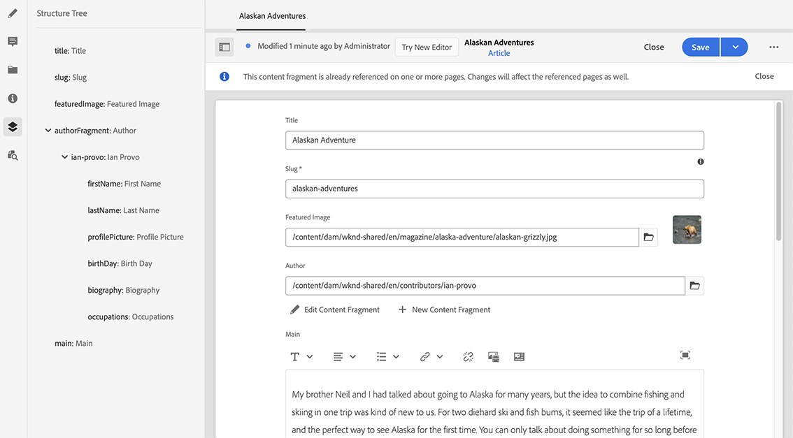

# 콘텐츠 조각 구조 트리 {#content-fragment-structure-tree}

AEM의 콘텐츠 조각 편집기의 구조 트리 기능을 사용하여 Headless 콘텐츠를 더 잘 이해할 수 있습니다.

>[!NOTE]
>
>콘텐츠 조각은 사이트 기능이지만 다음과 같이 저장됩니다. **에셋**.
>
>콘텐츠 조각 작성용 편집기에는 두 가지가 있습니다. 이 단원에서는 주로 **에셋** 콘솔. 사이트 설명서 를 참조하십시오. [컨텐츠 조각 - 작성](/help/sites-cloud/administering/content-fragments/authoring.md), 새 편집기에 대한 세부 정보(주로 **컨텐츠 조각** console).

콘텐츠 조각 편집기에서 [구조 트리] 아이콘을 선택할 수 있습니다.

이렇게 하면 왼쪽 창에서 조각 구조의 표현식이 열립니다. 이를 사용하여 참조된 조각을 탐색할 수 있습니다. 참조를 선택하면 편집용 조각이 열립니다.

>[!NOTE]
>
>기본 패널에서 탐색 표시를 사용하여 시작점으로 돌아갈 수 있습니다.

