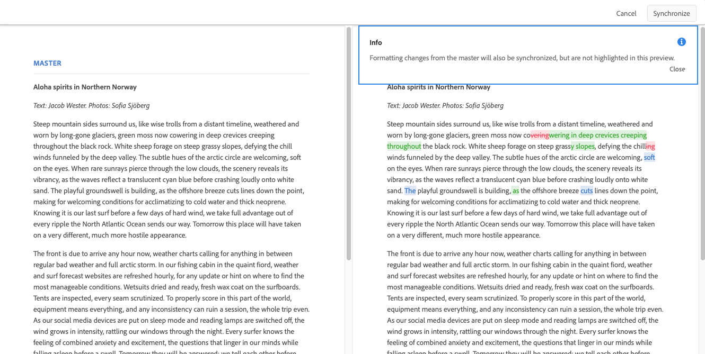

# 변형 - 조각 컨텐츠 작성{#variations-authoring-fragment-content}

[변형은](/help/assets/content-fragments/content-fragments.md#constituent-parts-of-a-content-fragment) 특정 채널 및/또는 시나리오에 사용할 마스터 컨텐츠의 복사본을 만들고 편집할 수 있으므로 컨텐츠 조각의 중요한 기능입니다.

변형 **탭에서** 다음을 수행할 수 있습니다.

* [조각에 대한 컨텐츠를](#authoring-your-content) 입력합니다.
* [마스터 컨텐츠의 변형](#managing-variations) 만들기 및 **관리**

편집 중인 데이터 유형에 따라 다양한 다른 작업을 수행합니다.예를 들면 다음과 같습니다.

* [조각](#inserting-assets-into-your-fragment) (이미지)에 시각적 에셋 삽입

* 리치 텍스트 [,](#rich-text)일반 텍스트 [및](#plain-text) 마크다운 중에서 [선택하여](#markdown) 편집할 수 있습니다.

* [컨텐츠 업로드](#uploading-content)

* [주요 통계](#viewing-key-statistics) 보기(여러 줄 텍스트 정보)

* [텍스트 요약](#summarizing-text)

* [변형을 마스터 컨텐츠와 동기화](#synchronizing-with-master)

>[!CAUTION]
>
>조각이 게시되고 참조되면 작성자가 편집을 위해 조각을 다시 열면 AEM에 경고가 표시됩니다. 이것은 조각의 변경 사항이 참조된 페이지에도 영향을 준다는 것을 경고하기 위한 것입니다.

## 컨텐츠 작성 {#authoring-your-content}

편집을 위해 컨텐츠 조각을 열면 변형 **탭이** 기본적으로 열립니다. 여기에서 마스터 또는 변형에 대한 컨텐츠를 작성할 수 있습니다. 다음을 작업을 수행할 수 있습니다.

* 변형 탭에서 직접 **편집**
* 전체 [화면 편집기를](#full-screen-editor) 열어 다음을 수행합니다.

   * 형식 [선택](#formats)
   * 더 많은 편집 옵션 보기(리치 텍스트 [포맷용](#rich-text) )

   * 다양한 [작업 액세스](#actions)

예:

* 간단한 조각 편집

   단순 조각은 한 개의 여러 줄 텍스트 필드로 구성됩니다(전체 화면 편집기에서 시각적 에셋을 추가할 수 있음).

   

* 구조화된 컨텐츠가 있는 조각 편집

   구조화된 조각은 컨텐츠 모델에서 정의된 다양한 데이터 유형의 다양한 필드를 포함합니다. 여러 줄로 된 필드의 경우 [전체 화면 편집기를](#full-screen-editor) 사용할 수 있습니다.

   

### 전체 화면 편집기 {#full-screen-editor}

여러 줄로 된 텍스트 필드를 편집할 때 전체 화면 편집기를 열 수 있습니다.실제 텍스트 내에서 탭하거나 클릭한 다음 다음 작업 아이콘을 선택합니다.

전체 화면 편집기에서는 다음을 제공합니다.

* 다양한 [작업 이용](#actions)
* 서식 [옵션에 따라](#formats)추가 서식 옵션([서식 텍스트](#rich-text))

### 작업 {#actions}

전체 화면 편집기(즉, 여러 줄 텍스트)가 열려 있는 경우에도 다음 작업을 모든 [형식에](#formats)사용할 수 있습니다.

* 서식( [서식](#formats) 텍스트[,](#rich-text)일반 텍스트, [마크다운](#plain-text) )을 [선택합니다](#markdown).

* [콘텐츠 업로드](#uploading-content)

* [텍스트에 주석](/help/assets/content-fragments/content-fragments-variations.md#annotating-a-content-fragment) 추가

* [조각](#inserting-assets-into-your-fragment) (이미지)에 시각적 에셋 삽입

* [텍스트 통계 표시](#viewing-key-statistics)

* [마스터와 동기화](#synchronizing-with-master) (변형 편집 시)

* [텍스트 요약](#summarizing-text)

### 형식 {#formats}

여러 줄 텍스트 편집 옵션은 선택한 형식에 따라 다릅니다.

* [리치 텍스트](#rich-text)
* [일반 텍스트](#plain-text)
* [Markdown](#markdown)

전체 화면 편집기에서 형식을 선택할 수 있습니다.

### 리치 텍스트 {#rich-text}

서식 있는 텍스트 편집 기능을 사용하면 다음과 같은 형식을 지정할 수 있습니다.

* 굵게
* 기울임체
* 밑줄
* 정렬:왼쪽, 가운데, 오른쪽
* 글머리 기호 목록
* 번호 매기기 목록
* 들여쓰기:증가, 감소
* 하이퍼링크 만들기/나누기
* 다음 서식 옵션을 사용할 수 있는 전체 화면 편집기를 엽니다.

   * Word에서 텍스트 붙여넣기
   * 표 삽입
   * 단락 스타일:단락, 제목 1/2/3
   * [시각적 에셋 삽입](#inserting-assets-into-your-fragment)
   * 검색
   * 찾기/바꾸기
   * 맞춤법 검사기
   * [주석](/help/assets/content-fragments/content-fragments-variations.md#annotating-a-content-fragment)

전체 화면 편집기에서 [작업에](#actions) 액세스할 수도 있습니다.

### 일반 텍스트 {#plain-text}

일반 텍스트를 사용하면 서식 또는 마크다운 정보 없이 신속하게 컨텐츠를 입력할 수 있습니다. 전체 화면 편집기를 열어 추가 [작업을](#actions)수행할 수도 있습니다.

>[!CAUTION]
>
>[일반 텍스트] **를** 선택하면 서식, 표시 및/또는 리치 텍스트 **또는 마크다운에 삽입한 에셋이 손실될** 수 **있습니다**.

### Markdown {#markdown}

>[!NOTE]
>
>자세한 내용은 Marketing [설명서를](/help/assets/content-fragments/content-fragments-markdown.md) 참조하십시오.

이렇게 하면 마크다운을 사용하여 텍스트 서식을 지정할 수 있습니다. 다음을 정의할 수 있습니다.

* 머리글
* 단락 및 줄 바꿈
* 링크
* 이미지
* 인용 부호 차단
* 목록
* 강조
* 코드 블록
* 백슬래시 이스케이프

전체 화면 편집기를 열어 추가 [작업을](#actions)수행할 수도 있습니다.

>[!CAUTION]
>
>리치 텍스트와 마크다운 간을 **전환하면** 이러한 두 포맷의 처리 방식에 차이가 있을 수 있으므로 **** 블록 인용 부호와 코드 블록을 사용하면 예기치 않은 효과를 경험할 수 있습니다.

### 주요 통계 보기 {#viewing-key-statistics}

전체 화면 편집기가 열리면 텍스트 **통계** 작업에 텍스트에 대한 다양한 정보가 표시됩니다.

예:

### 컨텐츠 업로드 {#uploading-content}

컨텐츠 조각을 작성하는 프로세스를 간소화하려면 외부 편집기에서 준비한 텍스트를 업로드하고 조각에 직접 추가할 수 있습니다.

### 텍스트 요약 {#summarizing-text}

텍스트 요약 기능은 사용자가 주요 요점과 전체 의미를 유지하면서 텍스트의 길이를 사전 정의된 단어 수로 줄이는 데 도움이 되도록 고안되었습니다.

>[!NOTE]
>
>보다 기술적인 측면에서, 시스템은 특정한 알고리즘에 따라 정보 밀도와 고유성의 *최고 비율을* 제공하는 것으로 문장을 유지하고 있습니다.

>[!CAUTION]
>
>컨텐츠 조각에는 유효한 언어 폴더(ISO 코드)가 있어야 합니다.사용할 언어 모델을 결정하는 데 사용됩니다.
>
>예를 들어 `en/` , 다음 경로에서와 같이
>
>  `/content/dam/my-brand/en/path-down/my-content-fragment`

>[!CAUTION]
기본적으로 영어로 제공됩니다.
다른 언어는 패키지 공유에서 언어 모델 패키지로 사용할 수 있습니다.
* [프랑스어(fr)](https://www.adobeaemcloud.com/content/marketplace/marketplaceProxy.html?packagePath=/content/companies/public/adobe/packages/cq630/product/smartcontent-model-fr)
* [독일어(de)](https://www.adobeaemcloud.com/content/marketplace/marketplaceProxy.html?packagePath=/content/companies/public/adobe/packages/cq630/product/smartcontent-model-de)
* [이탈리아어(it)](https://www.adobeaemcloud.com/content/marketplace/marketplaceProxy.html?packagePath=/content/companies/public/adobe/packages/cq630/product/smartcontent-model-it)
* [스페인어(es)](https://www.adobeaemcloud.com/content/marketplace/marketplaceProxy.html?packagePath=/content/companies/public/adobe/packages/cq630/product/smartcontent-model-es)

1. 마스터 **또는** 필요한 변형을 선택합니다.
2. 전체 화면 편집기를 엽니다.

3. 도구 **모음에서 텍스트** 요약을 선택합니다.

   

4. 대상 단어 수를 지정하고 시작을 **선택합니다**.
5. 원래 텍스트는 제안된 요약과 함께 나란히 표시됩니다.

   * 제거할 문장은 빨간색으로 강조 표시되고, 취소선이 표시됩니다.
   * 강조 표시된 문장을 클릭하면 요약된 컨텐츠에 유지됩니다.
   * 강조 표시되지 않은 문장을 클릭하면 제거됩니다.
   

6. 요약을 **선택하여** 변경 내용을 확인합니다.

### 컨텐츠 조각에 주석 달기 {#annotating-a-content-fragment}

조각에 주석을 다는 방법은 다음과 같습니다.

1. 마스터 **또는** 필요한 변형을 선택합니다.
1. 전체 화면 편집기를 엽니다.
1. 텍스트를 선택합니다. 주석 **아이콘을** 사용할 수 있게 됩니다.

   

1. 대화 상자가 열립니다. 여기에 주석을 입력할 수 있습니다.

1. 전체 화면 편집기를 닫고 **조각을** 저장합니다.

### 주석 보기, 편집, 삭제 {#viewing-editing-deleting-annotations}

주석:

* 편집기의 전체 화면 모드와 일반 모드에서 텍스트의 강조 표시로 표시됩니다. 그런 다음 강조 표시된 텍스트를 클릭하여 주석의 전체 세부 사항을 보거나 편집하거나 삭제할 수 있으며 이 텍스트를 클릭하면 대화 상자가 다시 열립니다.

   >[!NOTE]
   하나의 텍스트에 여러 주석이 적용된 경우 드롭다운 선택기가 제공됩니다.

* 주석이 적용된 전체 텍스트를 삭제하면 주석도 삭제됩니다.

* 조각 편집기에서 [주석] **탭을 선택하여** 나열하거나 삭제할 수 있습니다.

   

* 선택한 조각에 대해 타임라인에서 [보고](/help/assets/content-fragments/content-fragments-managing.md#timeline-for-content-fragments) 삭제할 수 있습니다.

### 조각에 자산 삽입 {#inserting-assets-into-your-fragment}

컨텐츠 조각을 작성하는 프로세스를 간소화하려면 자산( [이미지](/help/assets/manage-digital-assets.md) )을 조각에 직접 추가할 수 있습니다.

서식과 함께 조각의 단락 시퀀스에 추가됩니다.페이지에서 [조각을](/help/sites-cloud/authoring/fundamentals/content-fragments.md)사용/참조할 때 서식을 지정할 수 있습니다.

>[!CAUTION]
참조하는 페이지에서 이러한 자산을 이동하거나 삭제할 수 없으므로 조각 편집기에서 수행해야 합니다.
그러나 자산(예: 크기)의 서식은 [페이지 편집기에서](/help/sites-cloud/authoring/fundamentals/content-fragments.md)수행해야 합니다. 조각 편집기의 자산 표시는 컨텐츠 플로우를 작성하기 위한 것입니다.

>[!NOTE]
There are various methods of adding [images](/help/assets/content-fragments/content-fragments.md#fragments-with-visual-assets) to the fragment and/or page.

1. 이미지를 추가할 위치에 커서를 놓습니다.
2. 자산 **삽입** 아이콘을 사용하여 검색 대화 상자를 엽니다.

   

3. 대화 상자에서 다음 중 하나를 수행할 수 있습니다.

   * dam에서 필요한 자산으로 이동
   * dam에서 자산 검색
   일단 찾으면 축소판을 클릭하여 필요한 자산을 선택합니다.

4. 선택을 **사용하여** 자산을 현재 위치에서 컨텐츠 조각의 단락 시스템에 추가합니다.

   >[!CAUTION]
   자산을 추가한 후 형식을 다음으로 변경합니다.
   * **일반 텍스트**:조각에서 자산이 완전히 손실됩니다.
   * **Markdown**:자산은 표시되지 않지만 리치 텍스트로 돌아갈 때 **표시됩니다**.

## 변형 관리 {#managing-variations}

### 변형 만들기 {#creating-a-variation}

변형을 사용하면 마스터 **컨텐츠를 가져와** 목적에 따라 변경할 수 있습니다(필요한 경우).

새 변형을 만들려면:

1. 조각을 열고 사이드 패널이 표시되는지 확인합니다.
1. 사이드 **패널의** 아이콘 막대에서 변형을 선택합니다.
1. 변형 **만들기를 선택합니다**.
1. 대화 상자가 열리면 새 변형에 **대한** 제목 및 **설명을** 지정합니다.
1. 추가 **선택**;조각 **마스터가** 새 변형에 복사되며, 이 변형은 [편집을](#editing-a-variation)위해 열려 있습니다.

   >[!NOTE]
   새 변형을 만들 때는 항상 **현재** 열려 있는 변형이 아니라 복사되는 마스터가 됩니다.

### 변형 편집 {#editing-a-variation}

다음 중 하나를 수행한 후에 변형 컨텐츠를 변경할 수 있습니다.

* [변형](#creating-a-variation)만들기
* 기존 조각을 열고 측면 패널에서 필요한 변형을 선택합니다.

### 변형 이름 바꾸기 {#renaming-a-variation}

기존 변형의 이름을 변경하려면

1. 조각을 열고 **사이드** 패널에서 변형을 선택합니다.
1. 필요한 변형을 선택합니다.
1. 작업 **드롭다운에서** 이름 **변경을** 선택합니다.

1. 결과 대화 상자에 **새** 제목 및/또는 **설명을** 입력합니다.

1. 이름 변경 **작업을** 확인합니다.

>[!NOTE]
변형 제목에만 영향을 **줍니다**.

### 변형 삭제 {#deleting-a-variation}

기존 변형을 삭제하려면

1. 조각을 열고 **사이드** 패널에서 변형을 선택합니다.
1. 필요한 변형을 선택합니다.
1. 작업 **드롭다운에서** 삭제를 **선택합니다** .

1. 대화 **상자에서** 삭제 작업을 확인합니다.

>[!NOTE]
마스터는 삭제할 수 **없습니다**.

### 마스터와 동기화 {#synchronizing-with-master}

**마스터는** 컨텐츠 조각의 필수 부분이며, 정의에 따라 컨텐츠의 마스터 사본은 보유하지만, 변형에는 해당 컨텐츠의 개별 업데이트 및 맞춤 버전이 포함됩니다. 마스터가 업데이트되면 이러한 변경 사항이 변형과 연관성이 있을 수 있으므로 변경 사항을 해당 변경 사항에도 전파해야 합니다.

변형을 편집할 때 변형의 현재 요소를 마스터와 동기화하는 작업에 액세스할 수 있습니다. 이렇게 하면 마스터의 변경 내용을 필요한 변형에 자동으로 복사할 수 있습니다.

>[!CAUTION]
동기화는 Master *에서&#x200B;**변형으로**변경 사항을 복사하는*&#x200B;경우에만 사용할 수 있습니다.
변형의 현재 요소만 동기화됩니다.
동기화는 **여러 줄 텍스트** 데이터 유형에서만 작동합니다.
변형에서 *마스터로 변경 내용을&#x200B;**전송할&#x200B;***수 없습니다.

1. 조각 편집기에서 컨텐츠 조각을 엽니다. 마스터가 **편집되었는지** 확인합니다.
1. 특정 변형을 선택한 다음 다음 중 하나에서 적절한 동기화 작업을 선택합니다.

   * 작업 **드롭다운** 선택기 - **현재 요소를 마스터와 동기화**

   * 전체 화면 편집기의 도구 모음 - **마스터와 동기화**

1. 마스터 및 변형은 나란히 표시됩니다.

   * 녹색은 컨텐츠가 추가되었음을 나타냅니다(변형에).
   * 빨간색은 제거된 컨텐츠(변형에서)를 나타냅니다.
   * 파란색은 바뀐 텍스트를 나타냅니다.
   

1. 동기화를 **선택하면**&#x200B;변형이 업데이트되고 표시됩니다.
