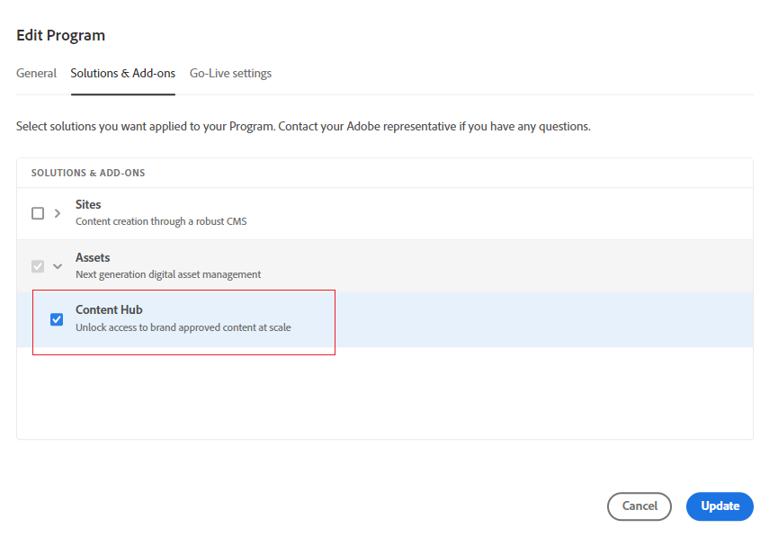

# Content Hub 배포 {#deploy-content-hub}

Content Hub은 조직 및 비즈니스 파트너를 위한 온브랜드 콘텐츠에 대한 액세스를 민주화하기 위해 Experience Manager Assets as a Cloud Service의 일부로 사용할 수 있습니다.

Experience Manager Assetsas a Cloud Service 에서 승인됨으로 표시된 자산은 Content Hub에서 자산 배포에 사용할 수 있습니다.

이 문서에서는 요구 사항에 따른 다양한 권한을 포함하여 사용자에게 Content Hub 액세스를 제공하는 통합 워크플로우를 제공합니다.

Content Hub에 대한 권한의 변형은 다음과 같습니다.

* [Content Hub 사용자](#onboard-content-hub-users): Content Hub 포털에서 브랜드 승인 자산에 액세스합니다.

* [Content Hub 관리자](#onboard-content-hub-administrator): 액세스 권한 [구성 사용자 인터페이스](/help/assets/configure-content-hub-ui-options.md) Content Hub에서 브랜드 승인 에셋에 액세스, Content Hub에 에셋 업로드 및 이미지를 편집하는 Adobe Express 통합(Adobe Express 권한이 있는 경우).

* [에셋을 추가할 수 있는 권한이 있는 Content Hub 사용자](#onboard-content-hub-users-add-assets): 다음을 수행할 수 있습니다. [Content Hub에 에셋 업로드](/help/assets/upload-brand-approved-assets.md) Content Hub 포털에서 brand approved assets에 액세스할 수 있습니다.

* [자산을 새 변형으로 리믹스할 수 있는 권한이 있는 Content Hub 사용자](#onboard-content-hub-users-remix-assets): [Adobe Express 통합](/help/assets/edit-images-content-hub.md) (Adobe Express 권한이 있는 경우) Content Hub 포털에서 브랜드 승인 에셋에 액세스할 수 있습니다.

* [Experience Manager Assets 사용자](#experience-manager-assets-users): Experience Manager Assetsas a Cloud Service 에서 자산을 승인하여 Content Hub에서 해당 자산을 사용할 수 있도록 하는 기능입니다.

## 1단계: Cloud Manager을 사용하여 Experience Manager Assets용 Content Hub 활성화 {#enable-content-hub}

Content Hub 포털에 액세스하려면 먼저 관리자가 Cloud Manager을 사용하여 Content Hub for Experience Manager Assetsas a Cloud Service 를 활성화해야 합니다. 다음 단계를 실행합니다.

1. Cloud Manager에 로그온합니다. 로그인하는 동안 올바른 조직을 선택해야 합니다. Cloud Manager에 모든 프로그램이 나열됩니다.

1. Experience Manager Assets as a Cloud Service 프로그램으로 이동하고 추가 옵션 아이콘(...)을 클릭합니다. **[!UICONTROL 프로그램 편집]**.

   

1. 다음에서 [!UICONTROL 프로그램 편집] 대화 상자에서 **[!UICONTROL 솔루션 및 추가 기능]** 탭.

1. 확장 **[!UICONTROL Assets]** 및 선택 **[!UICONTROL Content Hub]**.
   

1. **[!UICONTROL 업데이트]**&#x200B;를 클릭합니다.

이제 Experience Manager Assetsas a Cloud Service 에 대해 Content Hub이 활성화됩니다.

Experience Manager Assets을 처음 사용하는 경우 **[!UICONTROL 프로그램 추가]** 그런 다음 프로그램 세부 사항(프로그램 이름, 프로덕션용 설정)을 입력하고 **[!UICONTROL 계속]**. 그런 다음 을(를) 선택할 수 있습니다 **[!UICONTROL Assets]** 및 **[!UICONTROL Content Hub]** 다음에서 **[!UICONTROL 솔루션 및 추가 기능]** 탭.

### Admin Console의 Content Hub 인스턴스 및 제품 프로필{#content-hub-instance-product-profile}

다음 이후 [Cloud Manager을 사용하여 Assetsas a Cloud Service 용 Content Hub 활성화](#enable-content-hub), AEM Assets as a Cloud Service Admin Console 내에 을 사용하여 새로 만든 인스턴스가 있습니다. `contenthub` 접미사로:

은(는) 없습니다. `author` 또는 `publish` Content Hub에 대한 인스턴스 이름으로.

Content Hub 제품 프로필을 보려면 인스턴스 이름을 클릭합니다.

## 2단계: Content Hub 관리자 온보드 {#onboard-content-hub-administrator}

Content Hub 관리자는 [구성 사용자 인터페이스](/help/assets/configure-content-hub-ui-options.md) Content Hub에서 브랜드 승인 에셋에 액세스, Content Hub에 에셋 업로드 및 이미지를 편집하는 Adobe Express 통합(Adobe Express 권한이 있는 경우).

Content Hub 관리자를 온보딩하려면:

1. [Content Hub 사용자 제품 프로필에 액세스하여 클릭합니다](#content-hub-instance-product-profile).

1. 클릭 **[!UICONTROL 사용자 추가]** 제품 프로필에 사용자 또는 사용자 그룹을 추가합니다.

1. 클릭 **[!UICONTROL 저장]** 변경 내용을 저장합니다.

1. Content Hub 제품 프로필에 사용자를 추가한 후 Admin Console의 제품 목록에서 AEM as a Cloud Service 제품 이름을 클릭하여 Experience Manager Assets 제품 프로필에 액세스합니다.

1. AEM as a Cloud Service에 대한 프로덕션 작성자 인스턴스 를 클릭합니다.
   

   Admin Console은 AEM as a Cloud Service에 대한 두 개의 제품 프로필(관리자 및 사용자)을 표시합니다.
1. Administrators 제품 프로필을 클릭하고 **[!UICONTROL 사용자 추가]** 사용자를 제품 프로필에 추가합니다.
   

1. 클릭 **[!UICONTROL 저장]** 변경 내용을 저장합니다.

## 3단계: Content Hub 사용자 온보드 {#onboard-content-hub-users}

Content Hub 사용자는 포털에서 사용할 수 있는 에셋에 액세스할 수 있지만 새 에셋을 추가하거나 기존 에셋을 수정할 수는 없습니다.

Content Hub 사용자를 온보딩하려면:

1. [Content Hub 사용자 제품 프로필에 액세스하여 클릭합니다](#content-hub-instance-product-profile).

1. 클릭 **[!UICONTROL 사용자 추가]** 제품 프로필에 사용자 또는 사용자 그룹을 추가합니다.

1. 클릭 **[!UICONTROL 저장]** 변경 내용을 저장합니다.

이제 이러한 사용자는 Content Hub 포털에서 사용할 수 있는 자산에 액세스할 수 있습니다.

>[!NOTE]
>
>외부 ID 공급자와의 동기화와 같은 모든 고급 엔터프라이즈 기능을 사용할 수 있습니다.

Admin Console을 사용하여 적절한 사용자를 추가한 후 다음 링크를 사용하여 Content Hub에 액세스할 수 있습니다.

`https://experience.adobe.com/#/assets/contenthub`

### 사용자에게 이메일 알림 비활성화 {#disable-email-notifications}

관리자가 Content Hub 제품 프로필에 추가될 때 사용자에게 전송된 이메일 알림을 비활성화해야 하는 경우:

제품 프로필 이름 옆에 있는 검색 아이콘을 클릭하고 **[!UICONTROL 전자 메일로 사용자에게 알림]** 토글.

## 4단계: 에셋을 추가할 수 있는 권한이 있는 Content Hub 사용자 온보딩(선택 사항) {#onboard-content-hub-users-add-assets}

에셋을 추가할 수 있는 권한이 있는 Content Hub 사용자는 [Content Hub에 새 브랜드 승인 에셋 업로드](/help/assets/upload-brand-approved-assets.md).

사용자를 추가할 수 있는 권한이 있는 Content Hub 사용자를 온보딩하려면 다음을 수행하십시오.

1. [Content Hub 제품 프로필에 사용자 추가 후](#onboard-content-hub-users), Admin Console의 제품 목록에서 Experience Manager Assets 제품 이름을 클릭하여 AEM as a Cloud Service 제품 프로필에 액세스합니다.

1. AEM as a Cloud Service에 대한 프로덕션 작성자 인스턴스 를 클릭합니다.
   

   Admin Console은 AEM as a Cloud Service에 대한 두 개의 제품 프로필(관리자 및 사용자)을 표시합니다.
1. 사용자 제품 프로필을 클릭하고 **[!UICONTROL 사용자 추가]** 사용자를 제품 프로필에 추가합니다.
   

1. 클릭 **[!UICONTROL 저장]** 변경 내용을 저장합니다.

## 4단계: 에셋을 새 변형에 리믹스할 수 있는 권한이 있는 Content Hub 사용자 온보딩(선택 사항) {#onboard-content-hub-users-remix-assets}

자산을 새 변형에 재혼합할 수 있는 권한이 있는 Content Hub 사용자는 [Adobe Express을 사용하여 기존 에셋을 수정하고 에셋을 저장소에 저장](/help/assets/edit-images-content-hub.md). Adobe Express을 사용하여 에셋을 편집하는 것은 사용자에게 Adobe Express 권한이 있는 경우에만 사용할 수 있습니다.

자산을 새 변형에 재혼합할 수 있는 권한이 있는 Content Hub 사용자를 온보딩하려면 다음을 수행하십시오.

1. [Content Hub 제품 프로필에 사용자 추가 후](#onboard-content-hub-users), Admin Console의 제품 목록에서 Experience Manager Assets 제품 이름을 클릭하여 AEM as a Cloud Service 제품 프로필에 액세스합니다.

1. AEM as a Cloud Service에 대한 프로덕션 작성자 인스턴스 를 클릭합니다.
   

   Admin Console은 AEM as a Cloud Service에 대한 두 개의 제품 프로필(관리자 및 사용자)을 표시합니다.
1. 사용자 제품 프로필을 클릭하고 **[!UICONTROL 사용자 추가]** 사용자를 제품 프로필에 추가합니다.
   

1. 클릭 **[!UICONTROL 저장]** 변경 내용을 저장합니다.

## Experience Manager Assets 사용자 {#experience-manager-assets-users}

Experience Manager Assets 사용자는 AEM as a Cloud Service에서 사용할 수 있도록 Content Hub에서 자산을 승인할 수 있습니다.

Experience Manager Assets 사용자를 구성하려면 다음 작업을 수행하십시오.

1. Admin Console의 제품 목록에서 Experience Manager Assets 제품 이름을 클릭하여 AEM as a Cloud Service 제품 프로필에 액세스합니다.

1. AEM as a Cloud Service에 대한 프로덕션 작성자 인스턴스 를 클릭합니다.
   

   Admin Console은 AEM as a Cloud Service에 대한 두 개의 제품 프로필(관리자 및 사용자)을 표시합니다.
1. 사용자 제품 프로필을 클릭하고 **[!UICONTROL 사용자 추가]** 사용자를 제품 프로필에 추가합니다.
   

1. 클릭 **[!UICONTROL 저장]** 변경 내용을 저장합니다.

   >[!NOTE]
   >
   > 에 추가할 필요는 없습니다. [Content Hub 제품 프로필](#onboard-content-hub-users) Experience Manager Assets 사용자용

