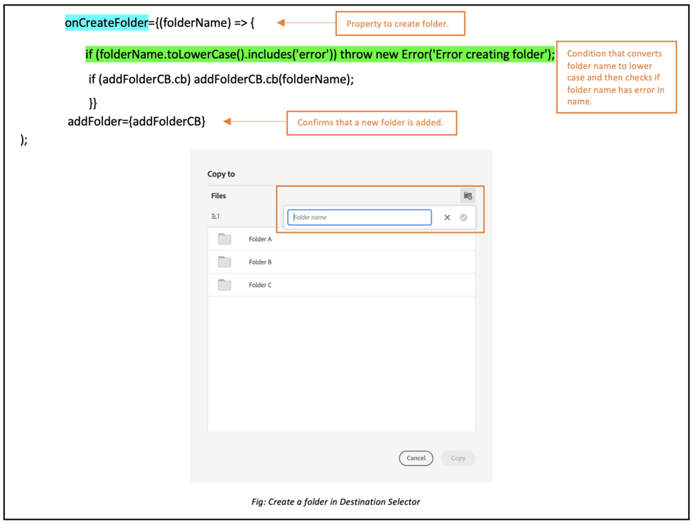

# 마이크로 프론트엔드 대상 선택기 {#Overview}

Micro-Frontend Destination Selector는 애플리케이션 내에서 [!DNL Experience Manager Assets as a Cloud Service] 리포지토리. 다음 내에서 적절한 폴더를 검색하거나 찾아볼 수 있습니다. [!DNL Experience Manager Assets as a Cloud Service] 애플리케이션에서 에셋을 저장하고 업로드합니다.

Micro-Frontend 사용자 인터페이스는 대상 선택기 패키지를 사용하여 애플리케이션 환경에서 사용할 수 있습니다. 패키지에 대한 모든 업데이트를 자동으로 가져오고 배포된 최신 대상 선택기가 애플리케이션 내에 자동으로 로드됩니다.


대상 선택기는 다음과 같은 많은 이점을 제공합니다.

* Vanilla JavaScript 라이브러리를 사용하여 Adobe 애플리케이션 또는 Adobe 이외의 애플리케이션과 쉽게 통합할 수 있습니다.
* 대상 선택기 패키지에 대한 업데이트가 애플리케이션에서 사용할 수 있는 대상 선택기에 자동으로 배포되므로 유지 관리가 쉽습니다. 최신 수정 사항을 로드하기 위해 애플리케이션 내에서 업데이트를 수행하지 않아도 됩니다.
* 응용 프로그램 내에서 대상 선택기 표시를 제어하는 속성을 사용할 수 있으므로 쉽게 사용자 지정할 수 있습니다.
* 전체 텍스트 검색을 통해 폴더로 빠르게 이동하여 애플리케이션에서 에셋을 업로드할 수 있습니다.
* 폴더를 만들고 오름차순 또는 내림차순으로 폴더를 정렬한 다음 목록, 격자, 갤러리 또는 폭포 보기에서 볼 수 있습니다.

이 문서의 범위는 와 함께 대상 선택기를 사용하는 방법을 보여 줍니다. [!DNL Adobe] 통합 셸의 응용 프로그램 또는 인증을 위해 이미 imsToken이 생성된 경우. 이 문서에서는 이러한 워크플로를 SUSI 외 흐름이라고 합니다.

대상 선택기를 통합하고 와 함께 사용하려면 다음 작업을 수행하십시오. [!DNL Experience Manager Assets as a Cloud Service] 저장소:

* [Vanilla JS를 사용한 대상 선택기 통합](#integration-with-vanilla-js)
* [대상 선택기 표시 속성 정의](#destination-selector-properties)
* [대상 선택기 사용](#using-destination-selector)

## Vanilla JS를 사용한 대상 선택기 통합 {#integration-with-vanilla-js}

모든 [!DNL Adobe] 또는 Adobe 이외의 애플리케이션을 [!DNL Experience Manager Assets] as a [!DNL Cloud Service] 저장소와 통합하고 애플리케이션 내에서 자산을 선택할 수 있습니다.

통합은 대상 선택기 패키지를 가져와 Vanilla JavaScript 라이브러리를 사용하여 Assets에 as a Cloud Service으로 연결함으로써 수행됩니다. 다음을 편집해야 합니다. `index.html` 또는 애플리케이션 내의 적절한 파일을 사용하여
* 인증 세부 정보 정의
* Assets as a Cloud Service 저장소 액세스
* 대상 선택기 표시 속성 구성

다음과 같은 경우 일부 IMS 속성을 정의하지 않고 인증을 수행할 수 있습니다.

* [통합 셸](https://experienceleague.adobe.com/docs/experience-manager-cloud-service/content/overview/aem-cloud-service-on-unified-shell.html?lang=ko)에서 [!DNL Adobe] 애플리케이션을 통합하는 경우
* 인증용으로 생성된 IMS 토큰을 이미 보유하고 있는 경우

## 사전 요구 사항 {#prerequisites}

`index.html` 파일 또는 애플리케이션 구현 내에 있는 유사한 파일의 사전 요구 사항을 정의하여 [!DNL Experience Manager Assets] as a [!DNL Cloud Service] 저장소에 액세스하기 위한 인증 세부 정보를 정의합니다. 사전 요구 사항에는 다음이 포함됩니다.
* imsOrg
* imsToken
* apikey

## 설치 {#installation}

대상 선택기는 두 ESM CDN을 통해 사용할 수 있습니다(예: [esm.sh](https://esm.sh/)/[잠복](https://www.skypack.dev/)) 및 [UMD](https://github.com/umdjs/umd) 버전.

**UMD 버전**&#x200B;을 사용하는 브라우저의 경우(권장됨):

```
<script src="https://experience.adobe.com/solutions/CQ-assets-selectors/assets/resources/assets-selectors.js"></script>

<script>
  const { renderDestinationSelector } = PureJSSelectors;
</script>
```

**ESM CDN 버전**&#x200B;을 사용하며 `import maps`가 지원되는 브라우저의 경우:

```
<script type="module">
  import { DestinationSelector } from 'https://experience.adobe.com/solutions/CQ-assets-selectors/assets/resources/@assets/selectors/index.js'
</script>
```

**ESM CDN 버전**&#x200B;을 사용하는 Deno/Webpack Module Federation의 경우:

```
import { DestinationSelector } from 'https://experience.adobe.com/solutions/CQ-assets-selectors/assets/resources/@assets/selectors/index.js'
```

### 선택한 대상 {#selected-destination}

대상 선택기에서 콜백을 수신함 `onItemSelect`, `onTreeToggleItem`, 또는 `onTreeSelectionChange` 개체(디렉터리, 이미지 등)를 포함하는 선택한 디렉터리로

**스키마 구문**

```
interface SelectedDestination {
  id: string;
  children: SelectedDestination[];
  'repo:repositoryId': string;
  'dc:format': string;
  'repo:assetClass': string;
  'storage:directoryType': string;
  'storage:region': string;
  'repo:name': string;
  'repo:path': string;
  'repo:ancestors': string[];
  'repo:createDate': string;
  'storage:assignee':

  { type: string; id: string; }
  ;
  'repo:assetId': string;
  'aem:published': boolean;
  'repo:createdBy': string;
  'repo:state': string;
  'repo:id': string;
  'repo:modifyDate': string;
  _page:

  { orderBy: string; count: number; };
}
```

다음 표에서는 선택한 대상의 몇 가지 중요한 속성을 설명합니다.

| 속성 | 유형 | 설명 |
|---|---|---|
| *repo:repositoryId* | 문자열 | 자산이 저장된 저장소의 고유 식별자입니다. |
| *repo:id* | 문자열 | 자산의 고유 식별자입니다. |
| *repo:assetClass* | 문자열 | 자산의 분류입니다(예: 이미지 또는 비디오, 문서). |
| *repo:name* | 문자열 | 파일 확장명을 포함한 자산의 이름입니다. |
| *repo:size* | 숫자 | 자산의 크기입니다(바이트). |
| *repo:path* | 문자열 | 저장소 내 자산의 위치입니다. |
| *repo:ancestors* | `Array<string>` | 저장소에 있는 자산의 상위 항목 배열입니다. |
| *repo:state* | 문자열 | 저장소에 있는 자산의 현재 상태입니다(예: 활성, 삭제됨 등). |
| *repo:createdBy* | 문자열 | 자산을 생성한 사용자 또는 시스템입니다. |
| *repo:createDate* | 문자열 | 자산이 생성된 날짜 및 시간입니다. |
| *repo:modifiedBy* | 문자열 | 마지막으로 자산을 수정한 사용자 또는 시스템입니다. |
| *repo:modifyDate* | 문자열 | 자산이 마지막으로 수정된 날짜 및 시간입니다. |
| *dc:format* | 문자열 | 에셋의 형식입니다. |
| *_페이지* | orderBy: 문자열; count: 숫자; | 문서의 페이지 번호를 포함합니다. |

속성의 전체 목록과 자세한 예를 보려면 다음을 방문하십시오. [대상 선택기 코드 예](https://github.com/adobe/aem-assets-selectors-mfe-examples).

### SUSI 외 흐름 예 {#non-ims-vanilla}

이 예에서는 를 실행할 때 SUSI가 아닌 플로우와 함께 대상 선택기를 사용하는 방법을 보여 줍니다. [!DNL Adobe] 통합 셸의 응용 프로그램 또는 `imsToken` 인증을 위해 생성되었습니다.

를 사용하여 코드에 대상 선택기 패키지 포함 `script` 태그로 표시 _라인 6~15_ 아래 예제 참조. 스크립트가 로드되면 `PureJSSelectors` 전역 변수를 사용할 수 있습니다. 대상 선택기 정의 [속성](#destination-selector-properties) 에 보여진 것처럼 _라인 16~23_. SUSI 외 흐름 인증에는 `imsOrg` 및 `imsToken` 속성이 모두 필요합니다. `handleSelection` 속성은 선택한 자산을 처리하는 데 사용됩니다. 대상 선택기를 렌더링하려면 `renderDestinationSelector` 에서 언급된 함수 _라인 17_. 대상 선택기가 `<div>` 에 표시된 컨테이너 요소 _라인 21 및 22_.

다음 단계에 따라 의 비 SUSI 플로우에서 대상 선택기 를 사용할 수 있습니다. [!DNL Adobe] 응용 프로그램.

```html {line-numbers="true"}
<!DOCTYPE html>
<html>
<head>
    <title>Destination Selector</title>
    <script src="https://experience.adobe.com/solutions/CQ-assets-selectors/assets/resources/assets-selectors.js"></script>
    <script>
        // get the container element in which we want to render the DestinationSelector component
        const container = document.getElementById('destination-selector-container');
        // imsOrg and imsToken are required for authentication in non-SUSI flow
        const destinationSelectorProps = {
            imsOrg: 'example-ims@AdobeOrg',
            imsToken: "example-imsToken",
            apiKey: "example-apiKey-associated-with-imsOrg",
            handleSelection: (assets: SelectedAssetType[]) => {},
        };
        // Call the `renderDestinationSelector` available in PureJSSelectors globals to render DestinationSelector
        PureJSSelectors.renderDestinationSelector(container, destinationselectorprops);
    </script>
</head>

<body>
    <div id="destination-selector-container" style="height: calc(100vh - 80px); width: calc(100vw - 60px); margin: -20px;">
    </div>
</body>

</html>
```

자세한 예를 보려면 다음을 방문하십시오 [대상 선택기 코드 예](https://github.com/adobe/aem-assets-selectors-mfe-examples).

## 대상 선택기 속성 사용 {#destination-selector-properties}

대상 선택기 속성을 사용하여 대상 선택기가 렌더링되는 방식을 사용자 지정할 수 있습니다. 다음 표에는 대상 선택기를 사용자 정의하고 사용하는 데 사용할 수 있는 속성이 나열되어 있습니다.

| 속성 | 유형 | 필수 | 기본값 | 설명 |
|---|---|---|---|---|
| *imsOrg* | 문자열 | 예 |  | 조직에 [!DNL Adobe Experience Manager] as a [!DNL Cloud Service]를 프로비저닝하는 중에 할당된 Adobe IMS(Identity Management System)입니다. 액세스하려는 조직이 Adobe IMS에 속해 있는지 여부를 인증하려면 `imsOrg` 키가 필요합니다. |
| *imsToken* | 문자열 | 아니요 |  | 인증에 사용되는 IMS 전달자 토큰입니다. `imsToken` SUSI 흐름을 사용하는 경우에는 이 필요하지 않습니다. 그러나 비SUSI 흐름을 사용하는 경우에는 필수입니다. |
| *apiKey* | 문자열 | 아니요 |  | AEM Discovery 서비스에 액세스하는 데 사용되는 API 키입니다. `apiKey` SUSI 흐름을 사용하는 경우에는 이 필요하지 않습니다. 그러나 비 SUSI 흐름에서는 필수입니다. |
| *rootPath* | 문자열 | 아니요 | /content/dam/ | 대상 선택기에 에셋이 표시되는 폴더 경로입니다. 캡슐화된 형태로도 `rootPath`를 사용할 수 있습니다. 예를 들어 다음 경로가 지정된 경우 `/content/dam/marketing/subfolder/`, 대상 선택기를 사용하면 상위 폴더를 통과할 수 없지만 하위 폴더만 표시됩니다. |
| *hasMore* | 부울 | 아니요 |  | 응용 프로그램에 표시할 컨텐츠가 더 많으면 이 속성을 사용하여 컨텐츠를 로드하는 로더를 추가하여 응용 프로그램에서 볼 수 있도록 할 수 있습니다. 콘텐츠 로드가 진행 중임을 나타내는 표시기입니다. |
| *orgName* | 부울 | 아니요 |  | AEM과 연결된 조직의 이름(orgID일 수 있음)입니다. |
| *initRepoID* | 문자열 | 아니요 |  | 기본 초기 보기에서 사용할 에셋 저장소의 경로입니다 |
| *onCreateFolder* | 문자열 | 아니요 |  | 다음 `onCreateFolder` 속성을 사용하면 애플리케이션에서 새 폴더를 추가하는 아이콘을 추가할 수 있습니다. |
| *onConfirm* | 문자열 | 아니요 |  | 확인 버튼을 누르면 콜백됩니다. |
| *confirmDisabled* | 문자열 | 아니요 |  | 이 속성은 확인 단추의 토글을 제어합니다. |
| *viewType* | 문자열 | 아니요 |  | 다음 `viewType` 속성은 에셋을 표시하는 데 사용하는 보기를 지정하는 데 사용됩니다. |
| *보기 유형 옵션* | 문자열 | 아니요 |  | 이 속성은 와(과) 관련되어 있습니다. `viewType` 속성. 하나 이상의 뷰를 지정하여 에셋을 표시할 수 있습니다. 사용 가능한 뷰 유형옵션에는 목록 뷰, 격자 뷰, 갤러리 뷰, 폭포 뷰 및 트리 뷰가 있습니다. |
| *itemNameFormat* | 문자열 | 아니요 |  | 이 속성을 사용하면 항목 이름의 형식을 지정할 수 있습니다. |
| *i18nSymbols* | `Object<{ id?: string, defaultMessage?: string, description?: string}>` | 아니요 |  | OOTB 번역이 애플리케이션 요구 사항을 제대로 충족하지 않는 경우 `i18nSymbols` 속성을 통해 현지화된 사용자 지정 값을 전달할 수 있는 인터페이스를 노출할 수 있습니다. 이 인터페이스를 통해 값을 전달하면 제공된 기본 번역이 재정의되며 사용자 고유의 번역이 대신 사용됩니다.  재정의를 수행하려면 유효한 재정의하려는 `i18nSymbols`의 키에 [메시지 설명자](https://formatjs.io/docs/react-intl/api/#message-descriptor) 오브젝트를 전달해야 합니다. |
| *inlineAlertSetup* | 문자열 | 아니요 |  | 애플리케이션에 전달할 경고 메시지가 추가됩니다. 예를 들어 이 폴더에 액세스할 권한이 없다는 경고 메시지를 추가하는 경우가 있습니다. |
| *intl* | 오브젝트 | 아니요 |  | 대상 선택기는 기본 OOTB 번역을 제공합니다. `intl.locale` 속성을 통해 유효한 로케일 문자열을 제공하여 번역 언어를 선택할 수 있습니다. 예를 들어 `intl={{ locale: "es-es" }}`의 경우 </br></br> 지원되는 로케일 문자열은 언어 표준의 이름을 표현하기 위해 [ISO 639 - 코드](https://www.iso.org/iso-639-language-codes.html)를 따릅니다. </br></br> 지원되는 로케일 목록: 영어 - “en-us”(기본값) 스페인어 - “es-es” 독일어 - “de-de” 프랑스어 - “fr-fr” 이탈리아어 - “it-it” 일본어 - “ja-jp” 한국어 - “ko-kr” 포르투갈어 - “pt-br” 중국어(번체) - “zh-cn” 중국어(대만) - “zh-tw” |

## 대상 선택기 속성 사용 예 {#usage-examples}

대상 선택기 를 정의할 수 있습니다 [속성](#destination-selector-properties) 다음에서 `index.html` 응용 프로그램 내에서 대상 선택기 표시를 사용자 지정하는 파일입니다.

### 예제 1: 대상 선택기에 폴더 만들기

대상 선택기를 사용하면 특정 위치에서 에셋을 업로드하거나, 이동하거나, 복사할 새 폴더를 만들 수 있습니다.



### 예제 2: 대상 선택기의 보기 유형 지정

대상 선택기는 목록 보기, 격자 보기, 갤러리 보기 및 Waterfall 보기를 포함하여 4개의 서로 다른 보기에 다양한 에셋 배열을 표시합니다. 기본 보기 유형을 지정하려면 다음을 사용할 수 있습니다 `viewType` 속성. 다음 `viewTypeOptions` 속성은 와 함께 사용됩니다. `viewType` 속성을 사용하여 다른 보기 유형 옵션을 드롭다운에 표시할 수 있도록 다른 보기 유형을 규정합니다. 하나의 옵션만 표시하려는 경우 단일 인수를 사용할 수 있습니다.


### 예제 3: 에셋 폴더의 경로 초기화

사용 `path` 속성을 사용하여 대상 선택기를 렌더링할 때 자동으로 표시되는 폴더 이름을 정의합니다.


## 대상 선택기 사용 {#using-destination-selector}

대상 선택기가 설정되고 대상 선택기를 와 함께 사용하도록 인증되었습니다. [!DNL Adobe Experience Manager] as a [!DNL Cloud Service] 응용 프로그램에서 에셋을 선택하거나 다른 다양한 작업을 수행하여 저장소 내에서 에셋을 검색할 수 있습니다.


* **A**: [검색 창](#search-bar)
* **B**: [정렬](#sorting)
* **C**: [자산](#assets-repo)
* **D**: [접미사 또는 접두사 추가](#add-suffix-or-prefix)
* **E**: [새 폴더 만들기](#create-new-folder)
* **F**: [보기](#types-of-view)
* **G**: [정보](#info)
* **H**: [폴더 선택](#select-folder)

### 검색 창 {#search-bar}

대상 선택기를 사용하면 선택한 저장소 내의 에셋에 대한 전체 텍스트 검색을 수행할 수 있습니다. 예를 들어 검색 창에 `wave` 키워드를 입력하면 메타데이터 속성에 언급된 것 중 `wave` 키워드가 있는 모든 자산이 표시됩니다.

### 정렬 {#sorting}

대상 선택기에서 에셋의 이름, 차원 또는 크기별로 에셋을 정렬할 수 있습니다. 자산을 오름차순 또는 내림차순으로 정렬할 수도 있습니다.

### 에셋 저장소 {#assets-repo}

대상 선택기를 사용하면 AEM 애플리케이션에서 사용할 수 있는 원하는 저장소의 데이터를 볼 수도 있습니다. 다음을 사용할 수 있습니다. `repositoryID` 속성을 사용하여 대상 선택기의 첫 번째 인스턴스에서 보려는 대상 폴더의 경로를 초기화합니다.

### 접미어 또는 접두어 추가 {#add-suffix-or-prefix}

다음은 의 예입니다. `optionsFormSetup` 속성. 이 옵션을 사용하여 선택을 확인할 수 있습니다. 이 옵션은 `onConfirm` 이벤트.

### 새 폴더를 만듭니다 {#create-new-folder}

폴더의 대상 폴더에 새 폴더를 만들 수 있습니다. [!DNL Adobe Experience Manager] as a [!DNL Cloud Service].

### 보기 유형 {#types-of-view}

대상 선택기를 사용하면 4개의 서로 다른 보기에서 에셋을 볼 수 있습니다.

* ** [!UICONTROL 목록 보기]**: 목록 보기에는 스크롤 가능한 파일과 폴더가 단일 열에 표시됩니다.
* ** [!UICONTROL 격자 보기]**: 격자 보기에는 스크롤 가능한 파일과 폴더가 행과 열의 격자로 표시됩니다.
* ** [!UICONTROL 갤러리 보기]**: 갤러리 보기에는 파일 또는 폴더가 중앙이 잠긴 가로 목록으로 표시됩니다.
* ** [!UICONTROL 워터폴 보기]**: 워터폴 보기에는 파일 또는 폴더가 Bridge 형태로 표시됩니다.

### 정보 {#info}

정보 또는 정보 아이콘을 사용하면 선택한 에셋의 메타데이터를 볼 수 있습니다. 여기에는 차원, 크기, 설명, 경로, 수정한 날짜 및 만든 날짜 등 다양한 세부 정보가 포함됩니다. 메타데이터 정보는 자산을 업로드 또는 복사하거나 새 자산을 만드는 동안 제공됩니다.

### 폴더 선택 {#select-folder}

폴더 선택 단추를 사용하여 다음과 관련된 다양한 작업을 수행할 에셋을 선택할 수 있습니다. [속성](#destination-selector-properties) 대상 선택기에서.