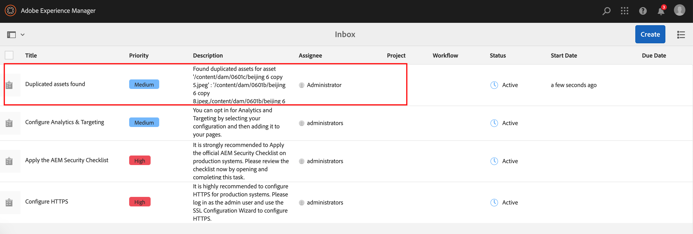

# 중복 자산 감지 {#detect-duplicate-assets}

DAM 사용자가 저장소에 이미 존재하는 에셋을 하나 이상 업로드하는 경우, [!DNL Experience Manager] 복제를 감지하고 사용자에게 알립니다. 중복 검색은 저장소 크기 및 업로드된 에셋 수에 따라 성능에 영향을 줄 수 있으므로 기본적으로 비활성화됩니다.

기능을 활성화하려면 다음을 수행하십시오.

1. 다음으로 이동 **[!UICONTROL 도구 > 에셋 > 에셋 구성]**.

1. 클릭 **[!UICONTROL 에셋 중복 감지기]**.

1. 다음에서 [!UICONTROL 에셋 중복 감지기 페이지], 클릭 **[!UICONTROL 활성화됨]**.

   `dam:sha1` 메타데이터 감지 필드의 값을 사용하면 파일 이름이 다른 경우에도 중복 에셋이 감지됩니다.

1. **[!UICONTROL 저장]**&#x200B;을 클릭합니다.

   

>[!NOTE]
>
>다음을 사용하여 중복 감지기를 구성한 경우 `/apps/example/config.author/com.adobe.cq.assetcompute.impl.assetprocessor.AssetDuplicationDetector.cfg.json` Adobe 구성 파일(OSGi 구성)은 계속 사용할 수 있지만 새 메서드를 사용하는 것이 좋습니다.

활성화되면 Experience Manager은 중복 에셋에 대한 알림을 Experience Manager 받은 편지함으로 보냅니다. 여러 개의 중복에 대한 집계 결과입니다. 사용자는 결과에 따라 에셋을 제거하도록 선택할 수 있습니다.

>[!NOTE]
>
>에셋을 저장소에 업로드하면 Experience Manager에서 중복을 감지하여 처음 100개의 중복 에셋에 대해 알려 줍니다.
