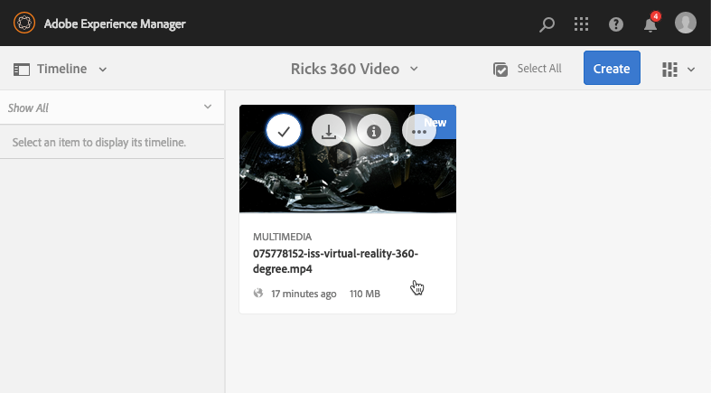

# 360/VR 비디오 {#vr-video}

360° 비디오는 모든 방향에서 동시에 보기를 기록합니다. 전방향 카메라나 카메라 모음을 이용하여 촬영합니다. 평면 디스플레이에서 재생 중에 사용자가 시야각을 제어할 수 있습니다. 모바일 장치에서 재생하면 일반적으로 내장된 자이로스코프 컨트롤이 적용됩니다.

Dynamic Media에는 360 비디오 자산 전달에 대한 기본 지원이 포함되어 있습니다. 기본적으로 보거나 재생하기 위해 추가 구성은 필요하지 않습니다. .mp4, .mkv 및 .mov 와 같은 표준 비디오 확장명을 사용하여 360 비디오를 제공합니다. 가장 일반적인 코덱은 H.264입니다.

360/VR 비디오 뷰어를 사용하여 동방형 비디오를 렌더링할 수 있습니다. 그 결과 방, 재산, 위치, 경관, 의료 시술 등에 대한 몰입형 시청 경험이 됩니다.

현재 공간 오디오가 지원되지 않습니다. 오디오가 스테레오로 혼합된 경우 고객이 카메라 시야각을 변경할 때 밸런스(L/R)가 변경되지 않습니다.

다음을 참조하십시오 [AEM Assets에서 Dynamic Media 360 비디오 및 사용자 지정 비디오 썸네일 사용](https://experienceleague.adobe.com/docs/experience-manager-learn/assets/dynamic-media/dynamic-media-360-video-custom-thumbnail-feature-video-use.html#dynamic-media).

참조: [뷰어 사전 설정 관리](/help/assets/dynamic-media/managing-viewer-presets.md).

## 360 비디오 작동 중 {#video-in-action}

선택 [우주 정거장](https://s7d1.scene7.com/s7viewers/html5/Video360Viewer.html?asset=Viewers/space_station_360-AVS) 브라우저 창을 열고 360° 비디오를 시청합니다. 비디오 재생 중에 포인터를 새 위치로 드래그하여 보기 각도를 변경합니다.

*Space Station 360의 비디오 프레임*

## 360/VR 비디오 및 Adobe Premiere Pro {#vr-video-and-adobe-premiere-pro}

Adobe 프리미어 프로를 사용하여 360/VR 푸티지를 보고 편집할 수 있습니다. 예를 들어, 장면에 로고와 텍스트를 적절하게 배치하고, 등장방형 미디어용으로 특별히 설계된 효과와 전환을 적용할 수 있습니다.

다음을 참조하십시오 [360/VR 비디오 편집](https://helpx.adobe.com/premiere-pro/how-to/edit-360-vr-video.html).

## 360 비디오 뷰어에 사용할 자산 업로드 {#uploading-assets-for-use-with-the-video-viewer}

에 업로드되는 360개의 비디오 자산 [!DNL Experience Manager] 레이블은 다음과 같습니다. **멀티미디어** 일반 비디오 에셋과 유사한 에셋 페이지에서 를 클릭합니다.

*카드 보기에 표시되는 업로드된 360개 비디오 자산입니다. 에셋은 멀티미디어라는 레이블이 지정됩니다.*

**360 Video 뷰어에 사용할 자산을 업로드합니다.**

1. 360 비디오 자산 전용의 폴더를 만들었습니다.
1. [적응형 비디오 프로필을 폴더에 적용](/help/assets/dynamic-media/video-profiles.md#applying-a-video-profile-to-folders).

   360 비디오 콘텐츠를 렌더링하면 표준 비 360 비디오 콘텐츠보다 소스 비디오 해상도 및 인코딩된 표현물 해상도에 대한 요구 사항이 더 높아집니다.

   Dynamic Media과 함께 제공되는 바로 사용 가능한 응용 비디오 프로필을 사용할 수 있습니다. 그러나 360이 아닌 비디오 뷰어로 렌더링된 동일한 설정으로 인코딩된 360이 아닌 비디오에 대해 얻는 것보다 360이 아닌 비디오 품질이 눈에 띄게 더 낮습니다. 따라서 고화질 360 비디오가 필요한 경우 다음 작업을 수행하십시오.

   * 가장 좋은 방법은 원본 360 비디오 콘텐츠에 다음 해상도 중 하나를 설정하는 것입니다.

      * 1080p - 1920 x 1080, Full HD 또는 FHD 해상도로 알려짐,
      * 4k, UHD 또는 Ultra HD 해상도로 알려진 2160p - 3840 x 2160. 이 대형 디스플레이 해상도는 프리미엄 TV 세트와 컴퓨터 모니터에서 가장 많이 발견됩니다. 너비가 4000픽셀에 가깝기 때문에 2160p 해상도를 &quot;4k&quot;라고 하는 경우가 많습니다. 즉, 1080p의 4배 픽셀을 제공합니다.

   * [사용자 지정 응용 비디오 프로필 만들기](/help/assets/dynamic-media/video-profiles.md#creating-a-video-encoding-profile-for-adaptive-streaming) (고품질 렌디션 포함) 예를 들어 다음 세 가지 설정이 포함된 응용 비디오 프로필을 만들 수 있습니다.

      * Width=auto; Height=720; 비트 전송률=2500kbps
      * Width=auto; Height=1080; 비트 전송률=5000kbps
      * Width=auto; Height=1440; 비트 전송률=6600kbps

   * 360 비디오 자산에만 사용되는 폴더에서 360 비디오 콘텐츠를 처리합니다.

   이 방법은 사용자의 네트워크 및 CPU에 더 많은 요구 사항을 제공합니다.

1. [폴더에 비디오 업로드](/help/assets/manage-video-assets.md#upload-and-preview-video-assets).

<!--

## Overriding the default aspect ratio of 360 videos  {#overriding-the-default-aspect-ratio-of-videos}

For an uploaded asset to qualify as a 360 video that you intend to use with the 360 Video viewer, the asset must have an aspect ratio of 2.

By default, AEM detects video as "360" if its aspect ratio (width/height) is 2.0. If you are an Administrator, you can override the default aspect ratio setting of 2 by setting the optional `s7video360AR` property in CRXDE Lite at the following:

* `/conf/global/settings/cloudconfigs/dmscene7/jcr:content`

  * **Property type**: Double
  * **Value**: floating-point aspect ratio, default 2.0.

After you set this property, it takes effect immediately on both existing videos and newly uploaded videos.

The aspect ratio applies to 360 video assets for the asset details page and the [Video 360 Media WCM component](/help/assets/dynamic-media/adding-dynamic-media-assets-to-pages.md#dynamic-media-components).

Start by uploading 360 Videos.

-->

## 360 비디오 미리 보기 {#previewing-video}

미리보기 를 사용하여 360 비디오가 고객에게 표시되는 방식을 확인하고 예상대로 작동하는지 확인할 수 있습니다.

참조: [뷰어 사전 설정 편집](/help/assets/dynamic-media/managing-viewer-presets.md#editing-viewer-presets).

360 비디오가 만족스러우면 게시할 수 있습니다.

다음을 참조하십시오 [웹 페이지에 비디오 또는 이미지 뷰어 포함](/help/assets/dynamic-media/embed-code.md).
다음을 참조하십시오 [웹 애플리케이션에 URL 연결](/help/assets/dynamic-media/linking-urls-to-yourwebapplication.md). 대화형 컨텐츠에 상대 URL이 있는 링크, 특히 다음에 대한 링크가 있는 경우에는 URL 기반 연결 방법이 불가능합니다 [!DNL Experience Manager Sites] 페이지.
다음을 참조하십시오 [페이지에 Dynamic Media Assets 추가](/help/assets/dynamic-media/adding-dynamic-media-assets-to-pages.md).

**360개의 비디오를 미리 보려면 다음 작업을 수행하십시오.**

1. 위치 **[!UICONTROL 에셋]**&#x200B;에서 생성한 기존 360 비디오로 이동합니다. 미리 보기 모드에서 열려면 360 비디오 자산을 선택합니다.

   

   비디오를 미리 보려면 360 비디오 자산을 선택합니다.

1. 미리보기 페이지에서 페이지의 왼쪽 상단 모서리 근처에 있는 드롭다운 목록을 선택한 다음 를 선택합니다 **[!UICONTROL 뷰어]**.

   

   뷰어 목록에서 를 선택합니다. **[!UICONTROL Video360_social]**&#x200B;을 클릭하고 다음 중 하나를 수행합니다.

   * 정적 장면의 시야각을 변경하려면 포인터를 비디오 위로 드래그합니다.
   * 재생을 시작하려면 비디오의 **[!UICONTROL 재생]** 단추를 클릭합니다. 비디오가 재생될 때 포인터를 비디오 위로 드래그하여 시야각을 변경합니다.

   *360 비디오 스크린샷.*

   * 뷰어 목록에서 를 선택합니다. **[!UICONTROL Video360VR]**.

     가상 현실(VR) 비디오는 가상 현실 헤드셋을 사용함으로써 액세스되는 몰입형 비디오 콘텐츠이다. 일반 비디오와 마찬가지로 360도 비디오 카메라를 사용하여 비디오를 녹화하고 캡처할 때 VR 비디오를 처음부터 만듭니다.

   
   *360 VR 비디오 스크린샷.*

1. 미리 보기 페이지의 오른쪽 상단 근처에서 을 선택합니다. **[!UICONTROL 닫기]**.

## 360 비디오 게시 {#publishing-video}

360 비디오를 사용하려면 게시해야 합니다. 360 비디오를 게시하면 URL 및 포함 코드가 활성화됩니다. 또한 확장 가능하고 성능이 뛰어난 전송을 위해 CDN과 통합된 360 비디오를 Dynamic Media 클라우드에 게시합니다.

다음을 참조하십시오 [Dynamic Media Assets 게시](/help/assets/dynamic-media/publishing-dynamicmedia-assets.md) 360 비디오를 게시하는 방법에 대한 자세한 내용을 참조하십시오.
참조: [웹 페이지에 비디오 또는 이미지 뷰어 포함](/help/assets/dynamic-media/embed-code.md).
참조: [웹 애플리케이션에 URL 연결](/help/assets/dynamic-media/linking-urls-to-yourwebapplication.md). 대화형 컨텐츠에 상대 URL이 있는 링크, 특히 다음에 대한 링크가 있는 경우에는 URL 기반 연결 방법이 불가능합니다 [!DNL Experience Manager Sites] 페이지.
참조: [페이지에 Dynamic Media Assets 추가](/help/assets/dynamic-media/adding-dynamic-media-assets-to-pages.md).
