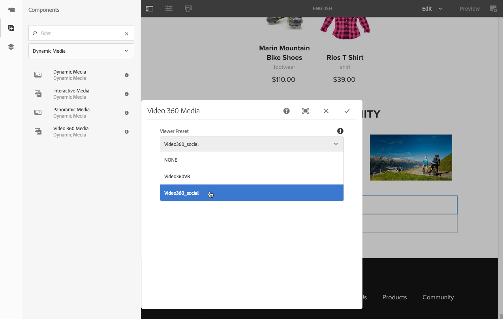

# 페이지에 Dynamic Media 자산 추가{#adding-dynamic-media-assets-to-pages}

웹 사이트에서 사용하는 자산에 Dynamic Media 기능을 추가하기 위해 **Dynamic Media**, **대화형 미디어**, **파노라마 미디어**, 또는 **비디오 360 미디어** 구성 요소를 생성하지 않습니다. 레이아웃 모드를 시작하고 Dynamic Media 구성 요소를 활성화합니다. Then you add these components to the page and add assets to the component. The Dynamic Media components are smart - they know whether you are adding an image or a video and the configuration options available change accordingly.

사용 중인 경우 Dynamic Media 자산을 페이지에 직접 추가합니다 [!DNL Adobe Experience Manager] WCM으로 사용할 수 있습니다. WCM에 서드파티 를 사용하는 경우, [링크](/help/assets/dynamic-media/linking-urls-to-yourwebapplication.md) 또는 [포함](/help/assets/dynamic-media/embed-code.md) 자산. 반응형 타사 웹 사이트의 경우 다음을 참조하십시오 [응답형 사이트에 최적화된 이미지 제공](/help/assets/dynamic-media/responsive-site.md).

>[!NOTE]
>
>자산을 의 페이지에 추가하기 전에 먼저 자산을 게시해야 합니다 [!DNL Experience Manager]. 자세한 내용은 [Dynamic Media 자산 게시](/help/assets/dynamic-media/publishing-dynamicmedia-assets.md).

## 페이지에 Dynamic Media 구성 요소 추가 {#adding-a-dynamic-media-component-to-a-page}

3D Media, Dynamic Media, 대화형 미디어, 파노라마 미디어, 스마트 자르기 비디오 또는 비디오 360 미디어 구성 요소를 페이지에 추가하는 것은 페이지에 구성 요소를 추가하는 것과 같습니다.

**페이지에 Dynamic Media 구성 요소를 추가하려면:**

1. in [!DNL Experience Manager]Dynamic Media 구성 요소를 추가할 페이지를 엽니다.
1. 왼쪽 창에서 **[!UICONTROL 구성 요소]** 아이콘을 클릭한 다음 Dynamic Media으로 필터링합니다.

   사용 가능한 Dynamic Media 구성 요소 목록이 없는 경우 사용할 Dynamic Media 구성 요소를 활성화해야 합니다. 자세한 내용은 [Dynamic Media 구성 요소 활성화](#enabling-dynamic-media-components).

   

1. 드래그 **[!UICONTROL Dynamic Media]** 구성 요소를 드래그하여 페이지의 원하는 위치에 놓습니다.

1. 구성 요소에 바로 포인터를 둡니다. 구성 요소를 파란색 상자로 둘러싸면 한 번 을 선택하여 구성 요소의 도구 모음을 표시합니다. 을(를) 선택합니다 **[!UICONTROL 구성(공구모양)]** 아이콘.

   

1. 페이지에 드롭한 Dynamic Media 구성 요소에 따라 구성 대화 상자가 열립니다. [구성 요소의 옵션 설정](/help/assets/dynamic-media/adding-dynamic-media-assets-to-pages.md#dynamic-media-components) 필요한 경우.

   아래 예는 Dynamic Media을 보여줍니다 **[!UICONTROL 비디오 360 미디어]** 구성 요소 대화 상자 및 뷰어 사전 설정 드롭다운 목록에서 사용할 수 있는 옵션.

   

   Dynamic Media Video 360 미디어 구성 요소입니다.

1. 완료되면 대화 상자의 오른쪽 상단 모서리에서 확인 표시를 선택하여 변경 사항을 저장합니다.

### Dynamic Media 구성 요소 활성화 {#enabling-dynamic-media-components}

페이지에 추가할 수 있는 Dynamic Media 구성 요소가 없다면 사용할 구성 요소를 활성화해야 합니다.

1. in [!DNL Experience Manager]Dynamic Media 구성 요소를 추가할 페이지를 엽니다.
1. 페이지 상단 근처에 있는 도구 모음 왼쪽에서 페이지 정보 아이콘을 선택한 다음 를 선택합니다 **[!UICONTROL 템플릿 편집]** 드롭다운 목록에서 을 선택합니다.

   

1. 페이지 상단 근처에 있는 도구 모음 오른쪽의 드롭다운 목록에서 를 선택합니다 **[!UICONTROL 구조]**.

   

1. 페이지 하단에서 다음을 선택합니다. **[!UICONTROL 레이아웃 컨테이너]** 도구 모음을 열려면 정책 아이콘을 선택합니다.
1. 설정 **[!UICONTROL 레이아웃 컨테이너]** 페이지, 아래에 **[!UICONTROL 속성]** 제목, **[!UICONTROL 허용된 구성 요소]** 탭이 선택되어 있습니다.

   

1. 표시될 때까지 스크롤합니다. **[!UICONTROL Dynamic Media]**.
1. 왼쪽의 > 아이콘을 선택합니다 **[!UICONTROL Dynamic Media]**&#x200B;를 선택한 다음 활성화할 Dynamic Media 구성 요소를 선택합니다.

   

1. 의 오른쪽 위 모서리 근처에 있습니다. **[!UICONTROL 레이아웃 컨테이너]** 페이지에서 완료(확인 표시) 아이콘을 선택합니다.

1. 페이지 상단 근처에 있는 도구 모음 오른쪽의 드롭다운 목록에서 를 선택합니다 **[!UICONTROL 초기 컨텐츠]**.
1. [페이지에 Dynamic Media 구성 요소 추가](#adding-a-dynamic-media-component-to-a-page) 평소대로요

## Dynamic Media 구성 요소 현지화 {#localizing-dynamic-media-components}

다음 두 가지 방법 중 하나로 Dynamic Media 구성 요소를 현지화할 수 있습니다.

* Within a web page in Sites, open **[!UICONTROL Properties]** and select the **[!UICONTROL Advanced]** tab. Select the desired language for localization.

   

* 사이트 선택기에서 원하는 페이지 또는 페이지 그룹을 선택합니다. 선택 **[!UICONTROL 속성]** 을(를) 선택하고 을(를) 선택합니다. **[!UICONTROL 고급]** 탭. Select the desired language for localization.

   >[!NOTE]
   >
   >에서 사용할 수 있는 일부 언어는 아닙니다 **[!UICONTROL 언어]** 메뉴에 현재 지정된 토큰이 있습니다.

## 사용 가능한 Dynamic Media 구성 요소 {#dynamic-media-components}

Dynamic Media 구성 요소는 **[!UICONTROL 구성 요소]** 아이콘 다음에 필터링 **[!UICONTROL Dynamic Media]**.

사용 가능한 Dynamic Media 구성 요소는 다음과 같습니다.

* **[!UICONTROL Dynamic Media]** - Use for such assets as images, video, eCatalogs, and spin sets.
* **[!UICONTROL 대화형 미디어]** - 대화형 비디오, 대화형 이미지 또는 회전 메뉴 세트와 같은 대화형 자산에 사용합니다.
* **[!UICONTROL 파노라마 미디어]** - 파노라마 이미지 또는 파노라마 VR 이미지 자산에 사용합니다.
* **[!UICONTROL 비디오 360 미디어]** - 360 비디오 및 360 VR 비디오 자산에 사용합니다.

>[!NOTE]
>
>이러한 구성 요소는 기본적으로 사용할 수 없으며 사용하기 전에 템플릿 편집기를 사용하여 사용 가능해야 합니다. 템플릿 편집기에서 사용할 수 있게 되면 다른 구성 요소처럼 페이지에 구성 요소를 추가할 수 있습니다 [!DNL Experience Manager] 구성 요소.

### 구성 요소: Dynamic Media {#dynamic-media-component}

Dynamic Media 구성 요소는 편리합니다. 이미지를 추가하든 비디오를 추가하든 다양한 선택 사항이 표시됩니다. 이 구성 요소는 이미지 사전 설정, 이미지 세트와 같은 이미지 기반 뷰어, 스핀 세트, 혼합 미디어 세트 및 비디오를 지원합니다. 또한 뷰어는 응답형이며 화면 크기가 스크린의 크기에 따라 자동으로 변경됩니다. 모든 뷰어는 HTML5 뷰어입니다.

>[!NOTE]
>
>웹 페이지에 다음이 포함되어 있는 경우:
>
>* 동일한 페이지에서 사용되는 Dynamic Media 구성 요소의 여러 인스턴스.
>* 각 인스턴스는 동일한 자산 유형을 사용합니다.
>
>해당 페이지의 각 Dynamic Media 구성 요소에 다른 뷰어 사전 설정을 할당할 수 없습니다.
>
>그러나 페이지 내에서 동일한 유형의 자산을 사용하는 모든 Dynamic Media 구성 요소에 대해 동일한 뷰어 사전 설정을 사용할 수 있습니다.

Dynamic Media 구성 요소를 추가하고 **[!UICONTROL Dynamic Media 설정]**&#x200B;이 비어 있거나 자산을 제대로 추가할 수 없는 경우, 다음을 확인하십시오.

* 이미지에 피라미드형 tiff 파일이 있습니다. Dynamic Media을 활성화하기 전에 가져온 이미지에는 피라미드형 tiff 파일이 없습니다.

#### 이미지 작업 시 {#when-working-with-images}

Dynamic Media 구성 요소를 사용하면 이미지 세트, 스핀 세트 및 혼합 미디어 세트를 포함한 다이내믹 이미지를 추가할 수 있습니다. 확대하거나 축소할 수 있고, 해당하는 경우 스핀 세트 내의 이미지를 회전하거나 다른 유형의 세트에서 이미지를 선택할 수 있습니다.

구성 요소에서 바로 뷰어 사전 설정, 이미지 사전 설정 또는 이미지 형식을 구성할 수도 있습니다. 이미지를 응답형으로 만들려면 중단점을 설정하거나 응답형 이미지 사전 설정을 적용할 수 있습니다.

다음 Dynamic Media 설정을 **[!UICONTROL 편집]** 아이콘을 클릭한 다음 **[!UICONTROL Dynamic Media 설정]**.

>[!NOTE]
>
>기본적으로 Dynamic Media 이미지 구성 요소는 적응형입니다. If you want to make it a fixed size, set it in the component in the **[!UICONTROL Advanced]** tab with the **[!UICONTROL Width]** and **[!UICONTROL Height]**.

* **[!UICONTROL 뷰어 사전 설정]** - 드롭다운 목록에서 기존 뷰어 사전 설정을 선택합니다. 보려는 뷰어 사전 설정이 표시되지 않을 경우 표시되도록 설정해야 합니다. 뷰어 사전 설정 관리를 참조하십시오. 이미지 사전 설정을 사용하고 있고 반대로 뷰어 사전 설정을 선택할 수는 없습니다.

   이 옵션은 이미지 세트, 스핀 세트 또는 혼합 미디어 세트를 보는 경우에만 사용할 수 있습니다. 표시되는 뷰어 사전 설정은 스마트 전용 관련 뷰어 사전 설정이 표시됩니다.

* **[!UICONTROL 뷰어 수정자]** - 뷰어 수정자는 이름=값 쌍의 형태를 및 구분 기호와 함께 가져오고 뷰어 참조 가이드에 설명된 대로 뷰어를 변경할 수 있도록 합니다. 뷰어 수정자의 예는 입니다. `posterimage=img.jpg&caption=text.vtt,1` 비디오 축소판에 대해 다른 이미지를 설정하고 닫힌 캡션/자막 파일을 비디오와 연결합니다.

* **[!UICONTROL 이미지 사전 설정]** - 드롭다운 목록에서 기존 이미지 사전 설정을 선택합니다. 보려는 이미지 사전 설정이 표시되지 않을 경우 표시되도록 설정해야 합니다. 이미지 사전 설정 관리를 참조하십시오. 이미지 사전 설정을 사용하고 있고 반대로 뷰어 사전 설정을 선택할 수는 없습니다.

   이미지 세트, 스핀 세트 또는 혼합 미디어 세트를 보는 경우에는 이 선택 사항을 사용할 수 없습니다.

* **[!UICONTROL 이미지 수정자]** - 더 많은 이미지 명령을 제공하여 이미지 효과를 적용할 수 있습니다. 이러한 명령은 이미지 사전 설정 및 이미지 제공 명령 참조에 설명되어 있습니다.

   이미지 세트, 스핀 세트 또는 혼합 미디어 세트를 보는 경우에는 이 선택 사항을 사용할 수 없습니다.

* **[!UICONTROL 중단점]** - 응답형 사이트에서 이 자산을 사용하는 경우 이미지 중단점을 추가해야 합니다. 이미지 중단점은 쉼표(,)로 구분해야 합니다. 이 옵션은 이미지 사전 설정에 정의된 높이 또는 너비가 없는 경우 작동합니다.

   이미지 세트, 스핀 세트 또는 혼합 미디어 세트를 보는 경우에는 이 선택 사항을 사용할 수 없습니다.

   다음 고급 설정을 선택하여 편집할 수 있습니다 **[!UICONTROL 편집]** 참조하십시오.

* **[!UICONTROL 고해상도 장치를 위한 최적화]** - DPR(장치 픽셀 비율) 최적화를 허용하려면 확인란을 (기본값) 선택합니다.

   다음 **[!UICONTROL 고해상도 장치를 위한 최적화]** 옵션이 true인 경우에만 표시됩니다.
   * 사전 설정 유형에서 **[!UICONTROL 이미지 사전 설정]** 이(가) 선택되어 있고 **[!UICONTROL RESS_IP]** 선택 **[!UICONTROL 이미지 사전 설정]** 드롭다운 목록.

   

   참조 - [장치 픽셀 비율 최적화 기본 정보](/help/assets/dynamic-media/imaging-faq.md#dpr).

   임의 [!DNL Experience Manager] Dynamic Media 스마트 이미징 DPR 값이 무시됩니다.

* **[!UICONTROL 제목]** - 이미지의 제목을 변경합니다.

* **[!UICONTROL 대체 텍스트]** - 그래픽이 꺼진 사용자의 이미지에 제목을 추가합니다.

   이미지 세트, 스핀 세트 또는 혼합 미디어 세트를 보는 경우에는 이 선택 사항을 사용할 수 없습니다.

* **[!UICONTROL URL, 여는 위치]** - 링크를 열 자산을 설정할 수 있습니다. URL을 설정하고 여는 위치에 같은 창에서 열지 또는 새 창에서 열지를 지정합니다.

   이미지 세트, 스핀 세트 또는 혼합 미디어 세트를 보는 경우에는 이 선택 사항을 사용할 수 없습니다.

* **[!UICONTROL 너비]** - 이미지의 크기를 고정하려면 값을 픽셀 단위로 입력하십시오. 이 값을 공백으로 두면 자산이 적응형으로 설정됩니다.

* **[!UICONTROL 높이]** - 이미지의 크기를 고정하려면 값을 픽셀 단위로 입력하십시오. 이 값을 공백으로 두면 자산이 적응형으로 설정됩니다.

#### 비디오 작업 시 {#when-working-with-video}

Dynamic Media 구성 요소를 사용하여 웹 페이지에 다이내믹 비디오를 추가하십시오. 구성 요소를 편집할 때 페이지에서 비디오를 재생하기 위해 사전 설정된 비디오 뷰어 사전 설정을 사용하도록 선택할 수 있습니다.

다음 Dynamic Media 설정을 선택하여 편집할 수 있습니다 **[!UICONTROL 편집]** 참조하십시오.

>[!NOTE]
>
>기본적으로 Dynamic Media 비디오 구성 요소는 적응형입니다. 고정 크기로 설정하려면 **[!UICONTROL 고급]** 탭에서 **[!UICONTROL 폭]** 및 **[!UICONTROL 높이]**&#x200B;로 구성 요소를 설정하십시오.

* **[!UICONTROL 뷰어 사전 설정]** - 드롭다운 목록에서 기존 비디오 뷰어 사전 설정을 선택합니다. 보려는 뷰어 사전 설정이 표시되지 않을 경우 표시되도록 설정해야 합니다. 뷰어 사전 설정 관리를 참조하십시오.

* **[!UICONTROL 뷰어 수정자]** - 뷰어 한정자가 `name=value` 쌍으로 `&` 구분 기호. Adobe 뷰어 참조 가이드에 설명된 대로 뷰어를 변경할 수 있도록 해줍니다. 뷰어 수정자의 예는 입니다. `posterimage=img.jpg&caption=text.vtt,1`

   예를 들어 뷰어 수정자를 사용하여 다음을 수행할 수 있습니다.

   * 캡션 파일을 비디오와 연결: [캡션](https://experienceleague.adobe.com/docs/dynamic-media-developer-resources/library/viewers-aem-assets-dmc/video/command-reference-url-video/r-html5-video-viewer-url-caption.html)
   * 탐색 파일을 비디오와 연결: [탐색](https://experienceleague.adobe.com/docs/dynamic-media-developer-resources/library/viewers-aem-assets-dmc/video/command-reference-url-video/r-html5-video-viewer-url-navigation.html)

      다음 고급 설정을 선택하여 편집할 수 있습니다 **[!UICONTROL 편집]** 참조하십시오.

* **[!UICONTROL 제목]** - 비디오의 제목을 변경합니다.

* **[!UICONTROL 너비]** - 이미지의 크기를 고정하려면 값을 픽셀 단위로 입력하십시오. 이 값을 공백으로 두면 자산이 적응형으로 설정됩니다.

* **[!UICONTROL 높이]** - 이미지의 크기를 고정하려면 값을 픽셀 단위로 입력하십시오. 이 값을 공백으로 두면 자산이 적응형으로 설정됩니다.

#### 스마트 자르기 작업 {#when-working-with-smart-crop}

Dynamic Media 구성 요소를 사용하여 웹 페이지에 스마트 자르기 이미지 자산을 추가합니다. 구성 요소를 편집할 때 페이지에서 비디오를 재생하기 위해 사전 설정된 비디오 뷰어 사전 설정을 사용하도록 선택할 수 있습니다.

자세한 내용은 [Experience Manager Assets Dynamic Media에서 스마트 자르기 사용](https://experienceleague.adobe.com/docs/experience-manager-learn/assets/dynamic-media/images/smart-crop-feature-video-use.html)

참조 - [이미지 프로필](/help/assets/dynamic-media/image-profiles.md).

다음 Dynamic Media 설정을 선택하여 편집할 수 있습니다 **[!UICONTROL 편집]** 참조하십시오.

>[!NOTE]
>
>기본적으로 Dynamic Media 이미지 구성 요소는 적응형입니다. If you want to make it a fixed size, set it in the component in the **[!UICONTROL Advanced]** tab with the **[!UICONTROL Width]** and **[!UICONTROL Height]**.

* **[!UICONTROL 이미지 수정자]** - 더 많은 이미지 명령을 제공하여 이미지 효과를 적용할 수 있습니다. 이러한 명령은 이미지 사전 설정 및 이미지 제공 명령 참조에 설명되어 있습니다.

   이미지 세트, 스핀 세트 또는 혼합 미디어 세트를 보는 경우에는 이 선택 사항을 사용할 수 없습니다.

   다음 고급 설정을 선택하여 편집할 수 있습니다 **[!UICONTROL 편집]** 참조하십시오.

* **[!UICONTROL 종횡비 일치 활성화]** - Dynamic Media에서 원본 이미지의 비율과 가장 일치하는 종횡비가 포함된 스마트 자르기 렌디션을 선택하도록 하려면 이 옵션을 선택합니다.

* **[!UICONTROL 고해상도 장치를 위한 최적화]** - DPR(장치 픽셀 비율) 최적화를 허용하려면 확인란을 (기본값) 선택합니다.

   다음 **[!UICONTROL 고해상도 장치를 위한 최적화]** 옵션이 true인 경우에만 표시됩니다.

   * 사전 설정 유형에서 **[!UICONTROL 스마트 자르기]** 옵션이 선택되어 있습니다.

   

   참조 - [장치 픽셀 비율 최적화 기본 정보](/help/assets/dynamic-media/imaging-faq.md#dpr).

   임의 [!DNL Experience Manager] Dynamic Media 스마트 이미징 DPR 값이 무시됩니다.

* **[!UICONTROL 제목]** - 스마트 자르기 이미지의 제목을 변경합니다.

* **[!UICONTROL 대체 텍스트]** - 그래픽을 해제한 사용자를 위해 스마트 자르기 이미지에 제목을 추가합니다.

   이미지 세트, 스핀 세트 또는 혼합 미디어 세트를 보는 경우에는 이 선택 사항을 사용할 수 없습니다.

* **[!UICONTROL URL, 여는 위치]** - 링크를 열 자산을 설정할 수 있습니다. URL을 설정하고 여는 위치에 같은 창에서 열지 또는 새 창에서 열지를 지정합니다.

   이미지 세트, 스핀 세트 또는 혼합 미디어 세트를 보는 경우에는 이 선택 사항을 사용할 수 없습니다.

* **[!UICONTROL 너비]** - 이미지의 크기를 고정하려면 값을 픽셀 단위로 입력하십시오. 이 값을 공백으로 두면 자산이 적응형으로 설정됩니다.

* **[!UICONTROL 높이]** - 이미지의 크기를 고정하려면 값을 픽셀 단위로 입력하십시오. 이 값을 공백으로 두면 자산이 적응형으로 설정됩니다.

### 구성 요소: 대화형 미디어 {#interactive-media-component}

대화형 미디어 구성 요소는 핫스팟이나 이미지 맵과 같은 상호 작용이 있는 자산을 위한 것입니다. 대화형 이미지, 대화형 비디오 또는 회전 배너가 있는 경우 **[!UICONTROL 대화형 미디어]** 구성 요소.

대화형 미디어 구성 요소는 편리하게도 이미지를 추가하든 비디오를 추가하든 다양한 선택 사항이 표시됩니다. 또한 뷰어는 응답형입니다. 화면 크기가 스크린의 크기에 따라 자동으로 변경됩니다. 모든 뷰어는 HTML5 뷰어입니다.

>[!NOTE]
>
>웹 페이지에 다음이 포함되어 있는 경우:
>
>* 동일한 페이지에서 사용되는 대화형 미디어 구성 요소의 여러 인스턴스.
>* 각 인스턴스는 동일한 자산 유형을 사용합니다.
>
>해당 페이지의 각 Interactive Media 구성 요소에 다른 뷰어 사전 설정을 할당할 수 없습니다.
>
>그러나 페이지 내에서 동일한 유형의 자산을 사용하는 모든 Interactive Media 구성 요소에 대해 동일한 뷰어 사전 설정을 사용할 수 있습니다.

다음을 편집할 수 있습니다 **[!UICONTROL 일반]** 선택하여 설정 **[!UICONTROL 편집]** 참조하십시오.

* **[!UICONTROL 뷰어 사전 설정]** - 드롭다운 목록에서 기존 뷰어 사전 설정을 선택합니다. 보려는 뷰어 사전 설정이 표시되지 않을 경우 표시되도록 설정해야 합니다. 뷰어 사전 설정을 사용하려면 먼저 게시해야 합니다. 뷰어 사전 설정 관리를 참조하십시오.

* **[!UICONTROL 제목]** - 비디오의 제목을 변경합니다.

* **[!UICONTROL 너비]** - 이미지의 크기를 고정하려면 값을 픽셀 단위로 입력하십시오. 이 값을 공백으로 두면 자산이 적응형으로 설정됩니다.

* **[!UICONTROL 높이]** - 이미지의 크기를 고정하려면 값을 픽셀 단위로 입력하십시오. 이 값을 공백으로 두면 자산이 적응형으로 설정됩니다.

   다음을 편집할 수 있습니다 **[!UICONTROL 장바구니에 추가]** 선택하여 설정 **[!UICONTROL 편집]** 참조하십시오.

* **[!UICONTROL 제품 자산 표시]** - 기본적으로 이 값이 선택되어 있습니다. 제품 자산은 상거래 모듈에 정의된 제품의 이미지를 보여줍니다. 제품 자산을 표시하지 않으려면 확인 표시를 지우십시오.

* **[!UICONTROL 제품 가격 표시]** - 기본적으로 이 값이 선택되어 있습니다. 제품 가격은 상거래 모듈에 정의된 항목의 가격을 보여줍니다. 제품 가격을 표시하지 않으려면 확인 표시를 지우십시오.

* **[!UICONTROL 제품 양식 표시]** - 기본적으로 이 값은 선택되어 있지 않습니다. 제품 양식에는 크기 및 색상과 같은 모든 제품 변형이 포함되어 있습니다. 제품 변형을 표시하지 않도록 하려면 확인 표시를 지우십시오.

### 구성 요소: 파노라마 미디어 {#panoramic-media-component}

파노라마 미디어 구성 요소는 구형 파노라마 이미지인 자산을 위한 것입니다. 이러한 이미지는 공간, 속성, 위치 또는 조경에 대한 360° 보기 환경을 제공합니다. 이미지가 구형 파노라마를 사용할 수 있도록 하려면 다음 중 하나 또는 둘 다 있어야 합니다.

* 2:1 종횡비입니다.
* 키워드가 태그됨 `equirectangular` 또는 (`spherical` + `panorama`) 또는 (`spherical` + `panoramic`). 자세한 내용은 [태그 사용](/help/sites-cloud/authoring/features/tags.md).

Both the aspect ratio and keyword criteria apply to panoramic assets for the asset details page and the **[!UICONTROL Panoramic Media]** WCM component.

>[!NOTE]
>
>웹 페이지에 다음이 포함되어 있는 경우:
>
>* 의 여러 인스턴스 **[!UICONTROL 파노라마 미디어]** 구성 요소가 동일한 페이지에서 사용되고 있습니다.
>* 각 인스턴스는 동일한 자산 유형을 사용합니다.
>
>각각에 다른 뷰어 사전 설정 할당 **[!UICONTROL 파노라마 미디어]** 해당 페이지의 구성 요소는 지원되지 않습니다.
>
>그러나 페이지 내에서 동일한 유형의 자산을 사용하는 모든 파노라마 미디어 구성 요소에 대해 동일한 뷰어 사전 설정을 사용할 수 있습니다.

다음 설정을 선택하여 편집할 수 있습니다 **[!UICONTROL 구성]** 참조하십시오.

* **[!UICONTROL 뷰어 사전 설정]** - 뷰어 사전 설정 드롭다운 목록에서 기존 뷰어를 선택합니다.

보려는 뷰어 사전 설정이 표시되지 않으면 게시되었는지 확인합니다. 사용하기 전에 뷰어 사전 설정을 게시합니다. 자세한 내용은 [뷰어 사전 설정 관리](/help/assets/dynamic-media/managing-viewer-presets.md).

### 구성 요소: 비디오 360 미디어 {#video-media-component}

를 사용하십시오 **[!UICONTROL 비디오 360 미디어]** 구성 요소를 사용하여 웹 페이지에서 필요한 사각형 비디오를 렌더링합니다. 이렇게 하면 방, 속성, 위치, 가로 또는 의료 과정에서 몰입감 있는 시청 환경을 얻을 수 있습니다.

평면 디스플레이에서 재생 중에 사용자는 보기 각도를 제어할 수 있습니다. 모바일 장치에서 재생은 일반적으로 내장된 점경식 컨트롤을 사용합니다.

뷰어에는 360개의 비디오 자산 전달에 대한 기본 지원이 포함되어 있습니다. 기본적으로 보거나 재생하는 데 추가 구성이 필요하지 않습니다. .mp4, .mkv 및 .mov와 같은 표준 비디오 확장 기능을 사용하여 360 비디오를 제공합니다. 가장 일반적인 코덱은 H.264입니다.

다음 설정을 선택하여 편집할 수 있습니다 **[!UICONTROL 구성]** 참조하십시오.

* **[!UICONTROL 뷰어 사전 설정]** - 뷰어 사전 설정 드롭다운 목록에서 기존 뷰어를 선택합니다. Video360VR은 가상 현실 안경을 사용하는 최종 사용자에게 사용됩니다. 기본 비디오 재생 제어 및 소셜 미디어 기능을 포함합니다. 기본 비디오 재생 컨트롤이 포함된 Video360_social을 사용합니다. 비디오 렌더링은 스테레오 모드로 수행됩니다. 수동 시점 제어 기능이 해제되었지만 회전 제어 기능이 켜져 있습니다. 소셜 미디어 기능이 없습니다.

보려는 뷰어 사전 설정이 표시되지 않으면 게시되었는지 확인합니다. 사용하기 전에 뷰어 사전 설정을 게시합니다. 자세한 내용은 [뷰어 사전 설정 관리](/help/assets/dynamic-media/managing-viewer-presets.md).

### HTTP/2를 사용하여 Dynamic Media 자산 전달 {#using-http-to-delivery-dynamic-media-assets}

HTTP/2는 브라우저 및 서버의 통신 방식을 향상시키는 업데이트된 새로운 웹 프로토콜입니다. 보다 신속하게 정보를 전송할 수 있고 필요한 처리 능력을 줄일 수 있습니다. 이제 Dynamic Media 자산의 배달이 HTTP/2를 통해 수행될 수 있으므로 로드 시간이 향상됩니다.

자세한 내용은 [컨텐츠의 HTTP2 전달](/help/assets/dynamic-media/http2faq.md) Dynamic Media 계정으로 HTTP/2 사용을 시작하는 방법에 대한 전체 세부 사항을 살펴보십시오.

>[!MORELIKETHIS]
>
>* [Dynamic Media Experience Manager에서 비디오 플레이어 사용](https://experienceleague.adobe.com/docs/experience-manager-learn/assets/dynamic-media/video/dynamic-media-video-player-feature-video-use.html)
>* [Experience Manager Dynamic Media에서 대화형 비디오 사용](https://experienceleague.adobe.com/docs/experience-manager-learn/assets/dynamic-media/video/dynamic-media-interactive-video-feature-video-use.html)
>* [Dynamic Media Experience Manager을 사용하여 자산 뷰어 이해](https://experienceleague.adobe.com/docs/experience-manager-learn/assets/dynamic-media/viewers/dynamic-media-viewer-feature-video-understand.html)
>* [Experience Manager Dynamic Media에서 사용자 지정 비디오 축소판 사용](https://experienceleague.adobe.com/docs/experience-manager-learn/assets/dynamic-media/video/dynamic-media-video-thumbnails-feature-video-use.html)
>* [Experience Manager Dynamic Media을 사용한 색상 관리 이해](https://experienceleague.adobe.com/docs/experience-manager-learn/assets/dynamic-media/images/dynamic-media-color-management-technical-video-setup.html#dynamic-media)
>* [Experience Manager Dynamic Media에서 이미지 선명하게 하기 사용](https://experienceleague.adobe.com/docs/experience-manager-learn/assets/dynamic-media/images/dynamic-media-image-sharpening-feature-video-use.html)

