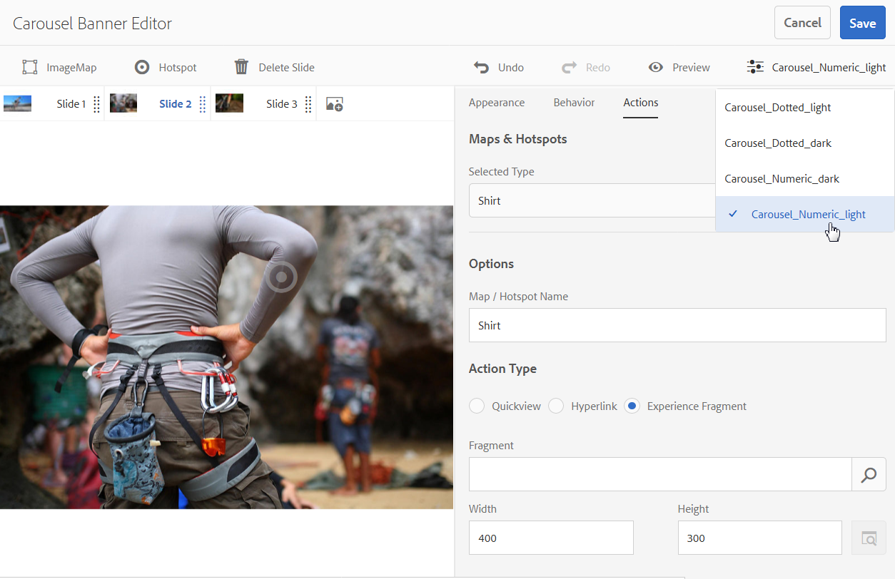

# 회전 배너{#carousel-banners}

회전 배너를 사용하면 마케터가 대화형 회전 프로모션 콘텐츠를 쉽게 만들어 모든 화면에 전달하여 전환을 유도할 수 있습니다.

홍보 배너에 포함된 콘텐츠를 만들고 수정하는 것은 시간이 많이 소요될 수 있으므로, 새 콘텐츠를 빠르게 게시하거나 더 많이 타깃팅하도록 하는 능력이 제한될 수 있습니다. 회전 배너를 빠르게 만들거나 수정하고 핫스팟 링크와 같은 상호 작용을 제품 세부 사항 또는 관련 리소스에 추가할 수 있습니다. 모든 화면에 이를 제공할 수 있으므로 새로운 홍보 콘텐츠를 더 빨리 시장에 출시할 수 있습니다.

회전 배너는 단어가 포함된 배너로 지정됩니다. **[!UICONTROL CAROUSELSET]**:

웹 사이트에서 회전식 배너는 다음과 같이 표시될 수 있습니다.

여기서 숫자를 선택하여 이미지를 탐색할 수 있습니다. 또한 슬라이드는 사용자 정의할 수 있는 시간 간격을 기준으로 자동으로 회전합니다. 회전 배너의 이미지는 핫스팟과 이미지 맵을 모두 지원합니다. 또는 을 선택하여 하이퍼링크로 이동하거나 빠른 보기 창에 액세스할 수 있습니다.

이 예에서 사용자가 이미지 맵을 선택하고 Quickview 창에 장갑을 끼려고 액세스했습니다.

## 캐러셀 배너가 생성되는 방식 보기 {#watch-how-carousel-banners-are-created}

다음 내용에 대해 살펴보기 [회전 배너를 만드는 방법](https://s7d5.scene7.com/s7viewers/html5/VideoViewer.html?videoserverurl=https://s7d5.scene7.com/is/content/&amp;emailurl=https://s7d5.scene7.com/s7/emailFriend&amp;serverUrl=https://s7d5.scene7.com/is/image/&amp;config=Scene7SharedAssets/Universal_HTML5_Video_social&amp;contenturl=https://s7d5.scene7.com/skins/&amp;asset=S7tutorials/InteractiveCarouselBanner) (기간: 10분 33초). 또한 회전 배너를 미리 보고, 편집하고, 전달하는 방법에 대해서도 알아봅니다.

>[!NOTE]
>
>관리자가 아닌 사용자를 **[!UICONTROL dam-users]** 그룹: 회전 배너를 만들거나 편집할 수 있습니다. 만들거나 편집하는 데 문제가 있는 경우 사용자를 다음에 추가할 수 있는 시스템 관리자에게 문의하십시오. **d[!UICONTROL am 사용자]** 그룹입니다.

## 빠른 시작: 회전 배너 {#quick-start-carousel-banners}

빠르게 시작하고 실행하려면:

1. [핫스팟 및 이미지 맵 변수 식별](#identifying-hotspot-and-image-map-variables) (Adobe Experience Manager Assets + Dynamic Media을 사용하는 고객만 해당)

   기존 빠른 보기 구현에서 사용하는 동적 변수를 식별하여 시작합니다. 이렇게 하면 Experience Manager Assets에서 회전 배너 만들기 프로세스 중에 핫스팟과 이미지 맵 데이터를 제대로 입력할 수 있습니다.

<!-- LEAVE; COMMERCE BEING ADDED AGAIN IN THE FUTURE

   >[!NOTE]
   >
   >If you are an Experience Manager Sites or Ecommerce customer, you can use the built-in feature to navigate to product pages and lookup the existing skus in the product catalog. You do not need to manually enter hotspot or image map variables.
   >
   >
   >If you are an Experience ManagerAssets and Dynamic Media customer, you will manually enter data for hotspots and image maps, and then integrate the published URL or Embed code with your third-party content management system.

-->

1. Optional: [Create a Carousel Set viewer preset](/help/assets/dynamic-media/managing-viewer-presets.md), as needed.

   관리자는 고유한 회전판 뷰어 사전 설정을 만들어 회전판의 비헤이비어와 모양을 사용자 정의할 수 있습니다. 주요 이점은 여러 회전 메뉴에 대해 이 사용자 지정 뷰어 사전 설정을 다시 사용할 수 있다는 것입니다. 그러나 사용자는 선택적으로 회전판을 작성하는 동안 회전판의 비헤이비어와 모양을 직접 사용자 정의할 수 있습니다. 이 접근 방식은 제공된 캐러셀에 특정 디자인을 원하는 경우 선호됩니다.

1. [이미지 배너 업로드](#uploading-image-banners).

   대화형으로 만들 이미지 배너를 업로드합니다.

1. [회전 메뉴 세트 만들기](#creating-carousel-sets).

   회전 메뉴 세트에서 사용자는 배너 이미지를 탐색하고 핫스팟 또는 이미지 맵을 선택하여 관련 콘텐츠에 액세스합니다.

   에셋에서 회전 메뉴 세트를 만들려면 다음을 선택합니다. **[!UICONTROL 만들기]**&#x200B;을 선택한 다음 을 선택합니다. **[!UICONTROL 회전 메뉴 세트]**. 슬라이드에 에셋 추가 및 선택 **[!UICONTROL 저장]**. You can also edit the appearance and behavior of the carousel directly within the editor.

1. [이미지 배너에 핫스팟 또는 이미지 맵 추가](#adding-hotspots-or-image-maps-to-an-image-banner).

   이미지 배너에 하나 이상의 핫스팟 또는 이미지 맵을 추가합니다. 그런 다음 각 항목을 링크, 빠른 보기 또는 경험 조각과 같은 작업에 연결합니다. 핫스팟 또는 이미지 맵을 추가한 후 회전 메뉴 세트를 게시하여 이 작업을 완료합니다. 게시하면 웹 사이트 랜딩 페이지를 복사하고 적용하는 데 사용할 수 있는 포함 코드가 만들어집니다.

   다음을 참조하십시오 [(선택 사항) 회전 배너 미리 보기](#optional-previewing-carousel-banners) - 선택 사항입니다. 원하는 경우 회전 메뉴 세트의 표현을 보고 상호 작용을 테스트할 수 있습니다.

1. [회전 배너 게시](#publishing-carousel-banners).

   에셋의 경우와 마찬가지로 회전 메뉴 세트를 게시합니다. 에셋에서 회전 메뉴 세트로 이동하여 선택하고 를 선택합니다 **[!UICONTROL 게시]**. 회전 메뉴 세트를 게시하면 URL 및 포함 문자열이 활성화됩니다.

1. 다음 중 하나를 수행하십시오.

   * [웹 사이트 페이지에 회전 배너 추가](#adding-a-carousel-banner-to-your-website-page)웹 사이트 페이지에 복사한 회전 배너 URL 또는 포함 코드를 추가할 수 있습니다.

      * [캐러셀 배너를 기존 빠른 보기와 통합](#integrating-the-carousel-banner-with-an-existing-quickview). 서드파티 웹 콘텐츠 관리 시스템을 사용하는 경우 새 캐러셀 배너를 웹 사이트의 기존 빠른 보기 구현과 통합해야 합니다.

   * [Experience Manager에서 웹 사이트에 캐러셀 배너 추가](/help/assets/dynamic-media/adding-dynamic-media-assets-to-pages.md). Experience Manager Sites 고객인 경우 대화형 미디어 구성 요소를 사용하여 페이지에 직접 회전 메뉴 세트를 추가할 수 있습니다.

회전 메뉴 세트를 편집해야 하는 경우 [회전 메뉴 세트 편집](#editing-carousel-sets). 또한 보고 편집할 수 있습니다 [회전 메뉴 세트 속성](/help/assets/manage-digital-assets.md#editing-properties).

## 핫스팟 및 이미지 맵 변수 식별 {#identifying-hotspot-and-image-map-variables}

기존 빠른 보기 구현에서 사용하는 동적 변수를 식별하여 시작합니다. 이 방법을 사용하면 Experience Manager Assets에서 회전 메뉴 세트 만들기 프로세스 중에 핫스팟이나 이미지 맵 데이터를 제대로 입력할 수 있습니다.

배너 이미지에 핫스팟 또는 이미지 맵을 추가하면 SKU(Stock Keeping Unit)를 할당합니다. 각 핫스팟 또는 이미지 맵에 선택적 추가 변수를 할당할 수도 있습니다. 이러한 변수는 나중에 핫스팟 또는 이미지 맵과 빠른 보기 콘텐츠를 일치시키는 데 사용됩니다.

<!-- LEAVE; COMMERCE BEING ADDED LATER

>[!NOTE]
>
>If you are an Experience Manager Sites and/or Experience Manager Ecommerce customer, skip this step. You do not need to manually identify hotspot or image map variables; you can use the integration with Ecommerce for product integration. See information on [setting up eCommerce](/help/sites-cloud/administering/generic.md). In addition, you can use the Interactive component and add it to your web page.
>
>If you are an Experience Manager Assets or Media customer, you publish the URL or Embed code and then integrate with your third-party content management system and identify hotspots and image maps manually.

-->

핫스팟 또는 이미지 맵 데이터와 연결할 변수의 수 및 유형을 올바르게 식별하는 것이 중요합니다. 배너 이미지에 추가된 각 핫스팟 또는 이미지 맵에는 기존 백엔드 시스템의 제품을 명확하게 식별할 수 있는 충분한 정보가 있어야 합니다. 동시에 각 핫스팟 또는 이미지 맵에 필요 이상의 데이터가 포함되지 않아야 합니다. 그 이유는 데이터 입력 프로세스가 지나치게 복잡하고 진행 중인 핫스팟 또는 이미지 맵 관리에 오류가 발생하기 쉽기 때문입니다.

핫스팟 또는 이미지 맵 데이터에 사용할 변수 집합을 식별하는 방법에는 여러 가지가 있습니다.

때로는 기존 Quickview 구현을 담당하는 IT 전문가와 상담하는 것으로 충분합니다. 시스템에서 빠른 보기를 식별하는 최소 데이터 세트가 무엇인지 알 수 있습니다. 그러나 프론트엔드 코드의 기존 동작을 간단하게 분석할 수 있습니다.

대부분의 빠른 보기 구현은 다음 패러다임을 사용합니다.

* User activates a user interface element on the website. 예: **[!UICONTROL 빠른 보기]** 단추를 클릭합니다.
* 필요한 경우 웹 사이트에서 빠른 보기 데이터 또는 컨텐츠를 로드하기 위해 백엔드에 Ajax 요청을 보냅니다.
* 빠른 보기 데이터는 웹 페이지에서의 렌더링을 준비하기 위해 콘텐츠로 변환됩니다.
* 마지막으로 프론트엔드 코드는 이러한 콘텐츠를 화면에서 시각적으로 렌더링합니다.

그러면 빠른 보기 기능이 구현된 기존 웹 사이트의 다른 영역을 방문하는 방법이 제공됩니다. 그런 다음 빠른 보기를 트리거하고 빠른 보기 데이터 또는 콘텐츠를 로드하기 위해 웹 페이지에서 전송하는 Ajax URL을 얻습니다.

일반적으로 특수 디버깅 도구를 사용할 필요가 없습니다. 최신 웹 브라우저에는 적절한 작업을 수행하는 웹 검사기가 있습니다. 다음은 웹 검사기를 포함하는 웹 브라우저의 몇 가지 예입니다.

* Google Chrome에서 나가는 모든 HTTP 요청을 보려면 F12(Windows®) 또는 Command-Option-I(Mac)를 눌러 [개발자 도구] 패널을 엽니다. 네트워크 탭을 선택합니다.
* Firefox에서 F12(Windows®) 또는 Command-Option-I(Mac)를 눌러 Firebug 플러그인을 활성화할 수 있습니다. 네트워크 탭을 사용하거나 내장된 검사기 도구 및 네트워크 탭을 사용합니다.

브라우저에서 네트워크 모니터링이 켜지면 페이지에서 빠른 보기를 트리거합니다.

이제 네트워크 로그에서 빠른 보기 Ajax URL을 찾아 기록된 URL을 복사하여 향후 분석합니다. 일반적으로 빠른 보기를 트리거하면 서버로 전송되는 요청이 많이 있습니다. 일반적으로 Quickview Ajax URL은 목록의 첫 번째 URL 중 하나입니다. 복잡한 쿼리 문자열 부분 또는 경로가 있으며 응답 MIME 유형은 다음 중 하나입니다. `text/html`, `text/xml`, 또는 `text/javascript`.

이 프로세스 중에 다양한 제품 카테고리와 유형을 사용하여 웹 사이트의 다양한 영역을 방문하는 것이 중요합니다. 그 이유는 빠른 보기 URL에는 주어진 웹 사이트 카테고리에 대해 공통적인 부분이 있지만, 웹 사이트의 다른 영역을 방문하는 경우에만 변경되기 때문입니다.

가장 간단한 경우, 빠른 보기 URL에 있는 유일한 변수 부분은 제품 SKU입니다. 이 경우 SKU 값은 배너 이미지에 핫스팟 또는 이미지 맵을 추가하는 데 필요한 유일한 데이터 부분입니다.

그러나 복잡한 경우 빠른 보기 URL에는 SKU 외에도 다양한 요소가 있습니다. 이러한 요소 중 일부에는 카테고리 ID, 색상 코드, 크기 코드 등이 포함됩니다. 이러한 경우 모든 요소는 핫스팟의 개별 변수이거나 회전 배너 기능의 이미지 맵 데이터 정의입니다.

다음 Quickview URL 및 결과 핫스팟 또는 이미지 맵 변수 예를 생각해 보십시오.

<table>
 <tbody>
  <tr>
   <td>쿼리 문자열에 있는 단일 SKU.</td>
   <td>
기록된 빠른 보기 URL에는 다음이 포함됩니다.

    <ul>
     <li>
<code>https://server/json?productId=866558&amp;source=100</code>
 </li>
     <li>
<code>https://server/json?productId=1196184&amp;source=100</code>
 </li>
     <li>
<code>https://server/json?productId=1081492&amp;source=100</code>
 </li>
     <li>
<code>https://server/json?productId=1898294&amp;source=100</code>
 </li>
    </ul> 
URL에서 유일한 변수 부분은 <code>productId=</code> 쿼리 문자열 매개 변수이며 SKU 값입니다. 따라서 핫스팟 또는 이미지 맵에는 다음과 같은 값으로 채워진 SKU 필드만 필요합니다. <code>866558,</code> <code>1196184,</code> <code>1081492,</code> <code>1898294.</code>
 </td>
  </tr>
  <tr>
   <td>URL 경로에 있는 단일 SKU.</td>
   <td>
기록된 빠른 보기 URL에는 다음이 포함됩니다.

    <ul>
     <li>
<code>https://server/product/6422350843</code>
 </li>
     <li>
<code>https://server/product/1607745002</code>
 </li>
     <li>
<code>https://server/product/0086724882</code>
 </li>
    </ul> 
변수 부분은 경로의 마지막 부분에 있으며, 핫스팟/이미지 맵의 SKU 값이 됩니다.<strong><code>6422350843</code>, <code>1607745002,</code> </strong><code>0086724882.</code>
 </td>
  </tr>
  <tr>
   <td>쿼리 문자열의 SKU 및 카테고리 ID.</td>
   <td>
기록된 빠른 보기 URL에는 다음이 포함됩니다.

    <ul>
     <li>
<code>https://server/quickView/product/?category=1100004&amp;prodId=305466</code>
 </li>
     <li>
<code>https://server/quickView/product/?category=1100004&amp;prodId=310181</code>
 </li>
     <li>
<code>https://server/quickView/product/?category=1740148&amp;prodId=308706</code>
 </li>
    </ul> 
이 경우 URL에는 두 가지 다양한 부분이 있습니다. SKU는에 저장됩니다. <code>prodId</code> 매개 변수와 범주 ID는에 저장됩니다. <code>category=</code>매개 변수.
 
따라서 핫스팟/이미지 맵 정의는 쌍입니다. 즉, SKU 값과 라는 추가 변수입니다. <code>categoryId</code>. 결과 쌍은 다음과 같습니다.

    <ul>
     <li>
SKU: <strong><code>305466</code></strong> 및 <code>categoryId</code> 은(는) <code>1100004</code>.
 </li>
     <li>
SKU: <strong><code>310181</code></strong> 및 <code>categoryId</code> 은(는) <strong><code>1100004</code></strong>.
 </li>
     <li>
SKU: <strong><code>308706</code></strong> 및 <code>categoryId</code> 은(는) <strong><code>1740148</code></strong>.
 </li>
    </ul> </td>
  </tr>
 </tbody>
</table>

## 이미지 배너 업로드 {#uploading-image-banners}

사용할 이미지를 이미 업로드한 경우 다음 단계로 이동하십시오. [회전 메뉴 세트 만들기](#creating-carousel-sets). 캐러셀에 사용된 이미지는 Dynamic Media이 활성화된 후에 업로드해야 합니다.

이미지 배너를 업로드하려면 다음을 참조하십시오. [에셋 업로드](/help/assets/manage-digital-assets.md).

## 회전 메뉴 세트 만들기 {#creating-carousel-sets}

>[!NOTE]
>
>관리자가 아닌 사용자를 **[!UICONTROL dam-users]** 그룹: 회전 배너를 만들거나 편집할 수 있습니다. 만들거나 편집하는 데 문제가 있는 경우 사용자를 다음에 추가할 수 있는 시스템 관리자에게 문의하십시오. **[!UICONTROL dam-users]** 그룹입니다.

**회전 메뉴 세트를 생성하려면**

1. 에셋에서 회전 메뉴 세트를 만들 폴더로 이동한 다음 로 이동합니다 **[!UICONTROL 만들기 > 회전 메뉴 세트]**.
1. 회전판 배너 편집기 페이지에서 **[!UICONTROL 자산 선택기를 열려면 탭하십시오.]** 을 클릭하여 첫 번째 슬라이드의 이미지를 선택합니다.

   회전 배너 편집기 페이지에서 다음 중 하나를 수행합니다.

   * 페이지의 왼쪽 상단 모서리 근처에서 을 선택합니다. **[!UICONTROL 슬라이드 추가]** 아이콘.

   * 페이지 가운데 근처에서 을 선택합니다. **[!UICONTROL 자산 선택기를 열려면 탭하십시오.]**.

   회전 메뉴 세트에 포함할 자산을 선택하려면 를 선택합니다. 선택한 에셋에는 확인 표시 아이콘이 있습니다. 완료되면 페이지의 오른쪽 상단 모서리 근처에서 을 선택합니다. **[!UICONTROL 선택]**.

   자산 선택기를 사용하여 키워드를 입력하고 를 선택하여 자산을 검색할 수 있습니다 **[!UICONTROL 반환]**. You can also apply filters to refine your search results. You can filter by path, collection, file type, and tag. 필터를 선택한 다음 **[!UICONTROL 필터]** 아이콘을 클릭합니다. 보기 아이콘을 선택하고 을 선택하여 보기 변경 **[!UICONTROL 열 보기]**, **[!UICONTROL 카드 보기]**, 또는 **[!UICONTROL 목록 보기]**.

   다음을 참조하십시오 [선택기를 사용한 작업](/help/assets/dynamic-media/working-with-selectors.md) 추가 정보.

1. 회전 메뉴 세트에서 회전할 모든 이미지를 추가할 때까지 슬라이드를 계속 추가합니다.
1. (선택 사항) 다음 중 하나를 수행합니다.

   * 필요한 경우 슬라이드를 드래그하여 세트 목록에서 이미지 순서를 변경합니다.
   * 이미지를 삭제하려면 이미지를 선택한 다음 를 선택합니다 **[!UICONTROL 슬라이드 삭제]** 을 클릭합니다.

   * 페이지의 오른쪽 상단 모서리 근처에서 사전 설정을 적용하려면 사전 설정 드롭다운 목록을 선택한 다음 세트에 적용할 사전 설정을 한 번에 선택합니다.

   슬라이드를 삭제하려면 슬라이드를 선택합니다. 도구 모음에서 를 선택합니다. **[!UICONTROL 슬라이드 삭제]** 을 클릭합니다. 슬라이드를 이동하려면 순서 변경 아이콘을 선택하고 원하는 위치로 이동합니다.

1. 슬라이드에 이미지를 추가한 후 이미지에 핫스팟, 이미지 맵 또는 두 가지 모두를 추가할 수 있습니다. 다음을 참조하십시오 [이미지 배너에 핫스팟 또는 이미지 맵 추가](#adding-hotspots-or-image-maps-to-an-image-banner).
1. 회전 메뉴 세트의 시각적 디자인과 비헤이비어를 변경할 수 있습니다. 다음 항목 선택 **[!UICONTROL 비헤이비어]** 및 **[!UICONTROL 모양]** 탭 - 회전 배너가 표시되는 방식이나 특정 구성 요소의 작동 방식을 조정합니다. 다음을 참조하십시오 [뷰어 사전 설정 관리](/help/assets/dynamic-media/viewer-presets.md) 뷰어 편집기 사용 방법에 대한 자세한 정보.

   >[!NOTE]
   >
   >회전 배너의 경우 다음을 조정할 수 있습니다.
   >
   >* 이미지가 표시되는 기간. 기본적으로 각 이미지는 9초 동안 표시됩니다.
   >* 애니메이션. 기본적으로 각 슬라이드 전환은 페이드입니다. 이를 슬라이드 전환으로 변경할 수 있습니다.
   >* 단추 스타일입니다. 사용자는 각 점 또는 숫자를 선택하여 배너를 통해 회전할 수 있습니다. 설정된 표시기 단추가 나타나는 위치(숫자 또는 점선 스타일인 경우)와 표시 단추 크기를 변경할 수 있습니다.
   >* 이미지 맵의 강조 표시 스타일 또는 핫스팟에 사용되는 아이콘을 변경합니다.
   >* 뷰어 사전 설정을 편집하기 전에 사전 설정의 기준으로 사용할 스타일을 선택합니다. 스타일을 선택하지 않은 경우 뷰어 사전 설정 편집을 시작할 때 다른 사전 설정으로 변경하면 모든 변경 내용이 손실됩니다.

   회전 배너의 모양을 미리 볼 수도 있습니다. 다음을 참조하십시오 [(선택 사항) 회전 배너 미리 보기](#optional-previewing-carousel-banners).

1. 선택 **[!UICONTROL 저장]** 완료 시.

## 이미지 배너에 핫스팟 또는 이미지 맵 추가 {#adding-hotspots-or-image-maps-to-an-image-banner}

회전 메뉴 세트 편집기를 사용하여 배너에 핫스팟 또는 이미지 맵을 추가할 수 있습니다.

핫스팟 또는 이미지 맵을 추가할 때 빠른 보기 팝업 표시, 하이퍼링크 또는 경험 조각으로 정의할 수 있습니다.

다음을 참조하십시오 [경험 조각](/help/sites-cloud/authoring/fragments/content-fragments.md).

>[!NOTE]
>
>경험 조각에 뷰어를 포함할 때 회전 배너의 소셜 미디어 공유 도구가 지원되지 않습니다.
>
>이 문제를 해결하려면 소셜 미디어 공유 도구가 없는 뷰어 사전 설정을 사용하거나 만들 수 있습니다. 이러한 뷰어 사전 설정을 사용하면 경험 조각에 성공적으로 포함할 수 있습니다.

이미지에 핫스팟 또는 이미지 맵을 추가할 때 작업 내용을 저장하는 것을 잊지 마십시오. 페이지의 오른쪽 상단 모서리 근처에 있는 실행 취소 및 재실행 옵션은 현재 생성/편집 세션 중에 지원됩니다.

회전식 배너 만들기를 마치면 선택적으로 미리보기 를 사용하여 회전식 배너가 고객에게 표시되는 방식을 확인할 수 있습니다.

다음을 참조하십시오 [(선택 사항) 회전 배너 미리 보기](#optional-previewing-carousel-banners).

>[!NOTE]
>
>이미지 배너에 핫스팟을 추가하면 핫스팟 정보가 이미지의 위치를 기준으로 동일한 메타데이터 위치에 저장됩니다. 이 점은 대화형 이미지인지 아니면 회전 배너인지에 관계없이 true입니다. 이 기능은 정의된 핫스팟 데이터와 함께 동일한 이미지를 두 뷰어에서 쉽게 재사용할 수 있음을 의미합니다.
>
>그러나 회전 배너는 핫스팟을 포함할 수도 있는 이미지에 대한 이미지 맵을 지원하지만 대화형 이미지는 지원하지 않습니다. 동일한 이미지를 사용하는 대화형 이미지 또는 회전 배너를 만들려면 이 팁을 기억하십시오. 동일한 이미지의 별도의 복사본을 대신 사용하여 대화형 이미지 및 회전식 배너를 만드는 것이 좋습니다.

>[!NOTE]
>
>핫스팟이 있는 대화형 이미지를 편집하고 이미지를 자르는 경우 핫스팟이 제거됩니다.

<!-- See also [Adding Image Maps](/help/assets/image-maps.md). -->

**이미지 배너에 핫스팟 또는 이미지 맵을 추가하려면 다음을 수행합니다.**

1. Assets에서 대화형으로 만들 회전 메뉴 세트로 이동합니다.
1. 회전 메뉴 세트를 선택하고 **[!UICONTROL 편집]**. 슬라이드 뷰어 편집기가 열립니다.
1. 대화형으로 만들 슬라이드를 선택합니다.
1. 페이지의 왼쪽 상단 모서리 근처에서 을 선택합니다. **[!UICONTROL 핫스팟]** 또는 **[!UICONTROL 이미지 맵]**.
1. 다음 중 하나를 수행합니다.

   * 핫스팟의 경우: 이미지에서 핫스팟을 표시할 위치를 선택합니다.
   * 이미지 맵의 경우: 이미지에서 왼쪽 상단에서 오른쪽 하단으로 드래그하여 이미지 맵 영역을 만듭니다. 모퉁이를 드래그하여 이미지 맵의 크기를 조정할 수 있습니다.

   필요한 경우 핫스팟 또는 이미지 맵을 새 위치로 드래그합니다. 또는 키보드 화살표 키를 사용하여 선택한 핫스팟의 위치를 제어합니다. 필요에 따라 더 많은 핫스팟 또는 이미지 맵을 추가합니다.

   핫스팟 또는 이미지 맵을 삭제하려면 **[!UICONTROL 작업]** 탭. 아래 **[!UICONTROL 지도 및 핫스팟]** 제목, 출처: **[!UICONTROL 선택한 유형]** 드롭다운 목록에서 제거할 핫스팟 또는 이미지 맵의 이름을 선택합니다. 다음 항목 선택 **[!UICONTROL 휴지통]** 아이콘을 클릭한 다음 선택 **[!UICONTROL 삭제]**.

1. 이름 텍스트 필드에 핫스팟 또는 이미지 맵의 이름을 입력합니다. 이 이름은 **[!UICONTROL 지도 및 핫스팟]** 드롭다운 목록입니다. 이름을 제공하면 나중에 핫스팟 또는 이미지 맵을 변경하기로 결정하는 경우 쉽게 식별할 수 있습니다.
1. 다음 중 하나를 수행합니다. **[!UICONTROL 작업]** 탭:

   * 선택 **[!UICONTROL 빠른 보기]**.

      * Experience Manager Sites인 경우 <!-- and Ecommerce--> 고객은 제품 선택기 아이콘(돋보기)을 선택하여 제품 선택 페이지를 엽니다. 회전 메뉴 배너 편집기로 돌아가려면 사용할 제품을 선택한 다음 페이지의 오른쪽 상단에 있는 확인 표시를 선택합니다.
      * Experience Manager Sites이 아닌 경우 <!-- or Ecommerce --> 고객:

         * 변수를 정의합니다. 다음을 참조하십시오 [핫스팟 변수 식별](#identifying-hotspot-and-image-map-variables).
         * 그런 다음 수동으로 SKU 값을 입력합니다. SKU 값 텍스트 필드에 제품의 SKU(Stock Keeping Unit)를 입력합니다. 이 SKU는 제공하는 각 고유 제품이나 서비스에 대한 고유 식별자입니다. 입력한 SKU 값이 빠른 보기 템플릿의 변수 부분을 자동으로 채웁니다. 이제 시스템에서 선택한 핫스팟을 특정 SKU의 빠른 보기와 연결해야 한다는 것을 알고 있습니다.
         * (선택 사항) 빠른 보기 내에 제품을 추가로 식별하는 데 사용해야 하는 다른 변수가 있는 경우 다음을 선택합니다 **[!UICONTROL 일반 변수 추가]**. 텍스트 필드에 추가 변수를 지정합니다. 예를 들어 category=Mens는 추가된 변수입니다.

         * 다음을 참조하십시오 [선택기를 사용한 작업](/help/assets/dynamic-media/working-with-selectors.md) 추가 정보.

   * 선택 **[!UICONTROL 하이퍼링크]**.

      * Experience Manager Sites 고객의 경우 사이트 선택기 아이콘(폴더)을 선택하여 URL로 이동합니다.

        >[!NOTE]
        >
        >대화형 콘텐츠에 상대 URL이 있는 링크, 특히 Experience Manager Sites 페이지에 대한 링크가 있는 경우에는 URL 기반 연결 방법이 불가능합니다.

      * 독립형 고객인 경우 href 텍스트 필드에 연결된 웹 페이지에 대한 전체 URL 경로를 지정합니다.

   링크를 새 브라우저 탭(권장 기본값)에서 열지 또는 동일한 탭에서 열지를 지정해야 합니다.

   다음을 참조하십시오 [선택기를 사용한 작업](/help/assets/dynamic-media/working-with-selectors.md) 추가 정보.

   * 선택 **[!UICONTROL 경험 조각]**.

      * Experience Manager Sites 고객인 경우 검색 아이콘(돋보기)을 선택하여 경험 조각 페이지를 엽니다. 핫스팟 관리 페이지로 돌아가려면 사용할 경험 조각을 선택한 다음 페이지의 오른쪽 상단 모서리에서 을 선택합니다. **[!UICONTROL 선택]**.
다음을 참조하십시오 [경험 조각](/help/sites-cloud/authoring/fragments/content-fragments.md).

      * 배너에 표시되는 경험 조각의 너비와 높이를 지정합니다.

        >[!NOTE]
        >
        >경험 조각에 뷰어를 포함할 때 회전 배너의 소셜 미디어 공유 도구가 지원되지 않습니다.
        >
        >이 점을 해결하려면 소셜 미디어 공유 도구가 없는 뷰어 사전 설정을 사용하거나 만들 수 있습니다. 이러한 뷰어 사전 설정을 사용하면 경험 조각에 성공적으로 포함할 수 있습니다.

   

   회전 배너의 모양을 미리 볼 수도 있습니다. 다음을 참조하십시오 [(선택 사항) 회전 배너 미리 보기](#optional-previewing-carousel-banners).

1. **[!UICONTROL 저장]**&#x200B;을 선택합니다.
1. 회전 메뉴 세트를 게시합니다. 게시하면 웹 사이트 페이지에서 사용할 수 있는 포함 코드 또는 URL이 만들어집니다. Experience Manager Sites 고객인 경우 웹 페이지에 바로 회전 메뉴 세트를 추가합니다.

   다음을 참조하십시오 [자산 게시](/help/assets/dynamic-media/publishing-dynamicmedia-assets.md).

   다음을 참조하십시오 [웹 사이트 랜딩 페이지에 회전 메뉴 세트 추가](#adding-a-carousel-banner-to-your-website-page)

## 회전 메뉴 세트 편집 {#editing-carousel-sets}

>[!NOTE]
>
>관리자가 아닌 사용자를 **[!UICONTROL dam-users]** 그룹: 회전 배너를 만들거나 편집할 수 있습니다. 만들거나 편집하는 데 문제가 있는 경우 사용자를 다음에 추가할 수 있는 시스템 관리자에게 문의하십시오. **[!UICONTROL dam-users]** 그룹입니다.

회전판 세트에 대해 다음과 같은 다양한 편집 작업을 수행할 수 있습니다.

* 슬라이드 세트에 슬라이드를 추가합니다. 참조: [선택기를 사용한 작업](/help/assets/dynamic-media/working-with-selectors.md).
* 슬라이드 세트에서 슬라이드 순서를 변경합니다.
* 회전 메뉴 세트에서 에셋을 삭제합니다.
* 뷰어 사전 설정을 적용합니다.
* 회전 메뉴 세트를 삭제합니다.
* 핫스팟 및 이미지 맵을 추가하거나 편집합니다. 참조: [선택기를 사용한 작업](/help/assets/dynamic-media/working-with-selectors.md).

**회전 메뉴 세트를 편집하려면:**

1. 다음 중 하나를 수행합니다.

   * 회전 메뉴 세트 에셋을 마우스로 가리킨 다음 을 선택합니다. **[!UICONTROL 편집]** (연필 아이콘).
   * 회전 메뉴 세트 에셋 위로 마우스를 가져간 후 **[!UICONTROL 선택]** (확인 표시 아이콘) 을 클릭한 다음 도구 모음에서 를 선택합니다 **[!UICONTROL 편집]**.

   * 회전 메뉴 세트 에셋을 선택한 다음 페이지의 왼쪽 상단 모서리에서 을(를) 선택합니다. **[!UICONTROL 편집]** (연필 아이콘).

1. 회전 메뉴 세트를 편집하려면 다음 중 하나를 수행합니다.

   * 슬라이드를 추가하려면 **[!UICONTROL 슬라이드 추가]** 아이콘. 해당 슬라이드에 추가할 에셋으로 이동한 다음 확인 표시를 선택합니다.
   * 슬라이드의 순서를 바꾸려면 슬라이드를 새 위치로 끕니다. 항목을 이동하려면 순서 바꾸기 아이콘을 선택합니다.
   * 핫스팟 또는 이미지 맵을 추가하려면 핫스팟 또는 이미지 맵 아이콘을 선택하고 [이미지 배너에 핫스팟 및 이미지 맵 추가](#adding-hotspots-or-image-maps-to-an-image-banner).
   * 회전 메뉴 세트의 모양이나 비헤이비어를 편집하려면 **[!UICONTROL 모양]** 탭 또는 **[!UICONTROL 비헤이비어]** 탭을 클릭한 다음 원하는 옵션을 설정합니다.
   * 핫스팟 또는 이미지 맵을 편집하려면 해당 슬라이드에서 핫스팟 또는 이미지 맵을 선택합니다. 아래 **[!UICONTROL 작업]** 탭에서 변경합니다.
   * 슬라이드를 삭제하려면 해당 슬라이드를 선택한 다음 를 선택합니다 **[!UICONTROL 슬라이드 삭제]** 을 클릭합니다.
   * 페이지의 오른쪽 상단 모서리 근처에서 사전 설정을 적용하려면 **[!UICONTROL 사전 설정]** 드롭다운 목록에서 뷰어 사전 설정을 선택합니다.
   * 전체 회전식 세트를 삭제하려면 회전식 세트로 이동하여 선택한 다음 를 선택합니다 **[!UICONTROL 삭제]**.

   >[!NOTE]
   >
   >핫스팟이 있는 대화형 이미지를 편집하고 이미지를 자르는 경우 핫스팟이 제거됩니다.

## (선택 사항) 회전 배너 미리 보기 {#optional-previewing-carousel-banners}

미리보기 를 사용하여 캐러셀 배너가 고객에게 표시되는 방식을 확인할 수 있습니다. 미리 보기를 사용하면 캐러셀 배너의 핫스팟과 이미지 맵을 테스트하여 예상대로 작동하는지 확인할 수 있습니다.

캐러셀 배너가 마음에 들면 게시할 수 있습니다.
다음을 참조하십시오 [웹 페이지에 비디오 또는 이미지 뷰어 포함](/help/assets/dynamic-media/embed-code.md).
다음을 참조하십시오 [웹 애플리케이션에 URL 연결](/help/assets/dynamic-media/linking-urls-to-yourwebapplication.md). 대화형 콘텐츠에 상대 URL이 있는 링크, 특히 Experience Manager Sites 페이지에 대한 링크가 있는 경우에는 URL 기반 연결 방법이 불가능합니다.
다음을 참조하십시오 [페이지에 Dynamic Media 에셋 추가](/help/assets/dynamic-media/adding-dynamic-media-assets-to-pages.md).

회전 메뉴 편집기(기본 방법) 또는 **[!UICONTROL 뷰어]** 목록을 표시합니다.

**선택적으로 회전식 배너를 미리 보려면 다음과 같이 하십시오.**

1. 위치 **[!UICONTROL 에셋]**&#x200B;를 클릭하고 생성한 기존 회전 배너로 이동한 다음 를 선택하여 엽니다.
1. **[!UICONTROL 편집]**&#x200B;을 선택합니다.
1. 도구 모음의 오른쪽 모서리에 있는 뷰어 사전 설정 목록에서 회전 배너를 미리 볼 뷰어를 선택합니다.

   

1. 선택 **[!UICONTROL 미리 보기]**.
1. 연결된 작업을 테스트하려면 이미지에서 핫스팟 또는 이미지 맵을 선택합니다.

**뷰어 목록에서 회전 배너를 미리 보려면 다음을 수행하십시오.**

1. 위치 **[!UICONTROL 에셋]**&#x200B;를 클릭하고 생성한 기존 회전 배너로 이동한 다음 를 선택하여 엽니다.
1. 미리 보기 페이지의 왼쪽 상단 모서리 근처에서 컨텐츠 아이콘을 선택합니다.
1. 다음에서 **[!UICONTROL 뷰어]** 페이지 왼쪽에 있는 패널에서 사용할 캐러셀 배너 뷰어 사전 설정의 이름을 선택합니다.
1. 연결된 작업을 테스트하려면 이미지에서 핫스팟 또는 이미지 맵을 선택합니다.

## 회전 배너 게시 {#publishing-carousel-banners}

회전판을 사용하려면 해당 회전판을 게시해야 합니다. 회전 메뉴 세트를 게시하면 URL 및 포함 코드가 활성화됩니다. 또한 확장 가능하고 성능이 뛰어난 전송을 위해 CDN과 통합된 Dynamic Media 클라우드에 캐러셀을 게시합니다.

>[!NOTE]
>
>회전 배너에 핫스팟이 있는 기존 대화형 이미지를 사용하는 경우 회전 배너를 게시한 후 대화형 이미지를 별도로 게시해야 합니다.
>
>또한, 캐러셀 배너에 사용하는 기존의 게시된 대화형 이미지를 수정하는 경우, 해당 변경 사항이 캐러셀 배너에 반영되도록 대화형 이미지를 게시하십시오.

다음을 참조하십시오 [Dynamic Media Assets 게시](/help/assets/dynamic-media/publishing-dynamicmedia-assets.md) 회전 배너를 게시하는 방법에 대한 정보입니다.

## 웹 사이트 페이지에 회전 배너 추가 {#adding-a-carousel-banner-to-your-website-page}

캐러셀을 만들기 위해 배너 이미지를 업로드한 후 배너에 핫스팟이나 이미지 맵 또는 두 가지 모두를 추가했습니다. 회전 메뉴 세트를 게시했습니다. 이제 기존 웹 사이트 페이지에 추가할 준비가 되었습니다.

>[!NOTE]
>
>Experience Manager Sites 고객의 경우 대화형 미디어 구성 요소를 페이지로 드래그하여 회전식 배너를 페이지에 바로 추가할 수 있습니다. 다음을 참조하십시오 [페이지에 Dynamic Media 에셋 추가](/help/assets/dynamic-media/adding-dynamic-media-assets-to-pages.md).

그러나 독립형 Experience Manager Assets 고객인 경우 수동으로 웹 사이트 랜딩 페이지에 캐러셀 배너를 추가할 수 있습니다.

1. 게시된 회전 메뉴 세트의 포함 코드를 복사합니다.
다음을 참조하십시오 [웹 페이지에 비디오 또는 이미지 뷰어 포함](/help/assets/dynamic-media/embed-code.md).

1. Experience Manager Assets에서 웹 페이지로 복사한 포함 코드를 추가합니다.
복사된 포함 코드는 응답하므로 페이지의 포함 영역에 자동으로 맞습니다.

## 회전 배너를 기존 빠른 보기와 통합 {#integrating-the-carousel-banner-with-an-existing-quickview}

참고: 이 단계는 독립형 Experience Manager Assets 고객인 경우에만 적용됩니다.

이 프로세스의 마지막 단계는 웹 사이트의 기존 빠른 보기 구현과 회전 배너를 통합하는 것입니다. 모든 Quick View 구현은 고유하며 일반적으로 프론트엔드 IT 직원의 지원을 포함하는 특정 접근 방식이 필요합니다.

기존 빠른 보기 구현은 일반적으로 웹 페이지에서 다음 순서로 발생하는 상호 관련된 작업 체인을 나타냅니다.

1. 사용자가 웹 사이트의 사용자 인터페이스에서 요소를 트리거합니다.
1. 프론트엔드 코드는 1단계에서 트리거된 사용자 인터페이스 요소를 기반으로 빠른 보기 URL을 가져옵니다.
1. 프론트엔드 코드는 2단계에서 얻은 URL을 사용하여 Ajax 요청을 보냅니다.
1. 백엔드 로직은 해당 빠른 보기 데이터 또는 컨텐츠를 프론트엔드 코드로 다시 반환합니다.
1. 프론트엔드 코드는 빠른 보기 데이터 또는 콘텐츠를 로드합니다.
1. 선택적으로, 프론트엔드 코드는 로드된 빠른 보기 데이터를 HTML 표시로 변환합니다.
1. 프론트엔드 코드는 모달 대화 상자 또는 패널을 표시하고 사용자의 화면에서 HTML 콘텐츠를 렌더링합니다.

이러한 호출은 임의의 단계에서 웹 페이지 논리에 의해 호출될 수 있는 독립적인 공개 API 호출을 나타내지 않습니다. 대신 모든 다음 단계가 이전 단계의 마지막 단계(콜백)에서 숨겨지는 체인 호출입니다.

캐러셀 배너가 1단계 및 2단계를 대체하는 것과 동시에, 사용자가 핫스팟 또는 이미지 맵을 선택하면 이러한 상호 작용은 뷰어에 의해 처리됩니다. 뷰어가 이전에 추가한 모든 핫스팟 또는 이미지 맵 데이터를 포함하는 웹 페이지에 이벤트를 반환합니다.

이러한 이벤트 처리기에서 프론트엔드 코드는 다음을 수행합니다.

* 회전 배너에서 방출되는 이벤트를 수신합니다.
* 핫스팟 또는 이미지 맵 데이터를 기반으로 빠른 보기 URL을 구성합니다.
* 백 엔드에서 빠른 보기를 로드하고 화면에 렌더링하여 표시하는 프로세스를 트리거합니다.

Experience Manager Assets에서 반환한 포함 코드에는 이미 주석 처리된 사용 준비 이벤트 핸들러가 있습니다.

따라서 코드의 주석 처리를 제거하고 더미 처리기 본문을 특정 웹 페이지에만 해당하는 코드로 바꾸기만 하면 됩니다.

빠른 보기 URL을 구성하는 프로세스는 이전에 다룬 핫스팟 및 이미지 맵 변수를 식별하는 데 사용된 프로세스와 반대입니다.

다음을 참조하십시오 [핫스팟 및 이미지 맵 변수 식별](#identifying-hotspot-and-image-map-variables).

빠른 보기 URL을 트리거하고 빠른 보기 패널을 활성화하는 마지막 단계는 IT 부서의 프론트엔드 IT 직원의 지원이 필요할 수 있습니다. 바로 사용 가능한 빠른 보기 URL을 가지고 적절한 단계에서 빠른 보기 구현을 정확하게 트리거하는 방법을 가장 잘 알고 있는 지식을 보유하고 있습니다.

## 빠른 보기를 사용하여 사용자 지정 팝업 Windows® 만들기 {#using-quickviews-to-create-custom-pop-ups}

다음을 참조하십시오 [빠른 보기를 사용하여 사용자 지정 팝업 Windows® 만들기](/help/assets/dynamic-media/custom-pop-ups.md).
