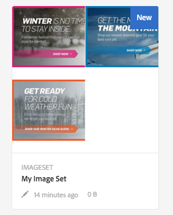

# Dynamic Media를 사용하여 작업 {#working-with-dynamic-media}

[Dynamic Media](https://business.adobe.com/products/experience-manager/assets/dynamic-media.html)는 다양한 시각적 머천다이징 및 마케팅 자산을 웹, 모바일 및 소셜 사이트에 맞게 자동으로 크기를 조정하여 주문형으로 제공하는 데 도움이 됩니다. 기본 소스 자산 세트를 사용하면 Dynamic Media는 글로벌, 확장 가능 및 성능 최적화 네트워크를 통해 실시간으로 다양한 유형의 풍부한 컨텐츠를 생성하고 전달합니다.

Dynamic Media에서는 확대/축소, 360° 회전, 비디오를 포함한 대화형 보기 환경을 제공합니다. Dynamic Media은 Adobe Experience Manager 디지털 자산 관리(Assets) 솔루션의 워크플로우를 고유하게 통합하여 디지털 캠페인 관리 프로세스를 단순화하고 간소화합니다.

<!-- >[!NOTE]
>
>A Community article is available on [Working with Adobe Experience Manager and Dynamic Media](https://helpx.adobe.com/experience-manager/using/aem_dynamic_media.html). -->

## Dynamic Media으로 수행할 수 있는 작업 {#what-you-can-do-with-dynamic-media}

Dynamic Media을 사용하면 자산을 게시하기 전에 자산을 관리할 수 있습니다. 일반적으로 자산으로 작업하는 방법은 다음과 같이 자세히 다룹니다 [디지털 자산 작업](/help/assets/manage-digital-assets.md). 일반적인 주제에는 자산 업로드, 다운로드, 편집 및 게시가 포함됩니다. 속성 보기 및 편집, 자산 검색.

Dynamic Media 전용 기능에는 다음이 포함됩니다.

* [회전 배너](carousel-banners.md)
* [이미지 세트](image-sets.md)
* [대화형 이미지](interactive-images.md)
* [대화형 비디오](interactive-videos.md)
* [혼합 미디어 세트](mixed-media-sets.md)
* [파노라마 이미지](panoramic-images.md)

* [스핀 세트](spin-sets.md)
* [비디오](video.md)
* [Dynamic Media 자산 제공](delivering-dynamic-media-assets.md)
* [자산 관리](managing-assets.md)
* [빠른 보기를 사용하여 사용자 지정 팝업 창 만들기](custom-pop-ups.md)

참조 - [Dynamic Media 설정](administering-dynamic-media.md).

<!-- 

OBSOLETE UNTIL INTEGRATING SCENE7 TOPIC GETS A MAJOR UPDATE
>[!NOTE]
>
>To understand the differences between using Dynamic Media and integrating Dynamic Media Classic with AEM, see [Dynamic Media Classic integration versus Dynamic Media](/help/sites-cloud/administering/integrating-scene7.md#aem-scene-integration-versus-dynamic-media).

-->

## Dynamic Media이 활성화되어 있고 Dynamic Media이 비활성화되어 있음 {#dynamic-media-on-versus-dynamic-media-off}

다음 특성에 따라 Dynamic Media이 활성화(설정됨)되었는지 여부를 알 수 있습니다.

* 다이내믹 표현물은 자산을 다운로드하거나 미리 볼 때 사용할 수 있습니다.
* 이미지 세트, 스핀 세트, 혼합 미디어 세트를 사용할 수 있습니다.
* PTIFF 표현물이 만들어집니다.

이미지 자산을 클릭하면 자산의 보기가 Dynamic Media이 활성화되면서 다릅니다. Dynamic Media은 온디맨드 HTML5 뷰어를 사용합니다.

### 동적 표현물 {#dynamic-renditions}

이미지 및 뷰어 사전 설정과 같은 다이내믹 표현물 ( 아래) **[!UICONTROL 동적]**)은 Dynamic Media이 활성화되어 있을 때 사용할 수 있습니다.

### 이미지 세트, 회전 세트, 혼합 미디어 세트 {#image-sets-spins-sets-mixed-media-sets}

Dynamic Media이 활성화되어 있으면 이미지 세트, 스핀 세트 및 혼합 미디어 세트를 사용할 수 있습니다.

### PTIFF 표현물 {#ptiff-renditions}

Dynamic Media이 활성화된 자산은 다음과 같습니다 `pyramid.tiffs`.

### 자산 보기 변경 {#asset-views-change}

Dynamic Media이 활성화되어 있으면 `+` 및 `-` 단추. 클릭/탭하여 특정 영역을 확대할 수도 있습니다. 되돌리기 를 선택하면 원래 버전으로 이동하며 대각선 화살표를 클릭하여 이미지를 전체 화면으로 만들 수 있습니다. Dynamic Media이 활성화되면 다음과 같이 표시됩니다.

Dynamic Media을 비활성화하여 확대/축소와 원래 크기로 되돌릴 수 있습니다.

